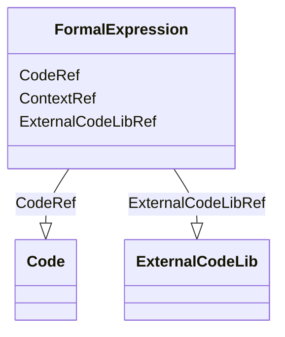

# Class: FormalExpression


URI: [odm:FormalExpression](http://www.cdisc.org/ns/odm/v2.0/FormalExpression)





<!-- no inheritance hierarchy -->


## Slots

| Name | Cardinality and Range | Description | Inheritance |
| ---  | --- | --- | --- |
| [ContextRef](ContextRef.md) | 0..1 <br/> [Text](Text.md) |  | direct |
| [CodeRef](CodeRef.md) | 1..1 <br/> [Code](Code.md) |  | direct |
| [ExternalCodeLibRef](ExternalCodeLibRef.md) | 1..1 <br/> [ExternalCodeLib](ExternalCodeLib.md) |  | direct |


## Usages

| used by | used in | type | used |
| ---  | --- | --- | --- |
| [RangeCheck](RangeCheck.md) | [FormalExpressionRef](FormalExpressionRef.md) | range | [FormalExpression](FormalExpression.md) |
| [MethodDef](MethodDef.md) | [FormalExpressionRef](FormalExpressionRef.md) | range | [FormalExpression](FormalExpression.md) |
| [ConditionDef](ConditionDef.md) | [FormalExpressionRef](FormalExpressionRef.md) | range | [FormalExpression](FormalExpression.md) |
| [StudyEndPoint](StudyEndPoint.md) | [FormalExpressionRef](FormalExpressionRef.md) | range | [FormalExpression](FormalExpression.md) |
| [StudyTargetPopulation](StudyTargetPopulation.md) | [FormalExpressionRef](FormalExpressionRef.md) | range | [FormalExpression](FormalExpression.md) |


## See Also

* [https://wiki.cdisc.org/display/ODM2/FormalExpression](https://wiki.cdisc.org/display/ODM2/FormalExpression)

## Identifier and Mapping Information


### Schema Source


* from schema: http://www.cdisc.org/ns/odm/v2.0


## Mappings

| Mapping Type | Mapped Value |
| ---  | ---  |
| self | odm:FormalExpression |
| native | odm:FormalExpression |


## LinkML Source

<!-- TODO: investigate https://stackoverflow.com/questions/37606292/how-to-create-tabbed-code-blocks-in-mkdocs-or-sphinx -->

### Direct

<details>
```yaml
name: FormalExpression
from_schema: http://www.cdisc.org/ns/odm/v2.0
see_also:
- https://wiki.cdisc.org/display/ODM2/FormalExpression
slots:
- ContextRef
- CodeRef
- ExternalCodeLibRef
slot_usage:
  ContextRef:
    name: ContextRef
    domain_of:
    - Alias
    - FormalExpression
    - ODMFileMetadata
    range: text
  CodeRef:
    name: CodeRef
    domain_of:
    - FormalExpression
    - Coding
    range: Code
    required: true
    minimum_cardinality: 1
    maximum_cardinality: 1
  ExternalCodeLibRef:
    name: ExternalCodeLibRef
    domain_of:
    - FormalExpression
    range: ExternalCodeLib
    required: true
    minimum_cardinality: 1
    maximum_cardinality: 1
class_uri: odm:FormalExpression

```
</details>

### Induced

<details>
```yaml
name: FormalExpression
from_schema: http://www.cdisc.org/ns/odm/v2.0
see_also:
- https://wiki.cdisc.org/display/ODM2/FormalExpression
slot_usage:
  ContextRef:
    name: ContextRef
    domain_of:
    - Alias
    - FormalExpression
    - ODMFileMetadata
    range: text
  CodeRef:
    name: CodeRef
    domain_of:
    - FormalExpression
    - Coding
    range: Code
    required: true
    minimum_cardinality: 1
    maximum_cardinality: 1
  ExternalCodeLibRef:
    name: ExternalCodeLibRef
    domain_of:
    - FormalExpression
    range: ExternalCodeLib
    required: true
    minimum_cardinality: 1
    maximum_cardinality: 1
attributes:
  ContextRef:
    name: ContextRef
    from_schema: http://www.cdisc.org/ns/odm/v2.0
    rank: 1000
    alias: ContextRef
    owner: FormalExpression
    domain_of:
    - Alias
    - FormalExpression
    - ODMFileMetadata
    range: text
  CodeRef:
    name: CodeRef
    from_schema: http://www.cdisc.org/ns/odm/v2.0
    rank: 1000
    alias: CodeRef
    owner: FormalExpression
    domain_of:
    - FormalExpression
    - Coding
    range: Code
    required: true
    minimum_cardinality: 1
    maximum_cardinality: 1
  ExternalCodeLibRef:
    name: ExternalCodeLibRef
    from_schema: http://www.cdisc.org/ns/odm/v2.0
    rank: 1000
    alias: ExternalCodeLibRef
    owner: FormalExpression
    domain_of:
    - FormalExpression
    range: ExternalCodeLib
    required: true
    minimum_cardinality: 1
    maximum_cardinality: 1
class_uri: odm:FormalExpression

```
</details>