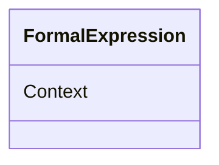

# Class: FormalExpression


URI: [odm:FormalExpression](http://www.cdisc.org/ns/odm/v2.0/FormalExpression)





<!-- no inheritance hierarchy -->


## Slots

| Name | Cardinality and Range | Description | Inheritance |
| ---  | --- | --- | --- |
| [Context](Context.md) | 0..1 <br/> [Text](Text.md) |  | direct |


## Usages

| used by | used in | type | used |
| ---  | --- | --- | --- |
| [StudyEndPoint](StudyEndPoint.md) | [FormalExpressionRef](FormalExpressionRef.md) | range | [FormalExpression](FormalExpression.md) |
| [StudyTargetPopulation](StudyTargetPopulation.md) | [FormalExpressionRef](FormalExpressionRef.md) | range | [FormalExpression](FormalExpression.md) |
| [ConditionDef](ConditionDef.md) | [FormalExpressionRef](FormalExpressionRef.md) | range | [FormalExpression](FormalExpression.md) |
| [MethodDef](MethodDef.md) | [FormalExpressionRef](FormalExpressionRef.md) | range | [FormalExpression](FormalExpression.md) |


## Identifier and Mapping Information


### Schema Source


* from schema: http://www.cdisc.org/ns/odm/v2.0


## Mappings

| Mapping Type | Mapped Value |
| ---  | ---  |
| self | odm:FormalExpression |
| native | odm:FormalExpression |


## LinkML Source

<!-- TODO: investigate https://stackoverflow.com/questions/37606292/how-to-create-tabbed-code-blocks-in-mkdocs-or-sphinx -->

### Direct

<details>
```yaml
name: FormalExpression
from_schema: http://www.cdisc.org/ns/odm/v2.0
slots:
- Context
slot_usage:
  Context:
    name: Context
    domain_of:
    - FormalExpression
    - Alias
    - ODMFileMetadata
    range: text
    required: false
class_uri: odm:FormalExpression

```
</details>

### Induced

<details>
```yaml
name: FormalExpression
from_schema: http://www.cdisc.org/ns/odm/v2.0
slot_usage:
  Context:
    name: Context
    domain_of:
    - FormalExpression
    - Alias
    - ODMFileMetadata
    range: text
    required: false
attributes:
  Context:
    name: Context
    from_schema: http://www.cdisc.org/ns/odm/v2.0
    rank: 1000
    alias: Context
    owner: FormalExpression
    domain_of:
    - FormalExpression
    - Alias
    - ODMFileMetadata
    range: text
    required: false
class_uri: odm:FormalExpression

```
</details>