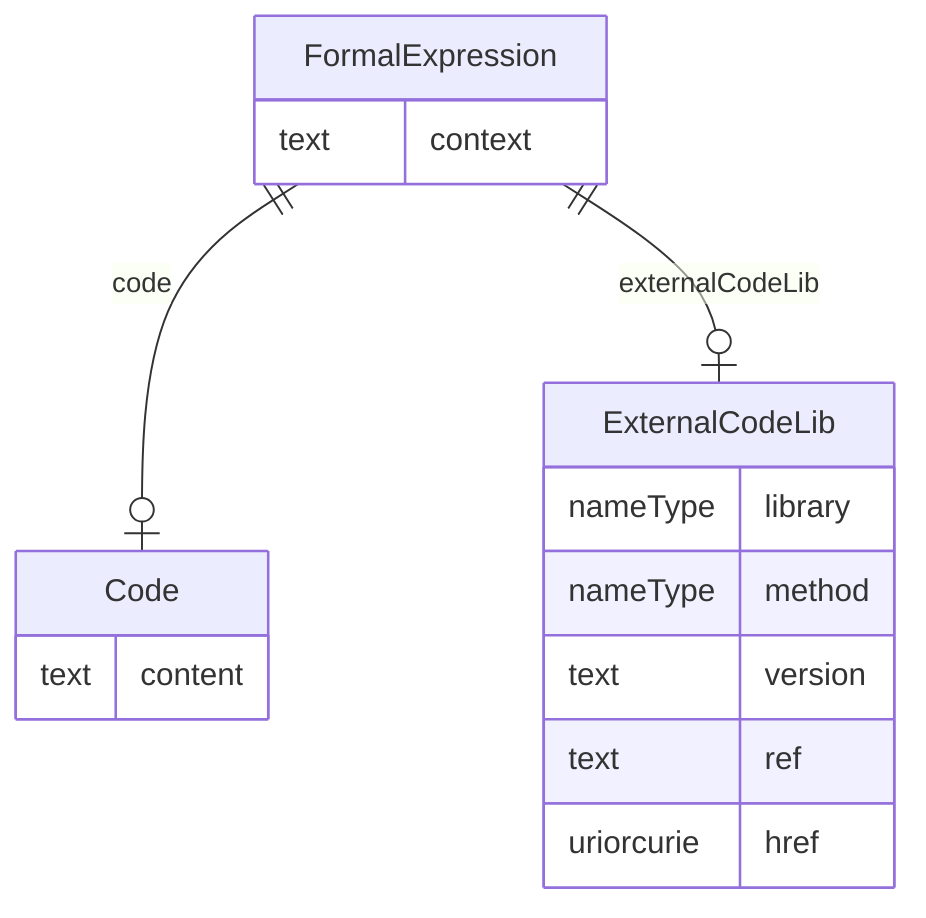

# Class: FormalExpression

_A FormalExpression used within a ConditionDef or a RangeCheck must evaluate to True or False. A FormalExpression referenced within a MethodDef having Type Imputation, Computation, or Transpose must evaluate to the correct DataType for an Item that may be imputed or computed using the Method. A FormalExpression gets parameter and return value definitions from the MethodSignature element. The data types in the MethodSignature parameters and return values must match the corresponding data types in the FormalExpression._


URI: [odm:FormalExpression](http://www.cdisc.org/ns/odm/v2.0/FormalExpression)





<!-- no inheritance hierarchy -->


## Slots

| Name | Cardinality* and Range | Description | Inheritance |
| ---  | --- | --- | --- |
| [context](context.md) | 0..1 <br/> [text](text.md) | A free-form qualifier to suggest an appropriate computer language to be used ... | direct |
| [code](code.md) | 0..1 <br/> [Code](Code.md) | A string pattern that identifies a concept as defined by the code system. | direct |
| [externalCodeLib](externalCodeLib.md) | 0..1 <br/> [ExternalCodeLib](ExternalCodeLib.md) | ExternalCodeLib reference: The ExternalCodeLib element references a FormalExp... | direct |

_* See [LinkML documentation](https://linkml.io/linkml/schemas/slots.html#slot-cardinality) for cardinality definitions._


## Usages

| used by | used in | type | used |
| ---  | --- | --- | --- |
| [RangeCheck](RangeCheck.md) | [formalExpression](formalExpression.md) | range | [FormalExpression](FormalExpression.md) |
| [MethodDef](MethodDef.md) | [formalExpression](formalExpression.md) | range | [FormalExpression](FormalExpression.md) |
| [ConditionDef](ConditionDef.md) | [formalExpression](formalExpression.md) | range | [FormalExpression](FormalExpression.md) |
| [StudyEndPoint](StudyEndPoint.md) | [formalExpression](formalExpression.md) | range | [FormalExpression](FormalExpression.md) |
| [StudyTargetPopulation](StudyTargetPopulation.md) | [formalExpression](formalExpression.md) | range | [FormalExpression](FormalExpression.md) |


## See Also

* [https://wiki.cdisc.org/display/PUB/FormalExpression](https://wiki.cdisc.org/display/PUB/FormalExpression)

## Identifier and Mapping Information


### Schema Source


* from schema: http://www.cdisc.org/ns/odm/v2.0


## Mappings

| Mapping Type | Mapped Value |
| ---  | ---  |
| self | odm:FormalExpression |
| native | odm:FormalExpression |


## LinkML Source

<!-- TODO: investigate https://stackoverflow.com/questions/37606292/how-to-create-tabbed-code-blocks-in-mkdocs-or-sphinx -->

### Direct

<details>
```yaml
name: FormalExpression
description: A FormalExpression used within a ConditionDef or a RangeCheck must evaluate
  to True or False. A FormalExpression referenced within a MethodDef having Type Imputation,
  Computation, or Transpose must evaluate to the correct DataType for an Item that
  may be imputed or computed using the Method. A FormalExpression gets parameter and
  return value definitions from the MethodSignature element. The data types in the
  MethodSignature parameters and return values must match the corresponding data types
  in the FormalExpression.
from_schema: http://www.cdisc.org/ns/odm/v2.0
see_also:
- https://wiki.cdisc.org/display/PUB/FormalExpression
rank: 1000
slots:
- context
- code
- externalCodeLib
slot_usage:
  context:
    name: context
    description: A free-form qualifier to suggest an appropriate computer language
      to be used when evaluating the FormalExpression content.
    comments:
    - 'Required

      range: text'
    domain_of:
    - Alias
    - FormalExpression
    - ODMFileMetadata
    range: text
  code:
    name: code
    domain_of:
    - FormalExpression
    - Coding
    range: Code
    maximum_cardinality: 1
  externalCodeLib:
    name: externalCodeLib
    domain_of:
    - FormalExpression
    range: ExternalCodeLib
    maximum_cardinality: 1
class_uri: odm:FormalExpression

```
</details>

### Induced

<details>
```yaml
name: FormalExpression
description: A FormalExpression used within a ConditionDef or a RangeCheck must evaluate
  to True or False. A FormalExpression referenced within a MethodDef having Type Imputation,
  Computation, or Transpose must evaluate to the correct DataType for an Item that
  may be imputed or computed using the Method. A FormalExpression gets parameter and
  return value definitions from the MethodSignature element. The data types in the
  MethodSignature parameters and return values must match the corresponding data types
  in the FormalExpression.
from_schema: http://www.cdisc.org/ns/odm/v2.0
see_also:
- https://wiki.cdisc.org/display/PUB/FormalExpression
rank: 1000
slot_usage:
  context:
    name: context
    description: A free-form qualifier to suggest an appropriate computer language
      to be used when evaluating the FormalExpression content.
    comments:
    - 'Required

      range: text'
    domain_of:
    - Alias
    - FormalExpression
    - ODMFileMetadata
    range: text
  code:
    name: code
    domain_of:
    - FormalExpression
    - Coding
    range: Code
    maximum_cardinality: 1
  externalCodeLib:
    name: externalCodeLib
    domain_of:
    - FormalExpression
    range: ExternalCodeLib
    maximum_cardinality: 1
attributes:
  context:
    name: context
    description: A free-form qualifier to suggest an appropriate computer language
      to be used when evaluating the FormalExpression content.
    comments:
    - 'Required

      range: text'
    from_schema: http://www.cdisc.org/ns/odm/v2.0
    rank: 1000
    alias: context
    owner: FormalExpression
    domain_of:
    - Alias
    - FormalExpression
    - ODMFileMetadata
    range: text
  code:
    name: code
    description: A string pattern that identifies a concept as defined by the code
      system.
    from_schema: http://www.cdisc.org/ns/odm/v2.0
    rank: 1000
    alias: code
    owner: FormalExpression
    domain_of:
    - FormalExpression
    - Coding
    range: Code
    maximum_cardinality: 1
  externalCodeLib:
    name: externalCodeLib
    description: 'ExternalCodeLib reference: The ExternalCodeLib element references
      a FormalExpression in an external code library, such as a file or GitHub. The
      intention is to make it possible to reference existing code libraries where
      the code is maintained as well as making it simpler to include longer, more
      complex FormalExpressions. The Library attribute provides the name of the external
      library, whereas ref or href provides a reference to the repository that can
      be used to retrieve the code. The Method attribute provides the name of the
      method in the file referenced for cases where multiple methods are provided
      in the source code file. The Version element provides the version of the external
      FormalExpression code referenced.'
    from_schema: http://www.cdisc.org/ns/odm/v2.0
    rank: 1000
    alias: externalCodeLib
    owner: FormalExpression
    domain_of:
    - FormalExpression
    range: ExternalCodeLib
    maximum_cardinality: 1
class_uri: odm:FormalExpression

```
</details>