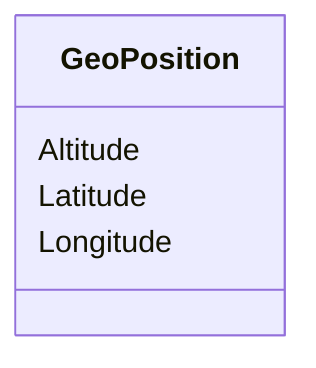

# Class: GeoPosition


URI: [odm:GeoPosition](http://www.cdisc.org/ns/odm/v2.0/GeoPosition)





<!-- no inheritance hierarchy -->


## Slots

| Name | Cardinality and Range | Description | Inheritance |
| ---  | --- | --- | --- |
| [Longitude](Longitude.md) | 0..1 <br/> [Decimal](Decimal.md) |  | direct |
| [Latitude](Latitude.md) | 0..1 <br/> [Decimal](Decimal.md) |  | direct |
| [Altitude](Altitude.md) | 0..1 <br/> [Decimal](Decimal.md) |  | direct |


## Usages

| used by | used in | type | used |
| ---  | --- | --- | --- |
| [Address](Address.md) | [GeoPositionRef](GeoPositionRef.md) | range | [GeoPosition](GeoPosition.md) |


## Identifier and Mapping Information


### Schema Source


* from schema: http://www.cdisc.org/ns/odm/v2.0


## Mappings

| Mapping Type | Mapped Value |
| ---  | ---  |
| self | odm:GeoPosition |
| native | odm:GeoPosition |


## LinkML Source

<!-- TODO: investigate https://stackoverflow.com/questions/37606292/how-to-create-tabbed-code-blocks-in-mkdocs-or-sphinx -->

### Direct

<details>
```yaml
name: GeoPosition
from_schema: http://www.cdisc.org/ns/odm/v2.0
slots:
- Longitude
- Latitude
- Altitude
slot_usage:
  Longitude:
    name: Longitude
    domain_of:
    - GeoPosition
    range: decimal
    required: false
  Latitude:
    name: Latitude
    domain_of:
    - GeoPosition
    range: decimal
    required: false
  Altitude:
    name: Altitude
    domain_of:
    - GeoPosition
    range: decimal
    required: false
class_uri: odm:GeoPosition

```
</details>

### Induced

<details>
```yaml
name: GeoPosition
from_schema: http://www.cdisc.org/ns/odm/v2.0
slot_usage:
  Longitude:
    name: Longitude
    domain_of:
    - GeoPosition
    range: decimal
    required: false
  Latitude:
    name: Latitude
    domain_of:
    - GeoPosition
    range: decimal
    required: false
  Altitude:
    name: Altitude
    domain_of:
    - GeoPosition
    range: decimal
    required: false
attributes:
  Longitude:
    name: Longitude
    from_schema: http://www.cdisc.org/ns/odm/v2.0
    rank: 1000
    alias: Longitude
    owner: GeoPosition
    domain_of:
    - GeoPosition
    range: decimal
    required: false
  Latitude:
    name: Latitude
    from_schema: http://www.cdisc.org/ns/odm/v2.0
    rank: 1000
    alias: Latitude
    owner: GeoPosition
    domain_of:
    - GeoPosition
    range: decimal
    required: false
  Altitude:
    name: Altitude
    from_schema: http://www.cdisc.org/ns/odm/v2.0
    rank: 1000
    alias: Altitude
    owner: GeoPosition
    domain_of:
    - GeoPosition
    range: decimal
    required: false
class_uri: odm:GeoPosition

```
</details>