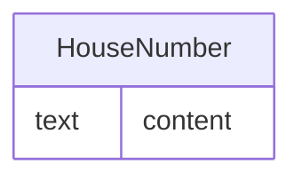

# Class: HouseNumber

_The house number part of a user's postal address._


URI: [odm:HouseNumber](http://www.cdisc.org/ns/odm/v2.0/HouseNumber)





<!-- no inheritance hierarchy -->


## Slots

| Name | Cardinality* and Range | Description | Inheritance |
| ---  | --- | --- | --- |
| [content](content.md) | 0..1 <br/> [text](text.md) | multi-line text content from between XML tags | direct |

_* See [LinkML documentation](https://linkml.io/linkml/schemas/slots.html#slot-cardinality) for cardinality definitions._


## Usages

| used by | used in | type | used |
| ---  | --- | --- | --- |
| [Address](Address.md) | [HouseNumberRef](HouseNumberRef.md) | range | [HouseNumber](HouseNumber.md) |


## See Also

* [https://wiki.cdisc.org/display/ODM2/HouseNumber](https://wiki.cdisc.org/display/ODM2/HouseNumber)

## Identifier and Mapping Information


### Schema Source


* from schema: http://www.cdisc.org/ns/odm/v2.0


## Mappings

| Mapping Type | Mapped Value |
| ---  | ---  |
| self | odm:HouseNumber |
| native | odm:HouseNumber |


## LinkML Source

<!-- TODO: investigate https://stackoverflow.com/questions/37606292/how-to-create-tabbed-code-blocks-in-mkdocs-or-sphinx -->

### Direct

<details>
```yaml
name: HouseNumber
description: The house number part of a user's postal address.
from_schema: http://www.cdisc.org/ns/odm/v2.0
see_also:
- https://wiki.cdisc.org/display/ODM2/HouseNumber
rank: 1000
slots:
- content
slot_usage:
  content:
    name: content
    domain_of:
    - TranslatedText
    - Title
    - CheckValue
    - Code
    - WorkflowEnd
    - UserName
    - Prefix
    - Suffix
    - FullName
    - GivenName
    - FamilyName
    - StreetName
    - HouseNumber
    - City
    - StateProv
    - Country
    - PostalCode
    - OtherText
    - Meaning
    - LegalReason
    - DateTimeStamp
    - ReasonForChange
    - SourceID
    - FlagValue
    - FlagType
    - Value
    range: text
class_uri: odm:HouseNumber

```
</details>

### Induced

<details>
```yaml
name: HouseNumber
description: The house number part of a user's postal address.
from_schema: http://www.cdisc.org/ns/odm/v2.0
see_also:
- https://wiki.cdisc.org/display/ODM2/HouseNumber
rank: 1000
slot_usage:
  content:
    name: content
    domain_of:
    - TranslatedText
    - Title
    - CheckValue
    - Code
    - WorkflowEnd
    - UserName
    - Prefix
    - Suffix
    - FullName
    - GivenName
    - FamilyName
    - StreetName
    - HouseNumber
    - City
    - StateProv
    - Country
    - PostalCode
    - OtherText
    - Meaning
    - LegalReason
    - DateTimeStamp
    - ReasonForChange
    - SourceID
    - FlagValue
    - FlagType
    - Value
    range: text
attributes:
  content:
    name: content
    description: multi-line text content from between XML tags
    from_schema: http://www.cdisc.org/ns/odm/v2.0
    rank: 1000
    alias: content
    owner: HouseNumber
    domain_of:
    - TranslatedText
    - Title
    - CheckValue
    - Code
    - WorkflowEnd
    - UserName
    - Prefix
    - Suffix
    - FullName
    - GivenName
    - FamilyName
    - StreetName
    - HouseNumber
    - City
    - StateProv
    - Country
    - PostalCode
    - OtherText
    - Meaning
    - LegalReason
    - DateTimeStamp
    - ReasonForChange
    - SourceID
    - FlagValue
    - FlagType
    - Value
    range: text
    inlined: true
class_uri: odm:HouseNumber

```
</details>