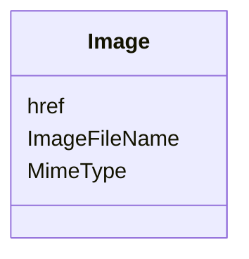

# Class: Image


_A visual depiction of the user._


URI: [odm:Image](http://www.cdisc.org/ns/odm/v2.0/Image)





<!-- no inheritance hierarchy -->


## Slots

| Name | Cardinality and Range | Description | Inheritance |
| ---  | --- | --- | --- |
| [ImageFileName](ImageFileName.md) | 0..1 <br/> [FileName](FileName.md) | The file name of or file path to the picture | direct |
| [href](href.md) | 0..1 <br/> [Text](Text.md) | URL of the location of the picture | direct |
| [MimeType](MimeType.md) | 0..1 <br/> [Text](Text.md) | Media type of the image | direct |


## Usages

| used by | used in | type | used |
| ---  | --- | --- | --- |
| [User](User.md) | [ImageRef](ImageRef.md) | range | [Image](Image.md) |


## See Also

* [https://wiki.cdisc.org/display/ODM2/Image](https://wiki.cdisc.org/display/ODM2/Image)

## Identifier and Mapping Information


### Schema Source


* from schema: http://www.cdisc.org/ns/odm/v2.0


## Mappings

| Mapping Type | Mapped Value |
| ---  | ---  |
| self | odm:Image |
| native | odm:Image |


## LinkML Source

<!-- TODO: investigate https://stackoverflow.com/questions/37606292/how-to-create-tabbed-code-blocks-in-mkdocs-or-sphinx -->

### Direct

<details>
```yaml
name: Image
description: A visual depiction of the user.
from_schema: http://www.cdisc.org/ns/odm/v2.0
see_also:
- https://wiki.cdisc.org/display/ODM2/Image
slots:
- ImageFileName
- href
- MimeType
slot_usage:
  ImageFileName:
    name: ImageFileName
    description: The file name of or file path to the picture
    comments:
    - 'Conditional

      range:fileName

      Either IamgeFileName or href must be present.'
    domain_of:
    - Image
    range: fileName
  href:
    name: href
    description: URL of the location of the picture
    comments:
    - 'Conditional

      range:text

      Either ImageFileName or href must be present.'
    domain_of:
    - Leaf
    - Include
    - ExternalCodeLib
    - Image
    - Coding
    range: text
  MimeType:
    name: MimeType
    description: Media type of the image
    comments:
    - 'Optional

      range:text

      Use of MimeType from the IANA list: http://www.iana.org/assignments/media-types/media-types.xhtml
      is recommended.'
    domain_of:
    - Image
    range: text
class_uri: odm:Image

```
</details>

### Induced

<details>
```yaml
name: Image
description: A visual depiction of the user.
from_schema: http://www.cdisc.org/ns/odm/v2.0
see_also:
- https://wiki.cdisc.org/display/ODM2/Image
slot_usage:
  ImageFileName:
    name: ImageFileName
    description: The file name of or file path to the picture
    comments:
    - 'Conditional

      range:fileName

      Either IamgeFileName or href must be present.'
    domain_of:
    - Image
    range: fileName
  href:
    name: href
    description: URL of the location of the picture
    comments:
    - 'Conditional

      range:text

      Either ImageFileName or href must be present.'
    domain_of:
    - Leaf
    - Include
    - ExternalCodeLib
    - Image
    - Coding
    range: text
  MimeType:
    name: MimeType
    description: Media type of the image
    comments:
    - 'Optional

      range:text

      Use of MimeType from the IANA list: http://www.iana.org/assignments/media-types/media-types.xhtml
      is recommended.'
    domain_of:
    - Image
    range: text
attributes:
  ImageFileName:
    name: ImageFileName
    description: The file name of or file path to the picture
    comments:
    - 'Conditional

      range:fileName

      Either IamgeFileName or href must be present.'
    from_schema: http://www.cdisc.org/ns/odm/v2.0
    rank: 1000
    alias: ImageFileName
    owner: Image
    domain_of:
    - Image
    range: fileName
  href:
    name: href
    description: URL of the location of the picture
    comments:
    - 'Conditional

      range:text

      Either ImageFileName or href must be present.'
    from_schema: http://www.cdisc.org/ns/odm/v2.0
    rank: 1000
    alias: href
    owner: Image
    domain_of:
    - Leaf
    - Include
    - ExternalCodeLib
    - Image
    - Coding
    range: text
  MimeType:
    name: MimeType
    description: Media type of the image
    comments:
    - 'Optional

      range:text

      Use of MimeType from the IANA list: http://www.iana.org/assignments/media-types/media-types.xhtml
      is recommended.'
    from_schema: http://www.cdisc.org/ns/odm/v2.0
    rank: 1000
    alias: MimeType
    owner: Image
    domain_of:
    - Image
    range: text
class_uri: odm:Image

```
</details>