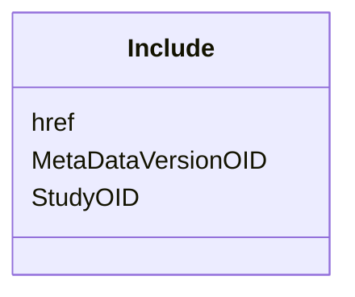

# Class: Include


URI: [odm:Include](http://www.cdisc.org/ns/odm/v2.0/Include)





<!-- no inheritance hierarchy -->


## Slots

| Name | Cardinality and Range | Description | Inheritance |
| ---  | --- | --- | --- |
| [StudyOID](StudyOID.md) | 1..1 <br/> [Oidref](Oidref.md) |  | direct |
| [MetaDataVersionOID](MetaDataVersionOID.md) | 1..1 <br/> [Oidref](Oidref.md) |  | direct |
| [href](href.md) | 0..1 <br/> [Uriorcurie](Uriorcurie.md) | URL that can be used to identify the location of a document or dataset file r... | direct |


## Usages

| used by | used in | type | used |
| ---  | --- | --- | --- |
| [MetaDataVersion](MetaDataVersion.md) | [IncludeRef](IncludeRef.md) | range | [Include](Include.md) |


## Identifier and Mapping Information


### Schema Source


* from schema: http://www.cdisc.org/ns/odm/v2.0


## Mappings

| Mapping Type | Mapped Value |
| ---  | ---  |
| self | odm:Include |
| native | odm:Include |


## LinkML Source

<!-- TODO: investigate https://stackoverflow.com/questions/37606292/how-to-create-tabbed-code-blocks-in-mkdocs-or-sphinx -->

### Direct

<details>
```yaml
name: Include
from_schema: http://www.cdisc.org/ns/odm/v2.0
slots:
- StudyOID
- MetaDataVersionOID
- href
slot_usage:
  StudyOID:
    name: StudyOID
    domain_of:
    - Include
    - SourceItem
    - AdminData
    - MetaDataVersionRef
    - ReferenceData
    - ClinicalData
    - Association
    - KeySet
    range: oidref
    required: true
  MetaDataVersionOID:
    name: MetaDataVersionOID
    domain_of:
    - Include
    - SourceItem
    - MetaDataVersionRef
    - ReferenceData
    - ClinicalData
    - Association
    - KeySet
    range: oidref
    required: true
  href:
    name: href
    domain_of:
    - leaf
    - Include
    - ExternalCodeList
    - ExternalCodeLib
    - Image
    - Coding
    range: uriorcurie
    required: false
class_uri: odm:Include

```
</details>

### Induced

<details>
```yaml
name: Include
from_schema: http://www.cdisc.org/ns/odm/v2.0
slot_usage:
  StudyOID:
    name: StudyOID
    domain_of:
    - Include
    - SourceItem
    - AdminData
    - MetaDataVersionRef
    - ReferenceData
    - ClinicalData
    - Association
    - KeySet
    range: oidref
    required: true
  MetaDataVersionOID:
    name: MetaDataVersionOID
    domain_of:
    - Include
    - SourceItem
    - MetaDataVersionRef
    - ReferenceData
    - ClinicalData
    - Association
    - KeySet
    range: oidref
    required: true
  href:
    name: href
    domain_of:
    - leaf
    - Include
    - ExternalCodeList
    - ExternalCodeLib
    - Image
    - Coding
    range: uriorcurie
    required: false
attributes:
  StudyOID:
    name: StudyOID
    from_schema: http://www.cdisc.org/ns/odm/v2.0
    rank: 1000
    alias: StudyOID
    owner: Include
    domain_of:
    - Include
    - SourceItem
    - AdminData
    - MetaDataVersionRef
    - ReferenceData
    - ClinicalData
    - Association
    - KeySet
    range: oidref
    required: true
  MetaDataVersionOID:
    name: MetaDataVersionOID
    from_schema: http://www.cdisc.org/ns/odm/v2.0
    rank: 1000
    alias: MetaDataVersionOID
    owner: Include
    domain_of:
    - Include
    - SourceItem
    - MetaDataVersionRef
    - ReferenceData
    - ClinicalData
    - Association
    - KeySet
    range: oidref
    required: true
  href:
    name: href
    description: URL that can be used to identify the location of a document or dataset
      file relative to the folder containing the ODM file.
    from_schema: http://www.cdisc.org/ns/odm/v2.0
    rank: 1000
    alias: href
    owner: Include
    domain_of:
    - leaf
    - Include
    - ExternalCodeList
    - ExternalCodeLib
    - Image
    - Coding
    range: uriorcurie
    required: false
class_uri: odm:Include

```
</details>