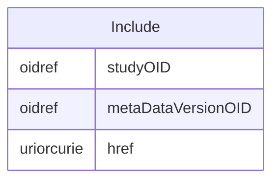

# Class: Include

_The Include metadata element allows a reference to a prior metadata version._


URI: [odm:Include](http://www.cdisc.org/ns/odm/v2.0/Include)





<!-- no inheritance hierarchy -->


## Slots

| Name | Cardinality* and Range | Description | Inheritance |
| ---  | --- | --- | --- |
| [studyOID](studyOID.md) | 1..1 <br/> [oidref](oidref.md) | References the Study that provides a prior metadata version. This attribute a... | direct |
| [metaDataVersionOID](metaDataVersionOID.md) | 1..1 <br/> [oidref](oidref.md) | References a prior MetaDataVersion within the Study referenced by the StudyOI... | direct |
| [href](href.md) | 0..1 <br/> [uriorcurie](uriorcurie.md) | Reference to the location where the to be included Study-Metadata definition ... | direct |

_* See [LinkML documentation](https://linkml.io/linkml/schemas/slots.html#slot-cardinality) for cardinality definitions._


## Usages

| used by | used in | type | used |
| ---  | --- | --- | --- |
| [MetaDataVersion](MetaDataVersion.md) | [include](include.md) | range | [Include](Include.md) |


## See Also

* [https://wiki.cdisc.org/display/PUB/Include](https://wiki.cdisc.org/display/PUB/Include)

## Identifier and Mapping Information


### Schema Source


* from schema: http://www.cdisc.org/ns/odm/v2.0


## Mappings

| Mapping Type | Mapped Value |
| ---  | ---  |
| self | odm:Include |
| native | odm:Include |


## LinkML Source

<!-- TODO: investigate https://stackoverflow.com/questions/37606292/how-to-create-tabbed-code-blocks-in-mkdocs-or-sphinx -->

### Direct

<details>
```yaml
name: Include
description: The Include metadata element allows a reference to a prior metadata version.
from_schema: http://www.cdisc.org/ns/odm/v2.0
see_also:
- https://wiki.cdisc.org/display/PUB/Include
rank: 1000
slots:
- studyOID
- metaDataVersionOID
- href
slot_usage:
  studyOID:
    name: studyOID
    description: References the Study that provides a prior metadata version. This
      attribute allows an Include element to reference a metadata version in another
      study. Thus, it is possible for many studies to share a set of common metadata
      definitions
    comments:
    - 'Required

      range: oidref'
    domain_of:
    - Include
    - SourceItem
    - AdminData
    - MetaDataVersionRef
    - ReferenceData
    - ClinicalData
    - Association
    - KeySet
    range: oidref
    required: true
  metaDataVersionOID:
    name: metaDataVersionOID
    description: References a prior MetaDataVersion within the Study referenced by
      the StudyOID attribute.
    comments:
    - 'Required

      range: oidref'
    domain_of:
    - Include
    - SourceItem
    - MetaDataVersionRef
    - ReferenceData
    - ClinicalData
    - Association
    - KeySet
    range: oidref
    required: true
  href:
    name: href
    description: Reference to the location where the to be included Study-Metadata
      definition can be accessed. The href attribute allows to provide the location
      (as a URL) of the ODM where the to-be-included elements can be retrieved, in
      the case that the combination of the referenced study and metadataversion is
      not present in the same file. The reference can be to a file (e.g., "file:///d:/MyStudies/MyStudy/PriorVersionODM.xml")
      or be an API call (e.g., " https://www.MyCompany.com/MyStudies?StudyOID=MyStudy&MetaDataVersionOID=MV.001
      ").
    comments:
    - 'Optional

      range: URI'
    domain_of:
    - Leaf
    - Include
    - ExternalCodeLib
    - Image
    - Coding
    range: uriorcurie
class_uri: odm:Include

```
</details>

### Induced

<details>
```yaml
name: Include
description: The Include metadata element allows a reference to a prior metadata version.
from_schema: http://www.cdisc.org/ns/odm/v2.0
see_also:
- https://wiki.cdisc.org/display/PUB/Include
rank: 1000
slot_usage:
  studyOID:
    name: studyOID
    description: References the Study that provides a prior metadata version. This
      attribute allows an Include element to reference a metadata version in another
      study. Thus, it is possible for many studies to share a set of common metadata
      definitions
    comments:
    - 'Required

      range: oidref'
    domain_of:
    - Include
    - SourceItem
    - AdminData
    - MetaDataVersionRef
    - ReferenceData
    - ClinicalData
    - Association
    - KeySet
    range: oidref
    required: true
  metaDataVersionOID:
    name: metaDataVersionOID
    description: References a prior MetaDataVersion within the Study referenced by
      the StudyOID attribute.
    comments:
    - 'Required

      range: oidref'
    domain_of:
    - Include
    - SourceItem
    - MetaDataVersionRef
    - ReferenceData
    - ClinicalData
    - Association
    - KeySet
    range: oidref
    required: true
  href:
    name: href
    description: Reference to the location where the to be included Study-Metadata
      definition can be accessed. The href attribute allows to provide the location
      (as a URL) of the ODM where the to-be-included elements can be retrieved, in
      the case that the combination of the referenced study and metadataversion is
      not present in the same file. The reference can be to a file (e.g., "file:///d:/MyStudies/MyStudy/PriorVersionODM.xml")
      or be an API call (e.g., " https://www.MyCompany.com/MyStudies?StudyOID=MyStudy&MetaDataVersionOID=MV.001
      ").
    comments:
    - 'Optional

      range: URI'
    domain_of:
    - Leaf
    - Include
    - ExternalCodeLib
    - Image
    - Coding
    range: uriorcurie
attributes:
  studyOID:
    name: studyOID
    description: References the Study that provides a prior metadata version. This
      attribute allows an Include element to reference a metadata version in another
      study. Thus, it is possible for many studies to share a set of common metadata
      definitions
    comments:
    - 'Required

      range: oidref'
    from_schema: http://www.cdisc.org/ns/odm/v2.0
    rank: 1000
    alias: studyOID
    owner: Include
    domain_of:
    - Include
    - SourceItem
    - AdminData
    - MetaDataVersionRef
    - ReferenceData
    - ClinicalData
    - Association
    - KeySet
    range: oidref
    required: true
  metaDataVersionOID:
    name: metaDataVersionOID
    description: References a prior MetaDataVersion within the Study referenced by
      the StudyOID attribute.
    comments:
    - 'Required

      range: oidref'
    from_schema: http://www.cdisc.org/ns/odm/v2.0
    rank: 1000
    alias: metaDataVersionOID
    owner: Include
    domain_of:
    - Include
    - SourceItem
    - MetaDataVersionRef
    - ReferenceData
    - ClinicalData
    - Association
    - KeySet
    range: oidref
    required: true
  href:
    name: href
    description: Reference to the location where the to be included Study-Metadata
      definition can be accessed. The href attribute allows to provide the location
      (as a URL) of the ODM where the to-be-included elements can be retrieved, in
      the case that the combination of the referenced study and metadataversion is
      not present in the same file. The reference can be to a file (e.g., "file:///d:/MyStudies/MyStudy/PriorVersionODM.xml")
      or be an API call (e.g., " https://www.MyCompany.com/MyStudies?StudyOID=MyStudy&MetaDataVersionOID=MV.001
      ").
    comments:
    - 'Optional

      range: URI'
    from_schema: http://www.cdisc.org/ns/odm/v2.0
    rank: 1000
    alias: href
    owner: Include
    domain_of:
    - Leaf
    - Include
    - ExternalCodeLib
    - Image
    - Coding
    range: uriorcurie
class_uri: odm:Include

```
</details>