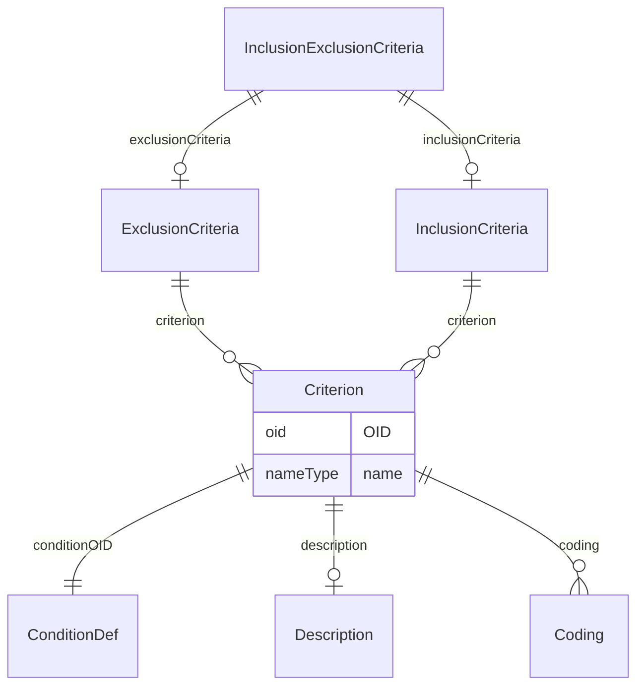

# Class: InclusionExclusionCriteria

_The InclusionExclusionCriteria element can contain 2 lists of Criterion elements, represented by the 2 elements InclusionCriteria and ExclusionCriteria. Together, these criteria determine the eligibility of a subject for the study. The actual condition to be evaluated is contained in an ODM ConditionDef, which is referenced by each Criterion‟s ConditionOID attribute._


URI: [odm:InclusionExclusionCriteria](http://www.cdisc.org/ns/odm/v2.0/InclusionExclusionCriteria)





<!-- no inheritance hierarchy -->


## Slots

| Name | Cardinality* and Range | Description | Inheritance |
| ---  | --- | --- | --- |
| [inclusionCriteria](inclusionCriteria.md) | 0..1 <br/> [InclusionCriteria](InclusionCriteria.md) | InclusionCriteria reference: The InclusionCriteria is a container element for... | direct |
| [exclusionCriteria](exclusionCriteria.md) | 0..1 <br/> [ExclusionCriteria](ExclusionCriteria.md) | ExclusionCriteria reference: The ExclusionCriteria is a container element for... | direct |

_* See [LinkML documentation](https://linkml.io/linkml/schemas/slots.html#slot-cardinality) for cardinality definitions._


## Usages

| used by | used in | type | used |
| ---  | --- | --- | --- |
| [Protocol](Protocol.md) | [inclusionExclusionCriteria](inclusionExclusionCriteria.md) | range | [InclusionExclusionCriteria](InclusionExclusionCriteria.md) |


## See Also

* [https://wiki.cdisc.org/display/PUB/InclusionExclusionCriteria](https://wiki.cdisc.org/display/PUB/InclusionExclusionCriteria)

## Identifier and Mapping Information


### Schema Source


* from schema: http://www.cdisc.org/ns/odm/v2.0


## Mappings

| Mapping Type | Mapped Value |
| ---  | ---  |
| self | odm:InclusionExclusionCriteria |
| native | odm:InclusionExclusionCriteria |


## LinkML Source

<!-- TODO: investigate https://stackoverflow.com/questions/37606292/how-to-create-tabbed-code-blocks-in-mkdocs-or-sphinx -->

### Direct

<details>
```yaml
name: InclusionExclusionCriteria
description: The InclusionExclusionCriteria element can contain 2 lists of Criterion
  elements, represented by the 2 elements InclusionCriteria and ExclusionCriteria.
  Together, these criteria determine the eligibility of a subject for the study. The
  actual condition to be evaluated is contained in an ODM ConditionDef, which is referenced
  by each Criterion‟s ConditionOID attribute.
from_schema: http://www.cdisc.org/ns/odm/v2.0
see_also:
- https://wiki.cdisc.org/display/PUB/InclusionExclusionCriteria
rank: 1000
slots:
- inclusionCriteria
- exclusionCriteria
slot_usage:
  inclusionCriteria:
    name: inclusionCriteria
    domain_of:
    - InclusionExclusionCriteria
    range: InclusionCriteria
    maximum_cardinality: 1
  exclusionCriteria:
    name: exclusionCriteria
    domain_of:
    - InclusionExclusionCriteria
    range: ExclusionCriteria
    maximum_cardinality: 1
class_uri: odm:InclusionExclusionCriteria

```
</details>

### Induced

<details>
```yaml
name: InclusionExclusionCriteria
description: The InclusionExclusionCriteria element can contain 2 lists of Criterion
  elements, represented by the 2 elements InclusionCriteria and ExclusionCriteria.
  Together, these criteria determine the eligibility of a subject for the study. The
  actual condition to be evaluated is contained in an ODM ConditionDef, which is referenced
  by each Criterion‟s ConditionOID attribute.
from_schema: http://www.cdisc.org/ns/odm/v2.0
see_also:
- https://wiki.cdisc.org/display/PUB/InclusionExclusionCriteria
rank: 1000
slot_usage:
  inclusionCriteria:
    name: inclusionCriteria
    domain_of:
    - InclusionExclusionCriteria
    range: InclusionCriteria
    maximum_cardinality: 1
  exclusionCriteria:
    name: exclusionCriteria
    domain_of:
    - InclusionExclusionCriteria
    range: ExclusionCriteria
    maximum_cardinality: 1
attributes:
  inclusionCriteria:
    name: inclusionCriteria
    description: 'InclusionCriteria reference: The InclusionCriteria is a container
      element for Criterion elements describing inclusion criteria for subjects in
      the study. When a list is provided, subjects must meet each of the criteria
      in the list in order to enroll in the study.'
    from_schema: http://www.cdisc.org/ns/odm/v2.0
    rank: 1000
    alias: inclusionCriteria
    owner: InclusionExclusionCriteria
    domain_of:
    - InclusionExclusionCriteria
    range: InclusionCriteria
    maximum_cardinality: 1
  exclusionCriteria:
    name: exclusionCriteria
    description: 'ExclusionCriteria reference: The ExclusionCriteria is a container
      element for Criterion elements describing exclusion criteria for subjects in
      the study. When a list is provided, not meeting any of the criteria in the list
      may lead to exclusion of enrollment in the study.'
    from_schema: http://www.cdisc.org/ns/odm/v2.0
    rank: 1000
    alias: exclusionCriteria
    owner: InclusionExclusionCriteria
    domain_of:
    - InclusionExclusionCriteria
    range: ExclusionCriteria
    maximum_cardinality: 1
class_uri: odm:InclusionExclusionCriteria

```
</details>