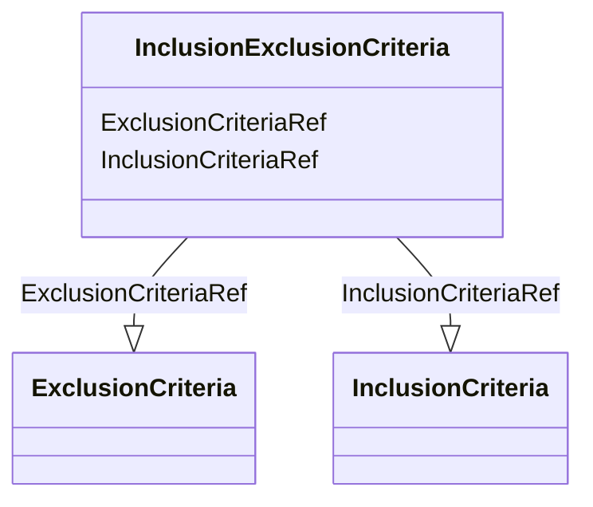

# Class: InclusionExclusionCriteria


URI: [odm:InclusionExclusionCriteria](http://www.cdisc.org/ns/odm/v2.0/InclusionExclusionCriteria)





<!-- no inheritance hierarchy -->


## Slots

| Name | Cardinality and Range | Description | Inheritance |
| ---  | --- | --- | --- |
| [InclusionCriteriaRef](InclusionCriteriaRef.md) | 0..1 <br/> [InclusionCriteria](InclusionCriteria.md) |  | direct |
| [ExclusionCriteriaRef](ExclusionCriteriaRef.md) | 0..1 <br/> [ExclusionCriteria](ExclusionCriteria.md) |  | direct |


## Usages

| used by | used in | type | used |
| ---  | --- | --- | --- |
| [Protocol](Protocol.md) | [InclusionExclusionCriteriaRef](InclusionExclusionCriteriaRef.md) | range | [InclusionExclusionCriteria](InclusionExclusionCriteria.md) |


## See Also

* [https://wiki.cdisc.org/display/ODM2/InclusionExclusionCriteria](https://wiki.cdisc.org/display/ODM2/InclusionExclusionCriteria)

## Identifier and Mapping Information


### Schema Source


* from schema: http://www.cdisc.org/ns/odm/v2.0


## Mappings

| Mapping Type | Mapped Value |
| ---  | ---  |
| self | odm:InclusionExclusionCriteria |
| native | odm:InclusionExclusionCriteria |


## LinkML Source

<!-- TODO: investigate https://stackoverflow.com/questions/37606292/how-to-create-tabbed-code-blocks-in-mkdocs-or-sphinx -->

### Direct

<details>
```yaml
name: InclusionExclusionCriteria
from_schema: http://www.cdisc.org/ns/odm/v2.0
see_also:
- https://wiki.cdisc.org/display/ODM2/InclusionExclusionCriteria
slots:
- InclusionCriteriaRef
- ExclusionCriteriaRef
slot_usage:
  InclusionCriteriaRef:
    name: InclusionCriteriaRef
    domain_of:
    - InclusionExclusionCriteria
    range: InclusionCriteria
    maximum_cardinality: 1
  ExclusionCriteriaRef:
    name: ExclusionCriteriaRef
    domain_of:
    - InclusionExclusionCriteria
    range: ExclusionCriteria
    maximum_cardinality: 1
class_uri: odm:InclusionExclusionCriteria

```
</details>

### Induced

<details>
```yaml
name: InclusionExclusionCriteria
from_schema: http://www.cdisc.org/ns/odm/v2.0
see_also:
- https://wiki.cdisc.org/display/ODM2/InclusionExclusionCriteria
slot_usage:
  InclusionCriteriaRef:
    name: InclusionCriteriaRef
    domain_of:
    - InclusionExclusionCriteria
    range: InclusionCriteria
    maximum_cardinality: 1
  ExclusionCriteriaRef:
    name: ExclusionCriteriaRef
    domain_of:
    - InclusionExclusionCriteria
    range: ExclusionCriteria
    maximum_cardinality: 1
attributes:
  InclusionCriteriaRef:
    name: InclusionCriteriaRef
    from_schema: http://www.cdisc.org/ns/odm/v2.0
    rank: 1000
    alias: InclusionCriteriaRef
    owner: InclusionExclusionCriteria
    domain_of:
    - InclusionExclusionCriteria
    range: InclusionCriteria
    maximum_cardinality: 1
  ExclusionCriteriaRef:
    name: ExclusionCriteriaRef
    from_schema: http://www.cdisc.org/ns/odm/v2.0
    rank: 1000
    alias: ExclusionCriteriaRef
    owner: InclusionExclusionCriteria
    domain_of:
    - InclusionExclusionCriteria
    range: ExclusionCriteria
    maximum_cardinality: 1
class_uri: odm:InclusionExclusionCriteria

```
</details>