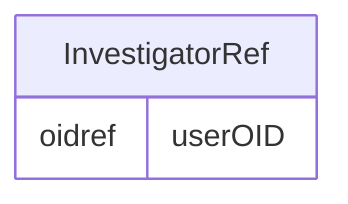

# Class: InvestigatorRef

_Provides a reference to the user who created the SubjectData record in the source system._


URI: [odm:InvestigatorRef](http://www.cdisc.org/ns/odm/v2.0/InvestigatorRef)





<!-- no inheritance hierarchy -->


## Slots

| Name | Cardinality* and Range | Description | Inheritance |
| ---  | --- | --- | --- |
| [userOID](userOID.md) | 1..1 <br/> [oidref](oidref.md) | Reference to a User definition. | direct |

_* See [LinkML documentation](https://linkml.io/linkml/schemas/slots.html#slot-cardinality) for cardinality definitions._


## Usages

| used by | used in | type | used |
| ---  | --- | --- | --- |
| [SubjectData](SubjectData.md) | [investigatorRef](investigatorRef.md) | range | [InvestigatorRef](InvestigatorRef.md) |


## See Also

* [https://wiki.cdisc.org/display/PUB/InvestigatorRef](https://wiki.cdisc.org/display/PUB/InvestigatorRef)

## Identifier and Mapping Information


### Schema Source


* from schema: http://www.cdisc.org/ns/odm/v2.0


## Mappings

| Mapping Type | Mapped Value |
| ---  | ---  |
| self | odm:InvestigatorRef |
| native | odm:InvestigatorRef |


## LinkML Source

<!-- TODO: investigate https://stackoverflow.com/questions/37606292/how-to-create-tabbed-code-blocks-in-mkdocs-or-sphinx -->

### Direct

<details>
```yaml
name: InvestigatorRef
description: Provides a reference to the user who created the SubjectData record in
  the source system.
from_schema: http://www.cdisc.org/ns/odm/v2.0
see_also:
- https://wiki.cdisc.org/display/PUB/InvestigatorRef
rank: 1000
slots:
- userOID
slot_usage:
  userOID:
    name: userOID
    description: Reference to a User definition.
    comments:
    - 'Required

      range: oidref

      Must match the OID attribute for an AdminData/User element where the AdminData/@StudyOID
      matches the ClinicalData/@StudyOID.'
    domain_of:
    - InvestigatorRef
    - UserRef
    range: oidref
    required: true
class_uri: odm:InvestigatorRef

```
</details>

### Induced

<details>
```yaml
name: InvestigatorRef
description: Provides a reference to the user who created the SubjectData record in
  the source system.
from_schema: http://www.cdisc.org/ns/odm/v2.0
see_also:
- https://wiki.cdisc.org/display/PUB/InvestigatorRef
rank: 1000
slot_usage:
  userOID:
    name: userOID
    description: Reference to a User definition.
    comments:
    - 'Required

      range: oidref

      Must match the OID attribute for an AdminData/User element where the AdminData/@StudyOID
      matches the ClinicalData/@StudyOID.'
    domain_of:
    - InvestigatorRef
    - UserRef
    range: oidref
    required: true
attributes:
  userOID:
    name: userOID
    description: Reference to a User definition.
    comments:
    - 'Required

      range: oidref

      Must match the OID attribute for an AdminData/User element where the AdminData/@StudyOID
      matches the ClinicalData/@StudyOID.'
    from_schema: http://www.cdisc.org/ns/odm/v2.0
    rank: 1000
    alias: userOID
    owner: InvestigatorRef
    domain_of:
    - InvestigatorRef
    - UserRef
    range: oidref
    required: true
class_uri: odm:InvestigatorRef

```
</details>