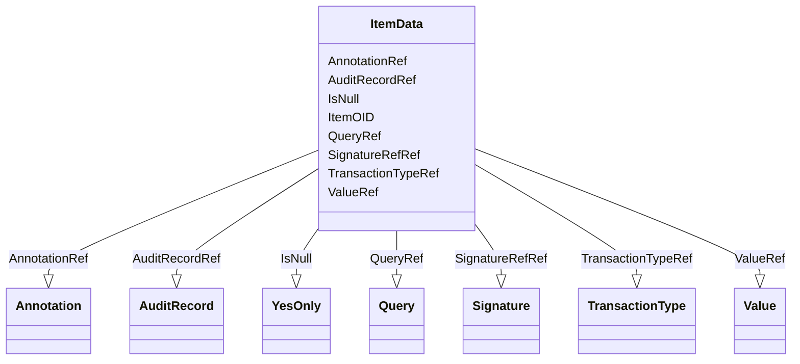

# Class: ItemData


URI: [odm:ItemData](http://www.cdisc.org/ns/odm/v2.0/ItemData)





<!-- no inheritance hierarchy -->


## Slots

| Name | Cardinality and Range | Description | Inheritance |
| ---  | --- | --- | --- |
| [ItemOID](ItemOID.md) | 1..1 <br/> [Oidref](Oidref.md) |  | direct |
| [TransactionTypeRef](TransactionTypeRef.md) | 0..1 <br/> [TransactionType](TransactionType.md) |  | direct |
| [IsNull](IsNull.md) | 0..1 <br/> [YesOnly](YesOnly.md) |  | direct |
| [ValueRef](ValueRef.md) | 0..* <br/> [Value](Value.md) |  | direct |
| [QueryRef](QueryRef.md) | 0..* <br/> [Query](Query.md) |  | direct |
| [AuditRecordRef](AuditRecordRef.md) | 0..1 <br/> [AuditRecord](AuditRecord.md) |  | direct |
| [SignatureRefRef](SignatureRefRef.md) | 0..1 <br/> [Signature](Signature.md) |  | direct |
| [AnnotationRef](AnnotationRef.md) | 0..* <br/> [Annotation](Annotation.md) |  | direct |


## Usages

| used by | used in | type | used |
| ---  | --- | --- | --- |
| [ItemGroupData](ItemGroupData.md) | [ItemDataRef](ItemDataRef.md) | range | [ItemData](ItemData.md) |


## See Also

* [https://wiki.cdisc.org/display/ODM2/ItemData](https://wiki.cdisc.org/display/ODM2/ItemData)

## Identifier and Mapping Information


### Schema Source


* from schema: http://www.cdisc.org/ns/odm/v2.0


## Mappings

| Mapping Type | Mapped Value |
| ---  | ---  |
| self | odm:ItemData |
| native | odm:ItemData |


## LinkML Source

<!-- TODO: investigate https://stackoverflow.com/questions/37606292/how-to-create-tabbed-code-blocks-in-mkdocs-or-sphinx -->

### Direct

<details>
```yaml
name: ItemData
from_schema: http://www.cdisc.org/ns/odm/v2.0
see_also:
- https://wiki.cdisc.org/display/ODM2/ItemData
slots:
- ItemOID
- TransactionTypeRef
- IsNull
- ValueRef
- QueryRef
- AuditRecordRef
- SignatureRefRef
- AnnotationRef
slot_usage:
  ItemOID:
    name: ItemOID
    domain_of:
    - ItemRef
    - SourceItem
    - RangeCheck
    - ItemData
    - KeySet
    range: oidref
    required: true
  TransactionTypeRef:
    name: TransactionTypeRef
    domain_of:
    - SubjectData
    - StudyEventData
    - ItemGroupData
    - ItemData
    - Annotation
    range: TransactionType
  IsNull:
    name: IsNull
    domain_of:
    - ItemData
    range: YesOnly
  ValueRef:
    name: ValueRef
    multivalued: true
    domain_of:
    - TrialPhase
    - ParameterValue
    - ItemData
    - Query
    range: Value
    inlined: true
    inlined_as_list: true
  QueryRef:
    name: QueryRef
    multivalued: true
    domain_of:
    - Location
    - ClinicalData
    - SubjectData
    - StudyEventData
    - ItemGroupData
    - ItemData
    range: Query
    inlined: true
    inlined_as_list: true
  AuditRecordRef:
    name: AuditRecordRef
    domain_of:
    - ReferenceData
    - ClinicalData
    - SubjectData
    - StudyEventData
    - ItemGroupData
    - ItemData
    - Query
    range: AuditRecord
    maximum_cardinality: 1
  SignatureRefRef:
    name: SignatureRefRef
    domain_of:
    - ReferenceData
    - ClinicalData
    - SubjectData
    - StudyEventData
    - ItemGroupData
    - ItemData
    - Signature
    range: Signature
    maximum_cardinality: 1
  AnnotationRef:
    name: AnnotationRef
    multivalued: true
    domain_of:
    - ReferenceData
    - ClinicalData
    - SubjectData
    - StudyEventData
    - ItemGroupData
    - ItemData
    - Association
    range: Annotation
    inlined: true
    inlined_as_list: true
class_uri: odm:ItemData

```
</details>

### Induced

<details>
```yaml
name: ItemData
from_schema: http://www.cdisc.org/ns/odm/v2.0
see_also:
- https://wiki.cdisc.org/display/ODM2/ItemData
slot_usage:
  ItemOID:
    name: ItemOID
    domain_of:
    - ItemRef
    - SourceItem
    - RangeCheck
    - ItemData
    - KeySet
    range: oidref
    required: true
  TransactionTypeRef:
    name: TransactionTypeRef
    domain_of:
    - SubjectData
    - StudyEventData
    - ItemGroupData
    - ItemData
    - Annotation
    range: TransactionType
  IsNull:
    name: IsNull
    domain_of:
    - ItemData
    range: YesOnly
  ValueRef:
    name: ValueRef
    multivalued: true
    domain_of:
    - TrialPhase
    - ParameterValue
    - ItemData
    - Query
    range: Value
    inlined: true
    inlined_as_list: true
  QueryRef:
    name: QueryRef
    multivalued: true
    domain_of:
    - Location
    - ClinicalData
    - SubjectData
    - StudyEventData
    - ItemGroupData
    - ItemData
    range: Query
    inlined: true
    inlined_as_list: true
  AuditRecordRef:
    name: AuditRecordRef
    domain_of:
    - ReferenceData
    - ClinicalData
    - SubjectData
    - StudyEventData
    - ItemGroupData
    - ItemData
    - Query
    range: AuditRecord
    maximum_cardinality: 1
  SignatureRefRef:
    name: SignatureRefRef
    domain_of:
    - ReferenceData
    - ClinicalData
    - SubjectData
    - StudyEventData
    - ItemGroupData
    - ItemData
    - Signature
    range: Signature
    maximum_cardinality: 1
  AnnotationRef:
    name: AnnotationRef
    multivalued: true
    domain_of:
    - ReferenceData
    - ClinicalData
    - SubjectData
    - StudyEventData
    - ItemGroupData
    - ItemData
    - Association
    range: Annotation
    inlined: true
    inlined_as_list: true
attributes:
  ItemOID:
    name: ItemOID
    from_schema: http://www.cdisc.org/ns/odm/v2.0
    rank: 1000
    alias: ItemOID
    owner: ItemData
    domain_of:
    - ItemRef
    - SourceItem
    - RangeCheck
    - ItemData
    - KeySet
    range: oidref
    required: true
  TransactionTypeRef:
    name: TransactionTypeRef
    from_schema: http://www.cdisc.org/ns/odm/v2.0
    rank: 1000
    alias: TransactionTypeRef
    owner: ItemData
    domain_of:
    - SubjectData
    - StudyEventData
    - ItemGroupData
    - ItemData
    - Annotation
    range: TransactionType
  IsNull:
    name: IsNull
    from_schema: http://www.cdisc.org/ns/odm/v2.0
    rank: 1000
    alias: IsNull
    owner: ItemData
    domain_of:
    - ItemData
    range: YesOnly
  ValueRef:
    name: ValueRef
    from_schema: http://www.cdisc.org/ns/odm/v2.0
    rank: 1000
    multivalued: true
    alias: ValueRef
    owner: ItemData
    domain_of:
    - TrialPhase
    - ParameterValue
    - ItemData
    - Query
    range: Value
    inlined: true
    inlined_as_list: true
  QueryRef:
    name: QueryRef
    from_schema: http://www.cdisc.org/ns/odm/v2.0
    rank: 1000
    multivalued: true
    alias: QueryRef
    owner: ItemData
    domain_of:
    - Location
    - ClinicalData
    - SubjectData
    - StudyEventData
    - ItemGroupData
    - ItemData
    range: Query
    inlined: true
    inlined_as_list: true
  AuditRecordRef:
    name: AuditRecordRef
    from_schema: http://www.cdisc.org/ns/odm/v2.0
    rank: 1000
    alias: AuditRecordRef
    owner: ItemData
    domain_of:
    - ReferenceData
    - ClinicalData
    - SubjectData
    - StudyEventData
    - ItemGroupData
    - ItemData
    - Query
    range: AuditRecord
    maximum_cardinality: 1
  SignatureRefRef:
    name: SignatureRefRef
    from_schema: http://www.cdisc.org/ns/odm/v2.0
    rank: 1000
    alias: SignatureRefRef
    owner: ItemData
    domain_of:
    - ReferenceData
    - ClinicalData
    - SubjectData
    - StudyEventData
    - ItemGroupData
    - ItemData
    - Signature
    range: Signature
    maximum_cardinality: 1
  AnnotationRef:
    name: AnnotationRef
    from_schema: http://www.cdisc.org/ns/odm/v2.0
    rank: 1000
    multivalued: true
    alias: AnnotationRef
    owner: ItemData
    domain_of:
    - ReferenceData
    - ClinicalData
    - SubjectData
    - StudyEventData
    - ItemGroupData
    - ItemData
    - Association
    range: Annotation
    inlined: true
    inlined_as_list: true
class_uri: odm:ItemData

```
</details>