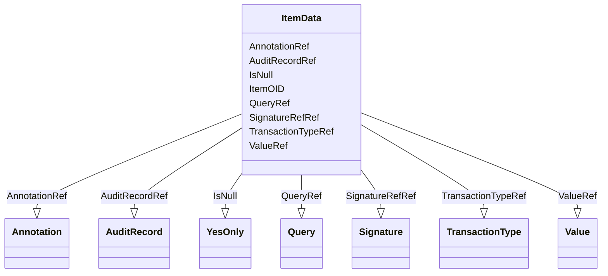

# Class: ItemData


_The ItemData element is used for transmission of the clinical data for an item. The model does not support repeating items within a single item group._


URI: [odm:ItemData](http://www.cdisc.org/ns/odm/v2.0/ItemData)





<!-- no inheritance hierarchy -->


## Slots

| Name | Cardinality and Range | Description | Inheritance |
| ---  | --- | --- | --- |
| [ItemOID](ItemOID.md) | 1..1 <br/> [oidref](oidref.md) | Reference to an ItemDef in the MetaDataVersion identified in the ClinicalData... | direct |
| [TransactionTypeRef](TransactionTypeRef.md) | 0..1 <br/> [TransactionType](TransactionType.md) | Records the TransactionType for this ItemData instance in the source system. | direct |
| [IsNull](IsNull.md) | 0..1 <br/> [YesOnly](YesOnly.md) | Flag specifying that an item's value is to be set to null. In the interest of... | direct |
| [ValueRef](ValueRef.md) | 0..* <br/> [Value](Value.md) | Human-readable designation of the trial phase. | direct |
| [QueryRef](QueryRef.md) | 0..* <br/> [Query](Query.md) | Query reference: The Query element represents a request for clarification on ... | direct |
| [AuditRecordRef](AuditRecordRef.md) | 0..1 <br/> [AuditRecord](AuditRecord.md) | AuditRecord reference: An AuditRecord carries information pertaining to the c... | direct |
| [SignatureRefRef](SignatureRefRef.md) | 0..1 <br/> [Signature](Signature.md) | SignatureRef reference: A reference to the signature meaning. | direct |
| [AnnotationRef](AnnotationRef.md) | 0..1 <br/> [Annotation](Annotation.md) | Annotation reference: A general note about clinical data. If an annotation ha... | direct |


## Usages

| used by | used in | type | used |
| ---  | --- | --- | --- |
| [ItemGroupData](ItemGroupData.md) | [ItemDataRef](ItemDataRef.md) | range | [ItemData](ItemData.md) |


## See Also

* [https://wiki.cdisc.org/display/ODM2/ItemData](https://wiki.cdisc.org/display/ODM2/ItemData)

## Identifier and Mapping Information


### Schema Source


* from schema: http://www.cdisc.org/ns/odm/v2.0


## Mappings

| Mapping Type | Mapped Value |
| ---  | ---  |
| self | odm:ItemData |
| native | odm:ItemData |


## LinkML Source

<!-- TODO: investigate https://stackoverflow.com/questions/37606292/how-to-create-tabbed-code-blocks-in-mkdocs-or-sphinx -->

### Direct

<details>
```yaml
name: ItemData
description: The ItemData element is used for transmission of the clinical data for
  an item. The model does not support repeating items within a single item group.
from_schema: http://www.cdisc.org/ns/odm/v2.0
see_also:
- https://wiki.cdisc.org/display/ODM2/ItemData
slots:
- ItemOID
- TransactionTypeRef
- IsNull
- ValueRef
- QueryRef
- AuditRecordRef
- SignatureRefRef
- AnnotationRef
slot_usage:
  ItemOID:
    name: ItemOID
    description: Reference to an ItemDef in the MetaDataVersion identified in the
      ClinicalData element. The referenced ItemDef defines the DataType of this item.
      The ItemOID attribute is used to identify a particular item definition. This
      value uniquely identifies an Item within the containing ItemGroup.
    comments:
    - Required
    domain_of:
    - ItemRef
    - SourceItem
    - RangeCheck
    - ItemData
    - KeySet
    range: oidref
    required: true
  TransactionTypeRef:
    name: TransactionTypeRef
    description: Records the TransactionType for this ItemData instance in the source
      system.
    comments:
    - Conditional Required on the ItemData element, or one of its ancestor elements,
      when ODM/@FileType has the value "Transactional".
    domain_of:
    - SubjectData
    - StudyEventData
    - ItemGroupData
    - ItemData
    - Annotation
    range: TransactionType
  IsNull:
    name: IsNull
    description: Flag specifying that an item's value is to be set to null. In the
      interest of creating non-verbose XML instances, one should not use ItemData
      elements with IsNull set to "Yes" to indicate uncollected data. The better practice
      is to transmit only collected data. For use cases where data traceability is
      important, providing ItemData elements with IsNull="Yes" maybe be useful. It
      is not necessary to provide an ItemData element with IsNull set to "Yes" in
      cases where the source system would not create a record.
    comments:
    - Conditional If the child element ItemData/Value is present, the IsNull attribute
      must not be set. If IsNull is set, the child element ItemData/Value must not
      be present.
    domain_of:
    - ItemData
    range: YesOnly
  ValueRef:
    name: ValueRef
    multivalued: true
    domain_of:
    - TrialPhase
    - ParameterValue
    - Telecom
    - ItemData
    - Query
    range: Value
    inlined: true
    inlined_as_list: true
  QueryRef:
    name: QueryRef
    multivalued: true
    domain_of:
    - Location
    - ClinicalData
    - SubjectData
    - StudyEventData
    - ItemGroupData
    - ItemData
    range: Query
    inlined: true
    inlined_as_list: true
  AuditRecordRef:
    name: AuditRecordRef
    domain_of:
    - ReferenceData
    - ClinicalData
    - SubjectData
    - StudyEventData
    - ItemGroupData
    - ItemData
    - Query
    range: AuditRecord
    maximum_cardinality: 1
  SignatureRefRef:
    name: SignatureRefRef
    domain_of:
    - ReferenceData
    - ClinicalData
    - SubjectData
    - StudyEventData
    - ItemGroupData
    - ItemData
    - Signature
    range: Signature
    maximum_cardinality: 1
  AnnotationRef:
    name: AnnotationRef
    domain_of:
    - ReferenceData
    - ClinicalData
    - SubjectData
    - StudyEventData
    - ItemGroupData
    - ItemData
    - Association
    range: Annotation
    maximum_cardinality: 1
class_uri: odm:ItemData

```
</details>

### Induced

<details>
```yaml
name: ItemData
description: The ItemData element is used for transmission of the clinical data for
  an item. The model does not support repeating items within a single item group.
from_schema: http://www.cdisc.org/ns/odm/v2.0
see_also:
- https://wiki.cdisc.org/display/ODM2/ItemData
slot_usage:
  ItemOID:
    name: ItemOID
    description: Reference to an ItemDef in the MetaDataVersion identified in the
      ClinicalData element. The referenced ItemDef defines the DataType of this item.
      The ItemOID attribute is used to identify a particular item definition. This
      value uniquely identifies an Item within the containing ItemGroup.
    comments:
    - Required
    domain_of:
    - ItemRef
    - SourceItem
    - RangeCheck
    - ItemData
    - KeySet
    range: oidref
    required: true
  TransactionTypeRef:
    name: TransactionTypeRef
    description: Records the TransactionType for this ItemData instance in the source
      system.
    comments:
    - Conditional Required on the ItemData element, or one of its ancestor elements,
      when ODM/@FileType has the value "Transactional".
    domain_of:
    - SubjectData
    - StudyEventData
    - ItemGroupData
    - ItemData
    - Annotation
    range: TransactionType
  IsNull:
    name: IsNull
    description: Flag specifying that an item's value is to be set to null. In the
      interest of creating non-verbose XML instances, one should not use ItemData
      elements with IsNull set to "Yes" to indicate uncollected data. The better practice
      is to transmit only collected data. For use cases where data traceability is
      important, providing ItemData elements with IsNull="Yes" maybe be useful. It
      is not necessary to provide an ItemData element with IsNull set to "Yes" in
      cases where the source system would not create a record.
    comments:
    - Conditional If the child element ItemData/Value is present, the IsNull attribute
      must not be set. If IsNull is set, the child element ItemData/Value must not
      be present.
    domain_of:
    - ItemData
    range: YesOnly
  ValueRef:
    name: ValueRef
    multivalued: true
    domain_of:
    - TrialPhase
    - ParameterValue
    - Telecom
    - ItemData
    - Query
    range: Value
    inlined: true
    inlined_as_list: true
  QueryRef:
    name: QueryRef
    multivalued: true
    domain_of:
    - Location
    - ClinicalData
    - SubjectData
    - StudyEventData
    - ItemGroupData
    - ItemData
    range: Query
    inlined: true
    inlined_as_list: true
  AuditRecordRef:
    name: AuditRecordRef
    domain_of:
    - ReferenceData
    - ClinicalData
    - SubjectData
    - StudyEventData
    - ItemGroupData
    - ItemData
    - Query
    range: AuditRecord
    maximum_cardinality: 1
  SignatureRefRef:
    name: SignatureRefRef
    domain_of:
    - ReferenceData
    - ClinicalData
    - SubjectData
    - StudyEventData
    - ItemGroupData
    - ItemData
    - Signature
    range: Signature
    maximum_cardinality: 1
  AnnotationRef:
    name: AnnotationRef
    domain_of:
    - ReferenceData
    - ClinicalData
    - SubjectData
    - StudyEventData
    - ItemGroupData
    - ItemData
    - Association
    range: Annotation
    maximum_cardinality: 1
attributes:
  ItemOID:
    name: ItemOID
    description: Reference to an ItemDef in the MetaDataVersion identified in the
      ClinicalData element. The referenced ItemDef defines the DataType of this item.
      The ItemOID attribute is used to identify a particular item definition. This
      value uniquely identifies an Item within the containing ItemGroup.
    comments:
    - Required
    from_schema: http://www.cdisc.org/ns/odm/v2.0
    rank: 1000
    alias: ItemOID
    owner: ItemData
    domain_of:
    - ItemRef
    - SourceItem
    - RangeCheck
    - ItemData
    - KeySet
    range: oidref
    required: true
  TransactionTypeRef:
    name: TransactionTypeRef
    description: Records the TransactionType for this ItemData instance in the source
      system.
    comments:
    - Conditional Required on the ItemData element, or one of its ancestor elements,
      when ODM/@FileType has the value "Transactional".
    from_schema: http://www.cdisc.org/ns/odm/v2.0
    rank: 1000
    alias: TransactionTypeRef
    owner: ItemData
    domain_of:
    - SubjectData
    - StudyEventData
    - ItemGroupData
    - ItemData
    - Annotation
    range: TransactionType
  IsNull:
    name: IsNull
    description: Flag specifying that an item's value is to be set to null. In the
      interest of creating non-verbose XML instances, one should not use ItemData
      elements with IsNull set to "Yes" to indicate uncollected data. The better practice
      is to transmit only collected data. For use cases where data traceability is
      important, providing ItemData elements with IsNull="Yes" maybe be useful. It
      is not necessary to provide an ItemData element with IsNull set to "Yes" in
      cases where the source system would not create a record.
    comments:
    - Conditional If the child element ItemData/Value is present, the IsNull attribute
      must not be set. If IsNull is set, the child element ItemData/Value must not
      be present.
    from_schema: http://www.cdisc.org/ns/odm/v2.0
    rank: 1000
    alias: IsNull
    owner: ItemData
    domain_of:
    - ItemData
    range: YesOnly
  ValueRef:
    name: ValueRef
    description: Human-readable designation of the trial phase.
    from_schema: http://www.cdisc.org/ns/odm/v2.0
    rank: 1000
    multivalued: true
    identifier: false
    alias: ValueRef
    owner: ItemData
    domain_of:
    - TrialPhase
    - ParameterValue
    - Telecom
    - ItemData
    - Query
    range: Value
    inlined: true
    inlined_as_list: true
  QueryRef:
    name: QueryRef
    description: 'Query reference: The Query element represents a request for clarification
      on a data item collected for a clinical trial, specifically a request from a
      sponsor or sponsor’s representative to an investigator to resolve an error or
      inconsistency discovered during data review. Queries can be created manually
      by individuals such as site monitors or data managers or automatically by systems.
      The full text of the Query exists in the Value child element. The optional Name
      attribute provide the means to provide a short identifier that can be included
      in listing or user interfaces.'
    from_schema: http://www.cdisc.org/ns/odm/v2.0
    rank: 1000
    multivalued: true
    identifier: false
    alias: QueryRef
    owner: ItemData
    domain_of:
    - Location
    - ClinicalData
    - SubjectData
    - StudyEventData
    - ItemGroupData
    - ItemData
    range: Query
    inlined: true
    inlined_as_list: true
  AuditRecordRef:
    name: AuditRecordRef
    description: 'AuditRecord reference: An AuditRecord carries information pertaining
      to the creation, deletion, or modification of clinical data. This information
      includes who performed that action, and where, when, and why that action was
      performed.AuditRecord information describes a change to clinical data, but is
      not itself clinical data. The value of some clinical data can always be changed
      by a subsequent transaction, but history cannot be changed, only added to.'
    from_schema: http://www.cdisc.org/ns/odm/v2.0
    rank: 1000
    identifier: false
    alias: AuditRecordRef
    owner: ItemData
    domain_of:
    - ReferenceData
    - ClinicalData
    - SubjectData
    - StudyEventData
    - ItemGroupData
    - ItemData
    - Query
    range: AuditRecord
    maximum_cardinality: 1
  SignatureRefRef:
    name: SignatureRefRef
    description: 'SignatureRef reference: A reference to the signature meaning.'
    from_schema: http://www.cdisc.org/ns/odm/v2.0
    rank: 1000
    identifier: false
    alias: SignatureRefRef
    owner: ItemData
    domain_of:
    - ReferenceData
    - ClinicalData
    - SubjectData
    - StudyEventData
    - ItemGroupData
    - ItemData
    - Signature
    range: Signature
    maximum_cardinality: 1
  AnnotationRef:
    name: AnnotationRef
    description: 'Annotation reference: A general note about clinical data. If an
      annotation has both a comment and flags, the flags should be related to the
      comment.'
    from_schema: http://www.cdisc.org/ns/odm/v2.0
    rank: 1000
    identifier: false
    alias: AnnotationRef
    owner: ItemData
    domain_of:
    - ReferenceData
    - ClinicalData
    - SubjectData
    - StudyEventData
    - ItemGroupData
    - ItemData
    - Association
    range: Annotation
    maximum_cardinality: 1
class_uri: odm:ItemData

```
</details>