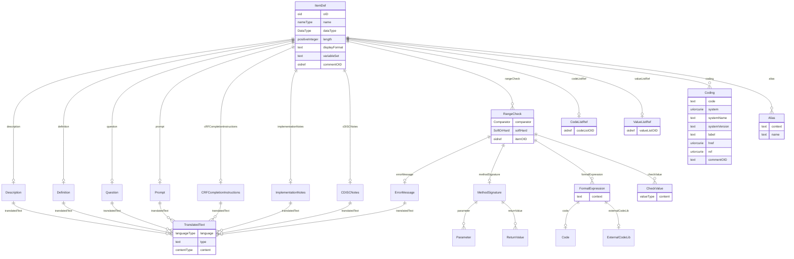

# Class: ItemDef

_An ItemDef describes a type of item that can occur within a study. Item properties include name, datatype, range, or codelist restrictions, and several other properties._


URI: [odm:ItemDef](http://www.cdisc.org/ns/odm/v2.0/ItemDef)





<!-- no inheritance hierarchy -->


## Slots

| Name | Cardinality* and Range | Description | Inheritance |
| ---  | --- | --- | --- |
| [oID](oID.md) | 1..1 <br/> [oid](oid.md) | Unique identifier for the ItemDef element. | direct |
| [name](name.md) | 1..1 <br/> [nameType](nameType.md) | Human readable name for the ItemDef. | direct |
| [dataType](dataType.md) | 1..1 <br/> [DataType](DataType.md) | Specification of the allowable values and the intended use of the correspondi... | direct |
| [length](length.md) | 0..1 <br/> [positiveInteger](positiveInteger.md) | Specifies the number of characters allowed for the ItemData/Value when it is ... | direct |
| [displayFormat](displayFormat.md) | 0..1 <br/> [text](text.md) | Display format supports data visualization of numeric float and date values. | direct |
| [variableSet](variableSet.md) | 0..1 <br/> [text](text.md) | ADaM variable set, e.g. Dose, Analysis Parameter, Treatment Timing. | direct |
| [commentOID](commentOID.md) | 0..1 <br/> [oidref](oidref.md) | Reference to a CommentDef with sponsor provided information related to this I... | direct |
| [description](description.md) | 0..1 <br/> [Description](Description.md) | Description reference: A free-text description of the containing metadata com... | direct |
| [definition](definition.md) | 0..1 <br/> [Definition](Definition.md) | A free-text definition of the parameter | direct |
| [question](question.md) | 0..1 <br/> [Question](Question.md) | Question reference: A label shown to a human user when prompted to provide da... | direct |
| [prompt](prompt.md) | 0..1 <br/> [Prompt](Prompt.md) | Prompt reference: A prompt text shown to a human user when prompted to provid... | direct |
| [cRFCompletionInstructions](cRFCompletionInstructions.md) | 0..1 <br/> [CRFCompletionInstructions](CRFCompletionInstructions.md) | CRFCompletionInstructions reference: Instructions for the clinical site on ho... | direct |
| [implementationNotes](implementationNotes.md) | 0..1 <br/> [ImplementationNotes](ImplementationNotes.md) | ImplementationNotes reference: Further information, such as rationale and imp... | direct |
| [cDISCNotes](cDISCNotes.md) | 0..1 <br/> [CDISCNotes](CDISCNotes.md) | CDISCNotes reference: Explanatory text for the variable. | direct |
| [rangeCheck](rangeCheck.md) | 0..* <br/> [RangeCheck](RangeCheck.md) | RangeCheck reference: A RangeCheck defines a constraint on the value of the e... | direct |
| [codeListRef](codeListRef.md) | 0..1 <br/> [CodeListRef](CodeListRef.md) | CodeListRef reference: A reference to a CodeList definition. | direct |
| [valueListRef](valueListRef.md) | 0..1 <br/> [ValueListRef](ValueListRef.md) | ValueListRef reference: The ValueListRef element is the OID of the ValueListD... | direct |
| [coding](coding.md) | 0..* <br/> [Coding](Coding.md) | Coding reference: Coding references a symbol from a defined code system. It u... | direct |
| [alias](alias.md) | 0..* <br/> [Alias](Alias.md) | Alias reference: An Alias provides an additional name for an element. The Con... | direct |

_* See [LinkML documentation](https://linkml.io/linkml/schemas/slots.html#slot-cardinality) for cardinality definitions._


## Usages

| used by | used in | type | used |
| ---  | --- | --- | --- |
| [MetaDataVersion](MetaDataVersion.md) | [itemDef](itemDef.md) | range | [ItemDef](ItemDef.md) |


## See Also

* [https://wiki.cdisc.org/display/PUB/ItemDef](https://wiki.cdisc.org/display/PUB/ItemDef)

## Identifier and Mapping Information


### Schema Source


* from schema: http://www.cdisc.org/ns/odm/v2.0


## Mappings

| Mapping Type | Mapped Value |
| ---  | ---  |
| self | odm:ItemDef |
| native | odm:ItemDef |


## LinkML Source

<!-- TODO: investigate https://stackoverflow.com/questions/37606292/how-to-create-tabbed-code-blocks-in-mkdocs-or-sphinx -->

### Direct

<details>
```yaml
name: ItemDef
description: An ItemDef describes a type of item that can occur within a study. Item
  properties include name, datatype, range, or codelist restrictions, and several
  other properties.
from_schema: http://www.cdisc.org/ns/odm/v2.0
see_also:
- https://wiki.cdisc.org/display/PUB/ItemDef
rank: 1000
slots:
- oID
- name
- dataType
- length
- displayFormat
- variableSet
- commentOID
- description
- definition
- question
- prompt
- cRFCompletionInstructions
- implementationNotes
- cDISCNotes
- rangeCheck
- codeListRef
- valueListRef
- coding
- alias
slot_usage:
  oID:
    name: oID
    description: Unique identifier for the ItemDef element.
    comments:
    - 'Required

      range: oid'
    domain_of:
    - Study
    - MetaDataVersion
    - Standard
    - ValueListDef
    - WhereClauseDef
    - StudyEventGroupDef
    - StudyEventDef
    - ItemGroupDef
    - ItemDef
    - CodeList
    - MethodDef
    - ConditionDef
    - CommentDef
    - StudyIndication
    - StudyIntervention
    - StudyObjective
    - StudyEndPoint
    - StudyTargetPopulation
    - StudyEstimand
    - Arm
    - Epoch
    - StudyParameter
    - StudyTiming
    - TransitionTimingConstraint
    - AbsoluteTimingConstraint
    - RelativeTimingConstraint
    - DurationTimingConstraint
    - WorkflowDef
    - Transition
    - Branching
    - Criterion
    - User
    - Organization
    - Location
    - SignatureDef
    - Query
    range: oid
    required: true
  name:
    name: name
    description: Human readable name for the ItemDef.
    comments:
    - 'Required

      range: name'
    domain_of:
    - Alias
    - MetaDataVersion
    - Standard
    - StudyEventGroupDef
    - StudyEventDef
    - ItemGroupDef
    - Class
    - SubClass
    - SourceItem
    - Resource
    - ItemDef
    - CodeList
    - MethodDef
    - Parameter
    - ReturnValue
    - ConditionDef
    - StudyObjective
    - StudyEndPoint
    - StudyTargetPopulation
    - StudyEstimand
    - Arm
    - Epoch
    - StudyTiming
    - TransitionTimingConstraint
    - AbsoluteTimingConstraint
    - RelativeTimingConstraint
    - DurationTimingConstraint
    - WorkflowDef
    - Transition
    - Branching
    - Criterion
    - Organization
    - Location
    - Query
    range: nameType
    required: true
  dataType:
    name: dataType
    description: Specification of the allowable values and the intended use of the
      corresponding value elements.
    comments:
    - 'Required

      enum values: (text | integer | decimal | float | double | date | time | datetime
      | string | boolean | double | hexBinary | base64Binary | hexFloat | base64Float
      | partialDate | partialTime | partialDatetime | durationDatetime | intervalDatetime
      | incompleteDatetime | incompleteDate | incompleteTime | URI )'
    domain_of:
    - ItemDef
    - CodeList
    - Parameter
    - ReturnValue
    range: DataType
    required: true
  length:
    name: length
    description: Specifies the number of characters allowed for the ItemData/Value
      when it is represented as a text.
    comments:
    - 'Optional

      range: positiveInteger'
    domain_of:
    - ItemDef
    range: positiveInteger
  displayFormat:
    name: displayFormat
    description: Display format supports data visualization of numeric float and date
      values.
    comments:
    - 'Optional

      range: text'
    domain_of:
    - ItemDef
    range: text
  variableSet:
    name: variableSet
    description: ADaM variable set, e.g. Dose, Analysis Parameter, Treatment Timing.
    comments:
    - 'Optional

      range: text'
    domain_of:
    - ItemDef
    range: text
  commentOID:
    name: commentOID
    description: Reference to a CommentDef with sponsor provided information related
      to this ItemDef,
    comments:
    - 'Optional

      range: oidref'
    domain_of:
    - MetaDataVersion
    - Standard
    - WhereClauseDef
    - StudyEventGroupDef
    - StudyEventDef
    - ItemGroupDef
    - ItemDef
    - CodeList
    - CodeListItem
    - MethodDef
    - ConditionDef
    - Coding
    range: oidref
  description:
    name: description
    domain_of:
    - Study
    - MetaDataVersion
    - ValueListDef
    - StudyEventGroupRef
    - StudyEventGroupDef
    - StudyEventDef
    - ItemGroupDef
    - Origin
    - ItemDef
    - CodeList
    - CodeListItem
    - MethodDef
    - ConditionDef
    - CommentDef
    - Protocol
    - StudyStructure
    - TrialPhase
    - StudyIndication
    - StudyIntervention
    - StudyObjective
    - StudyEndPoint
    - StudyTargetPopulation
    - StudyEstimand
    - IntercurrentEvent
    - SummaryMeasure
    - Arm
    - Epoch
    - TransitionTimingConstraint
    - AbsoluteTimingConstraint
    - RelativeTimingConstraint
    - DurationTimingConstraint
    - WorkflowDef
    - Criterion
    - Organization
    - Location
    - ODMFileMetadata
    range: Description
    maximum_cardinality: 1
  definition:
    name: definition
    domain_of:
    - ItemDef
    - Parameter
    - ReturnValue
    range: Definition
    maximum_cardinality: 1
  question:
    name: question
    domain_of:
    - ItemDef
    range: Question
    maximum_cardinality: 1
  prompt:
    name: prompt
    domain_of:
    - ItemDef
    range: Prompt
    maximum_cardinality: 1
  cRFCompletionInstructions:
    name: cRFCompletionInstructions
    domain_of:
    - ItemDef
    range: CRFCompletionInstructions
    maximum_cardinality: 1
  implementationNotes:
    name: implementationNotes
    domain_of:
    - ItemDef
    range: ImplementationNotes
    maximum_cardinality: 1
  cDISCNotes:
    name: cDISCNotes
    domain_of:
    - ItemDef
    range: CDISCNotes
    maximum_cardinality: 1
  rangeCheck:
    name: rangeCheck
    multivalued: true
    domain_of:
    - WhereClauseDef
    - ItemDef
    range: RangeCheck
    inlined: true
    inlined_as_list: true
  codeListRef:
    name: codeListRef
    domain_of:
    - ItemDef
    range: CodeListRef
    maximum_cardinality: 1
  valueListRef:
    name: valueListRef
    domain_of:
    - ItemDef
    range: ValueListRef
    maximum_cardinality: 1
  coding:
    name: coding
    multivalued: true
    domain_of:
    - StudyEventGroupDef
    - StudyEventDef
    - ItemGroupDef
    - Origin
    - SourceItems
    - SourceItem
    - ItemDef
    - CodeList
    - CodeListItem
    - StudyIndication
    - StudyIntervention
    - StudyTargetPopulation
    - StudyParameter
    - ParameterValue
    - Criterion
    - Annotation
    range: Coding
    inlined: true
    inlined_as_list: true
  alias:
    name: alias
    multivalued: true
    domain_of:
    - StudyEventDef
    - ItemGroupDef
    - ItemDef
    - CodeList
    - CodeListItem
    - MethodDef
    - ConditionDef
    - Protocol
    range: Alias
    inlined: true
    inlined_as_list: true
class_uri: odm:ItemDef

```
</details>

### Induced

<details>
```yaml
name: ItemDef
description: An ItemDef describes a type of item that can occur within a study. Item
  properties include name, datatype, range, or codelist restrictions, and several
  other properties.
from_schema: http://www.cdisc.org/ns/odm/v2.0
see_also:
- https://wiki.cdisc.org/display/PUB/ItemDef
rank: 1000
slot_usage:
  oID:
    name: oID
    description: Unique identifier for the ItemDef element.
    comments:
    - 'Required

      range: oid'
    domain_of:
    - Study
    - MetaDataVersion
    - Standard
    - ValueListDef
    - WhereClauseDef
    - StudyEventGroupDef
    - StudyEventDef
    - ItemGroupDef
    - ItemDef
    - CodeList
    - MethodDef
    - ConditionDef
    - CommentDef
    - StudyIndication
    - StudyIntervention
    - StudyObjective
    - StudyEndPoint
    - StudyTargetPopulation
    - StudyEstimand
    - Arm
    - Epoch
    - StudyParameter
    - StudyTiming
    - TransitionTimingConstraint
    - AbsoluteTimingConstraint
    - RelativeTimingConstraint
    - DurationTimingConstraint
    - WorkflowDef
    - Transition
    - Branching
    - Criterion
    - User
    - Organization
    - Location
    - SignatureDef
    - Query
    range: oid
    required: true
  name:
    name: name
    description: Human readable name for the ItemDef.
    comments:
    - 'Required

      range: name'
    domain_of:
    - Alias
    - MetaDataVersion
    - Standard
    - StudyEventGroupDef
    - StudyEventDef
    - ItemGroupDef
    - Class
    - SubClass
    - SourceItem
    - Resource
    - ItemDef
    - CodeList
    - MethodDef
    - Parameter
    - ReturnValue
    - ConditionDef
    - StudyObjective
    - StudyEndPoint
    - StudyTargetPopulation
    - StudyEstimand
    - Arm
    - Epoch
    - StudyTiming
    - TransitionTimingConstraint
    - AbsoluteTimingConstraint
    - RelativeTimingConstraint
    - DurationTimingConstraint
    - WorkflowDef
    - Transition
    - Branching
    - Criterion
    - Organization
    - Location
    - Query
    range: nameType
    required: true
  dataType:
    name: dataType
    description: Specification of the allowable values and the intended use of the
      corresponding value elements.
    comments:
    - 'Required

      enum values: (text | integer | decimal | float | double | date | time | datetime
      | string | boolean | double | hexBinary | base64Binary | hexFloat | base64Float
      | partialDate | partialTime | partialDatetime | durationDatetime | intervalDatetime
      | incompleteDatetime | incompleteDate | incompleteTime | URI )'
    domain_of:
    - ItemDef
    - CodeList
    - Parameter
    - ReturnValue
    range: DataType
    required: true
  length:
    name: length
    description: Specifies the number of characters allowed for the ItemData/Value
      when it is represented as a text.
    comments:
    - 'Optional

      range: positiveInteger'
    domain_of:
    - ItemDef
    range: positiveInteger
  displayFormat:
    name: displayFormat
    description: Display format supports data visualization of numeric float and date
      values.
    comments:
    - 'Optional

      range: text'
    domain_of:
    - ItemDef
    range: text
  variableSet:
    name: variableSet
    description: ADaM variable set, e.g. Dose, Analysis Parameter, Treatment Timing.
    comments:
    - 'Optional

      range: text'
    domain_of:
    - ItemDef
    range: text
  commentOID:
    name: commentOID
    description: Reference to a CommentDef with sponsor provided information related
      to this ItemDef,
    comments:
    - 'Optional

      range: oidref'
    domain_of:
    - MetaDataVersion
    - Standard
    - WhereClauseDef
    - StudyEventGroupDef
    - StudyEventDef
    - ItemGroupDef
    - ItemDef
    - CodeList
    - CodeListItem
    - MethodDef
    - ConditionDef
    - Coding
    range: oidref
  description:
    name: description
    domain_of:
    - Study
    - MetaDataVersion
    - ValueListDef
    - StudyEventGroupRef
    - StudyEventGroupDef
    - StudyEventDef
    - ItemGroupDef
    - Origin
    - ItemDef
    - CodeList
    - CodeListItem
    - MethodDef
    - ConditionDef
    - CommentDef
    - Protocol
    - StudyStructure
    - TrialPhase
    - StudyIndication
    - StudyIntervention
    - StudyObjective
    - StudyEndPoint
    - StudyTargetPopulation
    - StudyEstimand
    - IntercurrentEvent
    - SummaryMeasure
    - Arm
    - Epoch
    - TransitionTimingConstraint
    - AbsoluteTimingConstraint
    - RelativeTimingConstraint
    - DurationTimingConstraint
    - WorkflowDef
    - Criterion
    - Organization
    - Location
    - ODMFileMetadata
    range: Description
    maximum_cardinality: 1
  definition:
    name: definition
    domain_of:
    - ItemDef
    - Parameter
    - ReturnValue
    range: Definition
    maximum_cardinality: 1
  question:
    name: question
    domain_of:
    - ItemDef
    range: Question
    maximum_cardinality: 1
  prompt:
    name: prompt
    domain_of:
    - ItemDef
    range: Prompt
    maximum_cardinality: 1
  cRFCompletionInstructions:
    name: cRFCompletionInstructions
    domain_of:
    - ItemDef
    range: CRFCompletionInstructions
    maximum_cardinality: 1
  implementationNotes:
    name: implementationNotes
    domain_of:
    - ItemDef
    range: ImplementationNotes
    maximum_cardinality: 1
  cDISCNotes:
    name: cDISCNotes
    domain_of:
    - ItemDef
    range: CDISCNotes
    maximum_cardinality: 1
  rangeCheck:
    name: rangeCheck
    multivalued: true
    domain_of:
    - WhereClauseDef
    - ItemDef
    range: RangeCheck
    inlined: true
    inlined_as_list: true
  codeListRef:
    name: codeListRef
    domain_of:
    - ItemDef
    range: CodeListRef
    maximum_cardinality: 1
  valueListRef:
    name: valueListRef
    domain_of:
    - ItemDef
    range: ValueListRef
    maximum_cardinality: 1
  coding:
    name: coding
    multivalued: true
    domain_of:
    - StudyEventGroupDef
    - StudyEventDef
    - ItemGroupDef
    - Origin
    - SourceItems
    - SourceItem
    - ItemDef
    - CodeList
    - CodeListItem
    - StudyIndication
    - StudyIntervention
    - StudyTargetPopulation
    - StudyParameter
    - ParameterValue
    - Criterion
    - Annotation
    range: Coding
    inlined: true
    inlined_as_list: true
  alias:
    name: alias
    multivalued: true
    domain_of:
    - StudyEventDef
    - ItemGroupDef
    - ItemDef
    - CodeList
    - CodeListItem
    - MethodDef
    - ConditionDef
    - Protocol
    range: Alias
    inlined: true
    inlined_as_list: true
attributes:
  oID:
    name: oID
    description: Unique identifier for the ItemDef element.
    comments:
    - 'Required

      range: oid'
    from_schema: http://www.cdisc.org/ns/odm/v2.0
    rank: 1000
    identifier: true
    alias: oID
    owner: ItemDef
    domain_of:
    - Study
    - MetaDataVersion
    - Standard
    - ValueListDef
    - WhereClauseDef
    - StudyEventGroupDef
    - StudyEventDef
    - ItemGroupDef
    - ItemDef
    - CodeList
    - MethodDef
    - ConditionDef
    - CommentDef
    - StudyIndication
    - StudyIntervention
    - StudyObjective
    - StudyEndPoint
    - StudyTargetPopulation
    - StudyEstimand
    - Arm
    - Epoch
    - StudyParameter
    - StudyTiming
    - TransitionTimingConstraint
    - AbsoluteTimingConstraint
    - RelativeTimingConstraint
    - DurationTimingConstraint
    - WorkflowDef
    - Transition
    - Branching
    - Criterion
    - User
    - Organization
    - Location
    - SignatureDef
    - Query
    range: oid
    required: true
  name:
    name: name
    description: Human readable name for the ItemDef.
    comments:
    - 'Required

      range: name'
    from_schema: http://www.cdisc.org/ns/odm/v2.0
    rank: 1000
    alias: name
    owner: ItemDef
    domain_of:
    - Alias
    - MetaDataVersion
    - Standard
    - StudyEventGroupDef
    - StudyEventDef
    - ItemGroupDef
    - Class
    - SubClass
    - SourceItem
    - Resource
    - ItemDef
    - CodeList
    - MethodDef
    - Parameter
    - ReturnValue
    - ConditionDef
    - StudyObjective
    - StudyEndPoint
    - StudyTargetPopulation
    - StudyEstimand
    - Arm
    - Epoch
    - StudyTiming
    - TransitionTimingConstraint
    - AbsoluteTimingConstraint
    - RelativeTimingConstraint
    - DurationTimingConstraint
    - WorkflowDef
    - Transition
    - Branching
    - Criterion
    - Organization
    - Location
    - Query
    range: nameType
    required: true
  dataType:
    name: dataType
    description: Specification of the allowable values and the intended use of the
      corresponding value elements.
    comments:
    - 'Required

      enum values: (text | integer | decimal | float | double | date | time | datetime
      | string | boolean | double | hexBinary | base64Binary | hexFloat | base64Float
      | partialDate | partialTime | partialDatetime | durationDatetime | intervalDatetime
      | incompleteDatetime | incompleteDate | incompleteTime | URI )'
    from_schema: http://www.cdisc.org/ns/odm/v2.0
    rank: 1000
    alias: dataType
    owner: ItemDef
    domain_of:
    - ItemDef
    - CodeList
    - Parameter
    - ReturnValue
    range: DataType
    required: true
  length:
    name: length
    description: Specifies the number of characters allowed for the ItemData/Value
      when it is represented as a text.
    comments:
    - 'Optional

      range: positiveInteger'
    from_schema: http://www.cdisc.org/ns/odm/v2.0
    rank: 1000
    alias: length
    owner: ItemDef
    domain_of:
    - ItemDef
    range: positiveInteger
  displayFormat:
    name: displayFormat
    description: Display format supports data visualization of numeric float and date
      values.
    comments:
    - 'Optional

      range: text'
    from_schema: http://www.cdisc.org/ns/odm/v2.0
    rank: 1000
    alias: displayFormat
    owner: ItemDef
    domain_of:
    - ItemDef
    range: text
  variableSet:
    name: variableSet
    description: ADaM variable set, e.g. Dose, Analysis Parameter, Treatment Timing.
    comments:
    - 'Optional

      range: text'
    from_schema: http://www.cdisc.org/ns/odm/v2.0
    rank: 1000
    alias: variableSet
    owner: ItemDef
    domain_of:
    - ItemDef
    range: text
  commentOID:
    name: commentOID
    description: Reference to a CommentDef with sponsor provided information related
      to this ItemDef,
    comments:
    - 'Optional

      range: oidref'
    from_schema: http://www.cdisc.org/ns/odm/v2.0
    rank: 1000
    alias: commentOID
    owner: ItemDef
    domain_of:
    - MetaDataVersion
    - Standard
    - WhereClauseDef
    - StudyEventGroupDef
    - StudyEventDef
    - ItemGroupDef
    - ItemDef
    - CodeList
    - CodeListItem
    - MethodDef
    - ConditionDef
    - Coding
    range: oidref
  description:
    name: description
    description: 'Description reference: A free-text description of the containing
      metadata component, unless restricted by Business Rules.'
    from_schema: http://www.cdisc.org/ns/odm/v2.0
    rank: 1000
    identifier: false
    alias: description
    owner: ItemDef
    domain_of:
    - Study
    - MetaDataVersion
    - ValueListDef
    - StudyEventGroupRef
    - StudyEventGroupDef
    - StudyEventDef
    - ItemGroupDef
    - Origin
    - ItemDef
    - CodeList
    - CodeListItem
    - MethodDef
    - ConditionDef
    - CommentDef
    - Protocol
    - StudyStructure
    - TrialPhase
    - StudyIndication
    - StudyIntervention
    - StudyObjective
    - StudyEndPoint
    - StudyTargetPopulation
    - StudyEstimand
    - IntercurrentEvent
    - SummaryMeasure
    - Arm
    - Epoch
    - TransitionTimingConstraint
    - AbsoluteTimingConstraint
    - RelativeTimingConstraint
    - DurationTimingConstraint
    - WorkflowDef
    - Criterion
    - Organization
    - Location
    - ODMFileMetadata
    range: Description
    maximum_cardinality: 1
  definition:
    name: definition
    description: A free-text definition of the parameter
    from_schema: http://www.cdisc.org/ns/odm/v2.0
    rank: 1000
    identifier: false
    alias: definition
    owner: ItemDef
    domain_of:
    - ItemDef
    - Parameter
    - ReturnValue
    range: Definition
    maximum_cardinality: 1
  question:
    name: question
    description: 'Question reference: A label shown to a human user when prompted
      to provide data for an item on paper or on a screen.'
    from_schema: http://www.cdisc.org/ns/odm/v2.0
    rank: 1000
    identifier: false
    alias: question
    owner: ItemDef
    domain_of:
    - ItemDef
    range: Question
    maximum_cardinality: 1
  prompt:
    name: prompt
    description: 'Prompt reference: A prompt text shown to a human user when prompted
      to provide data for an item on paper or on a screen. The Prompt is a short version
      of the question.'
    from_schema: http://www.cdisc.org/ns/odm/v2.0
    rank: 1000
    identifier: false
    alias: prompt
    owner: ItemDef
    domain_of:
    - ItemDef
    range: Prompt
    maximum_cardinality: 1
  cRFCompletionInstructions:
    name: cRFCompletionInstructions
    description: 'CRFCompletionInstructions reference: Instructions for the clinical
      site on how to enter collected information on the CRF.'
    from_schema: http://www.cdisc.org/ns/odm/v2.0
    rank: 1000
    identifier: false
    alias: cRFCompletionInstructions
    owner: ItemDef
    domain_of:
    - ItemDef
    range: CRFCompletionInstructions
    maximum_cardinality: 1
  implementationNotes:
    name: implementationNotes
    description: 'ImplementationNotes reference: Further information, such as rationale
      and implementation instructions, on how to implement the CRF data collection
      fields.'
    from_schema: http://www.cdisc.org/ns/odm/v2.0
    rank: 1000
    identifier: false
    alias: implementationNotes
    owner: ItemDef
    domain_of:
    - ItemDef
    range: ImplementationNotes
    maximum_cardinality: 1
  cDISCNotes:
    name: cDISCNotes
    description: 'CDISCNotes reference: Explanatory text for the variable.'
    from_schema: http://www.cdisc.org/ns/odm/v2.0
    rank: 1000
    identifier: false
    alias: cDISCNotes
    owner: ItemDef
    domain_of:
    - ItemDef
    range: CDISCNotes
    maximum_cardinality: 1
  rangeCheck:
    name: rangeCheck
    description: 'RangeCheck reference: A RangeCheck defines a constraint on the value
      of the enclosing item. It represents an expression that evaluates to True when
      the ItemData value is valid or False when the ItemData value is invalid. The
      expression is specified using either Comparator and CheckValue or using FormalExpressions.'
    from_schema: http://www.cdisc.org/ns/odm/v2.0
    rank: 1000
    multivalued: true
    identifier: false
    alias: rangeCheck
    owner: ItemDef
    domain_of:
    - WhereClauseDef
    - ItemDef
    range: RangeCheck
    inlined: true
    inlined_as_list: true
  codeListRef:
    name: codeListRef
    description: 'CodeListRef reference: A reference to a CodeList definition.'
    from_schema: http://www.cdisc.org/ns/odm/v2.0
    rank: 1000
    identifier: false
    alias: codeListRef
    owner: ItemDef
    domain_of:
    - ItemDef
    range: CodeListRef
    maximum_cardinality: 1
  valueListRef:
    name: valueListRef
    description: 'ValueListRef reference: The ValueListRef element is the OID of the
      ValueListDef that contains the valuelist definition associated with the variable.
      If value-level metadata is required for a variable, a ValueListRef element should
      be provided as a child element on the ItemDef for the variable definition.'
    from_schema: http://www.cdisc.org/ns/odm/v2.0
    rank: 1000
    identifier: false
    alias: valueListRef
    owner: ItemDef
    domain_of:
    - ItemDef
    range: ValueListRef
    maximum_cardinality: 1
  coding:
    name: coding
    description: 'Coding reference: Coding references a symbol from a defined code
      system. It uses a code defined in a terminology system to associate semantics
      with a given term, codelist, variable, or group of variables. The presence of
      a Coding element associates a meaning to its parent element. Including multiple
      Coding elements for a given parent indicates synonymous meanings provided by
      different code systems or code system versions.'
    from_schema: http://www.cdisc.org/ns/odm/v2.0
    rank: 1000
    multivalued: true
    identifier: false
    alias: coding
    owner: ItemDef
    domain_of:
    - StudyEventGroupDef
    - StudyEventDef
    - ItemGroupDef
    - Origin
    - SourceItems
    - SourceItem
    - ItemDef
    - CodeList
    - CodeListItem
    - StudyIndication
    - StudyIntervention
    - StudyTargetPopulation
    - StudyParameter
    - ParameterValue
    - Criterion
    - Annotation
    range: Coding
    inlined: true
    inlined_as_list: true
  alias:
    name: alias
    description: 'Alias reference: An Alias provides an additional name for an element.
      The Context attribute specifies the application domain in which this additional
      name is relevant.'
    from_schema: http://www.cdisc.org/ns/odm/v2.0
    rank: 1000
    multivalued: true
    identifier: false
    alias: alias
    owner: ItemDef
    domain_of:
    - StudyEventDef
    - ItemGroupDef
    - ItemDef
    - CodeList
    - CodeListItem
    - MethodDef
    - ConditionDef
    - Protocol
    range: Alias
    inlined: true
    inlined_as_list: true
class_uri: odm:ItemDef

```
</details>