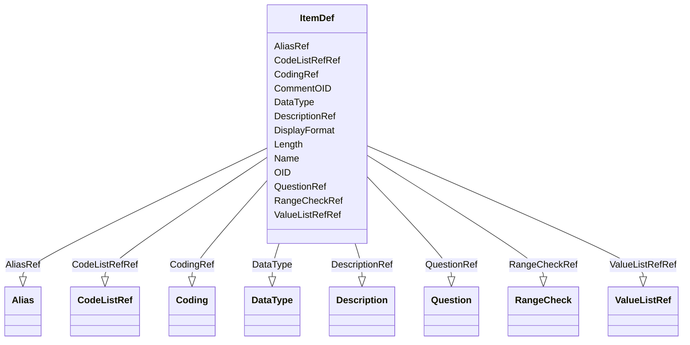

# Class: ItemDef


URI: [odm:ItemDef](http://www.cdisc.org/ns/odm/v2.0/ItemDef)





<!-- no inheritance hierarchy -->


## Slots

| Name | Cardinality and Range | Description | Inheritance |
| ---  | --- | --- | --- |
| [OID](OID.md) | 1..1 <br/> [Oid](Oid.md) | Unique identifier of the version within the XML document | direct |
| [Name](Name.md) | 1..1 <br/> [Name](Name.md) | General observation Sub Class | direct |
| [DataType](DataType.md) | 1..1 <br/> [DataType](DataType.md) | The DataType attribute specifies how the corresponding value | direct |
| [Length](Length.md) | 0..1 <br/> [PositiveInteger](PositiveInteger.md) | The Length attribute is optional when DataType is text, string, | direct |
| [DisplayFormat](DisplayFormat.md) | 0..1 <br/> [Text](Text.md) |  | direct |
| [CommentOID](CommentOID.md) | 0..1 <br/> [Oidref](Oidref.md) | The Comment identifier that this value refers to | direct |
| [DescriptionRef](DescriptionRef.md) | 0..1 <br/> [Description](Description.md) |  | direct |
| [QuestionRef](QuestionRef.md) | 0..1 <br/> [Question](Question.md) |  | direct |
| [RangeCheckRef](RangeCheckRef.md) | 0..* <br/> [RangeCheck](RangeCheck.md) |  | direct |
| [CodeListRefRef](CodeListRefRef.md) | 0..1 <br/> [CodeListRef](CodeListRef.md) |  | direct |
| [ValueListRefRef](ValueListRefRef.md) | 0..1 <br/> [ValueListRef](ValueListRef.md) |  | direct |
| [CodingRef](CodingRef.md) | 0..* <br/> [Coding](Coding.md) |  | direct |
| [AliasRef](AliasRef.md) | 0..* <br/> [Alias](Alias.md) |  | direct |


## Usages

| used by | used in | type | used |
| ---  | --- | --- | --- |
| [MetaDataVersion](MetaDataVersion.md) | [ItemDefRef](ItemDefRef.md) | range | [ItemDef](ItemDef.md) |


## Identifier and Mapping Information


### Schema Source


* from schema: http://www.cdisc.org/ns/odm/v2.0


## Mappings

| Mapping Type | Mapped Value |
| ---  | ---  |
| self | odm:ItemDef |
| native | odm:ItemDef |


## LinkML Source

<!-- TODO: investigate https://stackoverflow.com/questions/37606292/how-to-create-tabbed-code-blocks-in-mkdocs-or-sphinx -->

### Direct

<details>
```yaml
name: ItemDef
from_schema: http://www.cdisc.org/ns/odm/v2.0
slots:
- OID
- Name
- DataType
- Length
- DisplayFormat
- CommentOID
- DescriptionRef
- QuestionRef
- RangeCheckRef
- CodeListRefRef
- ValueListRefRef
- CodingRef
- AliasRef
slot_usage:
  OID:
    name: OID
    domain_of:
    - ValueListDef
    - WhereClauseDef
    - StudyEventGroupDef
    - CommentDef
    - StudyIndication
    - StudyIntervention
    - StudyObjective
    - StudyEndPoint
    - StudyTargetPopulation
    - StudyEstimand
    - Arm
    - Epoch
    - StudyParameter
    - StudyTiming
    - TransitionTimingConstraint
    - AbsoluteTimingConstraint
    - RelativeTimingConstraint
    - DurationTimingConstraint
    - WorkflowDef
    - Transition
    - Branching
    - Criterion
    - ExceptionEvent
    - Organization
    - Query
    - MetaDataVersion
    - StudyEventDef
    - ItemGroupDef
    - ItemDef
    - CodeList
    - ConditionDef
    - MethodDef
    - Standard
    - User
    - Location
    - SignatureDef
    - Study
    range: oid
    required: true
  Name:
    name: Name
    domain_of:
    - StudyEventGroupDef
    - Class
    - SubClass
    - SourceItem
    - Resource
    - Parameter
    - ReturnValue
    - StudyObjective
    - StudyEndPoint
    - StudyTargetPopulation
    - StudyEstimand
    - Arm
    - Epoch
    - StudyTiming
    - TransitionTimingConstraint
    - AbsoluteTimingConstraint
    - RelativeTimingConstraint
    - DurationTimingConstraint
    - WorkflowDef
    - Transition
    - Branching
    - Criterion
    - ExceptionEvent
    - Organization
    - Query
    - MetaDataVersion
    - StudyEventDef
    - ItemGroupDef
    - ItemDef
    - CodeList
    - ConditionDef
    - MethodDef
    - Standard
    - Alias
    - Location
    range: name
    required: true
  DataType:
    name: DataType
    domain_of:
    - Parameter
    - ReturnValue
    - ItemDef
    - CodeList
    range: DataType
    required: true
  Length:
    name: Length
    domain_of:
    - ItemDef
    range: positiveInteger
    required: false
  DisplayFormat:
    name: DisplayFormat
    domain_of:
    - ItemDef
    range: text
    required: false
  CommentOID:
    name: CommentOID
    domain_of:
    - WhereClauseDef
    - StudyEventGroupDef
    - Coding
    - MetaDataVersion
    - StudyEventDef
    - ItemGroupDef
    - ItemDef
    - CodeList
    - ConditionDef
    - MethodDef
    - Standard
    - CodeListItem
    - EnumeratedItem
    range: oidref
    required: false
  DescriptionRef:
    name: DescriptionRef
    domain_of:
    - ValueListDef
    - StudyEventGroupRef
    - StudyEventGroupDef
    - Origin
    - CommentDef
    - Protocol
    - StudyStructure
    - TrialPhase
    - StudyIndication
    - StudyIntervention
    - StudyObjective
    - StudyEndPoint
    - StudyTargetPopulation
    - StudyEstimand
    - IntercurrentEvent
    - SummaryMeasure
    - Arm
    - Epoch
    - TransitionTimingConstraint
    - AbsoluteTimingConstraint
    - RelativeTimingConstraint
    - DurationTimingConstraint
    - WorkflowDef
    - Criterion
    - ExceptionEvent
    - Organization
    - MetaDataVersion
    - StudyEventDef
    - ItemGroupDef
    - ItemDef
    - CodeList
    - ConditionDef
    - MethodDef
    - CodeListItem
    - EnumeratedItem
    - Location
    - Study
    - ODMFileMetadata
    range: Description
    required: false
    minimum_cardinality: 0
    maximum_cardinality: 1
  QuestionRef:
    name: QuestionRef
    domain_of:
    - ItemDef
    range: Question
    required: false
    minimum_cardinality: 0
    maximum_cardinality: 1
  RangeCheckRef:
    name: RangeCheckRef
    multivalued: true
    domain_of:
    - WhereClauseDef
    - ItemDef
    range: RangeCheck
    required: false
    minimum_cardinality: 0
  CodeListRefRef:
    name: CodeListRefRef
    domain_of:
    - ItemDef
    range: CodeListRef
    required: false
    minimum_cardinality: 0
    maximum_cardinality: 1
  ValueListRefRef:
    name: ValueListRefRef
    domain_of:
    - ItemDef
    range: ValueListRef
    required: false
    minimum_cardinality: 0
    maximum_cardinality: 1
  CodingRef:
    name: CodingRef
    multivalued: true
    domain_of:
    - StudyEventGroupDef
    - Origin
    - SourceItems
    - SourceItem
    - StudyIndication
    - StudyIntervention
    - StudyTargetPopulation
    - StudyParameter
    - ParameterValue
    - Annotation
    - StudyEventDef
    - ItemGroupDef
    - ItemDef
    - CodeList
    - CodeListItem
    - EnumeratedItem
    range: Coding
    required: false
    minimum_cardinality: 0
  AliasRef:
    name: AliasRef
    multivalued: true
    list_elements_unique: true
    domain_of:
    - Protocol
    - StudyEventDef
    - ItemGroupDef
    - ItemDef
    - CodeList
    - ConditionDef
    - MethodDef
    - CodeListItem
    - EnumeratedItem
    range: Alias
    required: false
    minimum_cardinality: 0
class_uri: odm:ItemDef
unique_keys:
  UC-MDV-4:
    unique_key_name: UC-MDV-4
    unique_key_slots:
    - OID

```
</details>

### Induced

<details>
```yaml
name: ItemDef
from_schema: http://www.cdisc.org/ns/odm/v2.0
slot_usage:
  OID:
    name: OID
    domain_of:
    - ValueListDef
    - WhereClauseDef
    - StudyEventGroupDef
    - CommentDef
    - StudyIndication
    - StudyIntervention
    - StudyObjective
    - StudyEndPoint
    - StudyTargetPopulation
    - StudyEstimand
    - Arm
    - Epoch
    - StudyParameter
    - StudyTiming
    - TransitionTimingConstraint
    - AbsoluteTimingConstraint
    - RelativeTimingConstraint
    - DurationTimingConstraint
    - WorkflowDef
    - Transition
    - Branching
    - Criterion
    - ExceptionEvent
    - Organization
    - Query
    - MetaDataVersion
    - StudyEventDef
    - ItemGroupDef
    - ItemDef
    - CodeList
    - ConditionDef
    - MethodDef
    - Standard
    - User
    - Location
    - SignatureDef
    - Study
    range: oid
    required: true
  Name:
    name: Name
    domain_of:
    - StudyEventGroupDef
    - Class
    - SubClass
    - SourceItem
    - Resource
    - Parameter
    - ReturnValue
    - StudyObjective
    - StudyEndPoint
    - StudyTargetPopulation
    - StudyEstimand
    - Arm
    - Epoch
    - StudyTiming
    - TransitionTimingConstraint
    - AbsoluteTimingConstraint
    - RelativeTimingConstraint
    - DurationTimingConstraint
    - WorkflowDef
    - Transition
    - Branching
    - Criterion
    - ExceptionEvent
    - Organization
    - Query
    - MetaDataVersion
    - StudyEventDef
    - ItemGroupDef
    - ItemDef
    - CodeList
    - ConditionDef
    - MethodDef
    - Standard
    - Alias
    - Location
    range: name
    required: true
  DataType:
    name: DataType
    domain_of:
    - Parameter
    - ReturnValue
    - ItemDef
    - CodeList
    range: DataType
    required: true
  Length:
    name: Length
    domain_of:
    - ItemDef
    range: positiveInteger
    required: false
  DisplayFormat:
    name: DisplayFormat
    domain_of:
    - ItemDef
    range: text
    required: false
  CommentOID:
    name: CommentOID
    domain_of:
    - WhereClauseDef
    - StudyEventGroupDef
    - Coding
    - MetaDataVersion
    - StudyEventDef
    - ItemGroupDef
    - ItemDef
    - CodeList
    - ConditionDef
    - MethodDef
    - Standard
    - CodeListItem
    - EnumeratedItem
    range: oidref
    required: false
  DescriptionRef:
    name: DescriptionRef
    domain_of:
    - ValueListDef
    - StudyEventGroupRef
    - StudyEventGroupDef
    - Origin
    - CommentDef
    - Protocol
    - StudyStructure
    - TrialPhase
    - StudyIndication
    - StudyIntervention
    - StudyObjective
    - StudyEndPoint
    - StudyTargetPopulation
    - StudyEstimand
    - IntercurrentEvent
    - SummaryMeasure
    - Arm
    - Epoch
    - TransitionTimingConstraint
    - AbsoluteTimingConstraint
    - RelativeTimingConstraint
    - DurationTimingConstraint
    - WorkflowDef
    - Criterion
    - ExceptionEvent
    - Organization
    - MetaDataVersion
    - StudyEventDef
    - ItemGroupDef
    - ItemDef
    - CodeList
    - ConditionDef
    - MethodDef
    - CodeListItem
    - EnumeratedItem
    - Location
    - Study
    - ODMFileMetadata
    range: Description
    required: false
    minimum_cardinality: 0
    maximum_cardinality: 1
  QuestionRef:
    name: QuestionRef
    domain_of:
    - ItemDef
    range: Question
    required: false
    minimum_cardinality: 0
    maximum_cardinality: 1
  RangeCheckRef:
    name: RangeCheckRef
    multivalued: true
    domain_of:
    - WhereClauseDef
    - ItemDef
    range: RangeCheck
    required: false
    minimum_cardinality: 0
  CodeListRefRef:
    name: CodeListRefRef
    domain_of:
    - ItemDef
    range: CodeListRef
    required: false
    minimum_cardinality: 0
    maximum_cardinality: 1
  ValueListRefRef:
    name: ValueListRefRef
    domain_of:
    - ItemDef
    range: ValueListRef
    required: false
    minimum_cardinality: 0
    maximum_cardinality: 1
  CodingRef:
    name: CodingRef
    multivalued: true
    domain_of:
    - StudyEventGroupDef
    - Origin
    - SourceItems
    - SourceItem
    - StudyIndication
    - StudyIntervention
    - StudyTargetPopulation
    - StudyParameter
    - ParameterValue
    - Annotation
    - StudyEventDef
    - ItemGroupDef
    - ItemDef
    - CodeList
    - CodeListItem
    - EnumeratedItem
    range: Coding
    required: false
    minimum_cardinality: 0
  AliasRef:
    name: AliasRef
    multivalued: true
    list_elements_unique: true
    domain_of:
    - Protocol
    - StudyEventDef
    - ItemGroupDef
    - ItemDef
    - CodeList
    - ConditionDef
    - MethodDef
    - CodeListItem
    - EnumeratedItem
    range: Alias
    required: false
    minimum_cardinality: 0
attributes:
  OID:
    name: OID
    description: Unique identifier of the version within the XML document.
    from_schema: http://www.cdisc.org/ns/odm/v2.0
    rank: 1000
    alias: OID
    owner: ItemDef
    domain_of:
    - ValueListDef
    - WhereClauseDef
    - StudyEventGroupDef
    - CommentDef
    - StudyIndication
    - StudyIntervention
    - StudyObjective
    - StudyEndPoint
    - StudyTargetPopulation
    - StudyEstimand
    - Arm
    - Epoch
    - StudyParameter
    - StudyTiming
    - TransitionTimingConstraint
    - AbsoluteTimingConstraint
    - RelativeTimingConstraint
    - DurationTimingConstraint
    - WorkflowDef
    - Transition
    - Branching
    - Criterion
    - ExceptionEvent
    - Organization
    - Query
    - MetaDataVersion
    - StudyEventDef
    - ItemGroupDef
    - ItemDef
    - CodeList
    - ConditionDef
    - MethodDef
    - Standard
    - User
    - Location
    - SignatureDef
    - Study
    range: oid
    required: true
  Name:
    name: Name
    description: General observation Sub Class.
    from_schema: http://www.cdisc.org/ns/odm/v2.0
    rank: 1000
    alias: Name
    owner: ItemDef
    domain_of:
    - StudyEventGroupDef
    - Class
    - SubClass
    - SourceItem
    - Resource
    - Parameter
    - ReturnValue
    - StudyObjective
    - StudyEndPoint
    - StudyTargetPopulation
    - StudyEstimand
    - Arm
    - Epoch
    - StudyTiming
    - TransitionTimingConstraint
    - AbsoluteTimingConstraint
    - RelativeTimingConstraint
    - DurationTimingConstraint
    - WorkflowDef
    - Transition
    - Branching
    - Criterion
    - ExceptionEvent
    - Organization
    - Query
    - MetaDataVersion
    - StudyEventDef
    - ItemGroupDef
    - ItemDef
    - CodeList
    - ConditionDef
    - MethodDef
    - Standard
    - Alias
    - Location
    range: name
    required: true
  DataType:
    name: DataType
    description: "The DataType attribute specifies how the corresponding value\n \
      \                   elements are to be interpreted for comparison and storage."
    from_schema: http://www.cdisc.org/ns/odm/v2.0
    rank: 1000
    alias: DataType
    owner: ItemDef
    domain_of:
    - Parameter
    - ReturnValue
    - ItemDef
    - CodeList
    range: DataType
    required: true
  Length:
    name: Length
    description: "The Length attribute is optional when DataType is text, string,\n\
      \                    integer, or float; and should not be used for the other\n\
      \                    datatypes."
    from_schema: http://www.cdisc.org/ns/odm/v2.0
    rank: 1000
    alias: Length
    owner: ItemDef
    domain_of:
    - ItemDef
    range: positiveInteger
    required: false
  DisplayFormat:
    name: DisplayFormat
    from_schema: http://www.cdisc.org/ns/odm/v2.0
    rank: 1000
    alias: DisplayFormat
    owner: ItemDef
    domain_of:
    - ItemDef
    range: text
    required: false
  CommentOID:
    name: CommentOID
    description: "The Comment identifier that this value refers to. Needed when the\
      \ WhereClause references Items across different domains.\n                The\
      \ Comment would define any join assumptions."
    from_schema: http://www.cdisc.org/ns/odm/v2.0
    rank: 1000
    alias: CommentOID
    owner: ItemDef
    domain_of:
    - WhereClauseDef
    - StudyEventGroupDef
    - Coding
    - MetaDataVersion
    - StudyEventDef
    - ItemGroupDef
    - ItemDef
    - CodeList
    - ConditionDef
    - MethodDef
    - Standard
    - CodeListItem
    - EnumeratedItem
    range: oidref
    required: false
  DescriptionRef:
    name: DescriptionRef
    from_schema: http://www.cdisc.org/ns/odm/v2.0
    rank: 1000
    alias: DescriptionRef
    owner: ItemDef
    domain_of:
    - ValueListDef
    - StudyEventGroupRef
    - StudyEventGroupDef
    - Origin
    - CommentDef
    - Protocol
    - StudyStructure
    - TrialPhase
    - StudyIndication
    - StudyIntervention
    - StudyObjective
    - StudyEndPoint
    - StudyTargetPopulation
    - StudyEstimand
    - IntercurrentEvent
    - SummaryMeasure
    - Arm
    - Epoch
    - TransitionTimingConstraint
    - AbsoluteTimingConstraint
    - RelativeTimingConstraint
    - DurationTimingConstraint
    - WorkflowDef
    - Criterion
    - ExceptionEvent
    - Organization
    - MetaDataVersion
    - StudyEventDef
    - ItemGroupDef
    - ItemDef
    - CodeList
    - ConditionDef
    - MethodDef
    - CodeListItem
    - EnumeratedItem
    - Location
    - Study
    - ODMFileMetadata
    range: Description
    required: false
    minimum_cardinality: 0
    maximum_cardinality: 1
  QuestionRef:
    name: QuestionRef
    from_schema: http://www.cdisc.org/ns/odm/v2.0
    rank: 1000
    alias: QuestionRef
    owner: ItemDef
    domain_of:
    - ItemDef
    range: Question
    required: false
    minimum_cardinality: 0
    maximum_cardinality: 1
  RangeCheckRef:
    name: RangeCheckRef
    from_schema: http://www.cdisc.org/ns/odm/v2.0
    rank: 1000
    multivalued: true
    alias: RangeCheckRef
    owner: ItemDef
    domain_of:
    - WhereClauseDef
    - ItemDef
    range: RangeCheck
    required: false
    minimum_cardinality: 0
  CodeListRefRef:
    name: CodeListRefRef
    from_schema: http://www.cdisc.org/ns/odm/v2.0
    rank: 1000
    alias: CodeListRefRef
    owner: ItemDef
    domain_of:
    - ItemDef
    range: CodeListRef
    required: false
    minimum_cardinality: 0
    maximum_cardinality: 1
  ValueListRefRef:
    name: ValueListRefRef
    from_schema: http://www.cdisc.org/ns/odm/v2.0
    rank: 1000
    alias: ValueListRefRef
    owner: ItemDef
    domain_of:
    - ItemDef
    range: ValueListRef
    required: false
    minimum_cardinality: 0
    maximum_cardinality: 1
  CodingRef:
    name: CodingRef
    from_schema: http://www.cdisc.org/ns/odm/v2.0
    rank: 1000
    multivalued: true
    alias: CodingRef
    owner: ItemDef
    domain_of:
    - StudyEventGroupDef
    - Origin
    - SourceItems
    - SourceItem
    - StudyIndication
    - StudyIntervention
    - StudyTargetPopulation
    - StudyParameter
    - ParameterValue
    - Annotation
    - StudyEventDef
    - ItemGroupDef
    - ItemDef
    - CodeList
    - CodeListItem
    - EnumeratedItem
    range: Coding
    required: false
    minimum_cardinality: 0
  AliasRef:
    name: AliasRef
    from_schema: http://www.cdisc.org/ns/odm/v2.0
    rank: 1000
    multivalued: true
    list_elements_unique: true
    alias: AliasRef
    owner: ItemDef
    domain_of:
    - Protocol
    - StudyEventDef
    - ItemGroupDef
    - ItemDef
    - CodeList
    - ConditionDef
    - MethodDef
    - CodeListItem
    - EnumeratedItem
    range: Alias
    required: false
    minimum_cardinality: 0
class_uri: odm:ItemDef
unique_keys:
  UC-MDV-4:
    unique_key_name: UC-MDV-4
    unique_key_slots:
    - OID

```
</details>