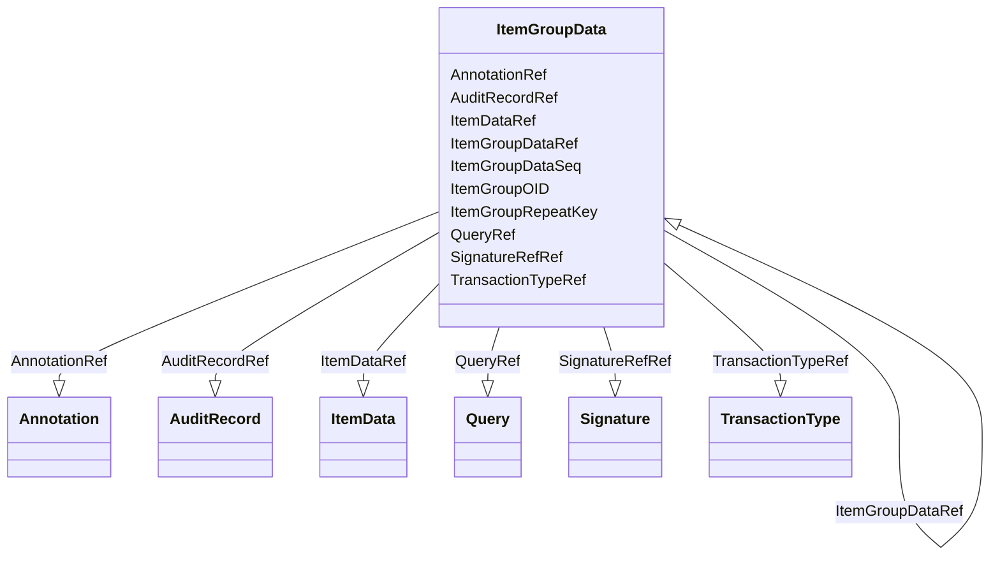

# Class: ItemGroupData


URI: [odm:ItemGroupData](http://www.cdisc.org/ns/odm/v2.0/ItemGroupData)





<!-- no inheritance hierarchy -->


## Slots

| Name | Cardinality and Range | Description | Inheritance |
| ---  | --- | --- | --- |
| [ItemGroupOID](ItemGroupOID.md) | 1..1 <br/> [Oidref](Oidref.md) |  | direct |
| [ItemGroupRepeatKey](ItemGroupRepeatKey.md) | 0..1 <br/> [RepeatKey](RepeatKey.md) |  | direct |
| [TransactionTypeRef](TransactionTypeRef.md) | 0..1 <br/> [TransactionType](TransactionType.md) |  | direct |
| [ItemGroupDataSeq](ItemGroupDataSeq.md) | 0..1 <br/> [PositiveInteger](PositiveInteger.md) |  | direct |
| [QueryRef](QueryRef.md) | 0..* <br/> [Query](Query.md) |  | direct |
| [ItemGroupDataRef](ItemGroupDataRef.md) | 0..1 <br/> [ItemGroupData](ItemGroupData.md) |  | direct |
| [ItemDataRef](ItemDataRef.md) | 0..1 <br/> [ItemData](ItemData.md) |  | direct |
| [AuditRecordRef](AuditRecordRef.md) | 0..1 <br/> [AuditRecord](AuditRecord.md) |  | direct |
| [SignatureRefRef](SignatureRefRef.md) | 0..1 <br/> [Signature](Signature.md) |  | direct |
| [AnnotationRef](AnnotationRef.md) | 0..* <br/> [Annotation](Annotation.md) |  | direct |


## Usages

| used by | used in | type | used |
| ---  | --- | --- | --- |
| [ReferenceData](ReferenceData.md) | [ItemGroupDataRef](ItemGroupDataRef.md) | range | [ItemGroupData](ItemGroupData.md) |
| [ClinicalData](ClinicalData.md) | [ItemGroupDataRef](ItemGroupDataRef.md) | range | [ItemGroupData](ItemGroupData.md) |
| [StudyEventData](StudyEventData.md) | [ItemGroupDataRef](ItemGroupDataRef.md) | range | [ItemGroupData](ItemGroupData.md) |
| [ItemGroupData](ItemGroupData.md) | [ItemGroupDataRef](ItemGroupDataRef.md) | range | [ItemGroupData](ItemGroupData.md) |


## See Also

* [https://wiki.cdisc.org/display/ODM2/ItemGroupData](https://wiki.cdisc.org/display/ODM2/ItemGroupData)

## Identifier and Mapping Information


### Schema Source


* from schema: http://www.cdisc.org/ns/odm/v2.0


## Mappings

| Mapping Type | Mapped Value |
| ---  | ---  |
| self | odm:ItemGroupData |
| native | odm:ItemGroupData |


## LinkML Source

<!-- TODO: investigate https://stackoverflow.com/questions/37606292/how-to-create-tabbed-code-blocks-in-mkdocs-or-sphinx -->

### Direct

<details>
```yaml
name: ItemGroupData
from_schema: http://www.cdisc.org/ns/odm/v2.0
see_also:
- https://wiki.cdisc.org/display/ODM2/ItemGroupData
slots:
- ItemGroupOID
- ItemGroupRepeatKey
- TransactionTypeRef
- ItemGroupDataSeq
- QueryRef
- ItemGroupDataRef
- ItemDataRef
- AuditRecordRef
- SignatureRefRef
- AnnotationRef
slot_usage:
  ItemGroupOID:
    name: ItemGroupOID
    domain_of:
    - ItemGroupRef
    - SourceItem
    - ItemGroupData
    - KeySet
    range: oidref
    required: true
  ItemGroupRepeatKey:
    name: ItemGroupRepeatKey
    domain_of:
    - ItemGroupData
    - KeySet
    range: repeatKey
  TransactionTypeRef:
    name: TransactionTypeRef
    domain_of:
    - SubjectData
    - StudyEventData
    - ItemGroupData
    - ItemData
    - Annotation
    range: TransactionType
  ItemGroupDataSeq:
    name: ItemGroupDataSeq
    domain_of:
    - ItemGroupData
    range: positiveInteger
  QueryRef:
    name: QueryRef
    multivalued: true
    domain_of:
    - Location
    - ClinicalData
    - SubjectData
    - StudyEventData
    - ItemGroupData
    - ItemData
    range: Query
    inlined: true
    inlined_as_list: true
  ItemGroupDataRef:
    name: ItemGroupDataRef
    domain_of:
    - ReferenceData
    - ClinicalData
    - StudyEventData
    - ItemGroupData
    range: ItemGroupData
    maximum_cardinality: 1
  ItemDataRef:
    name: ItemDataRef
    domain_of:
    - ItemGroupData
    range: ItemData
    maximum_cardinality: 1
  AuditRecordRef:
    name: AuditRecordRef
    domain_of:
    - ReferenceData
    - ClinicalData
    - SubjectData
    - StudyEventData
    - ItemGroupData
    - ItemData
    - Query
    range: AuditRecord
    maximum_cardinality: 1
  SignatureRefRef:
    name: SignatureRefRef
    domain_of:
    - ReferenceData
    - ClinicalData
    - SubjectData
    - StudyEventData
    - ItemGroupData
    - ItemData
    - Signature
    range: Signature
    maximum_cardinality: 1
  AnnotationRef:
    name: AnnotationRef
    multivalued: true
    domain_of:
    - ReferenceData
    - ClinicalData
    - SubjectData
    - StudyEventData
    - ItemGroupData
    - ItemData
    - Association
    range: Annotation
    inlined: true
    inlined_as_list: true
class_uri: odm:ItemGroupData

```
</details>

### Induced

<details>
```yaml
name: ItemGroupData
from_schema: http://www.cdisc.org/ns/odm/v2.0
see_also:
- https://wiki.cdisc.org/display/ODM2/ItemGroupData
slot_usage:
  ItemGroupOID:
    name: ItemGroupOID
    domain_of:
    - ItemGroupRef
    - SourceItem
    - ItemGroupData
    - KeySet
    range: oidref
    required: true
  ItemGroupRepeatKey:
    name: ItemGroupRepeatKey
    domain_of:
    - ItemGroupData
    - KeySet
    range: repeatKey
  TransactionTypeRef:
    name: TransactionTypeRef
    domain_of:
    - SubjectData
    - StudyEventData
    - ItemGroupData
    - ItemData
    - Annotation
    range: TransactionType
  ItemGroupDataSeq:
    name: ItemGroupDataSeq
    domain_of:
    - ItemGroupData
    range: positiveInteger
  QueryRef:
    name: QueryRef
    multivalued: true
    domain_of:
    - Location
    - ClinicalData
    - SubjectData
    - StudyEventData
    - ItemGroupData
    - ItemData
    range: Query
    inlined: true
    inlined_as_list: true
  ItemGroupDataRef:
    name: ItemGroupDataRef
    domain_of:
    - ReferenceData
    - ClinicalData
    - StudyEventData
    - ItemGroupData
    range: ItemGroupData
    maximum_cardinality: 1
  ItemDataRef:
    name: ItemDataRef
    domain_of:
    - ItemGroupData
    range: ItemData
    maximum_cardinality: 1
  AuditRecordRef:
    name: AuditRecordRef
    domain_of:
    - ReferenceData
    - ClinicalData
    - SubjectData
    - StudyEventData
    - ItemGroupData
    - ItemData
    - Query
    range: AuditRecord
    maximum_cardinality: 1
  SignatureRefRef:
    name: SignatureRefRef
    domain_of:
    - ReferenceData
    - ClinicalData
    - SubjectData
    - StudyEventData
    - ItemGroupData
    - ItemData
    - Signature
    range: Signature
    maximum_cardinality: 1
  AnnotationRef:
    name: AnnotationRef
    multivalued: true
    domain_of:
    - ReferenceData
    - ClinicalData
    - SubjectData
    - StudyEventData
    - ItemGroupData
    - ItemData
    - Association
    range: Annotation
    inlined: true
    inlined_as_list: true
attributes:
  ItemGroupOID:
    name: ItemGroupOID
    from_schema: http://www.cdisc.org/ns/odm/v2.0
    rank: 1000
    alias: ItemGroupOID
    owner: ItemGroupData
    domain_of:
    - ItemGroupRef
    - SourceItem
    - ItemGroupData
    - KeySet
    range: oidref
    required: true
  ItemGroupRepeatKey:
    name: ItemGroupRepeatKey
    from_schema: http://www.cdisc.org/ns/odm/v2.0
    rank: 1000
    alias: ItemGroupRepeatKey
    owner: ItemGroupData
    domain_of:
    - ItemGroupData
    - KeySet
    range: repeatKey
  TransactionTypeRef:
    name: TransactionTypeRef
    from_schema: http://www.cdisc.org/ns/odm/v2.0
    rank: 1000
    alias: TransactionTypeRef
    owner: ItemGroupData
    domain_of:
    - SubjectData
    - StudyEventData
    - ItemGroupData
    - ItemData
    - Annotation
    range: TransactionType
  ItemGroupDataSeq:
    name: ItemGroupDataSeq
    from_schema: http://www.cdisc.org/ns/odm/v2.0
    rank: 1000
    alias: ItemGroupDataSeq
    owner: ItemGroupData
    domain_of:
    - ItemGroupData
    range: positiveInteger
  QueryRef:
    name: QueryRef
    from_schema: http://www.cdisc.org/ns/odm/v2.0
    rank: 1000
    multivalued: true
    alias: QueryRef
    owner: ItemGroupData
    domain_of:
    - Location
    - ClinicalData
    - SubjectData
    - StudyEventData
    - ItemGroupData
    - ItemData
    range: Query
    inlined: true
    inlined_as_list: true
  ItemGroupDataRef:
    name: ItemGroupDataRef
    from_schema: http://www.cdisc.org/ns/odm/v2.0
    rank: 1000
    alias: ItemGroupDataRef
    owner: ItemGroupData
    domain_of:
    - ReferenceData
    - ClinicalData
    - StudyEventData
    - ItemGroupData
    range: ItemGroupData
    maximum_cardinality: 1
  ItemDataRef:
    name: ItemDataRef
    from_schema: http://www.cdisc.org/ns/odm/v2.0
    rank: 1000
    alias: ItemDataRef
    owner: ItemGroupData
    domain_of:
    - ItemGroupData
    range: ItemData
    maximum_cardinality: 1
  AuditRecordRef:
    name: AuditRecordRef
    from_schema: http://www.cdisc.org/ns/odm/v2.0
    rank: 1000
    alias: AuditRecordRef
    owner: ItemGroupData
    domain_of:
    - ReferenceData
    - ClinicalData
    - SubjectData
    - StudyEventData
    - ItemGroupData
    - ItemData
    - Query
    range: AuditRecord
    maximum_cardinality: 1
  SignatureRefRef:
    name: SignatureRefRef
    from_schema: http://www.cdisc.org/ns/odm/v2.0
    rank: 1000
    alias: SignatureRefRef
    owner: ItemGroupData
    domain_of:
    - ReferenceData
    - ClinicalData
    - SubjectData
    - StudyEventData
    - ItemGroupData
    - ItemData
    - Signature
    range: Signature
    maximum_cardinality: 1
  AnnotationRef:
    name: AnnotationRef
    from_schema: http://www.cdisc.org/ns/odm/v2.0
    rank: 1000
    multivalued: true
    alias: AnnotationRef
    owner: ItemGroupData
    domain_of:
    - ReferenceData
    - ClinicalData
    - SubjectData
    - StudyEventData
    - ItemGroupData
    - ItemData
    - Association
    range: Annotation
    inlined: true
    inlined_as_list: true
class_uri: odm:ItemGroupData

```
</details>