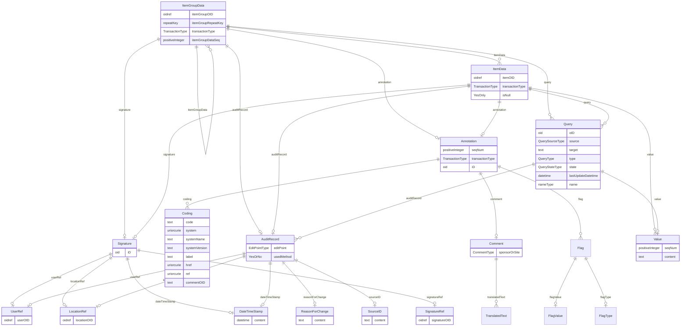

# Class: ItemGroupData

_Clinical data corresponding to an ItemGroupRef defined in the active MetaDataVersion._


URI: [odm:ItemGroupData](http://www.cdisc.org/ns/odm/v2.0/ItemGroupData)





<!-- no inheritance hierarchy -->


## Slots

| Name | Cardinality* and Range | Description | Inheritance |
| ---  | --- | --- | --- |
| [itemGroupOID](itemGroupOID.md) | 1..1 <br/> [oidref](oidref.md) | Reference to an ItemGroupDef for the MetaDataVersion identified in the Clinic... | direct |
| [itemGroupRepeatKey](itemGroupRepeatKey.md) | 0..1 <br/> [repeatKey](repeatKey.md) | A key used to distinguish between repeats of the same type of item group. | direct |
| [transactionType](transactionType.md) | 0..1 <br/> [TransactionType](TransactionType.md) | The TransactionType attribute need not be present in a Snapshot document. | direct |
| [itemGroupDataSeq](itemGroupDataSeq.md) | 0..1 <br/> [positiveInteger](positiveInteger.md) | Unique sequence # for each ItemGroupData child element (record) in the contai... | direct |
| [query](query.md) | 0..* <br/> [Query](Query.md) | Query reference: The Query element represents a request for clarification on ... | direct |
| [itemGroupData](itemGroupData.md) | 0..* <br/> [ItemGroupData](ItemGroupData.md) | ItemGroupData reference: Clinical data corresponding to an ItemGroupRef defin... | direct |
| [itemData](itemData.md) | 0..* <br/> [ItemData](ItemData.md) | ItemData reference: The ItemData element is used for transmission of the clin... | direct |
| [auditRecord](auditRecord.md) | 0..1 <br/> [AuditRecord](AuditRecord.md) | AuditRecord reference: An AuditRecord carries information pertaining to the c... | direct |
| [signature](signature.md) | 0..1 <br/> [Signature](Signature.md) | Signature reference: An electronic signature applies to a collection of clini... | direct |
| [annotation](annotation.md) | 0..1 <br/> [Annotation](Annotation.md) | Annotation reference: A general note about clinical data. If an annotation ha... | direct |

_* See [LinkML documentation](https://linkml.io/linkml/schemas/slots.html#slot-cardinality) for cardinality definitions._


## Usages

| used by | used in | type | used |
| ---  | --- | --- | --- |
| [ReferenceData](ReferenceData.md) | [itemGroupData](itemGroupData.md) | range | [ItemGroupData](ItemGroupData.md) |
| [ClinicalData](ClinicalData.md) | [itemGroupData](itemGroupData.md) | range | [ItemGroupData](ItemGroupData.md) |
| [StudyEventData](StudyEventData.md) | [itemGroupData](itemGroupData.md) | range | [ItemGroupData](ItemGroupData.md) |
| [ItemGroupData](ItemGroupData.md) | [itemGroupData](itemGroupData.md) | range | [ItemGroupData](ItemGroupData.md) |


## See Also

* [https://wiki.cdisc.org/display/PUB/ItemGroupData](https://wiki.cdisc.org/display/PUB/ItemGroupData)

## Identifier and Mapping Information


### Schema Source


* from schema: http://www.cdisc.org/ns/odm/v2.0


## Mappings

| Mapping Type | Mapped Value |
| ---  | ---  |
| self | odm:ItemGroupData |
| native | odm:ItemGroupData |


## LinkML Source

<!-- TODO: investigate https://stackoverflow.com/questions/37606292/how-to-create-tabbed-code-blocks-in-mkdocs-or-sphinx -->

### Direct

<details>
```yaml
name: ItemGroupData
description: Clinical data corresponding to an ItemGroupRef defined in the active
  MetaDataVersion.
from_schema: http://www.cdisc.org/ns/odm/v2.0
see_also:
- https://wiki.cdisc.org/display/PUB/ItemGroupData
rank: 1000
slots:
- itemGroupOID
- itemGroupRepeatKey
- transactionType
- itemGroupDataSeq
- query
- itemGroupData
- itemData
- auditRecord
- signature
- annotation
slot_usage:
  itemGroupOID:
    name: itemGroupOID
    description: Reference to an ItemGroupDef for the MetaDataVersion identified in
      the ClinicalData element.
    comments:
    - 'Required

      The values of ItemGroupOID must be unique within the parent element.'
    domain_of:
    - ItemGroupRef
    - SourceItem
    - ItemGroupData
    - KeySet
    range: oidref
    required: true
  itemGroupRepeatKey:
    name: itemGroupRepeatKey
    description: A key used to distinguish between repeats of the same type of item
      group.
    comments:
    - 'Conditional Required when the Repeating attribute for the ItemGroupDef element
      is "Yes".

      The values of ItemGroupRepeatKey must be unique within the parent element. The
      ItemGroupRepeatKey is present only if the ItemGroupDef is repeating. For /ODM/ReferenceData/ItemGroupData
      , the ItemGroupOID and ItemGroupRepeatKey pair must be unique.'
    domain_of:
    - ItemGroupData
    - KeySet
    range: repeatKey
  transactionType:
    name: transactionType
    description: The TransactionType attribute need not be present in a Snapshot document.
    comments:
    - Conditional Required when the FileType attribute for the ODM element is Transactional.
    domain_of:
    - SubjectData
    - StudyEventData
    - ItemGroupData
    - ItemData
    - Annotation
    range: TransactionType
  itemGroupDataSeq:
    name: itemGroupDataSeq
    description: 'Unique sequence # for each ItemGroupData child element (record)
      in the container element. The ItemGroupDataSeq attribute doesn’t have any other
      meaning than the sequence in which the items are saved and exchanged for each
      ItemGroupDef. It is equivalent to the observation # in a dataset.'
    comments:
    - 'Conditional Required when the parent element is ReferenceData or ClinicalData,
      the ItemGroupDataSeq.

      ItemGroupDataSeq may only be used when ItemGroupData is a direct child of either
      ClinicalData or ReferenceData and the ItemGroupData represents a row in a dataset.
      The ItemGroupDataSeq and ItemGroupRepeatKey attributes are mutually exclusive.'
    domain_of:
    - ItemGroupData
    range: positiveInteger
  query:
    name: query
    multivalued: true
    domain_of:
    - Location
    - ClinicalData
    - SubjectData
    - StudyEventData
    - ItemGroupData
    - ItemData
    range: Query
    inlined: true
    inlined_as_list: true
  itemGroupData:
    name: itemGroupData
    multivalued: true
    domain_of:
    - ReferenceData
    - ClinicalData
    - StudyEventData
    - ItemGroupData
    range: ItemGroupData
    inlined: true
    inlined_as_list: true
  itemData:
    name: itemData
    multivalued: true
    domain_of:
    - ItemGroupData
    range: ItemData
    inlined: true
    inlined_as_list: true
  auditRecord:
    name: auditRecord
    domain_of:
    - ReferenceData
    - ClinicalData
    - SubjectData
    - StudyEventData
    - ItemGroupData
    - ItemData
    - Query
    range: AuditRecord
    maximum_cardinality: 1
  signature:
    name: signature
    domain_of:
    - ReferenceData
    - ClinicalData
    - SubjectData
    - StudyEventData
    - ItemGroupData
    - ItemData
    range: Signature
    maximum_cardinality: 1
  annotation:
    name: annotation
    domain_of:
    - ReferenceData
    - ClinicalData
    - SubjectData
    - StudyEventData
    - ItemGroupData
    - ItemData
    - Association
    range: Annotation
    maximum_cardinality: 1
class_uri: odm:ItemGroupData

```
</details>

### Induced

<details>
```yaml
name: ItemGroupData
description: Clinical data corresponding to an ItemGroupRef defined in the active
  MetaDataVersion.
from_schema: http://www.cdisc.org/ns/odm/v2.0
see_also:
- https://wiki.cdisc.org/display/PUB/ItemGroupData
rank: 1000
slot_usage:
  itemGroupOID:
    name: itemGroupOID
    description: Reference to an ItemGroupDef for the MetaDataVersion identified in
      the ClinicalData element.
    comments:
    - 'Required

      The values of ItemGroupOID must be unique within the parent element.'
    domain_of:
    - ItemGroupRef
    - SourceItem
    - ItemGroupData
    - KeySet
    range: oidref
    required: true
  itemGroupRepeatKey:
    name: itemGroupRepeatKey
    description: A key used to distinguish between repeats of the same type of item
      group.
    comments:
    - 'Conditional Required when the Repeating attribute for the ItemGroupDef element
      is "Yes".

      The values of ItemGroupRepeatKey must be unique within the parent element. The
      ItemGroupRepeatKey is present only if the ItemGroupDef is repeating. For /ODM/ReferenceData/ItemGroupData
      , the ItemGroupOID and ItemGroupRepeatKey pair must be unique.'
    domain_of:
    - ItemGroupData
    - KeySet
    range: repeatKey
  transactionType:
    name: transactionType
    description: The TransactionType attribute need not be present in a Snapshot document.
    comments:
    - Conditional Required when the FileType attribute for the ODM element is Transactional.
    domain_of:
    - SubjectData
    - StudyEventData
    - ItemGroupData
    - ItemData
    - Annotation
    range: TransactionType
  itemGroupDataSeq:
    name: itemGroupDataSeq
    description: 'Unique sequence # for each ItemGroupData child element (record)
      in the container element. The ItemGroupDataSeq attribute doesn’t have any other
      meaning than the sequence in which the items are saved and exchanged for each
      ItemGroupDef. It is equivalent to the observation # in a dataset.'
    comments:
    - 'Conditional Required when the parent element is ReferenceData or ClinicalData,
      the ItemGroupDataSeq.

      ItemGroupDataSeq may only be used when ItemGroupData is a direct child of either
      ClinicalData or ReferenceData and the ItemGroupData represents a row in a dataset.
      The ItemGroupDataSeq and ItemGroupRepeatKey attributes are mutually exclusive.'
    domain_of:
    - ItemGroupData
    range: positiveInteger
  query:
    name: query
    multivalued: true
    domain_of:
    - Location
    - ClinicalData
    - SubjectData
    - StudyEventData
    - ItemGroupData
    - ItemData
    range: Query
    inlined: true
    inlined_as_list: true
  itemGroupData:
    name: itemGroupData
    multivalued: true
    domain_of:
    - ReferenceData
    - ClinicalData
    - StudyEventData
    - ItemGroupData
    range: ItemGroupData
    inlined: true
    inlined_as_list: true
  itemData:
    name: itemData
    multivalued: true
    domain_of:
    - ItemGroupData
    range: ItemData
    inlined: true
    inlined_as_list: true
  auditRecord:
    name: auditRecord
    domain_of:
    - ReferenceData
    - ClinicalData
    - SubjectData
    - StudyEventData
    - ItemGroupData
    - ItemData
    - Query
    range: AuditRecord
    maximum_cardinality: 1
  signature:
    name: signature
    domain_of:
    - ReferenceData
    - ClinicalData
    - SubjectData
    - StudyEventData
    - ItemGroupData
    - ItemData
    range: Signature
    maximum_cardinality: 1
  annotation:
    name: annotation
    domain_of:
    - ReferenceData
    - ClinicalData
    - SubjectData
    - StudyEventData
    - ItemGroupData
    - ItemData
    - Association
    range: Annotation
    maximum_cardinality: 1
attributes:
  itemGroupOID:
    name: itemGroupOID
    description: Reference to an ItemGroupDef for the MetaDataVersion identified in
      the ClinicalData element.
    comments:
    - 'Required

      The values of ItemGroupOID must be unique within the parent element.'
    from_schema: http://www.cdisc.org/ns/odm/v2.0
    rank: 1000
    alias: itemGroupOID
    owner: ItemGroupData
    domain_of:
    - ItemGroupRef
    - SourceItem
    - ItemGroupData
    - KeySet
    range: oidref
    required: true
  itemGroupRepeatKey:
    name: itemGroupRepeatKey
    description: A key used to distinguish between repeats of the same type of item
      group.
    comments:
    - 'Conditional Required when the Repeating attribute for the ItemGroupDef element
      is "Yes".

      The values of ItemGroupRepeatKey must be unique within the parent element. The
      ItemGroupRepeatKey is present only if the ItemGroupDef is repeating. For /ODM/ReferenceData/ItemGroupData
      , the ItemGroupOID and ItemGroupRepeatKey pair must be unique.'
    from_schema: http://www.cdisc.org/ns/odm/v2.0
    rank: 1000
    alias: itemGroupRepeatKey
    owner: ItemGroupData
    domain_of:
    - ItemGroupData
    - KeySet
    range: repeatKey
  transactionType:
    name: transactionType
    description: The TransactionType attribute need not be present in a Snapshot document.
    comments:
    - Conditional Required when the FileType attribute for the ODM element is Transactional.
    from_schema: http://www.cdisc.org/ns/odm/v2.0
    rank: 1000
    alias: transactionType
    owner: ItemGroupData
    domain_of:
    - SubjectData
    - StudyEventData
    - ItemGroupData
    - ItemData
    - Annotation
    range: TransactionType
  itemGroupDataSeq:
    name: itemGroupDataSeq
    description: 'Unique sequence # for each ItemGroupData child element (record)
      in the container element. The ItemGroupDataSeq attribute doesn’t have any other
      meaning than the sequence in which the items are saved and exchanged for each
      ItemGroupDef. It is equivalent to the observation # in a dataset.'
    comments:
    - 'Conditional Required when the parent element is ReferenceData or ClinicalData,
      the ItemGroupDataSeq.

      ItemGroupDataSeq may only be used when ItemGroupData is a direct child of either
      ClinicalData or ReferenceData and the ItemGroupData represents a row in a dataset.
      The ItemGroupDataSeq and ItemGroupRepeatKey attributes are mutually exclusive.'
    from_schema: http://www.cdisc.org/ns/odm/v2.0
    rank: 1000
    alias: itemGroupDataSeq
    owner: ItemGroupData
    domain_of:
    - ItemGroupData
    range: positiveInteger
  query:
    name: query
    description: 'Query reference: The Query element represents a request for clarification
      on a data item collected for a clinical trial, specifically a request from a
      sponsor or sponsor’s representative to an investigator to resolve an error or
      inconsistency discovered during data review. Queries can be created manually
      by individuals such as site monitors or data managers or automatically by systems.
      The full text of the Query exists in the Value child element. The optional Name
      attribute provide the means to provide a short identifier that can be included
      in listing or user interfaces.'
    from_schema: http://www.cdisc.org/ns/odm/v2.0
    rank: 1000
    multivalued: true
    identifier: false
    alias: query
    owner: ItemGroupData
    domain_of:
    - Location
    - ClinicalData
    - SubjectData
    - StudyEventData
    - ItemGroupData
    - ItemData
    range: Query
    inlined: true
    inlined_as_list: true
  itemGroupData:
    name: itemGroupData
    description: 'ItemGroupData reference: Clinical data corresponding to an ItemGroupRef
      defined in the active MetaDataVersion.'
    from_schema: http://www.cdisc.org/ns/odm/v2.0
    rank: 1000
    multivalued: true
    identifier: false
    alias: itemGroupData
    owner: ItemGroupData
    domain_of:
    - ReferenceData
    - ClinicalData
    - StudyEventData
    - ItemGroupData
    range: ItemGroupData
    inlined: true
    inlined_as_list: true
  itemData:
    name: itemData
    description: 'ItemData reference: The ItemData element is used for transmission
      of the clinical data for an item. The model does not support repeating items
      within a single item group.'
    from_schema: http://www.cdisc.org/ns/odm/v2.0
    rank: 1000
    multivalued: true
    identifier: false
    alias: itemData
    owner: ItemGroupData
    domain_of:
    - ItemGroupData
    range: ItemData
    inlined: true
    inlined_as_list: true
  auditRecord:
    name: auditRecord
    description: 'AuditRecord reference: An AuditRecord carries information pertaining
      to the creation, deletion, or modification of clinical data. This information
      includes who performed that action, and where, when, and why that action was
      performed.AuditRecord information describes a change to clinical data, but is
      not itself clinical data. The value of some clinical data can always be changed
      by a subsequent transaction, but history cannot be changed, only added to.'
    from_schema: http://www.cdisc.org/ns/odm/v2.0
    rank: 1000
    identifier: false
    alias: auditRecord
    owner: ItemGroupData
    domain_of:
    - ReferenceData
    - ClinicalData
    - SubjectData
    - StudyEventData
    - ItemGroupData
    - ItemData
    - Query
    range: AuditRecord
    maximum_cardinality: 1
  signature:
    name: signature
    description: 'Signature reference: An electronic signature applies to a collection
      of clinical data. This indicates that some user accepts legal responsibility
      for that data. See 21 CFR Part 11. The signature identifies the person signing,
      the location of signing, the signature meaning (via the referenced SignatureDef),
      the date and time of signing, and (in the case of a digital signature) an encrypted
      hash of the included data.'
    from_schema: http://www.cdisc.org/ns/odm/v2.0
    rank: 1000
    identifier: false
    alias: signature
    owner: ItemGroupData
    domain_of:
    - ReferenceData
    - ClinicalData
    - SubjectData
    - StudyEventData
    - ItemGroupData
    - ItemData
    range: Signature
    maximum_cardinality: 1
  annotation:
    name: annotation
    description: 'Annotation reference: A general note about clinical data. If an
      annotation has both a comment and flags, the flags should be related to the
      comment.'
    from_schema: http://www.cdisc.org/ns/odm/v2.0
    rank: 1000
    identifier: false
    alias: annotation
    owner: ItemGroupData
    domain_of:
    - ReferenceData
    - ClinicalData
    - SubjectData
    - StudyEventData
    - ItemGroupData
    - ItemData
    - Association
    range: Annotation
    maximum_cardinality: 1
class_uri: odm:ItemGroupData

```
</details>