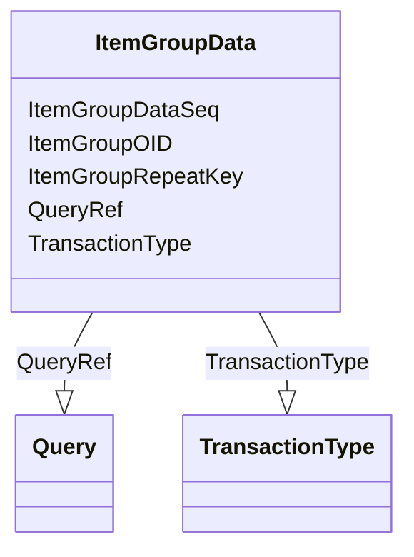

# Class: ItemGroupData


URI: [odm:ItemGroupData](http://www.cdisc.org/ns/odm/v2.0/ItemGroupData)





<!-- no inheritance hierarchy -->


## Slots

| Name | Cardinality and Range | Description | Inheritance |
| ---  | --- | --- | --- |
| [ItemGroupOID](ItemGroupOID.md) | 1..1 <br/> [Oidref](Oidref.md) |  | direct |
| [ItemGroupRepeatKey](ItemGroupRepeatKey.md) | 0..1 <br/> [RepeatKey](RepeatKey.md) |  | direct |
| [TransactionType](TransactionType.md) | 0..1 <br/> [TransactionType](TransactionType.md) |  | direct |
| [ItemGroupDataSeq](ItemGroupDataSeq.md) | 0..1 <br/> [Integer](Integer.md) |  | direct |
| [QueryRef](QueryRef.md) | 0..* <br/> [Query](Query.md) |  | direct |


## Usages

| used by | used in | type | used |
| ---  | --- | --- | --- |
| [ReferenceData](ReferenceData.md) | [ItemGroupDataRef](ItemGroupDataRef.md) | range | [ItemGroupData](ItemGroupData.md) |
| [ClinicalData](ClinicalData.md) | [ItemGroupDataRef](ItemGroupDataRef.md) | range | [ItemGroupData](ItemGroupData.md) |
| [StudyEventData](StudyEventData.md) | [ItemGroupDataRef](ItemGroupDataRef.md) | range | [ItemGroupData](ItemGroupData.md) |


## Identifier and Mapping Information


### Schema Source


* from schema: http://www.cdisc.org/ns/odm/v2.0


## Mappings

| Mapping Type | Mapped Value |
| ---  | ---  |
| self | odm:ItemGroupData |
| native | odm:ItemGroupData |


## LinkML Source

<!-- TODO: investigate https://stackoverflow.com/questions/37606292/how-to-create-tabbed-code-blocks-in-mkdocs-or-sphinx -->

### Direct

<details>
```yaml
name: ItemGroupData
in_subset:
- ItemGroupDataGroup
from_schema: http://www.cdisc.org/ns/odm/v2.0
slots:
- ItemGroupOID
- ItemGroupRepeatKey
- TransactionType
- ItemGroupDataSeq
- QueryRef
slot_usage:
  ItemGroupOID:
    name: ItemGroupOID
    domain_of:
    - SourceItem
    - ItemGroupData
    - KeySet
    - ItemGroupRef
    range: oidref
    required: true
  ItemGroupRepeatKey:
    name: ItemGroupRepeatKey
    domain_of:
    - ItemGroupData
    - KeySet
    range: repeatKey
    required: false
  TransactionType:
    name: TransactionType
    domain_of:
    - SubjectData
    - StudyEventData
    - ItemGroupData
    - ItemData
    - Annotation
    range: TransactionType
    required: false
  ItemGroupDataSeq:
    name: ItemGroupDataSeq
    domain_of:
    - ItemGroupData
    range: integer
    required: false
  QueryRef:
    name: QueryRef
    multivalued: true
    domain_of:
    - ClinicalData
    - SubjectData
    - StudyEventData
    - ItemGroupData
    - ItemData
    - Location
    range: Query
    required: false
    minimum_cardinality: 0
class_uri: odm:ItemGroupData

```
</details>

### Induced

<details>
```yaml
name: ItemGroupData
in_subset:
- ItemGroupDataGroup
from_schema: http://www.cdisc.org/ns/odm/v2.0
slot_usage:
  ItemGroupOID:
    name: ItemGroupOID
    domain_of:
    - SourceItem
    - ItemGroupData
    - KeySet
    - ItemGroupRef
    range: oidref
    required: true
  ItemGroupRepeatKey:
    name: ItemGroupRepeatKey
    domain_of:
    - ItemGroupData
    - KeySet
    range: repeatKey
    required: false
  TransactionType:
    name: TransactionType
    domain_of:
    - SubjectData
    - StudyEventData
    - ItemGroupData
    - ItemData
    - Annotation
    range: TransactionType
    required: false
  ItemGroupDataSeq:
    name: ItemGroupDataSeq
    domain_of:
    - ItemGroupData
    range: integer
    required: false
  QueryRef:
    name: QueryRef
    multivalued: true
    domain_of:
    - ClinicalData
    - SubjectData
    - StudyEventData
    - ItemGroupData
    - ItemData
    - Location
    range: Query
    required: false
    minimum_cardinality: 0
attributes:
  ItemGroupOID:
    name: ItemGroupOID
    from_schema: http://www.cdisc.org/ns/odm/v2.0
    rank: 1000
    alias: ItemGroupOID
    owner: ItemGroupData
    domain_of:
    - SourceItem
    - ItemGroupData
    - KeySet
    - ItemGroupRef
    range: oidref
    required: true
  ItemGroupRepeatKey:
    name: ItemGroupRepeatKey
    from_schema: http://www.cdisc.org/ns/odm/v2.0
    rank: 1000
    alias: ItemGroupRepeatKey
    owner: ItemGroupData
    domain_of:
    - ItemGroupData
    - KeySet
    range: repeatKey
    required: false
  TransactionType:
    name: TransactionType
    from_schema: http://www.cdisc.org/ns/odm/v2.0
    rank: 1000
    alias: TransactionType
    owner: ItemGroupData
    domain_of:
    - SubjectData
    - StudyEventData
    - ItemGroupData
    - ItemData
    - Annotation
    range: TransactionType
    required: false
  ItemGroupDataSeq:
    name: ItemGroupDataSeq
    from_schema: http://www.cdisc.org/ns/odm/v2.0
    rank: 1000
    alias: ItemGroupDataSeq
    owner: ItemGroupData
    domain_of:
    - ItemGroupData
    range: integer
    required: false
  QueryRef:
    name: QueryRef
    from_schema: http://www.cdisc.org/ns/odm/v2.0
    rank: 1000
    multivalued: true
    alias: QueryRef
    owner: ItemGroupData
    domain_of:
    - ClinicalData
    - SubjectData
    - StudyEventData
    - ItemGroupData
    - ItemData
    - Location
    range: Query
    required: false
    minimum_cardinality: 0
class_uri: odm:ItemGroupData

```
</details>