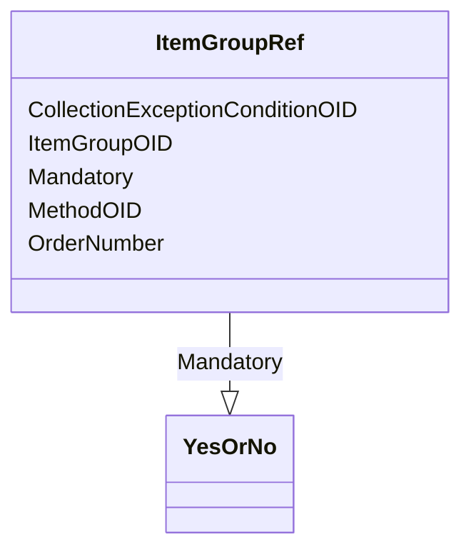

# Class: ItemGroupRef


URI: [odm:ItemGroupRef](http://www.cdisc.org/ns/odm/v2.0/ItemGroupRef)





<!-- no inheritance hierarchy -->


## Slots

| Name | Cardinality and Range | Description | Inheritance |
| ---  | --- | --- | --- |
| [ItemGroupOID](ItemGroupOID.md) | 1..1 <br/> [Oidref](Oidref.md) |  | direct |
| [MethodOID](MethodOID.md) | 0..1 <br/> [Oidref](Oidref.md) |  | direct |
| [OrderNumber](OrderNumber.md) | 0..1 <br/> [PositiveInteger](PositiveInteger.md) |  | direct |
| [Mandatory](Mandatory.md) | 1..1 <br/> [YesOrNo](YesOrNo.md) |  | direct |
| [CollectionExceptionConditionOID](CollectionExceptionConditionOID.md) | 0..1 <br/> [Oidref](Oidref.md) |  | direct |


## Usages

| used by | used in | type | used |
| ---  | --- | --- | --- |
| [StudyEventDef](StudyEventDef.md) | [ItemGroupRefRef](ItemGroupRefRef.md) | range | [ItemGroupRef](ItemGroupRef.md) |
| [ItemGroupDef](ItemGroupDef.md) | [ItemGroupRefRef](ItemGroupRefRef.md) | range | [ItemGroupRef](ItemGroupRef.md) |


## See Also

* [https://wiki.cdisc.org/display/ODM2/ItemGroupRef](https://wiki.cdisc.org/display/ODM2/ItemGroupRef)

## Identifier and Mapping Information


### Schema Source


* from schema: http://www.cdisc.org/ns/odm/v2.0


## Mappings

| Mapping Type | Mapped Value |
| ---  | ---  |
| self | odm:ItemGroupRef |
| native | odm:ItemGroupRef |


## LinkML Source

<!-- TODO: investigate https://stackoverflow.com/questions/37606292/how-to-create-tabbed-code-blocks-in-mkdocs-or-sphinx -->

### Direct

<details>
```yaml
name: ItemGroupRef
from_schema: http://www.cdisc.org/ns/odm/v2.0
see_also:
- https://wiki.cdisc.org/display/ODM2/ItemGroupRef
slots:
- ItemGroupOID
- MethodOID
- OrderNumber
- Mandatory
- CollectionExceptionConditionOID
slot_usage:
  ItemGroupOID:
    name: ItemGroupOID
    domain_of:
    - ItemGroupRef
    - SourceItem
    - ItemGroupData
    - KeySet
    range: oidref
    required: true
  MethodOID:
    name: MethodOID
    domain_of:
    - ItemGroupRef
    - ItemRef
    - TransitionTimingConstraint
    range: oidref
  OrderNumber:
    name: OrderNumber
    domain_of:
    - StudyEventGroupRef
    - StudyEventRef
    - ItemGroupRef
    - ItemRef
    - CodeListItem
    - Parameter
    - ReturnValue
    - StudyEndPointRef
    range: positiveInteger
  Mandatory:
    name: Mandatory
    domain_of:
    - StudyEventGroupRef
    - StudyEventRef
    - ItemGroupRef
    - ItemRef
    range: YesOrNo
    required: true
  CollectionExceptionConditionOID:
    name: CollectionExceptionConditionOID
    domain_of:
    - StudyEventGroupRef
    - StudyEventRef
    - ItemGroupRef
    - ItemRef
    range: oidref
class_uri: odm:ItemGroupRef

```
</details>

### Induced

<details>
```yaml
name: ItemGroupRef
from_schema: http://www.cdisc.org/ns/odm/v2.0
see_also:
- https://wiki.cdisc.org/display/ODM2/ItemGroupRef
slot_usage:
  ItemGroupOID:
    name: ItemGroupOID
    domain_of:
    - ItemGroupRef
    - SourceItem
    - ItemGroupData
    - KeySet
    range: oidref
    required: true
  MethodOID:
    name: MethodOID
    domain_of:
    - ItemGroupRef
    - ItemRef
    - TransitionTimingConstraint
    range: oidref
  OrderNumber:
    name: OrderNumber
    domain_of:
    - StudyEventGroupRef
    - StudyEventRef
    - ItemGroupRef
    - ItemRef
    - CodeListItem
    - Parameter
    - ReturnValue
    - StudyEndPointRef
    range: positiveInteger
  Mandatory:
    name: Mandatory
    domain_of:
    - StudyEventGroupRef
    - StudyEventRef
    - ItemGroupRef
    - ItemRef
    range: YesOrNo
    required: true
  CollectionExceptionConditionOID:
    name: CollectionExceptionConditionOID
    domain_of:
    - StudyEventGroupRef
    - StudyEventRef
    - ItemGroupRef
    - ItemRef
    range: oidref
attributes:
  ItemGroupOID:
    name: ItemGroupOID
    from_schema: http://www.cdisc.org/ns/odm/v2.0
    rank: 1000
    alias: ItemGroupOID
    owner: ItemGroupRef
    domain_of:
    - ItemGroupRef
    - SourceItem
    - ItemGroupData
    - KeySet
    range: oidref
    required: true
  MethodOID:
    name: MethodOID
    from_schema: http://www.cdisc.org/ns/odm/v2.0
    rank: 1000
    alias: MethodOID
    owner: ItemGroupRef
    domain_of:
    - ItemGroupRef
    - ItemRef
    - TransitionTimingConstraint
    range: oidref
  OrderNumber:
    name: OrderNumber
    from_schema: http://www.cdisc.org/ns/odm/v2.0
    rank: 1000
    alias: OrderNumber
    owner: ItemGroupRef
    domain_of:
    - StudyEventGroupRef
    - StudyEventRef
    - ItemGroupRef
    - ItemRef
    - CodeListItem
    - Parameter
    - ReturnValue
    - StudyEndPointRef
    range: positiveInteger
  Mandatory:
    name: Mandatory
    from_schema: http://www.cdisc.org/ns/odm/v2.0
    rank: 1000
    alias: Mandatory
    owner: ItemGroupRef
    domain_of:
    - StudyEventGroupRef
    - StudyEventRef
    - ItemGroupRef
    - ItemRef
    range: YesOrNo
    required: true
  CollectionExceptionConditionOID:
    name: CollectionExceptionConditionOID
    from_schema: http://www.cdisc.org/ns/odm/v2.0
    rank: 1000
    alias: CollectionExceptionConditionOID
    owner: ItemGroupRef
    domain_of:
    - StudyEventGroupRef
    - StudyEventRef
    - ItemGroupRef
    - ItemRef
    range: oidref
class_uri: odm:ItemGroupRef

```
</details>