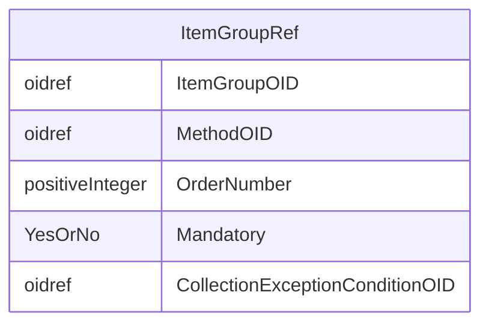

# Class: ItemGroupRef

_ItemGroupRef references an ItemGroupDef as it occurs within a specific StudyEventDef or ItemGroupDef. The list of ItemGroupRefs identifies the types of item groups that are allowed to occur within this type of studyevent or (nested) item group. The ItemGroupRefs within a single StudyEventDef or ItemGroupDef must not have duplicate ItemGroupOID or OrderNumber attribute values._


URI: [odm:ItemGroupRef](http://www.cdisc.org/ns/odm/v2.0/ItemGroupRef)





<!-- no inheritance hierarchy -->


## Slots

| Name | Cardinality* and Range | Description | Inheritance |
| ---  | --- | --- | --- |
| [ItemGroupOID](ItemGroupOID.md) | 1..1 <br/> [oidref](oidref.md) | Reference to the ItemGroupDef . | direct |
| [MethodOID](MethodOID.md) | 0..1 <br/> [oidref](oidref.md) | Reference to a MethodDef that will provide one or more data rows as output. T... | direct |
| [OrderNumber](OrderNumber.md) | 0..1 <br/> [positiveInteger](positiveInteger.md) | Indicates the order in which this ItemGroup appears in Metadata displays or d... | direct |
| [Mandatory](Mandatory.md) | 1..1 <br/> [YesOrNo](YesOrNo.md) | The Mandatory flag indicates that the clinical data for an instance of the co... | direct |
| [CollectionExceptionConditionOID](CollectionExceptionConditionOID.md) | 0..1 <br/> [oidref](oidref.md) | Reference to a ConditionDef If the CollectionExceptionConditionOID attribute ... | direct |

_* See [LinkML documentation](https://linkml.io/linkml/schemas/slots.html#slot-cardinality) for cardinality definitions._


## Usages

| used by | used in | type | used |
| ---  | --- | --- | --- |
| [StudyEventDef](StudyEventDef.md) | [ItemGroupRefRef](ItemGroupRefRef.md) | range | [ItemGroupRef](ItemGroupRef.md) |
| [ItemGroupDef](ItemGroupDef.md) | [ItemGroupRefRef](ItemGroupRefRef.md) | range | [ItemGroupRef](ItemGroupRef.md) |


## See Also

* [https://wiki.cdisc.org/display/ODM2/ItemGroupRef](https://wiki.cdisc.org/display/ODM2/ItemGroupRef)

## Identifier and Mapping Information


### Schema Source


* from schema: http://www.cdisc.org/ns/odm/v2.0


## Mappings

| Mapping Type | Mapped Value |
| ---  | ---  |
| self | odm:ItemGroupRef |
| native | odm:ItemGroupRef |


## LinkML Source

<!-- TODO: investigate https://stackoverflow.com/questions/37606292/how-to-create-tabbed-code-blocks-in-mkdocs-or-sphinx -->

### Direct

<details>
```yaml
name: ItemGroupRef
description: ItemGroupRef references an ItemGroupDef as it occurs within a specific
  StudyEventDef or ItemGroupDef. The list of ItemGroupRefs identifies the types of
  item groups that are allowed to occur within this type of studyevent or (nested)
  item group. The ItemGroupRefs within a single StudyEventDef or ItemGroupDef must
  not have duplicate ItemGroupOID or OrderNumber attribute values.
from_schema: http://www.cdisc.org/ns/odm/v2.0
see_also:
- https://wiki.cdisc.org/display/ODM2/ItemGroupRef
rank: 1000
slots:
- ItemGroupOID
- MethodOID
- OrderNumber
- Mandatory
- CollectionExceptionConditionOID
slot_usage:
  ItemGroupOID:
    name: ItemGroupOID
    description: Reference to the ItemGroupDef .
    comments:
    - 'Required

      range: oidref

      Must match the OID atttribute for an ItemGroupDef in the Study/MetaDataVersion.'
    domain_of:
    - ItemGroupRef
    - SourceItem
    - ItemGroupData
    - KeySet
    range: oidref
    required: true
  MethodOID:
    name: MethodOID
    description: Reference to a MethodDef that will provide one or more data rows
      as output. The MethodDef is used to prepopulate items
    comments:
    - 'Optional

      range: oidref

      The MethodOID value must match the OID attribute for a MethodDef in this Study/MetaDataVersion.'
    domain_of:
    - ItemGroupRef
    - ItemRef
    - TransitionTimingConstraint
    range: oidref
  OrderNumber:
    name: OrderNumber
    description: Indicates the order in which this ItemGroup appears in Metadata displays
      or data entry applications. The OrderNumber attribute provides an ordering on
      the ItemGroupDefs (within StudyEventDef or ItemGroupDef) for use whenever a
      list of ItemGroupDefs is presented to a user. Order of execution is preferably
      defined in a workflow (see Section 3.2.2.1.8, WorkflowDef ) but when used without
      a workflow, may be used the define the order in which data entry forms are presented
      in an application UI.
    comments:
    - 'Optional

      range: positiveInteger

      The StudyEventRefs within a StudyEventGroup must not have duplicate OrderNumber
      values'
    domain_of:
    - StudyEventGroupRef
    - StudyEventRef
    - ItemGroupRef
    - ItemRef
    - CodeListItem
    - Parameter
    - ReturnValue
    - StudyEndPointRef
    range: positiveInteger
  Mandatory:
    name: Mandatory
    description: The Mandatory flag indicates that the clinical data for an instance
      of the containing event or ItemGroup would be incomplete without an instance
      of this type of ItemGroup. ODM clinical data files that are incomplete in this
      sense may be considered incomplete for study review and analysis purposes.
    comments:
    - 'Required

      enum values: (Yes | No)

      When the value is Yes, the data for each subject in the study must include a
      StudyEventData element with this StudyEventOID.'
    domain_of:
    - StudyEventGroupRef
    - StudyEventRef
    - ItemGroupRef
    - ItemRef
    range: YesOrNo
    required: true
  CollectionExceptionConditionOID:
    name: CollectionExceptionConditionOID
    description: Reference to a ConditionDef If the CollectionExceptionConditionOID
      attribute is provided, the ConditionDef it references describes the circumstances
      under which data for this ItemGroup should not be collected.
    comments:
    - 'Optional

      range: oidref

      The CollectionExceptionConditionOID value must match the OID attribute for a
      ConditionDef in this Study/MetaDataVersion'
    domain_of:
    - StudyEventGroupRef
    - StudyEventRef
    - ItemGroupRef
    - ItemRef
    range: oidref
class_uri: odm:ItemGroupRef

```
</details>

### Induced

<details>
```yaml
name: ItemGroupRef
description: ItemGroupRef references an ItemGroupDef as it occurs within a specific
  StudyEventDef or ItemGroupDef. The list of ItemGroupRefs identifies the types of
  item groups that are allowed to occur within this type of studyevent or (nested)
  item group. The ItemGroupRefs within a single StudyEventDef or ItemGroupDef must
  not have duplicate ItemGroupOID or OrderNumber attribute values.
from_schema: http://www.cdisc.org/ns/odm/v2.0
see_also:
- https://wiki.cdisc.org/display/ODM2/ItemGroupRef
rank: 1000
slot_usage:
  ItemGroupOID:
    name: ItemGroupOID
    description: Reference to the ItemGroupDef .
    comments:
    - 'Required

      range: oidref

      Must match the OID atttribute for an ItemGroupDef in the Study/MetaDataVersion.'
    domain_of:
    - ItemGroupRef
    - SourceItem
    - ItemGroupData
    - KeySet
    range: oidref
    required: true
  MethodOID:
    name: MethodOID
    description: Reference to a MethodDef that will provide one or more data rows
      as output. The MethodDef is used to prepopulate items
    comments:
    - 'Optional

      range: oidref

      The MethodOID value must match the OID attribute for a MethodDef in this Study/MetaDataVersion.'
    domain_of:
    - ItemGroupRef
    - ItemRef
    - TransitionTimingConstraint
    range: oidref
  OrderNumber:
    name: OrderNumber
    description: Indicates the order in which this ItemGroup appears in Metadata displays
      or data entry applications. The OrderNumber attribute provides an ordering on
      the ItemGroupDefs (within StudyEventDef or ItemGroupDef) for use whenever a
      list of ItemGroupDefs is presented to a user. Order of execution is preferably
      defined in a workflow (see Section 3.2.2.1.8, WorkflowDef ) but when used without
      a workflow, may be used the define the order in which data entry forms are presented
      in an application UI.
    comments:
    - 'Optional

      range: positiveInteger

      The StudyEventRefs within a StudyEventGroup must not have duplicate OrderNumber
      values'
    domain_of:
    - StudyEventGroupRef
    - StudyEventRef
    - ItemGroupRef
    - ItemRef
    - CodeListItem
    - Parameter
    - ReturnValue
    - StudyEndPointRef
    range: positiveInteger
  Mandatory:
    name: Mandatory
    description: The Mandatory flag indicates that the clinical data for an instance
      of the containing event or ItemGroup would be incomplete without an instance
      of this type of ItemGroup. ODM clinical data files that are incomplete in this
      sense may be considered incomplete for study review and analysis purposes.
    comments:
    - 'Required

      enum values: (Yes | No)

      When the value is Yes, the data for each subject in the study must include a
      StudyEventData element with this StudyEventOID.'
    domain_of:
    - StudyEventGroupRef
    - StudyEventRef
    - ItemGroupRef
    - ItemRef
    range: YesOrNo
    required: true
  CollectionExceptionConditionOID:
    name: CollectionExceptionConditionOID
    description: Reference to a ConditionDef If the CollectionExceptionConditionOID
      attribute is provided, the ConditionDef it references describes the circumstances
      under which data for this ItemGroup should not be collected.
    comments:
    - 'Optional

      range: oidref

      The CollectionExceptionConditionOID value must match the OID attribute for a
      ConditionDef in this Study/MetaDataVersion'
    domain_of:
    - StudyEventGroupRef
    - StudyEventRef
    - ItemGroupRef
    - ItemRef
    range: oidref
attributes:
  ItemGroupOID:
    name: ItemGroupOID
    description: Reference to the ItemGroupDef .
    comments:
    - 'Required

      range: oidref

      Must match the OID atttribute for an ItemGroupDef in the Study/MetaDataVersion.'
    from_schema: http://www.cdisc.org/ns/odm/v2.0
    rank: 1000
    alias: ItemGroupOID
    owner: ItemGroupRef
    domain_of:
    - ItemGroupRef
    - SourceItem
    - ItemGroupData
    - KeySet
    range: oidref
    required: true
  MethodOID:
    name: MethodOID
    description: Reference to a MethodDef that will provide one or more data rows
      as output. The MethodDef is used to prepopulate items
    comments:
    - 'Optional

      range: oidref

      The MethodOID value must match the OID attribute for a MethodDef in this Study/MetaDataVersion.'
    from_schema: http://www.cdisc.org/ns/odm/v2.0
    rank: 1000
    alias: MethodOID
    owner: ItemGroupRef
    domain_of:
    - ItemGroupRef
    - ItemRef
    - TransitionTimingConstraint
    range: oidref
  OrderNumber:
    name: OrderNumber
    description: Indicates the order in which this ItemGroup appears in Metadata displays
      or data entry applications. The OrderNumber attribute provides an ordering on
      the ItemGroupDefs (within StudyEventDef or ItemGroupDef) for use whenever a
      list of ItemGroupDefs is presented to a user. Order of execution is preferably
      defined in a workflow (see Section 3.2.2.1.8, WorkflowDef ) but when used without
      a workflow, may be used the define the order in which data entry forms are presented
      in an application UI.
    comments:
    - 'Optional

      range: positiveInteger

      The StudyEventRefs within a StudyEventGroup must not have duplicate OrderNumber
      values'
    from_schema: http://www.cdisc.org/ns/odm/v2.0
    rank: 1000
    alias: OrderNumber
    owner: ItemGroupRef
    domain_of:
    - StudyEventGroupRef
    - StudyEventRef
    - ItemGroupRef
    - ItemRef
    - CodeListItem
    - Parameter
    - ReturnValue
    - StudyEndPointRef
    range: positiveInteger
  Mandatory:
    name: Mandatory
    description: The Mandatory flag indicates that the clinical data for an instance
      of the containing event or ItemGroup would be incomplete without an instance
      of this type of ItemGroup. ODM clinical data files that are incomplete in this
      sense may be considered incomplete for study review and analysis purposes.
    comments:
    - 'Required

      enum values: (Yes | No)

      When the value is Yes, the data for each subject in the study must include a
      StudyEventData element with this StudyEventOID.'
    from_schema: http://www.cdisc.org/ns/odm/v2.0
    rank: 1000
    alias: Mandatory
    owner: ItemGroupRef
    domain_of:
    - StudyEventGroupRef
    - StudyEventRef
    - ItemGroupRef
    - ItemRef
    range: YesOrNo
    required: true
  CollectionExceptionConditionOID:
    name: CollectionExceptionConditionOID
    description: Reference to a ConditionDef If the CollectionExceptionConditionOID
      attribute is provided, the ConditionDef it references describes the circumstances
      under which data for this ItemGroup should not be collected.
    comments:
    - 'Optional

      range: oidref

      The CollectionExceptionConditionOID value must match the OID attribute for a
      ConditionDef in this Study/MetaDataVersion'
    from_schema: http://www.cdisc.org/ns/odm/v2.0
    rank: 1000
    alias: CollectionExceptionConditionOID
    owner: ItemGroupRef
    domain_of:
    - StudyEventGroupRef
    - StudyEventRef
    - ItemGroupRef
    - ItemRef
    range: oidref
class_uri: odm:ItemGroupRef

```
</details>