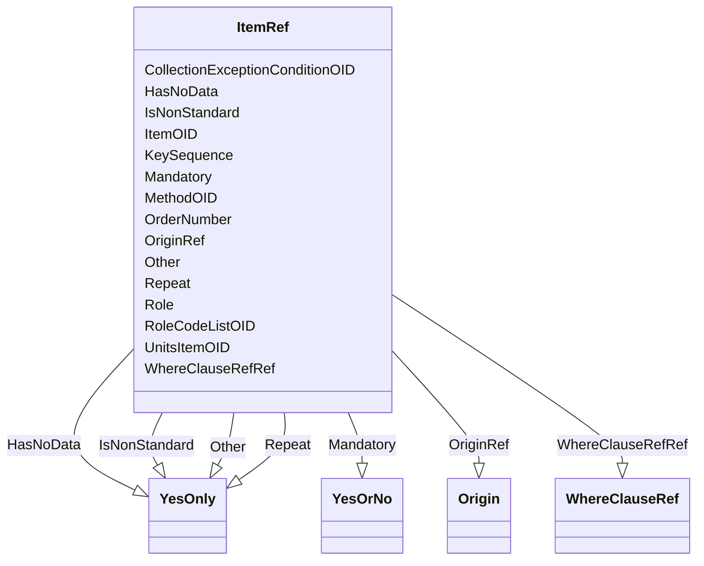

# Class: ItemRef


URI: [odm:ItemRef](http://www.cdisc.org/ns/odm/v2.0/ItemRef)





<!-- no inheritance hierarchy -->


## Slots

| Name | Cardinality and Range | Description | Inheritance |
| ---  | --- | --- | --- |
| [ItemOID](ItemOID.md) | 1..1 <br/> [Oidref](Oidref.md) |  | direct |
| [KeySequence](KeySequence.md) | 0..1 <br/> [Integer](Integer.md) |  | direct |
| [IsNonStandard](IsNonStandard.md) | 0..1 <br/> [YesOnly](YesOnly.md) |  | direct |
| [HasNoData](HasNoData.md) | 0..1 <br/> [YesOnly](YesOnly.md) |  | direct |
| [MethodOID](MethodOID.md) | 0..1 <br/> [Oidref](Oidref.md) |  | direct |
| [UnitsItemOID](UnitsItemOID.md) | 0..1 <br/> [Oidref](Oidref.md) |  | direct |
| [Repeat](Repeat.md) | 0..1 <br/> [YesOnly](YesOnly.md) |  | direct |
| [Other](Other.md) | 0..1 <br/> [YesOnly](YesOnly.md) |  | direct |
| [Role](Role.md) | 0..1 <br/> [Text](Text.md) |  | direct |
| [RoleCodeListOID](RoleCodeListOID.md) | 0..1 <br/> [Oidref](Oidref.md) |  | direct |
| [OrderNumber](OrderNumber.md) | 0..1 <br/> [Integer](Integer.md) |  | direct |
| [Mandatory](Mandatory.md) | 1..1 <br/> [YesOrNo](YesOrNo.md) |  | direct |
| [CollectionExceptionConditionOID](CollectionExceptionConditionOID.md) | 0..1 <br/> [Oidref](Oidref.md) |  | direct |
| [OriginRef](OriginRef.md) | 0..* <br/> [Origin](Origin.md) |  | direct |
| [WhereClauseRefRef](WhereClauseRefRef.md) | 0..* <br/> [WhereClauseRef](WhereClauseRef.md) |  | direct |


## Usages

| used by | used in | type | used |
| ---  | --- | --- | --- |
| [ValueListDef](ValueListDef.md) | [ItemRefRef](ItemRefRef.md) | range | [ItemRef](ItemRef.md) |


## Identifier and Mapping Information


### Schema Source


* from schema: http://www.cdisc.org/ns/odm/v2.0


## Mappings

| Mapping Type | Mapped Value |
| ---  | ---  |
| self | odm:ItemRef |
| native | odm:ItemRef |


## LinkML Source

<!-- TODO: investigate https://stackoverflow.com/questions/37606292/how-to-create-tabbed-code-blocks-in-mkdocs-or-sphinx -->

### Direct

<details>
```yaml
name: ItemRef
in_subset:
- ItemGroupDefGroup
from_schema: http://www.cdisc.org/ns/odm/v2.0
slots:
- ItemOID
- KeySequence
- IsNonStandard
- HasNoData
- MethodOID
- UnitsItemOID
- Repeat
- Other
- Role
- RoleCodeListOID
- OrderNumber
- Mandatory
- CollectionExceptionConditionOID
- OriginRef
- WhereClauseRefRef
slot_usage:
  ItemOID:
    name: ItemOID
    domain_of:
    - SourceItem
    - RangeCheck
    - ItemData
    - KeySet
    - ItemRef
    range: oidref
    required: true
  KeySequence:
    name: KeySequence
    domain_of:
    - ItemRef
    range: integer
    required: false
  IsNonStandard:
    name: IsNonStandard
    domain_of:
    - ItemGroupDef
    - CodeList
    - ItemRef
    range: YesOnly
    required: false
  HasNoData:
    name: HasNoData
    domain_of:
    - ItemGroupDef
    - ItemRef
    range: YesOnly
    required: false
  MethodOID:
    name: MethodOID
    domain_of:
    - TransitionTimingConstraint
    - ItemRef
    - ItemGroupRef
    range: oidref
    required: false
  UnitsItemOID:
    name: UnitsItemOID
    domain_of:
    - ItemRef
    range: oidref
    required: false
  Repeat:
    name: Repeat
    domain_of:
    - ItemRef
    range: YesOnly
    required: false
  Other:
    name: Other
    domain_of:
    - ItemRef
    - CodeListItem
    - EnumeratedItem
    range: YesOnly
    required: false
  Role:
    name: Role
    domain_of:
    - Organization
    - ItemRef
    - Location
    range: text
    required: false
  RoleCodeListOID:
    name: RoleCodeListOID
    domain_of:
    - ItemRef
    range: oidref
    required: false
  OrderNumber:
    name: OrderNumber
    domain_of:
    - StudyEventGroupRef
    - StudyEventRef
    - Parameter
    - ReturnValue
    - StudyEndPointRef
    - ItemRef
    - ItemGroupRef
    - CodeListItem
    - EnumeratedItem
    range: integer
    required: false
  Mandatory:
    name: Mandatory
    domain_of:
    - StudyEventGroupRef
    - StudyEventRef
    - ItemRef
    - ItemGroupRef
    range: YesOrNo
    required: true
  CollectionExceptionConditionOID:
    name: CollectionExceptionConditionOID
    domain_of:
    - StudyEventGroupRef
    - StudyEventRef
    - ItemRef
    - ItemGroupRef
    range: oidref
    required: false
  OriginRef:
    name: OriginRef
    multivalued: true
    domain_of:
    - ItemGroupDef
    - ItemRef
    range: Origin
    required: false
    minimum_cardinality: 0
  WhereClauseRefRef:
    name: WhereClauseRefRef
    multivalued: true
    domain_of:
    - ItemRef
    range: WhereClauseRef
    required: false
    minimum_cardinality: 0
class_uri: odm:ItemRef
unique_keys:
  UC-IGD-3:
    unique_key_name: UC-IGD-3
    unique_key_slots:
    - KeySequence

```
</details>

### Induced

<details>
```yaml
name: ItemRef
in_subset:
- ItemGroupDefGroup
from_schema: http://www.cdisc.org/ns/odm/v2.0
slot_usage:
  ItemOID:
    name: ItemOID
    domain_of:
    - SourceItem
    - RangeCheck
    - ItemData
    - KeySet
    - ItemRef
    range: oidref
    required: true
  KeySequence:
    name: KeySequence
    domain_of:
    - ItemRef
    range: integer
    required: false
  IsNonStandard:
    name: IsNonStandard
    domain_of:
    - ItemGroupDef
    - CodeList
    - ItemRef
    range: YesOnly
    required: false
  HasNoData:
    name: HasNoData
    domain_of:
    - ItemGroupDef
    - ItemRef
    range: YesOnly
    required: false
  MethodOID:
    name: MethodOID
    domain_of:
    - TransitionTimingConstraint
    - ItemRef
    - ItemGroupRef
    range: oidref
    required: false
  UnitsItemOID:
    name: UnitsItemOID
    domain_of:
    - ItemRef
    range: oidref
    required: false
  Repeat:
    name: Repeat
    domain_of:
    - ItemRef
    range: YesOnly
    required: false
  Other:
    name: Other
    domain_of:
    - ItemRef
    - CodeListItem
    - EnumeratedItem
    range: YesOnly
    required: false
  Role:
    name: Role
    domain_of:
    - Organization
    - ItemRef
    - Location
    range: text
    required: false
  RoleCodeListOID:
    name: RoleCodeListOID
    domain_of:
    - ItemRef
    range: oidref
    required: false
  OrderNumber:
    name: OrderNumber
    domain_of:
    - StudyEventGroupRef
    - StudyEventRef
    - Parameter
    - ReturnValue
    - StudyEndPointRef
    - ItemRef
    - ItemGroupRef
    - CodeListItem
    - EnumeratedItem
    range: integer
    required: false
  Mandatory:
    name: Mandatory
    domain_of:
    - StudyEventGroupRef
    - StudyEventRef
    - ItemRef
    - ItemGroupRef
    range: YesOrNo
    required: true
  CollectionExceptionConditionOID:
    name: CollectionExceptionConditionOID
    domain_of:
    - StudyEventGroupRef
    - StudyEventRef
    - ItemRef
    - ItemGroupRef
    range: oidref
    required: false
  OriginRef:
    name: OriginRef
    multivalued: true
    domain_of:
    - ItemGroupDef
    - ItemRef
    range: Origin
    required: false
    minimum_cardinality: 0
  WhereClauseRefRef:
    name: WhereClauseRefRef
    multivalued: true
    domain_of:
    - ItemRef
    range: WhereClauseRef
    required: false
    minimum_cardinality: 0
attributes:
  ItemOID:
    name: ItemOID
    from_schema: http://www.cdisc.org/ns/odm/v2.0
    rank: 1000
    alias: ItemOID
    owner: ItemRef
    domain_of:
    - SourceItem
    - RangeCheck
    - ItemData
    - KeySet
    - ItemRef
    range: oidref
    required: true
  KeySequence:
    name: KeySequence
    from_schema: http://www.cdisc.org/ns/odm/v2.0
    rank: 1000
    alias: KeySequence
    owner: ItemRef
    domain_of:
    - ItemRef
    range: integer
    required: false
  IsNonStandard:
    name: IsNonStandard
    from_schema: http://www.cdisc.org/ns/odm/v2.0
    rank: 1000
    alias: IsNonStandard
    owner: ItemRef
    domain_of:
    - ItemGroupDef
    - CodeList
    - ItemRef
    range: YesOnly
    required: false
  HasNoData:
    name: HasNoData
    from_schema: http://www.cdisc.org/ns/odm/v2.0
    rank: 1000
    alias: HasNoData
    owner: ItemRef
    domain_of:
    - ItemGroupDef
    - ItemRef
    range: YesOnly
    required: false
  MethodOID:
    name: MethodOID
    from_schema: http://www.cdisc.org/ns/odm/v2.0
    rank: 1000
    alias: MethodOID
    owner: ItemRef
    domain_of:
    - TransitionTimingConstraint
    - ItemRef
    - ItemGroupRef
    range: oidref
    required: false
  UnitsItemOID:
    name: UnitsItemOID
    from_schema: http://www.cdisc.org/ns/odm/v2.0
    rank: 1000
    alias: UnitsItemOID
    owner: ItemRef
    domain_of:
    - ItemRef
    range: oidref
    required: false
  Repeat:
    name: Repeat
    from_schema: http://www.cdisc.org/ns/odm/v2.0
    rank: 1000
    alias: Repeat
    owner: ItemRef
    domain_of:
    - ItemRef
    range: YesOnly
    required: false
  Other:
    name: Other
    from_schema: http://www.cdisc.org/ns/odm/v2.0
    rank: 1000
    alias: Other
    owner: ItemRef
    domain_of:
    - ItemRef
    - CodeListItem
    - EnumeratedItem
    range: YesOnly
    required: false
  Role:
    name: Role
    from_schema: http://www.cdisc.org/ns/odm/v2.0
    rank: 1000
    alias: Role
    owner: ItemRef
    domain_of:
    - Organization
    - ItemRef
    - Location
    range: text
    required: false
  RoleCodeListOID:
    name: RoleCodeListOID
    from_schema: http://www.cdisc.org/ns/odm/v2.0
    rank: 1000
    alias: RoleCodeListOID
    owner: ItemRef
    domain_of:
    - ItemRef
    range: oidref
    required: false
  OrderNumber:
    name: OrderNumber
    from_schema: http://www.cdisc.org/ns/odm/v2.0
    rank: 1000
    alias: OrderNumber
    owner: ItemRef
    domain_of:
    - StudyEventGroupRef
    - StudyEventRef
    - Parameter
    - ReturnValue
    - StudyEndPointRef
    - ItemRef
    - ItemGroupRef
    - CodeListItem
    - EnumeratedItem
    range: integer
    required: false
  Mandatory:
    name: Mandatory
    from_schema: http://www.cdisc.org/ns/odm/v2.0
    rank: 1000
    alias: Mandatory
    owner: ItemRef
    domain_of:
    - StudyEventGroupRef
    - StudyEventRef
    - ItemRef
    - ItemGroupRef
    range: YesOrNo
    required: true
  CollectionExceptionConditionOID:
    name: CollectionExceptionConditionOID
    from_schema: http://www.cdisc.org/ns/odm/v2.0
    rank: 1000
    alias: CollectionExceptionConditionOID
    owner: ItemRef
    domain_of:
    - StudyEventGroupRef
    - StudyEventRef
    - ItemRef
    - ItemGroupRef
    range: oidref
    required: false
  OriginRef:
    name: OriginRef
    from_schema: http://www.cdisc.org/ns/odm/v2.0
    rank: 1000
    multivalued: true
    alias: OriginRef
    owner: ItemRef
    domain_of:
    - ItemGroupDef
    - ItemRef
    range: Origin
    required: false
    minimum_cardinality: 0
  WhereClauseRefRef:
    name: WhereClauseRefRef
    from_schema: http://www.cdisc.org/ns/odm/v2.0
    rank: 1000
    multivalued: true
    alias: WhereClauseRefRef
    owner: ItemRef
    domain_of:
    - ItemRef
    range: WhereClauseRef
    required: false
    minimum_cardinality: 0
class_uri: odm:ItemRef
unique_keys:
  UC-IGD-3:
    unique_key_name: UC-IGD-3
    unique_key_slots:
    - KeySequence

```
</details>