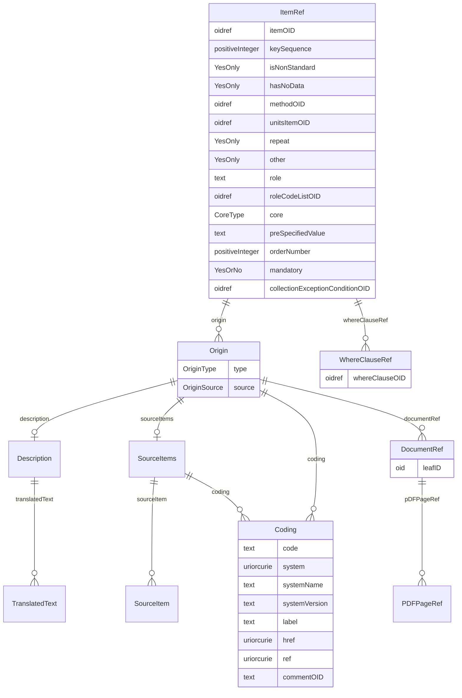

# Class: ItemRef

_A reference to an ItemDef as it occurs within a specific ItemGroupDef. The list of ItemRefs identifies the types of items that are allowed to occur within this type of item group._


URI: [odm:ItemRef](http://www.cdisc.org/ns/odm/v2.0/ItemRef)





<!-- no inheritance hierarchy -->


## Slots

| Name | Cardinality* and Range | Description | Inheritance |
| ---  | --- | --- | --- |
| [itemOID](itemOID.md) | 1..1 <br/> [oidref](oidref.md) | Reference to the ItemDef . | direct |
| [keySequence](keySequence.md) | 0..1 <br/> [positiveInteger](positiveInteger.md) | Indicates that this item is a key for the enclosing element. It also provides... | direct |
| [isNonStandard](isNonStandard.md) | 0..1 <br/> [YesOnly](YesOnly.md) | A non-standard variable is one that is not defined in the SDTMIG or the under... | direct |
| [hasNoData](hasNoData.md) | 0..1 <br/> [YesOnly](YesOnly.md) | Used to indicate that an ItemRef that represent a dataset's variable has no d... | direct |
| [methodOID](methodOID.md) | 0..1 <br/> [oidref](oidref.md) | Reference to a MethodDef used to derive the value of this item. | direct |
| [unitsItemOID](unitsItemOID.md) | 0..1 <br/> [oidref](oidref.md) | Reference to a sibling ItemRef element that represents the unit specification... | direct |
| [repeat](repeat.md) | 0..1 <br/> [YesOnly](YesOnly.md) | Indicates that the item serves as the item over which repeats are to be perfo... | direct |
| [other](other.md) | 0..1 <br/> [YesOnly](YesOnly.md) | Flag to indicate that the Item represents "other" content added to an ItemGro... | direct |
| [role](role.md) | 0..1 <br/> [text](text.md) | The Role for the referenced ItemDef. The Role attribute provides a single rol... | direct |
| [roleCodeListOID](roleCodeListOID.md) | 0..1 <br/> [oidref](oidref.md) | Reference to a CodeList that defines the allowable values of Role for the Stu... | direct |
| [core](core.md) | 0..1 <br/> [CoreType](CoreType.md) | CDASH, ADaM, SDTM, and SEND Core designations. | direct |
| [preSpecifiedValue](preSpecifiedValue.md) | 0..1 <br/> [text](text.md) | Prefill value or a default value for a field that is automatically populated. | direct |
| [orderNumber](orderNumber.md) | 0..1 <br/> [positiveInteger](positiveInteger.md) | Indicates the order in which this ItemRef appears in Metadata displays or dat... | direct |
| [mandatory](mandatory.md) | 1..1 <br/> [YesOrNo](YesOrNo.md) | Indicator of whether this ItemGroup must appear in the study clinical data fo... | direct |
| [collectionExceptionConditionOID](collectionExceptionConditionOID.md) | 0..1 <br/> [oidref](oidref.md) | Reference to a ConditionDef that defines the circumstances under which collec... | direct |
| [origin](origin.md) | 0..* <br/> [Origin](Origin.md) | Origin reference: Origin defines the source metadata, where applicable, for O... | direct |
| [whereClauseRef](whereClauseRef.md) | 0..* <br/> [WhereClauseRef](WhereClauseRef.md) | WhereClauseRef reference: The WhereClauseRef references the WhereClauseDef el... | direct |

_* See [LinkML documentation](https://linkml.io/linkml/schemas/slots.html#slot-cardinality) for cardinality definitions._


## Usages

| used by | used in | type | used |
| ---  | --- | --- | --- |
| [ValueListDef](ValueListDef.md) | [itemRef](itemRef.md) | range | [ItemRef](ItemRef.md) |
| [ItemGroupDef](ItemGroupDef.md) | [itemRef](itemRef.md) | range | [ItemRef](ItemRef.md) |


## See Also

* [https://wiki.cdisc.org/display/PUB/ItemRef](https://wiki.cdisc.org/display/PUB/ItemRef)

## Identifier and Mapping Information


### Schema Source


* from schema: http://www.cdisc.org/ns/odm/v2.0


## Mappings

| Mapping Type | Mapped Value |
| ---  | ---  |
| self | odm:ItemRef |
| native | odm:ItemRef |


## LinkML Source

<!-- TODO: investigate https://stackoverflow.com/questions/37606292/how-to-create-tabbed-code-blocks-in-mkdocs-or-sphinx -->

### Direct

<details>
```yaml
name: ItemRef
description: A reference to an ItemDef as it occurs within a specific ItemGroupDef.
  The list of ItemRefs identifies the types of items that are allowed to occur within
  this type of item group.
from_schema: http://www.cdisc.org/ns/odm/v2.0
see_also:
- https://wiki.cdisc.org/display/PUB/ItemRef
rank: 1000
slots:
- itemOID
- keySequence
- isNonStandard
- hasNoData
- methodOID
- unitsItemOID
- repeat
- other
- role
- roleCodeListOID
- core
- preSpecifiedValue
- orderNumber
- mandatory
- collectionExceptionConditionOID
- origin
- whereClauseRef
slot_usage:
  itemOID:
    name: itemOID
    description: Reference to the ItemDef .
    comments:
    - 'Required

      range: oidref

      Must match the OID attribute for an ItemDef in the Study/MetaDataVersion. The
      ItemRefs within an ItemGroupDef or ValueListDef must not have duplicate ItemOID
      values.'
    domain_of:
    - ItemRef
    - SourceItem
    - RangeCheck
    - ItemData
    - KeySet
    range: oidref
    required: true
  keySequence:
    name: keySequence
    description: Indicates that this item is a key for the enclosing element. It also
      provides an ordering for the keys.
    comments:
    - 'Optional

      range: positiveInteger

      The ItemRefs within an ItemGroupDef or ValueListDef must not have duplicate
      KeySequence values.'
    domain_of:
    - ItemRef
    range: positiveInteger
  isNonStandard:
    name: isNonStandard
    description: A non-standard variable is one that is not defined in the SDTMIG
      or the underlying SDTM model of a standard referenced within the ODM document.
      Permitted for any ItemRef that represents a non-standard variable in an SDTM
      or SEND dataset when the ODM Context attribute value is "Other" Is not used
      with an ItemRef that represents a value level metadata for an SDTMIG SUPPQUAL
      dataset Has no meaning for ADaM, so shall not be used for ADaM variables
    comments:
    - 'Optional

      range: (Yes)'
    domain_of:
    - ItemGroupDef
    - ItemRef
    - CodeList
    range: YesOnly
  hasNoData:
    name: hasNoData
    description: Used to indicate that an ItemRef that represent a dataset's variable
      has no data. Note that variables refer to both standard and non-standard/ supplemental
      qualifiers variables (/ODM/Study/MetaDataVersion/ItemGroupDef/ItemRef or /ODM/Study/MetaDataVersion/ValueListDef/ItemRef).
    comments:
    - 'Conditional

      range: (Yes)

      A comment must be included to explain why no data is present for dataset''s
      variables that were planned for use in the study.'
    domain_of:
    - ItemGroupDef
    - ItemRef
    range: YesOnly
  methodOID:
    name: methodOID
    description: Reference to a MethodDef used to derive the value of this item.
    comments:
    - 'Optional

      range: oidref

      The MethodOID value must match the OID attribute for a MethodDef in this Study/MetaDataVersion.'
    domain_of:
    - ItemGroupRef
    - ItemRef
    - TransitionTimingConstraint
    range: oidref
  unitsItemOID:
    name: unitsItemOID
    description: Reference to a sibling ItemRef element that represents the unit specification
      for this ItemRef (defines the associated units variable).
    comments:
    - 'Optional

      range: oidref

      The sibling ItemRef element will have ItemOID=UnitsItemOID and the UnitsItemOID
      value must match the OID attribute for the ItemDef that defines the units for
      this Item.'
    domain_of:
    - ItemRef
    range: oidref
  repeat:
    name: repeat
    description: Indicates that the item serves as the item over which repeats are
      to be performed.
    comments:
    - 'Optional

      range: (Yes)

      The corresponding ItemDef must have an associated CodeList containing the items
      over which the repeat is to be performed. There may only be one ItemRef within
      the ItemGroupDef with Repeat="Yes".'
    domain_of:
    - ItemRef
    range: YesOnly
  other:
    name: other
    description: Flag to indicate that the Item represents "other" content added to
      an ItemGroup.
    comments:
    - 'Optional

      range: (Yes)'
    domain_of:
    - ItemRef
    - CodeListItem
    range: YesOnly
  role:
    name: role
    description: The Role for the referenced ItemDef. The Role attribute provides
      a single role name describing the use of this data item. If the Role is defined
      by a standard terminology, RoleCodeListOID may be used to reference a CodeList
      that defines the full set roles from which the Role attribute value is to be
      taken.
    comments:
    - 'Optional

      range: text

      This attribute must not be present unless the Role attribute is defined.'
    domain_of:
    - ItemRef
    - Organization
    - Location
    range: text
  roleCodeListOID:
    name: roleCodeListOID
    description: Reference to a CodeList that defines the allowable values of Role
      for the Study.
    comments:
    - 'Optional

      range: oidref

      The RoleCodelistOID must match the OID attribute for a CodeList within the Study/MetaDataVersion.
      If Role is defined, RoleCodeListOID is still optional.'
    domain_of:
    - ItemRef
    range: oidref
  core:
    name: core
    description: CDASH, ADaM, SDTM, and SEND Core designations.
    comments:
    - 'Optional

      enum values: (HR | O | R/C | Cond | Exp | Perm | Req)

      Reference the appropriate specifications for complete requirements. Example:
      CDASH: "HR", "R/C", "O"; SDTM: "Req", "Exp", "Perm".'
    domain_of:
    - ItemRef
    range: CoreType
  preSpecifiedValue:
    name: preSpecifiedValue
    description: Prefill value or a default value for a field that is automatically
      populated.
    comments:
    - 'Optional

      range: text'
    domain_of:
    - ItemRef
    range: text
  orderNumber:
    name: orderNumber
    description: Indicates the order in which this ItemRef appears in Metadata displays
      or data entry applications. The OrderNumbers provide an ordering on the Items
      (within a containing element) for use whenever a list of Items is presented
      to a user. They do not imply anything about event scheduling, time ordering,
      or data correctness.
    comments:
    - 'Optional

      range: positiveInteger

      The ItemRefs within an ItemGroupDef or ValueListDef must not have duplicate
      OrderNumber values.'
    domain_of:
    - StudyEventGroupRef
    - StudyEventRef
    - ItemGroupRef
    - ItemRef
    - CodeListItem
    - Parameter
    - ReturnValue
    - StudyEndPointRef
    range: positiveInteger
  mandatory:
    name: mandatory
    description: Indicator of whether this ItemGroup must appear in the study clinical
      data for each subject per the study protocol. The Mandatory flag indicates that
      the clinical data for an instance of the containing element would be incomplete
      without an instance of this type of item. ODM clinical data files that are incomplete
      in this sense may be considered incomplete for study review and analysis purposes.
    comments:
    - 'Required

      enum values: (Yes | No)

      When the value is "Yes", the data for each subject in the study must include
      an ItemData element with this ItemOID.'
    domain_of:
    - StudyEventGroupRef
    - StudyEventRef
    - ItemGroupRef
    - ItemRef
    range: YesOrNo
    required: true
  collectionExceptionConditionOID:
    name: collectionExceptionConditionOID
    description: Reference to a ConditionDef that defines the circumstances under
      which collection of the Item may be omitted.
    comments:
    - 'Optional

      range: oidref

      The CollectionExceptionConditionOID value must match the OID attribute for a
      ConditionDef in this Study/MetaDataVersion.'
    domain_of:
    - StudyEventGroupRef
    - StudyEventRef
    - ItemGroupRef
    - ItemRef
    range: oidref
  origin:
    name: origin
    multivalued: true
    domain_of:
    - ItemGroupDef
    - ItemRef
    range: Origin
    inlined: true
    inlined_as_list: true
  whereClauseRef:
    name: whereClauseRef
    multivalued: true
    domain_of:
    - ItemRef
    range: WhereClauseRef
    inlined: true
    inlined_as_list: true
class_uri: odm:ItemRef

```
</details>

### Induced

<details>
```yaml
name: ItemRef
description: A reference to an ItemDef as it occurs within a specific ItemGroupDef.
  The list of ItemRefs identifies the types of items that are allowed to occur within
  this type of item group.
from_schema: http://www.cdisc.org/ns/odm/v2.0
see_also:
- https://wiki.cdisc.org/display/PUB/ItemRef
rank: 1000
slot_usage:
  itemOID:
    name: itemOID
    description: Reference to the ItemDef .
    comments:
    - 'Required

      range: oidref

      Must match the OID attribute for an ItemDef in the Study/MetaDataVersion. The
      ItemRefs within an ItemGroupDef or ValueListDef must not have duplicate ItemOID
      values.'
    domain_of:
    - ItemRef
    - SourceItem
    - RangeCheck
    - ItemData
    - KeySet
    range: oidref
    required: true
  keySequence:
    name: keySequence
    description: Indicates that this item is a key for the enclosing element. It also
      provides an ordering for the keys.
    comments:
    - 'Optional

      range: positiveInteger

      The ItemRefs within an ItemGroupDef or ValueListDef must not have duplicate
      KeySequence values.'
    domain_of:
    - ItemRef
    range: positiveInteger
  isNonStandard:
    name: isNonStandard
    description: A non-standard variable is one that is not defined in the SDTMIG
      or the underlying SDTM model of a standard referenced within the ODM document.
      Permitted for any ItemRef that represents a non-standard variable in an SDTM
      or SEND dataset when the ODM Context attribute value is "Other" Is not used
      with an ItemRef that represents a value level metadata for an SDTMIG SUPPQUAL
      dataset Has no meaning for ADaM, so shall not be used for ADaM variables
    comments:
    - 'Optional

      range: (Yes)'
    domain_of:
    - ItemGroupDef
    - ItemRef
    - CodeList
    range: YesOnly
  hasNoData:
    name: hasNoData
    description: Used to indicate that an ItemRef that represent a dataset's variable
      has no data. Note that variables refer to both standard and non-standard/ supplemental
      qualifiers variables (/ODM/Study/MetaDataVersion/ItemGroupDef/ItemRef or /ODM/Study/MetaDataVersion/ValueListDef/ItemRef).
    comments:
    - 'Conditional

      range: (Yes)

      A comment must be included to explain why no data is present for dataset''s
      variables that were planned for use in the study.'
    domain_of:
    - ItemGroupDef
    - ItemRef
    range: YesOnly
  methodOID:
    name: methodOID
    description: Reference to a MethodDef used to derive the value of this item.
    comments:
    - 'Optional

      range: oidref

      The MethodOID value must match the OID attribute for a MethodDef in this Study/MetaDataVersion.'
    domain_of:
    - ItemGroupRef
    - ItemRef
    - TransitionTimingConstraint
    range: oidref
  unitsItemOID:
    name: unitsItemOID
    description: Reference to a sibling ItemRef element that represents the unit specification
      for this ItemRef (defines the associated units variable).
    comments:
    - 'Optional

      range: oidref

      The sibling ItemRef element will have ItemOID=UnitsItemOID and the UnitsItemOID
      value must match the OID attribute for the ItemDef that defines the units for
      this Item.'
    domain_of:
    - ItemRef
    range: oidref
  repeat:
    name: repeat
    description: Indicates that the item serves as the item over which repeats are
      to be performed.
    comments:
    - 'Optional

      range: (Yes)

      The corresponding ItemDef must have an associated CodeList containing the items
      over which the repeat is to be performed. There may only be one ItemRef within
      the ItemGroupDef with Repeat="Yes".'
    domain_of:
    - ItemRef
    range: YesOnly
  other:
    name: other
    description: Flag to indicate that the Item represents "other" content added to
      an ItemGroup.
    comments:
    - 'Optional

      range: (Yes)'
    domain_of:
    - ItemRef
    - CodeListItem
    range: YesOnly
  role:
    name: role
    description: The Role for the referenced ItemDef. The Role attribute provides
      a single role name describing the use of this data item. If the Role is defined
      by a standard terminology, RoleCodeListOID may be used to reference a CodeList
      that defines the full set roles from which the Role attribute value is to be
      taken.
    comments:
    - 'Optional

      range: text

      This attribute must not be present unless the Role attribute is defined.'
    domain_of:
    - ItemRef
    - Organization
    - Location
    range: text
  roleCodeListOID:
    name: roleCodeListOID
    description: Reference to a CodeList that defines the allowable values of Role
      for the Study.
    comments:
    - 'Optional

      range: oidref

      The RoleCodelistOID must match the OID attribute for a CodeList within the Study/MetaDataVersion.
      If Role is defined, RoleCodeListOID is still optional.'
    domain_of:
    - ItemRef
    range: oidref
  core:
    name: core
    description: CDASH, ADaM, SDTM, and SEND Core designations.
    comments:
    - 'Optional

      enum values: (HR | O | R/C | Cond | Exp | Perm | Req)

      Reference the appropriate specifications for complete requirements. Example:
      CDASH: "HR", "R/C", "O"; SDTM: "Req", "Exp", "Perm".'
    domain_of:
    - ItemRef
    range: CoreType
  preSpecifiedValue:
    name: preSpecifiedValue
    description: Prefill value or a default value for a field that is automatically
      populated.
    comments:
    - 'Optional

      range: text'
    domain_of:
    - ItemRef
    range: text
  orderNumber:
    name: orderNumber
    description: Indicates the order in which this ItemRef appears in Metadata displays
      or data entry applications. The OrderNumbers provide an ordering on the Items
      (within a containing element) for use whenever a list of Items is presented
      to a user. They do not imply anything about event scheduling, time ordering,
      or data correctness.
    comments:
    - 'Optional

      range: positiveInteger

      The ItemRefs within an ItemGroupDef or ValueListDef must not have duplicate
      OrderNumber values.'
    domain_of:
    - StudyEventGroupRef
    - StudyEventRef
    - ItemGroupRef
    - ItemRef
    - CodeListItem
    - Parameter
    - ReturnValue
    - StudyEndPointRef
    range: positiveInteger
  mandatory:
    name: mandatory
    description: Indicator of whether this ItemGroup must appear in the study clinical
      data for each subject per the study protocol. The Mandatory flag indicates that
      the clinical data for an instance of the containing element would be incomplete
      without an instance of this type of item. ODM clinical data files that are incomplete
      in this sense may be considered incomplete for study review and analysis purposes.
    comments:
    - 'Required

      enum values: (Yes | No)

      When the value is "Yes", the data for each subject in the study must include
      an ItemData element with this ItemOID.'
    domain_of:
    - StudyEventGroupRef
    - StudyEventRef
    - ItemGroupRef
    - ItemRef
    range: YesOrNo
    required: true
  collectionExceptionConditionOID:
    name: collectionExceptionConditionOID
    description: Reference to a ConditionDef that defines the circumstances under
      which collection of the Item may be omitted.
    comments:
    - 'Optional

      range: oidref

      The CollectionExceptionConditionOID value must match the OID attribute for a
      ConditionDef in this Study/MetaDataVersion.'
    domain_of:
    - StudyEventGroupRef
    - StudyEventRef
    - ItemGroupRef
    - ItemRef
    range: oidref
  origin:
    name: origin
    multivalued: true
    domain_of:
    - ItemGroupDef
    - ItemRef
    range: Origin
    inlined: true
    inlined_as_list: true
  whereClauseRef:
    name: whereClauseRef
    multivalued: true
    domain_of:
    - ItemRef
    range: WhereClauseRef
    inlined: true
    inlined_as_list: true
attributes:
  itemOID:
    name: itemOID
    description: Reference to the ItemDef .
    comments:
    - 'Required

      range: oidref

      Must match the OID attribute for an ItemDef in the Study/MetaDataVersion. The
      ItemRefs within an ItemGroupDef or ValueListDef must not have duplicate ItemOID
      values.'
    from_schema: http://www.cdisc.org/ns/odm/v2.0
    rank: 1000
    alias: itemOID
    owner: ItemRef
    domain_of:
    - ItemRef
    - SourceItem
    - RangeCheck
    - ItemData
    - KeySet
    range: oidref
    required: true
  keySequence:
    name: keySequence
    description: Indicates that this item is a key for the enclosing element. It also
      provides an ordering for the keys.
    comments:
    - 'Optional

      range: positiveInteger

      The ItemRefs within an ItemGroupDef or ValueListDef must not have duplicate
      KeySequence values.'
    from_schema: http://www.cdisc.org/ns/odm/v2.0
    rank: 1000
    alias: keySequence
    owner: ItemRef
    domain_of:
    - ItemRef
    range: positiveInteger
  isNonStandard:
    name: isNonStandard
    description: A non-standard variable is one that is not defined in the SDTMIG
      or the underlying SDTM model of a standard referenced within the ODM document.
      Permitted for any ItemRef that represents a non-standard variable in an SDTM
      or SEND dataset when the ODM Context attribute value is "Other" Is not used
      with an ItemRef that represents a value level metadata for an SDTMIG SUPPQUAL
      dataset Has no meaning for ADaM, so shall not be used for ADaM variables
    comments:
    - 'Optional

      range: (Yes)'
    from_schema: http://www.cdisc.org/ns/odm/v2.0
    rank: 1000
    alias: isNonStandard
    owner: ItemRef
    domain_of:
    - ItemGroupDef
    - ItemRef
    - CodeList
    range: YesOnly
  hasNoData:
    name: hasNoData
    description: Used to indicate that an ItemRef that represent a dataset's variable
      has no data. Note that variables refer to both standard and non-standard/ supplemental
      qualifiers variables (/ODM/Study/MetaDataVersion/ItemGroupDef/ItemRef or /ODM/Study/MetaDataVersion/ValueListDef/ItemRef).
    comments:
    - 'Conditional

      range: (Yes)

      A comment must be included to explain why no data is present for dataset''s
      variables that were planned for use in the study.'
    from_schema: http://www.cdisc.org/ns/odm/v2.0
    rank: 1000
    alias: hasNoData
    owner: ItemRef
    domain_of:
    - ItemGroupDef
    - ItemRef
    range: YesOnly
  methodOID:
    name: methodOID
    description: Reference to a MethodDef used to derive the value of this item.
    comments:
    - 'Optional

      range: oidref

      The MethodOID value must match the OID attribute for a MethodDef in this Study/MetaDataVersion.'
    from_schema: http://www.cdisc.org/ns/odm/v2.0
    rank: 1000
    alias: methodOID
    owner: ItemRef
    domain_of:
    - ItemGroupRef
    - ItemRef
    - TransitionTimingConstraint
    range: oidref
  unitsItemOID:
    name: unitsItemOID
    description: Reference to a sibling ItemRef element that represents the unit specification
      for this ItemRef (defines the associated units variable).
    comments:
    - 'Optional

      range: oidref

      The sibling ItemRef element will have ItemOID=UnitsItemOID and the UnitsItemOID
      value must match the OID attribute for the ItemDef that defines the units for
      this Item.'
    from_schema: http://www.cdisc.org/ns/odm/v2.0
    rank: 1000
    alias: unitsItemOID
    owner: ItemRef
    domain_of:
    - ItemRef
    range: oidref
  repeat:
    name: repeat
    description: Indicates that the item serves as the item over which repeats are
      to be performed.
    comments:
    - 'Optional

      range: (Yes)

      The corresponding ItemDef must have an associated CodeList containing the items
      over which the repeat is to be performed. There may only be one ItemRef within
      the ItemGroupDef with Repeat="Yes".'
    from_schema: http://www.cdisc.org/ns/odm/v2.0
    rank: 1000
    alias: repeat
    owner: ItemRef
    domain_of:
    - ItemRef
    range: YesOnly
  other:
    name: other
    description: Flag to indicate that the Item represents "other" content added to
      an ItemGroup.
    comments:
    - 'Optional

      range: (Yes)'
    from_schema: http://www.cdisc.org/ns/odm/v2.0
    rank: 1000
    alias: other
    owner: ItemRef
    domain_of:
    - ItemRef
    - CodeListItem
    range: YesOnly
  role:
    name: role
    description: The Role for the referenced ItemDef. The Role attribute provides
      a single role name describing the use of this data item. If the Role is defined
      by a standard terminology, RoleCodeListOID may be used to reference a CodeList
      that defines the full set roles from which the Role attribute value is to be
      taken.
    comments:
    - 'Optional

      range: text

      This attribute must not be present unless the Role attribute is defined.'
    from_schema: http://www.cdisc.org/ns/odm/v2.0
    rank: 1000
    alias: role
    owner: ItemRef
    domain_of:
    - ItemRef
    - Organization
    - Location
    range: text
  roleCodeListOID:
    name: roleCodeListOID
    description: Reference to a CodeList that defines the allowable values of Role
      for the Study.
    comments:
    - 'Optional

      range: oidref

      The RoleCodelistOID must match the OID attribute for a CodeList within the Study/MetaDataVersion.
      If Role is defined, RoleCodeListOID is still optional.'
    from_schema: http://www.cdisc.org/ns/odm/v2.0
    rank: 1000
    alias: roleCodeListOID
    owner: ItemRef
    domain_of:
    - ItemRef
    range: oidref
  core:
    name: core
    description: CDASH, ADaM, SDTM, and SEND Core designations.
    comments:
    - 'Optional

      enum values: (HR | O | R/C | Cond | Exp | Perm | Req)

      Reference the appropriate specifications for complete requirements. Example:
      CDASH: "HR", "R/C", "O"; SDTM: "Req", "Exp", "Perm".'
    from_schema: http://www.cdisc.org/ns/odm/v2.0
    rank: 1000
    alias: core
    owner: ItemRef
    domain_of:
    - ItemRef
    range: CoreType
  preSpecifiedValue:
    name: preSpecifiedValue
    description: Prefill value or a default value for a field that is automatically
      populated.
    comments:
    - 'Optional

      range: text'
    from_schema: http://www.cdisc.org/ns/odm/v2.0
    rank: 1000
    alias: preSpecifiedValue
    owner: ItemRef
    domain_of:
    - ItemRef
    range: text
  orderNumber:
    name: orderNumber
    description: Indicates the order in which this ItemRef appears in Metadata displays
      or data entry applications. The OrderNumbers provide an ordering on the Items
      (within a containing element) for use whenever a list of Items is presented
      to a user. They do not imply anything about event scheduling, time ordering,
      or data correctness.
    comments:
    - 'Optional

      range: positiveInteger

      The ItemRefs within an ItemGroupDef or ValueListDef must not have duplicate
      OrderNumber values.'
    from_schema: http://www.cdisc.org/ns/odm/v2.0
    rank: 1000
    alias: orderNumber
    owner: ItemRef
    domain_of:
    - StudyEventGroupRef
    - StudyEventRef
    - ItemGroupRef
    - ItemRef
    - CodeListItem
    - Parameter
    - ReturnValue
    - StudyEndPointRef
    range: positiveInteger
  mandatory:
    name: mandatory
    description: Indicator of whether this ItemGroup must appear in the study clinical
      data for each subject per the study protocol. The Mandatory flag indicates that
      the clinical data for an instance of the containing element would be incomplete
      without an instance of this type of item. ODM clinical data files that are incomplete
      in this sense may be considered incomplete for study review and analysis purposes.
    comments:
    - 'Required

      enum values: (Yes | No)

      When the value is "Yes", the data for each subject in the study must include
      an ItemData element with this ItemOID.'
    from_schema: http://www.cdisc.org/ns/odm/v2.0
    rank: 1000
    alias: mandatory
    owner: ItemRef
    domain_of:
    - StudyEventGroupRef
    - StudyEventRef
    - ItemGroupRef
    - ItemRef
    range: YesOrNo
    required: true
  collectionExceptionConditionOID:
    name: collectionExceptionConditionOID
    description: Reference to a ConditionDef that defines the circumstances under
      which collection of the Item may be omitted.
    comments:
    - 'Optional

      range: oidref

      The CollectionExceptionConditionOID value must match the OID attribute for a
      ConditionDef in this Study/MetaDataVersion.'
    from_schema: http://www.cdisc.org/ns/odm/v2.0
    rank: 1000
    alias: collectionExceptionConditionOID
    owner: ItemRef
    domain_of:
    - StudyEventGroupRef
    - StudyEventRef
    - ItemGroupRef
    - ItemRef
    range: oidref
  origin:
    name: origin
    description: 'Origin reference: Origin defines the source metadata, where applicable,
      for ODM ItemRefs or ItemGroupRefs. Origin as a child element replaces the Origin
      attribute in ODM v1.3 that exists for the ItemDef and ItemGroupDef elements.The
      Origin element is based on the def:Origin element in Define-XML v2.1 with the
      Trace-XML v1.0 extension.'
    from_schema: http://www.cdisc.org/ns/odm/v2.0
    rank: 1000
    multivalued: true
    identifier: false
    alias: origin
    owner: ItemRef
    domain_of:
    - ItemGroupDef
    - ItemRef
    range: Origin
    inlined: true
    inlined_as_list: true
  whereClauseRef:
    name: whereClauseRef
    description: 'WhereClauseRef reference: The WhereClauseRef references the WhereClauseDef
      element that describes the conditions under which the variable values are defined
      by the referenced ItemDef.'
    from_schema: http://www.cdisc.org/ns/odm/v2.0
    rank: 1000
    multivalued: true
    identifier: false
    alias: whereClauseRef
    owner: ItemRef
    domain_of:
    - ItemRef
    range: WhereClauseRef
    inlined: true
    inlined_as_list: true
class_uri: odm:ItemRef

```
</details>