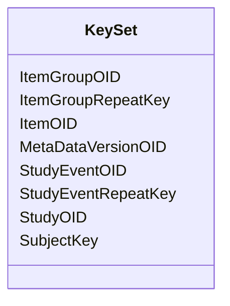

# Class: KeySet


URI: [odm:KeySet](http://www.cdisc.org/ns/odm/v2.0/KeySet)





<!-- no inheritance hierarchy -->


## Slots

| Name | Cardinality and Range | Description | Inheritance |
| ---  | --- | --- | --- |
| [StudyOID](StudyOID.md) | 1..1 <br/> [Oidref](Oidref.md) |  | direct |
| [SubjectKey](SubjectKey.md) | 0..1 <br/> [SubjectKey](SubjectKey.md) |  | direct |
| [MetaDataVersionOID](MetaDataVersionOID.md) | 0..1 <br/> [Oidref](Oidref.md) |  | direct |
| [StudyEventOID](StudyEventOID.md) | 0..1 <br/> [Oidref](Oidref.md) |  | direct |
| [StudyEventRepeatKey](StudyEventRepeatKey.md) | 0..1 <br/> [RepeatKey](RepeatKey.md) |  | direct |
| [ItemGroupOID](ItemGroupOID.md) | 0..1 <br/> [Oidref](Oidref.md) |  | direct |
| [ItemGroupRepeatKey](ItemGroupRepeatKey.md) | 0..1 <br/> [RepeatKey](RepeatKey.md) |  | direct |
| [ItemOID](ItemOID.md) | 0..1 <br/> [Oidref](Oidref.md) |  | direct |


## Usages

| used by | used in | type | used |
| ---  | --- | --- | --- |
| [Association](Association.md) | [KeySetRef](KeySetRef.md) | range | [KeySet](KeySet.md) |


## Identifier and Mapping Information


### Schema Source


* from schema: http://www.cdisc.org/ns/odm/v2.0


## Mappings

| Mapping Type | Mapped Value |
| ---  | ---  |
| self | odm:KeySet |
| native | odm:KeySet |


## LinkML Source

<!-- TODO: investigate https://stackoverflow.com/questions/37606292/how-to-create-tabbed-code-blocks-in-mkdocs-or-sphinx -->

### Direct

<details>
```yaml
name: KeySet
from_schema: http://www.cdisc.org/ns/odm/v2.0
slots:
- StudyOID
- SubjectKey
- MetaDataVersionOID
- StudyEventOID
- StudyEventRepeatKey
- ItemGroupOID
- ItemGroupRepeatKey
- ItemOID
slot_usage:
  StudyOID:
    name: StudyOID
    domain_of:
    - Include
    - SourceItem
    - AdminData
    - MetaDataVersionRef
    - ReferenceData
    - ClinicalData
    - Association
    - KeySet
    range: oidref
    required: true
  SubjectKey:
    name: SubjectKey
    domain_of:
    - SubjectData
    - KeySet
    range: subjectKey
    required: false
  MetaDataVersionOID:
    name: MetaDataVersionOID
    domain_of:
    - Include
    - SourceItem
    - MetaDataVersionRef
    - ReferenceData
    - ClinicalData
    - Association
    - KeySet
    range: oidref
    required: false
  StudyEventOID:
    name: StudyEventOID
    domain_of:
    - StudyEventRef
    - AbsoluteTimingConstraint
    - StudyEventData
    - KeySet
    range: oidref
    required: false
  StudyEventRepeatKey:
    name: StudyEventRepeatKey
    domain_of:
    - StudyEventData
    - KeySet
    range: repeatKey
    required: false
  ItemGroupOID:
    name: ItemGroupOID
    domain_of:
    - SourceItem
    - ItemGroupData
    - KeySet
    - ItemGroupRef
    range: oidref
    required: false
  ItemGroupRepeatKey:
    name: ItemGroupRepeatKey
    domain_of:
    - ItemGroupData
    - KeySet
    range: repeatKey
    required: false
  ItemOID:
    name: ItemOID
    domain_of:
    - SourceItem
    - RangeCheck
    - ItemData
    - KeySet
    - ItemRef
    range: oidref
    required: false
class_uri: odm:KeySet

```
</details>

### Induced

<details>
```yaml
name: KeySet
from_schema: http://www.cdisc.org/ns/odm/v2.0
slot_usage:
  StudyOID:
    name: StudyOID
    domain_of:
    - Include
    - SourceItem
    - AdminData
    - MetaDataVersionRef
    - ReferenceData
    - ClinicalData
    - Association
    - KeySet
    range: oidref
    required: true
  SubjectKey:
    name: SubjectKey
    domain_of:
    - SubjectData
    - KeySet
    range: subjectKey
    required: false
  MetaDataVersionOID:
    name: MetaDataVersionOID
    domain_of:
    - Include
    - SourceItem
    - MetaDataVersionRef
    - ReferenceData
    - ClinicalData
    - Association
    - KeySet
    range: oidref
    required: false
  StudyEventOID:
    name: StudyEventOID
    domain_of:
    - StudyEventRef
    - AbsoluteTimingConstraint
    - StudyEventData
    - KeySet
    range: oidref
    required: false
  StudyEventRepeatKey:
    name: StudyEventRepeatKey
    domain_of:
    - StudyEventData
    - KeySet
    range: repeatKey
    required: false
  ItemGroupOID:
    name: ItemGroupOID
    domain_of:
    - SourceItem
    - ItemGroupData
    - KeySet
    - ItemGroupRef
    range: oidref
    required: false
  ItemGroupRepeatKey:
    name: ItemGroupRepeatKey
    domain_of:
    - ItemGroupData
    - KeySet
    range: repeatKey
    required: false
  ItemOID:
    name: ItemOID
    domain_of:
    - SourceItem
    - RangeCheck
    - ItemData
    - KeySet
    - ItemRef
    range: oidref
    required: false
attributes:
  StudyOID:
    name: StudyOID
    from_schema: http://www.cdisc.org/ns/odm/v2.0
    rank: 1000
    alias: StudyOID
    owner: KeySet
    domain_of:
    - Include
    - SourceItem
    - AdminData
    - MetaDataVersionRef
    - ReferenceData
    - ClinicalData
    - Association
    - KeySet
    range: oidref
    required: true
  SubjectKey:
    name: SubjectKey
    from_schema: http://www.cdisc.org/ns/odm/v2.0
    rank: 1000
    alias: SubjectKey
    owner: KeySet
    domain_of:
    - SubjectData
    - KeySet
    range: subjectKey
    required: false
  MetaDataVersionOID:
    name: MetaDataVersionOID
    from_schema: http://www.cdisc.org/ns/odm/v2.0
    rank: 1000
    alias: MetaDataVersionOID
    owner: KeySet
    domain_of:
    - Include
    - SourceItem
    - MetaDataVersionRef
    - ReferenceData
    - ClinicalData
    - Association
    - KeySet
    range: oidref
    required: false
  StudyEventOID:
    name: StudyEventOID
    from_schema: http://www.cdisc.org/ns/odm/v2.0
    rank: 1000
    alias: StudyEventOID
    owner: KeySet
    domain_of:
    - StudyEventRef
    - AbsoluteTimingConstraint
    - StudyEventData
    - KeySet
    range: oidref
    required: false
  StudyEventRepeatKey:
    name: StudyEventRepeatKey
    from_schema: http://www.cdisc.org/ns/odm/v2.0
    rank: 1000
    alias: StudyEventRepeatKey
    owner: KeySet
    domain_of:
    - StudyEventData
    - KeySet
    range: repeatKey
    required: false
  ItemGroupOID:
    name: ItemGroupOID
    from_schema: http://www.cdisc.org/ns/odm/v2.0
    rank: 1000
    alias: ItemGroupOID
    owner: KeySet
    domain_of:
    - SourceItem
    - ItemGroupData
    - KeySet
    - ItemGroupRef
    range: oidref
    required: false
  ItemGroupRepeatKey:
    name: ItemGroupRepeatKey
    from_schema: http://www.cdisc.org/ns/odm/v2.0
    rank: 1000
    alias: ItemGroupRepeatKey
    owner: KeySet
    domain_of:
    - ItemGroupData
    - KeySet
    range: repeatKey
    required: false
  ItemOID:
    name: ItemOID
    from_schema: http://www.cdisc.org/ns/odm/v2.0
    rank: 1000
    alias: ItemOID
    owner: KeySet
    domain_of:
    - SourceItem
    - RangeCheck
    - ItemData
    - KeySet
    - ItemRef
    range: oidref
    required: false
class_uri: odm:KeySet

```
</details>