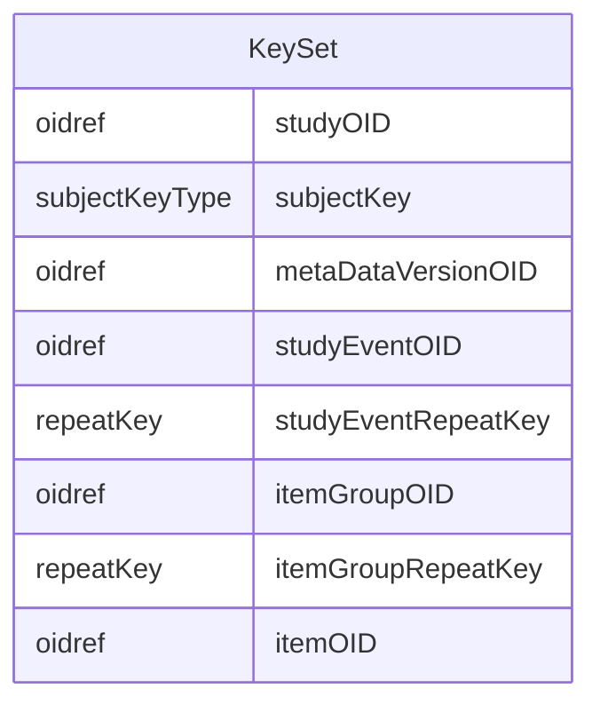

# Class: KeySet

_A KeySet references a single entity (e.g., a study, a subject, a study event). Only those attributes needed to specify the particular entity are required, and all others must be omitted (see Section 2.7, Clinical Data Keys)._


URI: [odm:KeySet](http://www.cdisc.org/ns/odm/v2.0/KeySet)





<!-- no inheritance hierarchy -->


## Slots

| Name | Cardinality* and Range | Description | Inheritance |
| ---  | --- | --- | --- |
| [studyOID](studyOID.md) | 1..1 <br/> [oidref](oidref.md) | References the StudyOID in an ODM/ClinicalData element. | direct |
| [subjectKey](subjectKey.md) | 0..1 <br/> [subjectKeyType](subjectKeyType.md) | Reference to a SubjectKey attribute value for a SubjectData child element of ... | direct |
| [metaDataVersionOID](metaDataVersionOID.md) | 0..1 <br/> [oidref](oidref.md) | Reference to a MetaDataVersionOID attribute value for this ClinicalData eleme... | direct |
| [studyEventOID](studyEventOID.md) | 0..1 <br/> [oidref](oidref.md) | Reference to a StudyEventOID attribute value for a StudyEventData child eleme... | direct |
| [studyEventRepeatKey](studyEventRepeatKey.md) | 0..1 <br/> [repeatKey](repeatKey.md) | Reference to a StudyEventRepeatKey attribute value for a StudyEventData child... | direct |
| [itemGroupOID](itemGroupOID.md) | 0..1 <br/> [oidref](oidref.md) | Reference to an ItemGroupOID attribute value for an ItemGroupData child eleme... | direct |
| [itemGroupRepeatKey](itemGroupRepeatKey.md) | 0..1 <br/> [repeatKey](repeatKey.md) | Reference to an ItemGroupRepeatKey attribute value for an ItemGroupData child... | direct |
| [itemOID](itemOID.md) | 0..1 <br/> [oidref](oidref.md) | Reference to an ItemOID attribute for an ItemData child element of this Clini... | direct |

_* See [LinkML documentation](https://linkml.io/linkml/schemas/slots.html#slot-cardinality) for cardinality definitions._


## Usages

| used by | used in | type | used |
| ---  | --- | --- | --- |
| [Association](Association.md) | [keySet](keySet.md) | range | [KeySet](KeySet.md) |


## See Also

* [https://wiki.cdisc.org/display/PUB/KeySet](https://wiki.cdisc.org/display/PUB/KeySet)

## Identifier and Mapping Information


### Schema Source


* from schema: http://www.cdisc.org/ns/odm/v2.0


## Mappings

| Mapping Type | Mapped Value |
| ---  | ---  |
| self | odm:KeySet |
| native | odm:KeySet |


## LinkML Source

<!-- TODO: investigate https://stackoverflow.com/questions/37606292/how-to-create-tabbed-code-blocks-in-mkdocs-or-sphinx -->

### Direct

<details>
```yaml
name: KeySet
description: A KeySet references a single entity (e.g., a study, a subject, a study
  event). Only those attributes needed to specify the particular entity are required,
  and all others must be omitted (see Section 2.7, Clinical Data Keys).
from_schema: http://www.cdisc.org/ns/odm/v2.0
see_also:
- https://wiki.cdisc.org/display/PUB/KeySet
rank: 1000
slots:
- studyOID
- subjectKey
- metaDataVersionOID
- studyEventOID
- studyEventRepeatKey
- itemGroupOID
- itemGroupRepeatKey
- itemOID
slot_usage:
  studyOID:
    name: studyOID
    description: References the StudyOID in an ODM/ClinicalData element.
    comments:
    - Matches the Association/@StudyOID.
    domain_of:
    - Include
    - SourceItem
    - AdminData
    - MetaDataVersionRef
    - ReferenceData
    - ClinicalData
    - Association
    - KeySet
    range: oidref
    required: true
  subjectKey:
    name: subjectKey
    description: Reference to a SubjectKey attribute value for a SubjectData child
      element of this ClinicalData element.
    comments:
    - 'Optional

      Matches the SubjectKey attribute for a ClinicalData/SubjectData element.'
    domain_of:
    - SubjectData
    - KeySet
    range: subjectKeyType
  metaDataVersionOID:
    name: metaDataVersionOID
    description: Reference to a MetaDataVersionOID attribute value for this ClinicalData
      element.
    comments:
    - 'Optional

      Matches the MetaDataVersionOID attribute for this ClinicalData element.'
    domain_of:
    - Include
    - SourceItem
    - MetaDataVersionRef
    - ReferenceData
    - ClinicalData
    - Association
    - KeySet
    range: oidref
  studyEventOID:
    name: studyEventOID
    description: Reference to a StudyEventOID attribute value for a StudyEventData
      child element of this ClinicalData/SubjectData element.
    comments:
    - 'Optional

      Matches the StudyEventOID attribute for a StudyEventData child element of this
      ClinicalData/SubjectData element.'
    domain_of:
    - StudyEventRef
    - AbsoluteTimingConstraint
    - StudyEventData
    - KeySet
    range: oidref
  studyEventRepeatKey:
    name: studyEventRepeatKey
    description: Reference to a StudyEventRepeatKey attribute value for a StudyEventData
      child element of this ClinicalData/SubjectData/StudyEventData element.
    comments:
    - 'Optional

      Matches the StudyEventRepeatKey attribute for this ClinicalData/SubjectData/StudyEventData
      element.'
    domain_of:
    - StudyEventData
    - KeySet
    range: repeatKey
  itemGroupOID:
    name: itemGroupOID
    description: Reference to an ItemGroupOID attribute value for an ItemGroupData
      child element of this ClinicalData/SubjectData/StudyEventData element.
    comments:
    - 'Optional

      Matches the ItemGroupOID attribute for an ItemGroupData child of this ClinicalData/SubjectData/StudyEventData.'
    domain_of:
    - ItemGroupRef
    - SourceItem
    - ItemGroupData
    - KeySet
    range: oidref
  itemGroupRepeatKey:
    name: itemGroupRepeatKey
    description: Reference to an ItemGroupRepeatKey attribute value for an ItemGroupData
      child element of this ClinicalData/SubjectData/StudyEventData element.
    comments:
    - '(Optional

      Matches the ItemGroupRepeatKey value for this ClinicalData/SubjectData/StudyEventData/ItemGroupData
      element.'
    domain_of:
    - ItemGroupData
    - KeySet
    range: repeatKey
  itemOID:
    name: itemOID
    description: Reference to an ItemOID attribute for an ItemData child element of
      this ClinicalData/SubjectData/StudyEventData/ItemGroupData element.
    comments:
    - 'Optional

      Matches the ItemOID for an ItemData child of this ClinicalData/SubjectData/StudyEventData/ItemGroupData
      element.'
    domain_of:
    - ItemRef
    - SourceItem
    - RangeCheck
    - ItemData
    - KeySet
    range: oidref
class_uri: odm:KeySet

```
</details>

### Induced

<details>
```yaml
name: KeySet
description: A KeySet references a single entity (e.g., a study, a subject, a study
  event). Only those attributes needed to specify the particular entity are required,
  and all others must be omitted (see Section 2.7, Clinical Data Keys).
from_schema: http://www.cdisc.org/ns/odm/v2.0
see_also:
- https://wiki.cdisc.org/display/PUB/KeySet
rank: 1000
slot_usage:
  studyOID:
    name: studyOID
    description: References the StudyOID in an ODM/ClinicalData element.
    comments:
    - Matches the Association/@StudyOID.
    domain_of:
    - Include
    - SourceItem
    - AdminData
    - MetaDataVersionRef
    - ReferenceData
    - ClinicalData
    - Association
    - KeySet
    range: oidref
    required: true
  subjectKey:
    name: subjectKey
    description: Reference to a SubjectKey attribute value for a SubjectData child
      element of this ClinicalData element.
    comments:
    - 'Optional

      Matches the SubjectKey attribute for a ClinicalData/SubjectData element.'
    domain_of:
    - SubjectData
    - KeySet
    range: subjectKeyType
  metaDataVersionOID:
    name: metaDataVersionOID
    description: Reference to a MetaDataVersionOID attribute value for this ClinicalData
      element.
    comments:
    - 'Optional

      Matches the MetaDataVersionOID attribute for this ClinicalData element.'
    domain_of:
    - Include
    - SourceItem
    - MetaDataVersionRef
    - ReferenceData
    - ClinicalData
    - Association
    - KeySet
    range: oidref
  studyEventOID:
    name: studyEventOID
    description: Reference to a StudyEventOID attribute value for a StudyEventData
      child element of this ClinicalData/SubjectData element.
    comments:
    - 'Optional

      Matches the StudyEventOID attribute for a StudyEventData child element of this
      ClinicalData/SubjectData element.'
    domain_of:
    - StudyEventRef
    - AbsoluteTimingConstraint
    - StudyEventData
    - KeySet
    range: oidref
  studyEventRepeatKey:
    name: studyEventRepeatKey
    description: Reference to a StudyEventRepeatKey attribute value for a StudyEventData
      child element of this ClinicalData/SubjectData/StudyEventData element.
    comments:
    - 'Optional

      Matches the StudyEventRepeatKey attribute for this ClinicalData/SubjectData/StudyEventData
      element.'
    domain_of:
    - StudyEventData
    - KeySet
    range: repeatKey
  itemGroupOID:
    name: itemGroupOID
    description: Reference to an ItemGroupOID attribute value for an ItemGroupData
      child element of this ClinicalData/SubjectData/StudyEventData element.
    comments:
    - 'Optional

      Matches the ItemGroupOID attribute for an ItemGroupData child of this ClinicalData/SubjectData/StudyEventData.'
    domain_of:
    - ItemGroupRef
    - SourceItem
    - ItemGroupData
    - KeySet
    range: oidref
  itemGroupRepeatKey:
    name: itemGroupRepeatKey
    description: Reference to an ItemGroupRepeatKey attribute value for an ItemGroupData
      child element of this ClinicalData/SubjectData/StudyEventData element.
    comments:
    - '(Optional

      Matches the ItemGroupRepeatKey value for this ClinicalData/SubjectData/StudyEventData/ItemGroupData
      element.'
    domain_of:
    - ItemGroupData
    - KeySet
    range: repeatKey
  itemOID:
    name: itemOID
    description: Reference to an ItemOID attribute for an ItemData child element of
      this ClinicalData/SubjectData/StudyEventData/ItemGroupData element.
    comments:
    - 'Optional

      Matches the ItemOID for an ItemData child of this ClinicalData/SubjectData/StudyEventData/ItemGroupData
      element.'
    domain_of:
    - ItemRef
    - SourceItem
    - RangeCheck
    - ItemData
    - KeySet
    range: oidref
attributes:
  studyOID:
    name: studyOID
    description: References the StudyOID in an ODM/ClinicalData element.
    comments:
    - Matches the Association/@StudyOID.
    from_schema: http://www.cdisc.org/ns/odm/v2.0
    rank: 1000
    alias: studyOID
    owner: KeySet
    domain_of:
    - Include
    - SourceItem
    - AdminData
    - MetaDataVersionRef
    - ReferenceData
    - ClinicalData
    - Association
    - KeySet
    range: oidref
    required: true
  subjectKey:
    name: subjectKey
    description: Reference to a SubjectKey attribute value for a SubjectData child
      element of this ClinicalData element.
    comments:
    - 'Optional

      Matches the SubjectKey attribute for a ClinicalData/SubjectData element.'
    from_schema: http://www.cdisc.org/ns/odm/v2.0
    rank: 1000
    alias: subjectKey
    owner: KeySet
    domain_of:
    - SubjectData
    - KeySet
    range: subjectKeyType
  metaDataVersionOID:
    name: metaDataVersionOID
    description: Reference to a MetaDataVersionOID attribute value for this ClinicalData
      element.
    comments:
    - 'Optional

      Matches the MetaDataVersionOID attribute for this ClinicalData element.'
    from_schema: http://www.cdisc.org/ns/odm/v2.0
    rank: 1000
    alias: metaDataVersionOID
    owner: KeySet
    domain_of:
    - Include
    - SourceItem
    - MetaDataVersionRef
    - ReferenceData
    - ClinicalData
    - Association
    - KeySet
    range: oidref
  studyEventOID:
    name: studyEventOID
    description: Reference to a StudyEventOID attribute value for a StudyEventData
      child element of this ClinicalData/SubjectData element.
    comments:
    - 'Optional

      Matches the StudyEventOID attribute for a StudyEventData child element of this
      ClinicalData/SubjectData element.'
    from_schema: http://www.cdisc.org/ns/odm/v2.0
    rank: 1000
    alias: studyEventOID
    owner: KeySet
    domain_of:
    - StudyEventRef
    - AbsoluteTimingConstraint
    - StudyEventData
    - KeySet
    range: oidref
  studyEventRepeatKey:
    name: studyEventRepeatKey
    description: Reference to a StudyEventRepeatKey attribute value for a StudyEventData
      child element of this ClinicalData/SubjectData/StudyEventData element.
    comments:
    - 'Optional

      Matches the StudyEventRepeatKey attribute for this ClinicalData/SubjectData/StudyEventData
      element.'
    from_schema: http://www.cdisc.org/ns/odm/v2.0
    rank: 1000
    alias: studyEventRepeatKey
    owner: KeySet
    domain_of:
    - StudyEventData
    - KeySet
    range: repeatKey
  itemGroupOID:
    name: itemGroupOID
    description: Reference to an ItemGroupOID attribute value for an ItemGroupData
      child element of this ClinicalData/SubjectData/StudyEventData element.
    comments:
    - 'Optional

      Matches the ItemGroupOID attribute for an ItemGroupData child of this ClinicalData/SubjectData/StudyEventData.'
    from_schema: http://www.cdisc.org/ns/odm/v2.0
    rank: 1000
    alias: itemGroupOID
    owner: KeySet
    domain_of:
    - ItemGroupRef
    - SourceItem
    - ItemGroupData
    - KeySet
    range: oidref
  itemGroupRepeatKey:
    name: itemGroupRepeatKey
    description: Reference to an ItemGroupRepeatKey attribute value for an ItemGroupData
      child element of this ClinicalData/SubjectData/StudyEventData element.
    comments:
    - '(Optional

      Matches the ItemGroupRepeatKey value for this ClinicalData/SubjectData/StudyEventData/ItemGroupData
      element.'
    from_schema: http://www.cdisc.org/ns/odm/v2.0
    rank: 1000
    alias: itemGroupRepeatKey
    owner: KeySet
    domain_of:
    - ItemGroupData
    - KeySet
    range: repeatKey
  itemOID:
    name: itemOID
    description: Reference to an ItemOID attribute for an ItemData child element of
      this ClinicalData/SubjectData/StudyEventData/ItemGroupData element.
    comments:
    - 'Optional

      Matches the ItemOID for an ItemData child of this ClinicalData/SubjectData/StudyEventData/ItemGroupData
      element.'
    from_schema: http://www.cdisc.org/ns/odm/v2.0
    rank: 1000
    alias: itemOID
    owner: KeySet
    domain_of:
    - ItemRef
    - SourceItem
    - RangeCheck
    - ItemData
    - KeySet
    range: oidref
class_uri: odm:KeySet

```
</details>