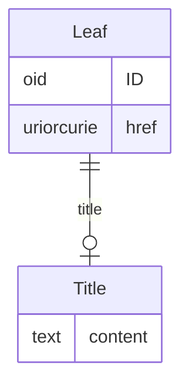

# Class: Leaf

_Contains the XLink information referenced by DocumentRef or ArchiveLocationID_


URI: [odm:Leaf](http://www.cdisc.org/ns/odm/v2.0/Leaf)





<!-- no inheritance hierarchy -->


## Slots

| Name | Cardinality* and Range | Description | Inheritance |
| ---  | --- | --- | --- |
| [ID](ID.md) | 1..1 <br/> [oid](oid.md) | Unique ID for the Leaf. See Section 2.13, Element Identifiers and References ... | direct |
| [href](href.md) | 1..1 <br/> [uriorcurie](uriorcurie.md) | URL that can be used to identify the location of a document or dataset file r... | direct |
| [title](title.md) | 0..1 <br/> [Title](Title.md) | Text with the label for the document or dataset. | direct |

_* See [LinkML documentation](https://linkml.io/linkml/schemas/slots.html#slot-cardinality) for cardinality definitions._


## Usages

| used by | used in | type | used |
| ---  | --- | --- | --- |
| [MetaDataVersion](MetaDataVersion.md) | [leaf](leaf.md) | range | [Leaf](Leaf.md) |
| [ItemGroupDef](ItemGroupDef.md) | [archiveLocationID](archiveLocationID.md) | range | [Leaf](Leaf.md) |
| [ItemGroupDef](ItemGroupDef.md) | [leaf](leaf.md) | range | [Leaf](Leaf.md) |
| [SourceItem](SourceItem.md) | [leafID](leafID.md) | range | [Leaf](Leaf.md) |


## See Also

* [https://wiki.cdisc.org/display/PUB/Leaf](https://wiki.cdisc.org/display/PUB/Leaf)

## Identifier and Mapping Information


### Schema Source


* from schema: http://www.cdisc.org/ns/odm/v2.0


## Mappings

| Mapping Type | Mapped Value |
| ---  | ---  |
| self | odm:Leaf |
| native | odm:Leaf |


## LinkML Source

<!-- TODO: investigate https://stackoverflow.com/questions/37606292/how-to-create-tabbed-code-blocks-in-mkdocs-or-sphinx -->

### Direct

<details>
```yaml
name: Leaf
description: Contains the XLink information referenced by DocumentRef or ArchiveLocationID
from_schema: http://www.cdisc.org/ns/odm/v2.0
see_also:
- https://wiki.cdisc.org/display/PUB/Leaf
rank: 1000
slots:
- ID
- href
- title
slot_usage:
  ID:
    name: ID
    description: 'Unique ID for the Leaf. See Section 2.13, Element Identifiers and
      References , for OID considerations. Business Rule: Leaf ID attributes must
      be unique within the ODM document (i.e., there can be no 2 Leaf elements with
      the same ID attribute).'
    comments:
    - 'Required

      enum values: The Leaf ID is based on the XML xs:ID datatype, which is a Non-Colonized
      Name; therefore, ID attributes must start with either a letter or underscore
      (_), and may contain only letters, digits, underscores, hyphens and periods.'
    identifier: true
    domain_of:
    - Leaf
    - Signature
    - Annotation
    range: oid
    required: true
  href:
    name: href
    description: 'URL that can be used to identify the location of a document or dataset
      file relative to the folder containing the ODM file. If the file is not located
      in the same folder as the ODM file, a relative file path should be included.
      Business Rule: For regulatory submissions to the FDA, the locations specified
      have to conform to locations allowed in the eCTD, in the Technical Conformance
      Guide for the relevant regulatory authority and the study data specifications.'
    comments:
    - 'Required

      range: xsd:anyURI'
    domain_of:
    - Leaf
    - Include
    - ExternalCodeLib
    - Image
    - Coding
    range: uriorcurie
    required: true
  title:
    name: title
    description: Text with the label for the document or dataset.
    domain_of:
    - PDFPageRef
    - Leaf
    range: Title
    maximum_cardinality: 1
class_uri: odm:Leaf

```
</details>

### Induced

<details>
```yaml
name: Leaf
description: Contains the XLink information referenced by DocumentRef or ArchiveLocationID
from_schema: http://www.cdisc.org/ns/odm/v2.0
see_also:
- https://wiki.cdisc.org/display/PUB/Leaf
rank: 1000
slot_usage:
  ID:
    name: ID
    description: 'Unique ID for the Leaf. See Section 2.13, Element Identifiers and
      References , for OID considerations. Business Rule: Leaf ID attributes must
      be unique within the ODM document (i.e., there can be no 2 Leaf elements with
      the same ID attribute).'
    comments:
    - 'Required

      enum values: The Leaf ID is based on the XML xs:ID datatype, which is a Non-Colonized
      Name; therefore, ID attributes must start with either a letter or underscore
      (_), and may contain only letters, digits, underscores, hyphens and periods.'
    identifier: true
    domain_of:
    - Leaf
    - Signature
    - Annotation
    range: oid
    required: true
  href:
    name: href
    description: 'URL that can be used to identify the location of a document or dataset
      file relative to the folder containing the ODM file. If the file is not located
      in the same folder as the ODM file, a relative file path should be included.
      Business Rule: For regulatory submissions to the FDA, the locations specified
      have to conform to locations allowed in the eCTD, in the Technical Conformance
      Guide for the relevant regulatory authority and the study data specifications.'
    comments:
    - 'Required

      range: xsd:anyURI'
    domain_of:
    - Leaf
    - Include
    - ExternalCodeLib
    - Image
    - Coding
    range: uriorcurie
    required: true
  title:
    name: title
    description: Text with the label for the document or dataset.
    domain_of:
    - PDFPageRef
    - Leaf
    range: Title
    maximum_cardinality: 1
attributes:
  ID:
    name: ID
    description: 'Unique ID for the Leaf. See Section 2.13, Element Identifiers and
      References , for OID considerations. Business Rule: Leaf ID attributes must
      be unique within the ODM document (i.e., there can be no 2 Leaf elements with
      the same ID attribute).'
    comments:
    - 'Required

      enum values: The Leaf ID is based on the XML xs:ID datatype, which is a Non-Colonized
      Name; therefore, ID attributes must start with either a letter or underscore
      (_), and may contain only letters, digits, underscores, hyphens and periods.'
    from_schema: http://www.cdisc.org/ns/odm/v2.0
    rank: 1000
    identifier: true
    alias: ID
    owner: Leaf
    domain_of:
    - Leaf
    - Signature
    - Annotation
    range: oid
    required: true
  href:
    name: href
    description: 'URL that can be used to identify the location of a document or dataset
      file relative to the folder containing the ODM file. If the file is not located
      in the same folder as the ODM file, a relative file path should be included.
      Business Rule: For regulatory submissions to the FDA, the locations specified
      have to conform to locations allowed in the eCTD, in the Technical Conformance
      Guide for the relevant regulatory authority and the study data specifications.'
    comments:
    - 'Required

      range: xsd:anyURI'
    from_schema: http://www.cdisc.org/ns/odm/v2.0
    rank: 1000
    alias: href
    owner: Leaf
    domain_of:
    - Leaf
    - Include
    - ExternalCodeLib
    - Image
    - Coding
    range: uriorcurie
    required: true
  title:
    name: title
    description: Text with the label for the document or dataset.
    from_schema: http://www.cdisc.org/ns/odm/v2.0
    rank: 1000
    alias: title
    owner: Leaf
    domain_of:
    - PDFPageRef
    - Leaf
    range: Title
    maximum_cardinality: 1
class_uri: odm:Leaf

```
</details>