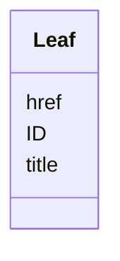

# Class: Leaf


_Contains the XLink information referenced by DocumentRef or ArchiveLocationID_


URI: [odm:leaf](http://www.cdisc.org/ns/odm/v2.0/leaf)





<!-- no inheritance hierarchy -->


## Slots

| Name | Cardinality and Range | Description | Inheritance |
| ---  | --- | --- | --- |
| [ID](ID.md) | 1..1 <br/> [Oid](Oid.md) | Unique identifier for the leaf that is referenced | direct |
| [href](href.md) | 1..1 <br/> [String](String.md) | URL that can be used to identify the location of a document or dataset file r... | direct |
| [title](title.md) | 1..1 <br/> [String](String.md) | Text with the label for the document or dataset | direct |


## Usages

| used by | used in | type | used |
| ---  | --- | --- | --- |
| [MetaDataVersion](MetaDataVersion.md) | [leafRef](leafRef.md) | range | [Leaf](Leaf.md) |
| [ItemGroupDef](ItemGroupDef.md) | [leafRef](leafRef.md) | range | [Leaf](Leaf.md) |


## Identifier and Mapping Information


### Schema Source


* from schema: http://www.cdisc.org/ns/odm/v2.0


## Mappings

| Mapping Type | Mapped Value |
| ---  | ---  |
| self | odm:leaf |
| native | odm:Leaf |


## LinkML Source

<!-- TODO: investigate https://stackoverflow.com/questions/37606292/how-to-create-tabbed-code-blocks-in-mkdocs-or-sphinx -->

### Direct

<details>
```yaml
name: leaf
description: Contains the XLink information referenced by DocumentRef or ArchiveLocationID
from_schema: http://www.cdisc.org/ns/odm/v2.0
slots:
- ID
- href
- title
slot_usage:
  ID:
    name: ID
    domain_of:
    - leaf
    - Signature
    - Annotation
    range: oid
    required: true
  href:
    name: href
    domain_of:
    - leaf
    - Include
    - ExternalCodeList
    - ExternalCodeLib
    - Image
    - Coding
    required: true
  title:
    name: title
    description: Text with the label for the document or dataset.
    domain_of:
    - leaf
    required: true
    minimum_cardinality: 1
    maximum_cardinality: 1
class_uri: odm:leaf

```
</details>

### Induced

<details>
```yaml
name: leaf
description: Contains the XLink information referenced by DocumentRef or ArchiveLocationID
from_schema: http://www.cdisc.org/ns/odm/v2.0
slot_usage:
  ID:
    name: ID
    domain_of:
    - leaf
    - Signature
    - Annotation
    range: oid
    required: true
  href:
    name: href
    domain_of:
    - leaf
    - Include
    - ExternalCodeList
    - ExternalCodeLib
    - Image
    - Coding
    required: true
  title:
    name: title
    description: Text with the label for the document or dataset.
    domain_of:
    - leaf
    required: true
    minimum_cardinality: 1
    maximum_cardinality: 1
attributes:
  ID:
    name: ID
    description: Unique identifier for the leaf that is referenced.
    from_schema: http://www.cdisc.org/ns/odm/v2.0
    rank: 1000
    alias: ID
    owner: leaf
    domain_of:
    - leaf
    - Signature
    - Annotation
    range: oid
    required: true
  href:
    name: href
    description: URL that can be used to identify the location of a document or dataset
      file relative to the folder containing the ODM file.
    from_schema: http://www.cdisc.org/ns/odm/v2.0
    rank: 1000
    alias: href
    owner: leaf
    domain_of:
    - leaf
    - Include
    - ExternalCodeList
    - ExternalCodeLib
    - Image
    - Coding
    range: string
    required: true
  title:
    name: title
    description: Text with the label for the document or dataset.
    from_schema: http://www.cdisc.org/ns/odm/v2.0
    rank: 1000
    alias: title
    owner: leaf
    domain_of:
    - leaf
    range: string
    required: true
    minimum_cardinality: 1
    maximum_cardinality: 1
class_uri: odm:leaf

```
</details>