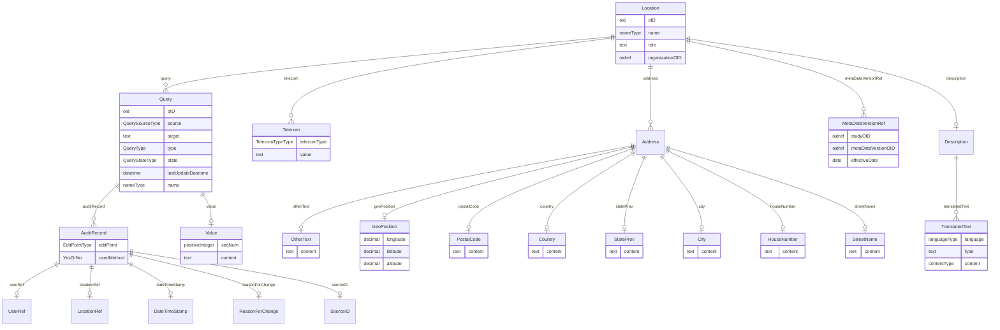

# Class: Location

_A physical location associated with data collection and/or treatment of subjects._


URI: [odm:Location](http://www.cdisc.org/ns/odm/v2.0/Location)





<!-- no inheritance hierarchy -->


## Slots

| Name | Cardinality* and Range | Description | Inheritance |
| ---  | --- | --- | --- |
| [oID](oID.md) | 1..1 <br/> [oid](oid.md) | Unique identifier | direct |
| [name](name.md) | 1..1 <br/> [nameType](nameType.md) | Human-readable identifier. | direct |
| [role](role.md) | 0..1 <br/> [text](text.md) | Specifies the role of this location in the study. | direct |
| [organizationOID](organizationOID.md) | 0..1 <br/> [oidref](oidref.md) | Reference to an organization. | direct |
| [description](description.md) | 0..1 <br/> [Description](Description.md) | Description reference: A free-text description of the containing metadata com... | direct |
| [metaDataVersionRef](metaDataVersionRef.md) | 0..* <br/> [MetaDataVersionRef](MetaDataVersionRef.md) | MetaDataVersionRef reference: A reference to a MetaDataVersion used at the co... | direct |
| [address](address.md) | 0..* <br/> [Address](Address.md) | Address reference: The postal address for a user, location, or organization. | direct |
| [telecom](telecom.md) | 0..* <br/> [Telecom](Telecom.md) | Telecom reference: The telecommunication contacts points of a user, a locatio... | direct |
| [query](query.md) | 0..* <br/> [Query](Query.md) | Query reference: The Query element represents a request for clarification on ... | direct |

_* See [LinkML documentation](https://linkml.io/linkml/schemas/slots.html#slot-cardinality) for cardinality definitions._


## Usages

| used by | used in | type | used |
| ---  | --- | --- | --- |
| [AdminData](AdminData.md) | [location](location.md) | range | [Location](Location.md) |


## See Also

* [https://wiki.cdisc.org/display/PUB/Location](https://wiki.cdisc.org/display/PUB/Location)

## Identifier and Mapping Information


### Schema Source


* from schema: http://www.cdisc.org/ns/odm/v2.0


## Mappings

| Mapping Type | Mapped Value |
| ---  | ---  |
| self | odm:Location |
| native | odm:Location |


## LinkML Source

<!-- TODO: investigate https://stackoverflow.com/questions/37606292/how-to-create-tabbed-code-blocks-in-mkdocs-or-sphinx -->

### Direct

<details>
```yaml
name: Location
description: A physical location associated with data collection and/or treatment
  of subjects.
from_schema: http://www.cdisc.org/ns/odm/v2.0
see_also:
- https://wiki.cdisc.org/display/PUB/Location
rank: 1000
slots:
- oID
- name
- role
- organizationOID
- description
- metaDataVersionRef
- address
- telecom
- query
slot_usage:
  oID:
    name: oID
    description: Unique identifier
    comments:
    - 'Required

      range: oid

      Must be unique for a study.'
    domain_of:
    - Study
    - MetaDataVersion
    - Standard
    - ValueListDef
    - WhereClauseDef
    - StudyEventGroupDef
    - StudyEventDef
    - ItemGroupDef
    - ItemDef
    - CodeList
    - MethodDef
    - ConditionDef
    - CommentDef
    - StudyIndication
    - StudyIntervention
    - StudyObjective
    - StudyEndPoint
    - StudyTargetPopulation
    - StudyEstimand
    - Arm
    - Epoch
    - StudyParameter
    - StudyTiming
    - TransitionTimingConstraint
    - AbsoluteTimingConstraint
    - RelativeTimingConstraint
    - DurationTimingConstraint
    - WorkflowDef
    - Transition
    - Branching
    - Criterion
    - User
    - Organization
    - Location
    - SignatureDef
    - Query
    range: oid
    required: true
  name:
    name: name
    description: Human-readable identifier.
    comments:
    - 'Required

      range: name

      Must be unique within the set of Location definitions for the study.'
    domain_of:
    - Alias
    - MetaDataVersion
    - Standard
    - StudyEventGroupDef
    - StudyEventDef
    - ItemGroupDef
    - Class
    - SubClass
    - SourceItem
    - Resource
    - ItemDef
    - CodeList
    - MethodDef
    - Parameter
    - ReturnValue
    - ConditionDef
    - StudyObjective
    - StudyEndPoint
    - StudyTargetPopulation
    - StudyEstimand
    - Arm
    - Epoch
    - StudyTiming
    - TransitionTimingConstraint
    - AbsoluteTimingConstraint
    - RelativeTimingConstraint
    - DurationTimingConstraint
    - WorkflowDef
    - Transition
    - Branching
    - Criterion
    - Organization
    - Location
    - Query
    range: nameType
    required: true
  role:
    name: role
    description: Specifies the role of this location in the study.
    comments:
    - 'Optional

      range: text'
    domain_of:
    - ItemRef
    - Organization
    - Location
    range: text
  organizationOID:
    name: organizationOID
    description: Reference to an organization.
    comments:
    - 'Optional

      range: oidref'
    domain_of:
    - User
    - Location
    range: oidref
  description:
    name: description
    domain_of:
    - Study
    - MetaDataVersion
    - ValueListDef
    - StudyEventGroupRef
    - StudyEventGroupDef
    - StudyEventDef
    - ItemGroupDef
    - Origin
    - ItemDef
    - CodeList
    - CodeListItem
    - MethodDef
    - ConditionDef
    - CommentDef
    - Protocol
    - StudyStructure
    - TrialPhase
    - StudyIndication
    - StudyIntervention
    - StudyObjective
    - StudyEndPoint
    - StudyTargetPopulation
    - StudyEstimand
    - IntercurrentEvent
    - SummaryMeasure
    - Arm
    - Epoch
    - TransitionTimingConstraint
    - AbsoluteTimingConstraint
    - RelativeTimingConstraint
    - DurationTimingConstraint
    - WorkflowDef
    - Criterion
    - Organization
    - Location
    - ODMFileMetadata
    range: Description
    maximum_cardinality: 1
  metaDataVersionRef:
    name: metaDataVersionRef
    multivalued: true
    domain_of:
    - Location
    range: MetaDataVersionRef
    inlined: true
    inlined_as_list: true
  address:
    name: address
    multivalued: true
    domain_of:
    - User
    - Organization
    - Location
    range: Address
    inlined: true
    inlined_as_list: true
  telecom:
    name: telecom
    multivalued: true
    domain_of:
    - User
    - Organization
    - Location
    range: Telecom
    inlined: true
    inlined_as_list: true
  query:
    name: query
    multivalued: true
    domain_of:
    - Location
    - ClinicalData
    - SubjectData
    - StudyEventData
    - ItemGroupData
    - ItemData
    range: Query
    inlined: true
    inlined_as_list: true
class_uri: odm:Location

```
</details>

### Induced

<details>
```yaml
name: Location
description: A physical location associated with data collection and/or treatment
  of subjects.
from_schema: http://www.cdisc.org/ns/odm/v2.0
see_also:
- https://wiki.cdisc.org/display/PUB/Location
rank: 1000
slot_usage:
  oID:
    name: oID
    description: Unique identifier
    comments:
    - 'Required

      range: oid

      Must be unique for a study.'
    domain_of:
    - Study
    - MetaDataVersion
    - Standard
    - ValueListDef
    - WhereClauseDef
    - StudyEventGroupDef
    - StudyEventDef
    - ItemGroupDef
    - ItemDef
    - CodeList
    - MethodDef
    - ConditionDef
    - CommentDef
    - StudyIndication
    - StudyIntervention
    - StudyObjective
    - StudyEndPoint
    - StudyTargetPopulation
    - StudyEstimand
    - Arm
    - Epoch
    - StudyParameter
    - StudyTiming
    - TransitionTimingConstraint
    - AbsoluteTimingConstraint
    - RelativeTimingConstraint
    - DurationTimingConstraint
    - WorkflowDef
    - Transition
    - Branching
    - Criterion
    - User
    - Organization
    - Location
    - SignatureDef
    - Query
    range: oid
    required: true
  name:
    name: name
    description: Human-readable identifier.
    comments:
    - 'Required

      range: name

      Must be unique within the set of Location definitions for the study.'
    domain_of:
    - Alias
    - MetaDataVersion
    - Standard
    - StudyEventGroupDef
    - StudyEventDef
    - ItemGroupDef
    - Class
    - SubClass
    - SourceItem
    - Resource
    - ItemDef
    - CodeList
    - MethodDef
    - Parameter
    - ReturnValue
    - ConditionDef
    - StudyObjective
    - StudyEndPoint
    - StudyTargetPopulation
    - StudyEstimand
    - Arm
    - Epoch
    - StudyTiming
    - TransitionTimingConstraint
    - AbsoluteTimingConstraint
    - RelativeTimingConstraint
    - DurationTimingConstraint
    - WorkflowDef
    - Transition
    - Branching
    - Criterion
    - Organization
    - Location
    - Query
    range: nameType
    required: true
  role:
    name: role
    description: Specifies the role of this location in the study.
    comments:
    - 'Optional

      range: text'
    domain_of:
    - ItemRef
    - Organization
    - Location
    range: text
  organizationOID:
    name: organizationOID
    description: Reference to an organization.
    comments:
    - 'Optional

      range: oidref'
    domain_of:
    - User
    - Location
    range: oidref
  description:
    name: description
    domain_of:
    - Study
    - MetaDataVersion
    - ValueListDef
    - StudyEventGroupRef
    - StudyEventGroupDef
    - StudyEventDef
    - ItemGroupDef
    - Origin
    - ItemDef
    - CodeList
    - CodeListItem
    - MethodDef
    - ConditionDef
    - CommentDef
    - Protocol
    - StudyStructure
    - TrialPhase
    - StudyIndication
    - StudyIntervention
    - StudyObjective
    - StudyEndPoint
    - StudyTargetPopulation
    - StudyEstimand
    - IntercurrentEvent
    - SummaryMeasure
    - Arm
    - Epoch
    - TransitionTimingConstraint
    - AbsoluteTimingConstraint
    - RelativeTimingConstraint
    - DurationTimingConstraint
    - WorkflowDef
    - Criterion
    - Organization
    - Location
    - ODMFileMetadata
    range: Description
    maximum_cardinality: 1
  metaDataVersionRef:
    name: metaDataVersionRef
    multivalued: true
    domain_of:
    - Location
    range: MetaDataVersionRef
    inlined: true
    inlined_as_list: true
  address:
    name: address
    multivalued: true
    domain_of:
    - User
    - Organization
    - Location
    range: Address
    inlined: true
    inlined_as_list: true
  telecom:
    name: telecom
    multivalued: true
    domain_of:
    - User
    - Organization
    - Location
    range: Telecom
    inlined: true
    inlined_as_list: true
  query:
    name: query
    multivalued: true
    domain_of:
    - Location
    - ClinicalData
    - SubjectData
    - StudyEventData
    - ItemGroupData
    - ItemData
    range: Query
    inlined: true
    inlined_as_list: true
attributes:
  oID:
    name: oID
    description: Unique identifier
    comments:
    - 'Required

      range: oid

      Must be unique for a study.'
    from_schema: http://www.cdisc.org/ns/odm/v2.0
    rank: 1000
    identifier: true
    alias: oID
    owner: Location
    domain_of:
    - Study
    - MetaDataVersion
    - Standard
    - ValueListDef
    - WhereClauseDef
    - StudyEventGroupDef
    - StudyEventDef
    - ItemGroupDef
    - ItemDef
    - CodeList
    - MethodDef
    - ConditionDef
    - CommentDef
    - StudyIndication
    - StudyIntervention
    - StudyObjective
    - StudyEndPoint
    - StudyTargetPopulation
    - StudyEstimand
    - Arm
    - Epoch
    - StudyParameter
    - StudyTiming
    - TransitionTimingConstraint
    - AbsoluteTimingConstraint
    - RelativeTimingConstraint
    - DurationTimingConstraint
    - WorkflowDef
    - Transition
    - Branching
    - Criterion
    - User
    - Organization
    - Location
    - SignatureDef
    - Query
    range: oid
    required: true
  name:
    name: name
    description: Human-readable identifier.
    comments:
    - 'Required

      range: name

      Must be unique within the set of Location definitions for the study.'
    from_schema: http://www.cdisc.org/ns/odm/v2.0
    rank: 1000
    alias: name
    owner: Location
    domain_of:
    - Alias
    - MetaDataVersion
    - Standard
    - StudyEventGroupDef
    - StudyEventDef
    - ItemGroupDef
    - Class
    - SubClass
    - SourceItem
    - Resource
    - ItemDef
    - CodeList
    - MethodDef
    - Parameter
    - ReturnValue
    - ConditionDef
    - StudyObjective
    - StudyEndPoint
    - StudyTargetPopulation
    - StudyEstimand
    - Arm
    - Epoch
    - StudyTiming
    - TransitionTimingConstraint
    - AbsoluteTimingConstraint
    - RelativeTimingConstraint
    - DurationTimingConstraint
    - WorkflowDef
    - Transition
    - Branching
    - Criterion
    - Organization
    - Location
    - Query
    range: nameType
    required: true
  role:
    name: role
    description: Specifies the role of this location in the study.
    comments:
    - 'Optional

      range: text'
    from_schema: http://www.cdisc.org/ns/odm/v2.0
    rank: 1000
    alias: role
    owner: Location
    domain_of:
    - ItemRef
    - Organization
    - Location
    range: text
  organizationOID:
    name: organizationOID
    description: Reference to an organization.
    comments:
    - 'Optional

      range: oidref'
    from_schema: http://www.cdisc.org/ns/odm/v2.0
    rank: 1000
    alias: organizationOID
    owner: Location
    domain_of:
    - User
    - Location
    range: oidref
  description:
    name: description
    description: 'Description reference: A free-text description of the containing
      metadata component, unless restricted by Business Rules.'
    from_schema: http://www.cdisc.org/ns/odm/v2.0
    rank: 1000
    identifier: false
    alias: description
    owner: Location
    domain_of:
    - Study
    - MetaDataVersion
    - ValueListDef
    - StudyEventGroupRef
    - StudyEventGroupDef
    - StudyEventDef
    - ItemGroupDef
    - Origin
    - ItemDef
    - CodeList
    - CodeListItem
    - MethodDef
    - ConditionDef
    - CommentDef
    - Protocol
    - StudyStructure
    - TrialPhase
    - StudyIndication
    - StudyIntervention
    - StudyObjective
    - StudyEndPoint
    - StudyTargetPopulation
    - StudyEstimand
    - IntercurrentEvent
    - SummaryMeasure
    - Arm
    - Epoch
    - TransitionTimingConstraint
    - AbsoluteTimingConstraint
    - RelativeTimingConstraint
    - DurationTimingConstraint
    - WorkflowDef
    - Criterion
    - Organization
    - Location
    - ODMFileMetadata
    range: Description
    maximum_cardinality: 1
  metaDataVersionRef:
    name: metaDataVersionRef
    description: 'MetaDataVersionRef reference: A reference to a MetaDataVersion used
      at the containing Location. The EffectiveDate reflects the possibility that
      the metadata may change over the course of the study.'
    from_schema: http://www.cdisc.org/ns/odm/v2.0
    rank: 1000
    multivalued: true
    identifier: false
    alias: metaDataVersionRef
    owner: Location
    domain_of:
    - Location
    range: MetaDataVersionRef
    inlined: true
    inlined_as_list: true
  address:
    name: address
    description: 'Address reference: The postal address for a user, location, or organization.'
    from_schema: http://www.cdisc.org/ns/odm/v2.0
    rank: 1000
    multivalued: true
    identifier: false
    alias: address
    owner: Location
    domain_of:
    - User
    - Organization
    - Location
    range: Address
    inlined: true
    inlined_as_list: true
  telecom:
    name: telecom
    description: 'Telecom reference: The telecommunication contacts points of a user,
      a location, or an organization. The Type attribute designates the type of contact.'
    from_schema: http://www.cdisc.org/ns/odm/v2.0
    rank: 1000
    multivalued: true
    identifier: false
    alias: telecom
    owner: Location
    domain_of:
    - User
    - Organization
    - Location
    range: Telecom
    inlined: true
    inlined_as_list: true
  query:
    name: query
    description: 'Query reference: The Query element represents a request for clarification
      on a data item collected for a clinical trial, specifically a request from a
      sponsor or sponsor’s representative to an investigator to resolve an error or
      inconsistency discovered during data review. Queries can be created manually
      by individuals such as site monitors or data managers or automatically by systems.
      The full text of the Query exists in the Value child element. The optional Name
      attribute provide the means to provide a short identifier that can be included
      in listing or user interfaces.'
    from_schema: http://www.cdisc.org/ns/odm/v2.0
    rank: 1000
    multivalued: true
    identifier: false
    alias: query
    owner: Location
    domain_of:
    - Location
    - ClinicalData
    - SubjectData
    - StudyEventData
    - ItemGroupData
    - ItemData
    range: Query
    inlined: true
    inlined_as_list: true
class_uri: odm:Location

```
</details>