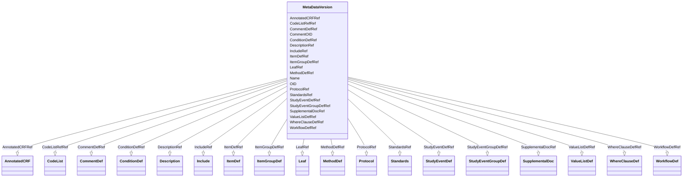

# Class: MetaDataVersion


_The metadata for a study is defined in a series of MetaDataVersion elements. Through this mechanism (multiple MetaDataVersion elements), the model supports the incremental deployment of "mid-stream study changes," and thus can handle a situation where multiple versions of the metadata are being used simultaneously (e.g., due to delays in IRB approval at various sites)._


URI: [odm:MetaDataVersion](http://www.cdisc.org/ns/odm/v2.0/MetaDataVersion)





<!-- no inheritance hierarchy -->


## Slots

| Name | Cardinality and Range | Description | Inheritance |
| ---  | --- | --- | --- |
| [OID](OID.md) | 1..1 <br/> [oid](oid.md) | Unique identifier. | direct |
| [Name](Name.md) | 1..1 <br/> [name](name.md) | MetaDataVersion name. | direct |
| [CommentOID](CommentOID.md) | 0..1 <br/> [oidref](oidref.md) | Reference to a CommentDef element. | direct |
| [DescriptionRef](DescriptionRef.md) | 0..1 <br/> [Description](Description.md) | Description reference: A free-text description of the containing metadata com... | direct |
| [IncludeRef](IncludeRef.md) | 0..1 <br/> [Include](Include.md) | Include reference: The Include metadata element allows a reference to a prior... | direct |
| [StandardsRef](StandardsRef.md) | 0..1 <br/> [Standards](Standards.md) | Standards reference: The Standards element provides a container for the list ... | direct |
| [AnnotatedCRFRef](AnnotatedCRFRef.md) | 0..1 <br/> [AnnotatedCRF](AnnotatedCRF.md) | AnnotatedCRF reference: An Annotated Case Report Form (CRF) is a Portable Fil... | direct |
| [SupplementalDocRef](SupplementalDocRef.md) | 0..1 <br/> [SupplementalDoc](SupplementalDoc.md) | SupplementalDoc reference: Supplemental data definitions | direct |
| [ValueListDefRef](ValueListDefRef.md) | 0..* <br/> [ValueListDef](ValueListDef.md) | ValueListDef reference: The following table specifies the XML structure for v... | direct |
| [WhereClauseDefRef](WhereClauseDefRef.md) | 0..* <br/> [WhereClauseDef](WhereClauseDef.md) | WhereClauseDef reference: The WhereClauseDef element specifies a condition. | direct |
| [ProtocolRef](ProtocolRef.md) | 0..1 <br/> [Protocol](Protocol.md) | Protocol reference: The Protocol element lists the kinds of study events that... | direct |
| [WorkflowDefRef](WorkflowDefRef.md) | 0..* <br/> [WorkflowDef](WorkflowDef.md) | WorkflowDef reference: A WorkflowDef defines an automated workflow for a stud... | direct |
| [StudyEventGroupDefRef](StudyEventGroupDefRef.md) | 0..* <br/> [StudyEventGroupDef](StudyEventGroupDef.md) | StudyEventGroupDef reference: StudyEventGroupDef is a study building block th... | direct |
| [StudyEventDefRef](StudyEventDefRef.md) | 0..* <br/> [StudyEventDef](StudyEventDef.md) | StudyEventDef reference: StudyEventDef represents the definition of an activi... | direct |
| [ItemGroupDefRef](ItemGroupDefRef.md) | 0..* <br/> [ItemGroupDef](ItemGroupDef.md) | ItemGroupDef reference: An ItemGroupDef describes a type of variable or field... | direct |
| [ItemDefRef](ItemDefRef.md) | 0..* <br/> [ItemDef](ItemDef.md) | ItemDef reference: An ItemDef describes a type of item that can occur within ... | direct |
| [CodeListRefRef](CodeListRefRef.md) | 0..* <br/> [CodeList](CodeList.md) | CodeListRef reference: A reference to a CodeList definition. | direct |
| [ConditionDefRef](ConditionDefRef.md) | 0..* <br/> [ConditionDef](ConditionDef.md) | ConditionDef reference: A ConditionDef defines a boolean condition. | direct |
| [MethodDefRef](MethodDefRef.md) | 0..* <br/> [MethodDef](MethodDef.md) | MethodDef reference: A MethodDef defines how a data value can be obtained fro... | direct |
| [CommentDefRef](CommentDefRef.md) | 0..* <br/> [CommentDef](CommentDef.md) | CommentDef reference: The Comment element allows referencing short comments s... | direct |
| [LeafRef](LeafRef.md) | 0..* <br/> [Leaf](Leaf.md) | Leaf reference: Contains the XLink information referenced by DocumentRef or A... | direct |


## Usages

| used by | used in | type | used |
| ---  | --- | --- | --- |
| [Study](Study.md) | [MetaDataVersionRefRef](MetaDataVersionRefRef.md) | range | [MetaDataVersion](MetaDataVersion.md) |


## See Also

* [https://wiki.cdisc.org/display/ODM2/MetaDataVersion](https://wiki.cdisc.org/display/ODM2/MetaDataVersion)

## Identifier and Mapping Information


### Schema Source


* from schema: http://www.cdisc.org/ns/odm/v2.0


## Mappings

| Mapping Type | Mapped Value |
| ---  | ---  |
| self | odm:MetaDataVersion |
| native | odm:MetaDataVersion |


## LinkML Source

<!-- TODO: investigate https://stackoverflow.com/questions/37606292/how-to-create-tabbed-code-blocks-in-mkdocs-or-sphinx -->

### Direct

<details>
```yaml
name: MetaDataVersion
description: The metadata for a study is defined in a series of MetaDataVersion elements.
  Through this mechanism (multiple MetaDataVersion elements), the model supports the
  incremental deployment of "mid-stream study changes," and thus can handle a situation
  where multiple versions of the metadata are being used simultaneously (e.g., due
  to delays in IRB approval at various sites).
from_schema: http://www.cdisc.org/ns/odm/v2.0
see_also:
- https://wiki.cdisc.org/display/ODM2/MetaDataVersion
slots:
- OID
- Name
- CommentOID
- DescriptionRef
- IncludeRef
- StandardsRef
- AnnotatedCRFRef
- SupplementalDocRef
- ValueListDefRef
- WhereClauseDefRef
- ProtocolRef
- WorkflowDefRef
- StudyEventGroupDefRef
- StudyEventDefRef
- ItemGroupDefRef
- ItemDefRef
- CodeListRefRef
- ConditionDefRef
- MethodDefRef
- CommentDefRef
- LeafRef
slot_usage:
  OID:
    name: OID
    description: Unique identifier.
    comments:
    - 'Required

      range: oid'
    domain_of:
    - Study
    - MetaDataVersion
    - Standard
    - ValueListDef
    - WhereClauseDef
    - StudyEventGroupDef
    - StudyEventDef
    - ItemGroupDef
    - ItemDef
    - CodeList
    - MethodDef
    - ConditionDef
    - CommentDef
    - StudyIndication
    - StudyIntervention
    - StudyObjective
    - StudyEndPoint
    - StudyTargetPopulation
    - StudyEstimand
    - Arm
    - Epoch
    - StudyParameter
    - StudyTiming
    - TransitionTimingConstraint
    - AbsoluteTimingConstraint
    - RelativeTimingConstraint
    - DurationTimingConstraint
    - WorkflowDef
    - Transition
    - Branching
    - Criterion
    - User
    - Organization
    - Location
    - SignatureDef
    - Query
    range: oid
    required: true
  Name:
    name: Name
    description: MetaDataVersion name.
    comments:
    - 'Required

      range: name'
    domain_of:
    - Alias
    - MetaDataVersion
    - Standard
    - StudyEventGroupDef
    - StudyEventDef
    - ItemGroupDef
    - Class
    - SubClass
    - SourceItem
    - Resource
    - ItemDef
    - CodeList
    - MethodDef
    - Parameter
    - ReturnValue
    - ConditionDef
    - StudyObjective
    - StudyEndPoint
    - StudyTargetPopulation
    - StudyEstimand
    - Arm
    - Epoch
    - StudyTiming
    - TransitionTimingConstraint
    - AbsoluteTimingConstraint
    - RelativeTimingConstraint
    - DurationTimingConstraint
    - WorkflowDef
    - Transition
    - Branching
    - Criterion
    - Organization
    - Location
    - Query
    range: name
    required: true
  CommentOID:
    name: CommentOID
    description: Reference to a CommentDef element.
    comments:
    - 'Optional

      range: oidref'
    domain_of:
    - MetaDataVersion
    - Standard
    - WhereClauseDef
    - StudyEventGroupDef
    - StudyEventDef
    - ItemGroupDef
    - ItemDef
    - CodeList
    - CodeListItem
    - MethodDef
    - ConditionDef
    - Coding
    range: oidref
  DescriptionRef:
    name: DescriptionRef
    domain_of:
    - Study
    - MetaDataVersion
    - ValueListDef
    - StudyEventGroupRef
    - StudyEventGroupDef
    - StudyEventDef
    - ItemGroupDef
    - Origin
    - ItemDef
    - CodeList
    - CodeListItem
    - MethodDef
    - ConditionDef
    - CommentDef
    - Protocol
    - StudyStructure
    - TrialPhase
    - StudyIndication
    - StudyIntervention
    - StudyObjective
    - StudyEndPoint
    - StudyTargetPopulation
    - StudyEstimand
    - IntercurrentEvent
    - SummaryMeasure
    - Arm
    - Epoch
    - TransitionTimingConstraint
    - AbsoluteTimingConstraint
    - RelativeTimingConstraint
    - DurationTimingConstraint
    - WorkflowDef
    - Criterion
    - Organization
    - Location
    - ODMFileMetadata
    range: Description
    maximum_cardinality: 1
  IncludeRef:
    name: IncludeRef
    domain_of:
    - MetaDataVersion
    range: Include
    maximum_cardinality: 1
  StandardsRef:
    name: StandardsRef
    domain_of:
    - MetaDataVersion
    range: Standards
    maximum_cardinality: 1
  AnnotatedCRFRef:
    name: AnnotatedCRFRef
    domain_of:
    - MetaDataVersion
    range: AnnotatedCRF
    maximum_cardinality: 1
  SupplementalDocRef:
    name: SupplementalDocRef
    domain_of:
    - MetaDataVersion
    range: SupplementalDoc
    maximum_cardinality: 1
  ValueListDefRef:
    name: ValueListDefRef
    multivalued: true
    domain_of:
    - MetaDataVersion
    range: ValueListDef
    inlined: true
    inlined_as_list: true
  WhereClauseDefRef:
    name: WhereClauseDefRef
    multivalued: true
    domain_of:
    - MetaDataVersion
    range: WhereClauseDef
    inlined: true
    inlined_as_list: true
  ProtocolRef:
    name: ProtocolRef
    domain_of:
    - MetaDataVersion
    range: Protocol
    maximum_cardinality: 1
  WorkflowDefRef:
    name: WorkflowDefRef
    multivalued: true
    domain_of:
    - MetaDataVersion
    range: WorkflowDef
    inlined: true
    inlined_as_list: true
  StudyEventGroupDefRef:
    name: StudyEventGroupDefRef
    multivalued: true
    domain_of:
    - MetaDataVersion
    range: StudyEventGroupDef
    inlined: true
    inlined_as_list: true
  StudyEventDefRef:
    name: StudyEventDefRef
    multivalued: true
    domain_of:
    - MetaDataVersion
    range: StudyEventDef
    inlined: true
    inlined_as_list: true
  ItemGroupDefRef:
    name: ItemGroupDefRef
    multivalued: true
    domain_of:
    - MetaDataVersion
    range: ItemGroupDef
    inlined: true
    inlined_as_list: true
  ItemDefRef:
    name: ItemDefRef
    multivalued: true
    domain_of:
    - MetaDataVersion
    range: ItemDef
    inlined: true
    inlined_as_list: true
  CodeListRefRef:
    name: CodeListRefRef
    multivalued: true
    domain_of:
    - MetaDataVersion
    - ItemDef
    range: CodeList
    inlined: true
    inlined_as_list: true
  ConditionDefRef:
    name: ConditionDefRef
    multivalued: true
    domain_of:
    - MetaDataVersion
    range: ConditionDef
    inlined: true
    inlined_as_list: true
  MethodDefRef:
    name: MethodDefRef
    multivalued: true
    domain_of:
    - MetaDataVersion
    range: MethodDef
    inlined: true
    inlined_as_list: true
  CommentDefRef:
    name: CommentDefRef
    multivalued: true
    domain_of:
    - MetaDataVersion
    range: CommentDef
    inlined: true
    inlined_as_list: true
  LeafRef:
    name: LeafRef
    multivalued: true
    domain_of:
    - MetaDataVersion
    - ItemGroupDef
    range: Leaf
    inlined: true
    inlined_as_list: true
class_uri: odm:MetaDataVersion

```
</details>

### Induced

<details>
```yaml
name: MetaDataVersion
description: The metadata for a study is defined in a series of MetaDataVersion elements.
  Through this mechanism (multiple MetaDataVersion elements), the model supports the
  incremental deployment of "mid-stream study changes," and thus can handle a situation
  where multiple versions of the metadata are being used simultaneously (e.g., due
  to delays in IRB approval at various sites).
from_schema: http://www.cdisc.org/ns/odm/v2.0
see_also:
- https://wiki.cdisc.org/display/ODM2/MetaDataVersion
slot_usage:
  OID:
    name: OID
    description: Unique identifier.
    comments:
    - 'Required

      range: oid'
    domain_of:
    - Study
    - MetaDataVersion
    - Standard
    - ValueListDef
    - WhereClauseDef
    - StudyEventGroupDef
    - StudyEventDef
    - ItemGroupDef
    - ItemDef
    - CodeList
    - MethodDef
    - ConditionDef
    - CommentDef
    - StudyIndication
    - StudyIntervention
    - StudyObjective
    - StudyEndPoint
    - StudyTargetPopulation
    - StudyEstimand
    - Arm
    - Epoch
    - StudyParameter
    - StudyTiming
    - TransitionTimingConstraint
    - AbsoluteTimingConstraint
    - RelativeTimingConstraint
    - DurationTimingConstraint
    - WorkflowDef
    - Transition
    - Branching
    - Criterion
    - User
    - Organization
    - Location
    - SignatureDef
    - Query
    range: oid
    required: true
  Name:
    name: Name
    description: MetaDataVersion name.
    comments:
    - 'Required

      range: name'
    domain_of:
    - Alias
    - MetaDataVersion
    - Standard
    - StudyEventGroupDef
    - StudyEventDef
    - ItemGroupDef
    - Class
    - SubClass
    - SourceItem
    - Resource
    - ItemDef
    - CodeList
    - MethodDef
    - Parameter
    - ReturnValue
    - ConditionDef
    - StudyObjective
    - StudyEndPoint
    - StudyTargetPopulation
    - StudyEstimand
    - Arm
    - Epoch
    - StudyTiming
    - TransitionTimingConstraint
    - AbsoluteTimingConstraint
    - RelativeTimingConstraint
    - DurationTimingConstraint
    - WorkflowDef
    - Transition
    - Branching
    - Criterion
    - Organization
    - Location
    - Query
    range: name
    required: true
  CommentOID:
    name: CommentOID
    description: Reference to a CommentDef element.
    comments:
    - 'Optional

      range: oidref'
    domain_of:
    - MetaDataVersion
    - Standard
    - WhereClauseDef
    - StudyEventGroupDef
    - StudyEventDef
    - ItemGroupDef
    - ItemDef
    - CodeList
    - CodeListItem
    - MethodDef
    - ConditionDef
    - Coding
    range: oidref
  DescriptionRef:
    name: DescriptionRef
    domain_of:
    - Study
    - MetaDataVersion
    - ValueListDef
    - StudyEventGroupRef
    - StudyEventGroupDef
    - StudyEventDef
    - ItemGroupDef
    - Origin
    - ItemDef
    - CodeList
    - CodeListItem
    - MethodDef
    - ConditionDef
    - CommentDef
    - Protocol
    - StudyStructure
    - TrialPhase
    - StudyIndication
    - StudyIntervention
    - StudyObjective
    - StudyEndPoint
    - StudyTargetPopulation
    - StudyEstimand
    - IntercurrentEvent
    - SummaryMeasure
    - Arm
    - Epoch
    - TransitionTimingConstraint
    - AbsoluteTimingConstraint
    - RelativeTimingConstraint
    - DurationTimingConstraint
    - WorkflowDef
    - Criterion
    - Organization
    - Location
    - ODMFileMetadata
    range: Description
    maximum_cardinality: 1
  IncludeRef:
    name: IncludeRef
    domain_of:
    - MetaDataVersion
    range: Include
    maximum_cardinality: 1
  StandardsRef:
    name: StandardsRef
    domain_of:
    - MetaDataVersion
    range: Standards
    maximum_cardinality: 1
  AnnotatedCRFRef:
    name: AnnotatedCRFRef
    domain_of:
    - MetaDataVersion
    range: AnnotatedCRF
    maximum_cardinality: 1
  SupplementalDocRef:
    name: SupplementalDocRef
    domain_of:
    - MetaDataVersion
    range: SupplementalDoc
    maximum_cardinality: 1
  ValueListDefRef:
    name: ValueListDefRef
    multivalued: true
    domain_of:
    - MetaDataVersion
    range: ValueListDef
    inlined: true
    inlined_as_list: true
  WhereClauseDefRef:
    name: WhereClauseDefRef
    multivalued: true
    domain_of:
    - MetaDataVersion
    range: WhereClauseDef
    inlined: true
    inlined_as_list: true
  ProtocolRef:
    name: ProtocolRef
    domain_of:
    - MetaDataVersion
    range: Protocol
    maximum_cardinality: 1
  WorkflowDefRef:
    name: WorkflowDefRef
    multivalued: true
    domain_of:
    - MetaDataVersion
    range: WorkflowDef
    inlined: true
    inlined_as_list: true
  StudyEventGroupDefRef:
    name: StudyEventGroupDefRef
    multivalued: true
    domain_of:
    - MetaDataVersion
    range: StudyEventGroupDef
    inlined: true
    inlined_as_list: true
  StudyEventDefRef:
    name: StudyEventDefRef
    multivalued: true
    domain_of:
    - MetaDataVersion
    range: StudyEventDef
    inlined: true
    inlined_as_list: true
  ItemGroupDefRef:
    name: ItemGroupDefRef
    multivalued: true
    domain_of:
    - MetaDataVersion
    range: ItemGroupDef
    inlined: true
    inlined_as_list: true
  ItemDefRef:
    name: ItemDefRef
    multivalued: true
    domain_of:
    - MetaDataVersion
    range: ItemDef
    inlined: true
    inlined_as_list: true
  CodeListRefRef:
    name: CodeListRefRef
    multivalued: true
    domain_of:
    - MetaDataVersion
    - ItemDef
    range: CodeList
    inlined: true
    inlined_as_list: true
  ConditionDefRef:
    name: ConditionDefRef
    multivalued: true
    domain_of:
    - MetaDataVersion
    range: ConditionDef
    inlined: true
    inlined_as_list: true
  MethodDefRef:
    name: MethodDefRef
    multivalued: true
    domain_of:
    - MetaDataVersion
    range: MethodDef
    inlined: true
    inlined_as_list: true
  CommentDefRef:
    name: CommentDefRef
    multivalued: true
    domain_of:
    - MetaDataVersion
    range: CommentDef
    inlined: true
    inlined_as_list: true
  LeafRef:
    name: LeafRef
    multivalued: true
    domain_of:
    - MetaDataVersion
    - ItemGroupDef
    range: Leaf
    inlined: true
    inlined_as_list: true
attributes:
  OID:
    name: OID
    description: Unique identifier.
    comments:
    - 'Required

      range: oid'
    from_schema: http://www.cdisc.org/ns/odm/v2.0
    rank: 1000
    identifier: true
    alias: OID
    owner: MetaDataVersion
    domain_of:
    - Study
    - MetaDataVersion
    - Standard
    - ValueListDef
    - WhereClauseDef
    - StudyEventGroupDef
    - StudyEventDef
    - ItemGroupDef
    - ItemDef
    - CodeList
    - MethodDef
    - ConditionDef
    - CommentDef
    - StudyIndication
    - StudyIntervention
    - StudyObjective
    - StudyEndPoint
    - StudyTargetPopulation
    - StudyEstimand
    - Arm
    - Epoch
    - StudyParameter
    - StudyTiming
    - TransitionTimingConstraint
    - AbsoluteTimingConstraint
    - RelativeTimingConstraint
    - DurationTimingConstraint
    - WorkflowDef
    - Transition
    - Branching
    - Criterion
    - User
    - Organization
    - Location
    - SignatureDef
    - Query
    range: oid
    required: true
  Name:
    name: Name
    description: MetaDataVersion name.
    comments:
    - 'Required

      range: name'
    from_schema: http://www.cdisc.org/ns/odm/v2.0
    rank: 1000
    alias: Name
    owner: MetaDataVersion
    domain_of:
    - Alias
    - MetaDataVersion
    - Standard
    - StudyEventGroupDef
    - StudyEventDef
    - ItemGroupDef
    - Class
    - SubClass
    - SourceItem
    - Resource
    - ItemDef
    - CodeList
    - MethodDef
    - Parameter
    - ReturnValue
    - ConditionDef
    - StudyObjective
    - StudyEndPoint
    - StudyTargetPopulation
    - StudyEstimand
    - Arm
    - Epoch
    - StudyTiming
    - TransitionTimingConstraint
    - AbsoluteTimingConstraint
    - RelativeTimingConstraint
    - DurationTimingConstraint
    - WorkflowDef
    - Transition
    - Branching
    - Criterion
    - Organization
    - Location
    - Query
    range: name
    required: true
  CommentOID:
    name: CommentOID
    description: Reference to a CommentDef element.
    comments:
    - 'Optional

      range: oidref'
    from_schema: http://www.cdisc.org/ns/odm/v2.0
    rank: 1000
    alias: CommentOID
    owner: MetaDataVersion
    domain_of:
    - MetaDataVersion
    - Standard
    - WhereClauseDef
    - StudyEventGroupDef
    - StudyEventDef
    - ItemGroupDef
    - ItemDef
    - CodeList
    - CodeListItem
    - MethodDef
    - ConditionDef
    - Coding
    range: oidref
  DescriptionRef:
    name: DescriptionRef
    description: 'Description reference: A free-text description of the containing
      metadata component, unless restricted by Business Rules.'
    from_schema: http://www.cdisc.org/ns/odm/v2.0
    rank: 1000
    identifier: false
    alias: DescriptionRef
    owner: MetaDataVersion
    domain_of:
    - Study
    - MetaDataVersion
    - ValueListDef
    - StudyEventGroupRef
    - StudyEventGroupDef
    - StudyEventDef
    - ItemGroupDef
    - Origin
    - ItemDef
    - CodeList
    - CodeListItem
    - MethodDef
    - ConditionDef
    - CommentDef
    - Protocol
    - StudyStructure
    - TrialPhase
    - StudyIndication
    - StudyIntervention
    - StudyObjective
    - StudyEndPoint
    - StudyTargetPopulation
    - StudyEstimand
    - IntercurrentEvent
    - SummaryMeasure
    - Arm
    - Epoch
    - TransitionTimingConstraint
    - AbsoluteTimingConstraint
    - RelativeTimingConstraint
    - DurationTimingConstraint
    - WorkflowDef
    - Criterion
    - Organization
    - Location
    - ODMFileMetadata
    range: Description
    maximum_cardinality: 1
  IncludeRef:
    name: IncludeRef
    description: 'Include reference: The Include metadata element allows a reference
      to a prior metadata version.'
    from_schema: http://www.cdisc.org/ns/odm/v2.0
    rank: 1000
    identifier: false
    alias: IncludeRef
    owner: MetaDataVersion
    domain_of:
    - MetaDataVersion
    range: Include
    maximum_cardinality: 1
  StandardsRef:
    name: StandardsRef
    description: 'Standards reference: The Standards element provides a container
      for the list of Standard elements referenced in the MetaDataVersion for the
      Study..'
    from_schema: http://www.cdisc.org/ns/odm/v2.0
    rank: 1000
    identifier: false
    alias: StandardsRef
    owner: MetaDataVersion
    domain_of:
    - MetaDataVersion
    range: Standards
    maximum_cardinality: 1
  AnnotatedCRFRef:
    name: AnnotatedCRFRef
    description: 'AnnotatedCRF reference: An Annotated Case Report Form (CRF) is a
      Portable File Format (PDF) document that provides the mapping of data collection
      fields to the variables or discrete variable values contained within the datasets.'
    from_schema: http://www.cdisc.org/ns/odm/v2.0
    rank: 1000
    identifier: false
    alias: AnnotatedCRFRef
    owner: MetaDataVersion
    domain_of:
    - MetaDataVersion
    range: AnnotatedCRF
    maximum_cardinality: 1
  SupplementalDocRef:
    name: SupplementalDocRef
    description: 'SupplementalDoc reference: Supplemental data definitions'
    from_schema: http://www.cdisc.org/ns/odm/v2.0
    rank: 1000
    identifier: false
    alias: SupplementalDocRef
    owner: MetaDataVersion
    domain_of:
    - MetaDataVersion
    range: SupplementalDoc
    maximum_cardinality: 1
  ValueListDefRef:
    name: ValueListDefRef
    description: 'ValueListDef reference: The following table specifies the XML structure
      for valuelist metadata. The ValueListDef element contains ItemRef elements that
      reference ItemDef elements that provide the value-level metadata details'
    from_schema: http://www.cdisc.org/ns/odm/v2.0
    rank: 1000
    multivalued: true
    identifier: false
    alias: ValueListDefRef
    owner: MetaDataVersion
    domain_of:
    - MetaDataVersion
    range: ValueListDef
    inlined: true
    inlined_as_list: true
  WhereClauseDefRef:
    name: WhereClauseDefRef
    description: 'WhereClauseDef reference: The WhereClauseDef element specifies a
      condition.'
    from_schema: http://www.cdisc.org/ns/odm/v2.0
    rank: 1000
    multivalued: true
    identifier: false
    alias: WhereClauseDefRef
    owner: MetaDataVersion
    domain_of:
    - MetaDataVersion
    range: WhereClauseDef
    inlined: true
    inlined_as_list: true
  ProtocolRef:
    name: ProtocolRef
    description: 'Protocol reference: The Protocol element lists the kinds of study
      events that can occur within a specific version of a study. All clinical data
      must occur within one of these study events.'
    from_schema: http://www.cdisc.org/ns/odm/v2.0
    rank: 1000
    identifier: false
    alias: ProtocolRef
    owner: MetaDataVersion
    domain_of:
    - MetaDataVersion
    range: Protocol
    maximum_cardinality: 1
  WorkflowDefRef:
    name: WorkflowDefRef
    description: 'WorkflowDef reference: A WorkflowDef defines an automated workflow
      for a study.'
    from_schema: http://www.cdisc.org/ns/odm/v2.0
    rank: 1000
    multivalued: true
    identifier: false
    alias: WorkflowDefRef
    owner: MetaDataVersion
    domain_of:
    - MetaDataVersion
    range: WorkflowDef
    inlined: true
    inlined_as_list: true
  StudyEventGroupDefRef:
    name: StudyEventGroupDefRef
    description: 'StudyEventGroupDef reference: StudyEventGroupDef is a study building
      block that groups a number of smaller building blocks, which can themselves
      be StudyEventGroups or StudyEvents. It thus allows nesting of building blocks.'
    from_schema: http://www.cdisc.org/ns/odm/v2.0
    rank: 1000
    multivalued: true
    identifier: false
    alias: StudyEventGroupDefRef
    owner: MetaDataVersion
    domain_of:
    - MetaDataVersion
    range: StudyEventGroupDef
    inlined: true
    inlined_as_list: true
  StudyEventDefRef:
    name: StudyEventDefRef
    description: 'StudyEventDef reference: StudyEventDef represents the definition
      of an activity in a study where data is collected. For example, a study event
      may represent a set of item groups that represent data collection instruments
      to be completed for a subject during a visit in a study. The visit occurs as
      part of a study workflow, and the workflow is referenced in the study event.'
    from_schema: http://www.cdisc.org/ns/odm/v2.0
    rank: 1000
    multivalued: true
    identifier: false
    alias: StudyEventDefRef
    owner: MetaDataVersion
    domain_of:
    - MetaDataVersion
    range: StudyEventDef
    inlined: true
    inlined_as_list: true
  ItemGroupDefRef:
    name: ItemGroupDefRef
    description: 'ItemGroupDef reference: An ItemGroupDef describes a type of variable
      or field grouping that can occur within a study.'
    from_schema: http://www.cdisc.org/ns/odm/v2.0
    rank: 1000
    multivalued: true
    identifier: false
    alias: ItemGroupDefRef
    owner: MetaDataVersion
    domain_of:
    - MetaDataVersion
    range: ItemGroupDef
    inlined: true
    inlined_as_list: true
  ItemDefRef:
    name: ItemDefRef
    description: 'ItemDef reference: An ItemDef describes a type of item that can
      occur within a study. Item properties include name, datatype, range, or codelist
      restrictions, and several other properties.'
    from_schema: http://www.cdisc.org/ns/odm/v2.0
    rank: 1000
    multivalued: true
    identifier: false
    alias: ItemDefRef
    owner: MetaDataVersion
    domain_of:
    - MetaDataVersion
    range: ItemDef
    inlined: true
    inlined_as_list: true
  CodeListRefRef:
    name: CodeListRefRef
    description: 'CodeListRef reference: A reference to a CodeList definition.'
    from_schema: http://www.cdisc.org/ns/odm/v2.0
    rank: 1000
    multivalued: true
    identifier: false
    alias: CodeListRefRef
    owner: MetaDataVersion
    domain_of:
    - MetaDataVersion
    - ItemDef
    range: CodeList
    inlined: true
    inlined_as_list: true
  ConditionDefRef:
    name: ConditionDefRef
    description: 'ConditionDef reference: A ConditionDef defines a boolean condition.'
    from_schema: http://www.cdisc.org/ns/odm/v2.0
    rank: 1000
    multivalued: true
    identifier: false
    alias: ConditionDefRef
    owner: MetaDataVersion
    domain_of:
    - MetaDataVersion
    range: ConditionDef
    inlined: true
    inlined_as_list: true
  MethodDefRef:
    name: MethodDefRef
    description: 'MethodDef reference: A MethodDef defines how a data value can be
      obtained from a collection of other data values.'
    from_schema: http://www.cdisc.org/ns/odm/v2.0
    rank: 1000
    multivalued: true
    identifier: false
    alias: MethodDefRef
    owner: MetaDataVersion
    domain_of:
    - MetaDataVersion
    range: MethodDef
    inlined: true
    inlined_as_list: true
  CommentDefRef:
    name: CommentDefRef
    description: 'CommentDef reference: The Comment element allows referencing short
      comments self-contained in the XML document or long comments normally included
      in external documents. For comments included in external documents, the reference
      could include specific pages of a document where the comments are included.'
    from_schema: http://www.cdisc.org/ns/odm/v2.0
    rank: 1000
    multivalued: true
    identifier: false
    alias: CommentDefRef
    owner: MetaDataVersion
    domain_of:
    - MetaDataVersion
    range: CommentDef
    inlined: true
    inlined_as_list: true
  LeafRef:
    name: LeafRef
    description: 'Leaf reference: Contains the XLink information referenced by DocumentRef
      or ArchiveLocationID'
    from_schema: http://www.cdisc.org/ns/odm/v2.0
    rank: 1000
    multivalued: true
    identifier: false
    alias: LeafRef
    owner: MetaDataVersion
    domain_of:
    - MetaDataVersion
    - ItemGroupDef
    range: Leaf
    inlined: true
    inlined_as_list: true
class_uri: odm:MetaDataVersion

```
</details>