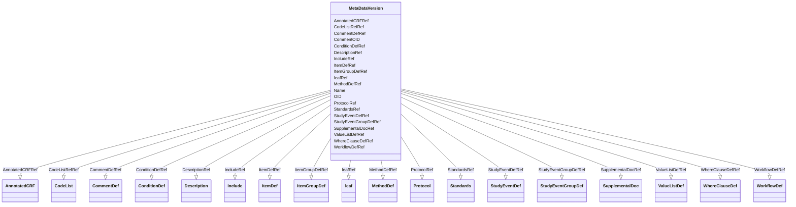

# Class: MetaDataVersion


URI: [odm:MetaDataVersion](http://www.cdisc.org/ns/odm/v2.0/MetaDataVersion)





<!-- no inheritance hierarchy -->


## Slots

| Name | Cardinality and Range | Description | Inheritance |
| ---  | --- | --- | --- |
| [OID](OID.md) | 1..1 <br/> [Oid](Oid.md) | Unique identifier of the version within the XML document | direct |
| [Name](Name.md) | 1..1 <br/> [Name](Name.md) | General observation Sub Class | direct |
| [CommentOID](CommentOID.md) | 0..1 <br/> [Oidref](Oidref.md) | The Comment identifier that this value refers to | direct |
| [DescriptionRef](DescriptionRef.md) | 0..1 <br/> [Description](Description.md) |  | direct |
| [IncludeRef](IncludeRef.md) | 0..1 <br/> [Include](Include.md) |  | direct |
| [StandardsRef](StandardsRef.md) | 0..1 <br/> [Standards](Standards.md) |  | direct |
| [AnnotatedCRFRef](AnnotatedCRFRef.md) | 0..1 <br/> [AnnotatedCRF](AnnotatedCRF.md) |  | direct |
| [SupplementalDocRef](SupplementalDocRef.md) | 0..1 <br/> [SupplementalDoc](SupplementalDoc.md) |  | direct |
| [ValueListDefRef](ValueListDefRef.md) | 0..* <br/> [ValueListDef](ValueListDef.md) |  | direct |
| [WhereClauseDefRef](WhereClauseDefRef.md) | 0..* <br/> [WhereClauseDef](WhereClauseDef.md) |  | direct |
| [ProtocolRef](ProtocolRef.md) | 0..1 <br/> [Protocol](Protocol.md) |  | direct |
| [WorkflowDefRef](WorkflowDefRef.md) | 0..* <br/> [WorkflowDef](WorkflowDef.md) |  | direct |
| [StudyEventGroupDefRef](StudyEventGroupDefRef.md) | 0..* <br/> [StudyEventGroupDef](StudyEventGroupDef.md) |  | direct |
| [StudyEventDefRef](StudyEventDefRef.md) | 0..* <br/> [StudyEventDef](StudyEventDef.md) |  | direct |
| [ItemGroupDefRef](ItemGroupDefRef.md) | 0..* <br/> [ItemGroupDef](ItemGroupDef.md) |  | direct |
| [ItemDefRef](ItemDefRef.md) | 0..* <br/> [ItemDef](ItemDef.md) |  | direct |
| [CodeListRefRef](CodeListRefRef.md) | 0..* <br/> [CodeList](CodeList.md) |  | direct |
| [ConditionDefRef](ConditionDefRef.md) | 0..* <br/> [ConditionDef](ConditionDef.md) |  | direct |
| [MethodDefRef](MethodDefRef.md) | 0..* <br/> [MethodDef](MethodDef.md) |  | direct |
| [CommentDefRef](CommentDefRef.md) | 0..* <br/> [CommentDef](CommentDef.md) |  | direct |
| [leafRef](leafRef.md) | 0..* <br/> [Leaf](Leaf.md) |  | direct |


## Usages

| used by | used in | type | used |
| ---  | --- | --- | --- |
| [Study](Study.md) | [MetaDataVersionRefRef](MetaDataVersionRefRef.md) | range | [MetaDataVersion](MetaDataVersion.md) |


## See Also

* [https://wiki.cdisc.org/display/ODM2/MetaDataVersion](https://wiki.cdisc.org/display/ODM2/MetaDataVersion)

## Identifier and Mapping Information


### Schema Source


* from schema: http://www.cdisc.org/ns/odm/v2.0


## Mappings

| Mapping Type | Mapped Value |
| ---  | ---  |
| self | odm:MetaDataVersion |
| native | odm:MetaDataVersion |


## LinkML Source

<!-- TODO: investigate https://stackoverflow.com/questions/37606292/how-to-create-tabbed-code-blocks-in-mkdocs-or-sphinx -->

### Direct

<details>
```yaml
name: MetaDataVersion
from_schema: http://www.cdisc.org/ns/odm/v2.0
see_also:
- https://wiki.cdisc.org/display/ODM2/MetaDataVersion
slots:
- OID
- Name
- CommentOID
- DescriptionRef
- IncludeRef
- StandardsRef
- AnnotatedCRFRef
- SupplementalDocRef
- ValueListDefRef
- WhereClauseDefRef
- ProtocolRef
- WorkflowDefRef
- StudyEventGroupDefRef
- StudyEventDefRef
- ItemGroupDefRef
- ItemDefRef
- CodeListRefRef
- ConditionDefRef
- MethodDefRef
- CommentDefRef
- leafRef
slot_usage:
  OID:
    name: OID
    domain_of:
    - Study
    - MetaDataVersion
    - Standard
    - ValueListDef
    - WhereClauseDef
    - StudyEventGroupDef
    - StudyEventDef
    - ItemGroupDef
    - ItemDef
    - CodeList
    - MethodDef
    - ConditionDef
    - CommentDef
    - StudyIndication
    - StudyIntervention
    - StudyObjective
    - StudyEndPoint
    - StudyTargetPopulation
    - StudyEstimand
    - Arm
    - Epoch
    - StudyParameter
    - StudyTiming
    - TransitionTimingConstraint
    - AbsoluteTimingConstraint
    - RelativeTimingConstraint
    - DurationTimingConstraint
    - WorkflowDef
    - Transition
    - Branching
    - Criterion
    - ExceptionEvent
    - User
    - Organization
    - Location
    - SignatureDef
    - Query
    range: oid
    required: true
  Name:
    name: Name
    domain_of:
    - Alias
    - MetaDataVersion
    - Standard
    - StudyEventGroupDef
    - StudyEventDef
    - ItemGroupDef
    - Class
    - SubClass
    - SourceItem
    - Resource
    - ItemDef
    - CodeList
    - MethodDef
    - Parameter
    - ReturnValue
    - ConditionDef
    - StudyObjective
    - StudyEndPoint
    - StudyTargetPopulation
    - StudyEstimand
    - Arm
    - Epoch
    - StudyTiming
    - TransitionTimingConstraint
    - AbsoluteTimingConstraint
    - RelativeTimingConstraint
    - DurationTimingConstraint
    - WorkflowDef
    - Transition
    - Branching
    - Criterion
    - ExceptionEvent
    - Organization
    - Location
    - Query
    range: name
    required: true
  CommentOID:
    name: CommentOID
    domain_of:
    - MetaDataVersion
    - Standard
    - WhereClauseDef
    - StudyEventGroupDef
    - StudyEventDef
    - ItemGroupDef
    - ItemDef
    - CodeList
    - CodeListItem
    - MethodDef
    - ConditionDef
    - Coding
    range: oidref
  DescriptionRef:
    name: DescriptionRef
    domain_of:
    - Study
    - MetaDataVersion
    - ValueListDef
    - StudyEventGroupRef
    - StudyEventGroupDef
    - StudyEventDef
    - ItemGroupDef
    - Origin
    - ItemDef
    - CodeList
    - CodeListItem
    - MethodDef
    - ConditionDef
    - CommentDef
    - Protocol
    - StudyStructure
    - TrialPhase
    - StudyIndication
    - StudyIntervention
    - StudyObjective
    - StudyEndPoint
    - StudyTargetPopulation
    - StudyEstimand
    - IntercurrentEvent
    - SummaryMeasure
    - Arm
    - Epoch
    - TransitionTimingConstraint
    - AbsoluteTimingConstraint
    - RelativeTimingConstraint
    - DurationTimingConstraint
    - WorkflowDef
    - Criterion
    - ExceptionEvent
    - Organization
    - Location
    - ODMFileMetadata
    range: Description
    maximum_cardinality: 1
  IncludeRef:
    name: IncludeRef
    domain_of:
    - MetaDataVersion
    range: Include
    maximum_cardinality: 1
  StandardsRef:
    name: StandardsRef
    domain_of:
    - MetaDataVersion
    range: Standards
    maximum_cardinality: 1
  AnnotatedCRFRef:
    name: AnnotatedCRFRef
    domain_of:
    - MetaDataVersion
    range: AnnotatedCRF
    maximum_cardinality: 1
  SupplementalDocRef:
    name: SupplementalDocRef
    domain_of:
    - MetaDataVersion
    range: SupplementalDoc
    maximum_cardinality: 1
  ValueListDefRef:
    name: ValueListDefRef
    multivalued: true
    domain_of:
    - MetaDataVersion
    range: ValueListDef
    inlined: true
    inlined_as_list: true
  WhereClauseDefRef:
    name: WhereClauseDefRef
    multivalued: true
    domain_of:
    - MetaDataVersion
    range: WhereClauseDef
    inlined: true
    inlined_as_list: true
  ProtocolRef:
    name: ProtocolRef
    domain_of:
    - MetaDataVersion
    range: Protocol
    maximum_cardinality: 1
  WorkflowDefRef:
    name: WorkflowDefRef
    multivalued: true
    domain_of:
    - MetaDataVersion
    range: WorkflowDef
    inlined: true
    inlined_as_list: true
  StudyEventGroupDefRef:
    name: StudyEventGroupDefRef
    multivalued: true
    domain_of:
    - MetaDataVersion
    range: StudyEventGroupDef
    inlined: true
    inlined_as_list: true
  StudyEventDefRef:
    name: StudyEventDefRef
    multivalued: true
    domain_of:
    - MetaDataVersion
    range: StudyEventDef
    inlined: true
    inlined_as_list: true
  ItemGroupDefRef:
    name: ItemGroupDefRef
    multivalued: true
    domain_of:
    - MetaDataVersion
    range: ItemGroupDef
    inlined: true
    inlined_as_list: true
  ItemDefRef:
    name: ItemDefRef
    multivalued: true
    domain_of:
    - MetaDataVersion
    range: ItemDef
    inlined: true
    inlined_as_list: true
  CodeListRefRef:
    name: CodeListRefRef
    multivalued: true
    domain_of:
    - MetaDataVersion
    - ItemDef
    range: CodeList
    inlined: true
    inlined_as_list: true
  ConditionDefRef:
    name: ConditionDefRef
    multivalued: true
    domain_of:
    - MetaDataVersion
    range: ConditionDef
    inlined: true
    inlined_as_list: true
  MethodDefRef:
    name: MethodDefRef
    multivalued: true
    domain_of:
    - MetaDataVersion
    range: MethodDef
    inlined: true
    inlined_as_list: true
  CommentDefRef:
    name: CommentDefRef
    multivalued: true
    domain_of:
    - MetaDataVersion
    range: CommentDef
    inlined: true
    inlined_as_list: true
  leafRef:
    name: leafRef
    multivalued: true
    domain_of:
    - MetaDataVersion
    - ItemGroupDef
    range: leaf
    inlined: true
    inlined_as_list: true
class_uri: odm:MetaDataVersion

```
</details>

### Induced

<details>
```yaml
name: MetaDataVersion
from_schema: http://www.cdisc.org/ns/odm/v2.0
see_also:
- https://wiki.cdisc.org/display/ODM2/MetaDataVersion
slot_usage:
  OID:
    name: OID
    domain_of:
    - Study
    - MetaDataVersion
    - Standard
    - ValueListDef
    - WhereClauseDef
    - StudyEventGroupDef
    - StudyEventDef
    - ItemGroupDef
    - ItemDef
    - CodeList
    - MethodDef
    - ConditionDef
    - CommentDef
    - StudyIndication
    - StudyIntervention
    - StudyObjective
    - StudyEndPoint
    - StudyTargetPopulation
    - StudyEstimand
    - Arm
    - Epoch
    - StudyParameter
    - StudyTiming
    - TransitionTimingConstraint
    - AbsoluteTimingConstraint
    - RelativeTimingConstraint
    - DurationTimingConstraint
    - WorkflowDef
    - Transition
    - Branching
    - Criterion
    - ExceptionEvent
    - User
    - Organization
    - Location
    - SignatureDef
    - Query
    range: oid
    required: true
  Name:
    name: Name
    domain_of:
    - Alias
    - MetaDataVersion
    - Standard
    - StudyEventGroupDef
    - StudyEventDef
    - ItemGroupDef
    - Class
    - SubClass
    - SourceItem
    - Resource
    - ItemDef
    - CodeList
    - MethodDef
    - Parameter
    - ReturnValue
    - ConditionDef
    - StudyObjective
    - StudyEndPoint
    - StudyTargetPopulation
    - StudyEstimand
    - Arm
    - Epoch
    - StudyTiming
    - TransitionTimingConstraint
    - AbsoluteTimingConstraint
    - RelativeTimingConstraint
    - DurationTimingConstraint
    - WorkflowDef
    - Transition
    - Branching
    - Criterion
    - ExceptionEvent
    - Organization
    - Location
    - Query
    range: name
    required: true
  CommentOID:
    name: CommentOID
    domain_of:
    - MetaDataVersion
    - Standard
    - WhereClauseDef
    - StudyEventGroupDef
    - StudyEventDef
    - ItemGroupDef
    - ItemDef
    - CodeList
    - CodeListItem
    - MethodDef
    - ConditionDef
    - Coding
    range: oidref
  DescriptionRef:
    name: DescriptionRef
    domain_of:
    - Study
    - MetaDataVersion
    - ValueListDef
    - StudyEventGroupRef
    - StudyEventGroupDef
    - StudyEventDef
    - ItemGroupDef
    - Origin
    - ItemDef
    - CodeList
    - CodeListItem
    - MethodDef
    - ConditionDef
    - CommentDef
    - Protocol
    - StudyStructure
    - TrialPhase
    - StudyIndication
    - StudyIntervention
    - StudyObjective
    - StudyEndPoint
    - StudyTargetPopulation
    - StudyEstimand
    - IntercurrentEvent
    - SummaryMeasure
    - Arm
    - Epoch
    - TransitionTimingConstraint
    - AbsoluteTimingConstraint
    - RelativeTimingConstraint
    - DurationTimingConstraint
    - WorkflowDef
    - Criterion
    - ExceptionEvent
    - Organization
    - Location
    - ODMFileMetadata
    range: Description
    maximum_cardinality: 1
  IncludeRef:
    name: IncludeRef
    domain_of:
    - MetaDataVersion
    range: Include
    maximum_cardinality: 1
  StandardsRef:
    name: StandardsRef
    domain_of:
    - MetaDataVersion
    range: Standards
    maximum_cardinality: 1
  AnnotatedCRFRef:
    name: AnnotatedCRFRef
    domain_of:
    - MetaDataVersion
    range: AnnotatedCRF
    maximum_cardinality: 1
  SupplementalDocRef:
    name: SupplementalDocRef
    domain_of:
    - MetaDataVersion
    range: SupplementalDoc
    maximum_cardinality: 1
  ValueListDefRef:
    name: ValueListDefRef
    multivalued: true
    domain_of:
    - MetaDataVersion
    range: ValueListDef
    inlined: true
    inlined_as_list: true
  WhereClauseDefRef:
    name: WhereClauseDefRef
    multivalued: true
    domain_of:
    - MetaDataVersion
    range: WhereClauseDef
    inlined: true
    inlined_as_list: true
  ProtocolRef:
    name: ProtocolRef
    domain_of:
    - MetaDataVersion
    range: Protocol
    maximum_cardinality: 1
  WorkflowDefRef:
    name: WorkflowDefRef
    multivalued: true
    domain_of:
    - MetaDataVersion
    range: WorkflowDef
    inlined: true
    inlined_as_list: true
  StudyEventGroupDefRef:
    name: StudyEventGroupDefRef
    multivalued: true
    domain_of:
    - MetaDataVersion
    range: StudyEventGroupDef
    inlined: true
    inlined_as_list: true
  StudyEventDefRef:
    name: StudyEventDefRef
    multivalued: true
    domain_of:
    - MetaDataVersion
    range: StudyEventDef
    inlined: true
    inlined_as_list: true
  ItemGroupDefRef:
    name: ItemGroupDefRef
    multivalued: true
    domain_of:
    - MetaDataVersion
    range: ItemGroupDef
    inlined: true
    inlined_as_list: true
  ItemDefRef:
    name: ItemDefRef
    multivalued: true
    domain_of:
    - MetaDataVersion
    range: ItemDef
    inlined: true
    inlined_as_list: true
  CodeListRefRef:
    name: CodeListRefRef
    multivalued: true
    domain_of:
    - MetaDataVersion
    - ItemDef
    range: CodeList
    inlined: true
    inlined_as_list: true
  ConditionDefRef:
    name: ConditionDefRef
    multivalued: true
    domain_of:
    - MetaDataVersion
    range: ConditionDef
    inlined: true
    inlined_as_list: true
  MethodDefRef:
    name: MethodDefRef
    multivalued: true
    domain_of:
    - MetaDataVersion
    range: MethodDef
    inlined: true
    inlined_as_list: true
  CommentDefRef:
    name: CommentDefRef
    multivalued: true
    domain_of:
    - MetaDataVersion
    range: CommentDef
    inlined: true
    inlined_as_list: true
  leafRef:
    name: leafRef
    multivalued: true
    domain_of:
    - MetaDataVersion
    - ItemGroupDef
    range: leaf
    inlined: true
    inlined_as_list: true
attributes:
  OID:
    name: OID
    description: Unique identifier of the version within the XML document.
    from_schema: http://www.cdisc.org/ns/odm/v2.0
    rank: 1000
    identifier: true
    alias: OID
    owner: MetaDataVersion
    domain_of:
    - Study
    - MetaDataVersion
    - Standard
    - ValueListDef
    - WhereClauseDef
    - StudyEventGroupDef
    - StudyEventDef
    - ItemGroupDef
    - ItemDef
    - CodeList
    - MethodDef
    - ConditionDef
    - CommentDef
    - StudyIndication
    - StudyIntervention
    - StudyObjective
    - StudyEndPoint
    - StudyTargetPopulation
    - StudyEstimand
    - Arm
    - Epoch
    - StudyParameter
    - StudyTiming
    - TransitionTimingConstraint
    - AbsoluteTimingConstraint
    - RelativeTimingConstraint
    - DurationTimingConstraint
    - WorkflowDef
    - Transition
    - Branching
    - Criterion
    - ExceptionEvent
    - User
    - Organization
    - Location
    - SignatureDef
    - Query
    range: oid
    required: true
  Name:
    name: Name
    description: General observation Sub Class.
    from_schema: http://www.cdisc.org/ns/odm/v2.0
    rank: 1000
    alias: Name
    owner: MetaDataVersion
    domain_of:
    - Alias
    - MetaDataVersion
    - Standard
    - StudyEventGroupDef
    - StudyEventDef
    - ItemGroupDef
    - Class
    - SubClass
    - SourceItem
    - Resource
    - ItemDef
    - CodeList
    - MethodDef
    - Parameter
    - ReturnValue
    - ConditionDef
    - StudyObjective
    - StudyEndPoint
    - StudyTargetPopulation
    - StudyEstimand
    - Arm
    - Epoch
    - StudyTiming
    - TransitionTimingConstraint
    - AbsoluteTimingConstraint
    - RelativeTimingConstraint
    - DurationTimingConstraint
    - WorkflowDef
    - Transition
    - Branching
    - Criterion
    - ExceptionEvent
    - Organization
    - Location
    - Query
    range: name
    required: true
  CommentOID:
    name: CommentOID
    description: "The Comment identifier that this value refers to. Needed when the\
      \ WhereClause references Items across different domains.\n                The\
      \ Comment would define any join assumptions."
    from_schema: http://www.cdisc.org/ns/odm/v2.0
    rank: 1000
    alias: CommentOID
    owner: MetaDataVersion
    domain_of:
    - MetaDataVersion
    - Standard
    - WhereClauseDef
    - StudyEventGroupDef
    - StudyEventDef
    - ItemGroupDef
    - ItemDef
    - CodeList
    - CodeListItem
    - MethodDef
    - ConditionDef
    - Coding
    range: oidref
  DescriptionRef:
    name: DescriptionRef
    from_schema: http://www.cdisc.org/ns/odm/v2.0
    rank: 1000
    alias: DescriptionRef
    owner: MetaDataVersion
    domain_of:
    - Study
    - MetaDataVersion
    - ValueListDef
    - StudyEventGroupRef
    - StudyEventGroupDef
    - StudyEventDef
    - ItemGroupDef
    - Origin
    - ItemDef
    - CodeList
    - CodeListItem
    - MethodDef
    - ConditionDef
    - CommentDef
    - Protocol
    - StudyStructure
    - TrialPhase
    - StudyIndication
    - StudyIntervention
    - StudyObjective
    - StudyEndPoint
    - StudyTargetPopulation
    - StudyEstimand
    - IntercurrentEvent
    - SummaryMeasure
    - Arm
    - Epoch
    - TransitionTimingConstraint
    - AbsoluteTimingConstraint
    - RelativeTimingConstraint
    - DurationTimingConstraint
    - WorkflowDef
    - Criterion
    - ExceptionEvent
    - Organization
    - Location
    - ODMFileMetadata
    range: Description
    maximum_cardinality: 1
  IncludeRef:
    name: IncludeRef
    from_schema: http://www.cdisc.org/ns/odm/v2.0
    rank: 1000
    alias: IncludeRef
    owner: MetaDataVersion
    domain_of:
    - MetaDataVersion
    range: Include
    maximum_cardinality: 1
  StandardsRef:
    name: StandardsRef
    from_schema: http://www.cdisc.org/ns/odm/v2.0
    rank: 1000
    alias: StandardsRef
    owner: MetaDataVersion
    domain_of:
    - MetaDataVersion
    range: Standards
    maximum_cardinality: 1
  AnnotatedCRFRef:
    name: AnnotatedCRFRef
    from_schema: http://www.cdisc.org/ns/odm/v2.0
    rank: 1000
    alias: AnnotatedCRFRef
    owner: MetaDataVersion
    domain_of:
    - MetaDataVersion
    range: AnnotatedCRF
    maximum_cardinality: 1
  SupplementalDocRef:
    name: SupplementalDocRef
    from_schema: http://www.cdisc.org/ns/odm/v2.0
    rank: 1000
    alias: SupplementalDocRef
    owner: MetaDataVersion
    domain_of:
    - MetaDataVersion
    range: SupplementalDoc
    maximum_cardinality: 1
  ValueListDefRef:
    name: ValueListDefRef
    from_schema: http://www.cdisc.org/ns/odm/v2.0
    rank: 1000
    multivalued: true
    alias: ValueListDefRef
    owner: MetaDataVersion
    domain_of:
    - MetaDataVersion
    range: ValueListDef
    inlined: true
    inlined_as_list: true
  WhereClauseDefRef:
    name: WhereClauseDefRef
    from_schema: http://www.cdisc.org/ns/odm/v2.0
    rank: 1000
    multivalued: true
    alias: WhereClauseDefRef
    owner: MetaDataVersion
    domain_of:
    - MetaDataVersion
    range: WhereClauseDef
    inlined: true
    inlined_as_list: true
  ProtocolRef:
    name: ProtocolRef
    from_schema: http://www.cdisc.org/ns/odm/v2.0
    rank: 1000
    alias: ProtocolRef
    owner: MetaDataVersion
    domain_of:
    - MetaDataVersion
    range: Protocol
    maximum_cardinality: 1
  WorkflowDefRef:
    name: WorkflowDefRef
    from_schema: http://www.cdisc.org/ns/odm/v2.0
    rank: 1000
    multivalued: true
    alias: WorkflowDefRef
    owner: MetaDataVersion
    domain_of:
    - MetaDataVersion
    range: WorkflowDef
    inlined: true
    inlined_as_list: true
  StudyEventGroupDefRef:
    name: StudyEventGroupDefRef
    from_schema: http://www.cdisc.org/ns/odm/v2.0
    rank: 1000
    multivalued: true
    alias: StudyEventGroupDefRef
    owner: MetaDataVersion
    domain_of:
    - MetaDataVersion
    range: StudyEventGroupDef
    inlined: true
    inlined_as_list: true
  StudyEventDefRef:
    name: StudyEventDefRef
    from_schema: http://www.cdisc.org/ns/odm/v2.0
    rank: 1000
    multivalued: true
    alias: StudyEventDefRef
    owner: MetaDataVersion
    domain_of:
    - MetaDataVersion
    range: StudyEventDef
    inlined: true
    inlined_as_list: true
  ItemGroupDefRef:
    name: ItemGroupDefRef
    from_schema: http://www.cdisc.org/ns/odm/v2.0
    rank: 1000
    multivalued: true
    alias: ItemGroupDefRef
    owner: MetaDataVersion
    domain_of:
    - MetaDataVersion
    range: ItemGroupDef
    inlined: true
    inlined_as_list: true
  ItemDefRef:
    name: ItemDefRef
    from_schema: http://www.cdisc.org/ns/odm/v2.0
    rank: 1000
    multivalued: true
    alias: ItemDefRef
    owner: MetaDataVersion
    domain_of:
    - MetaDataVersion
    range: ItemDef
    inlined: true
    inlined_as_list: true
  CodeListRefRef:
    name: CodeListRefRef
    from_schema: http://www.cdisc.org/ns/odm/v2.0
    rank: 1000
    multivalued: true
    alias: CodeListRefRef
    owner: MetaDataVersion
    domain_of:
    - MetaDataVersion
    - ItemDef
    range: CodeList
    inlined: true
    inlined_as_list: true
  ConditionDefRef:
    name: ConditionDefRef
    from_schema: http://www.cdisc.org/ns/odm/v2.0
    rank: 1000
    multivalued: true
    alias: ConditionDefRef
    owner: MetaDataVersion
    domain_of:
    - MetaDataVersion
    range: ConditionDef
    inlined: true
    inlined_as_list: true
  MethodDefRef:
    name: MethodDefRef
    from_schema: http://www.cdisc.org/ns/odm/v2.0
    rank: 1000
    multivalued: true
    alias: MethodDefRef
    owner: MetaDataVersion
    domain_of:
    - MetaDataVersion
    range: MethodDef
    inlined: true
    inlined_as_list: true
  CommentDefRef:
    name: CommentDefRef
    from_schema: http://www.cdisc.org/ns/odm/v2.0
    rank: 1000
    multivalued: true
    alias: CommentDefRef
    owner: MetaDataVersion
    domain_of:
    - MetaDataVersion
    range: CommentDef
    inlined: true
    inlined_as_list: true
  leafRef:
    name: leafRef
    from_schema: http://www.cdisc.org/ns/odm/v2.0
    rank: 1000
    multivalued: true
    alias: leafRef
    owner: MetaDataVersion
    domain_of:
    - MetaDataVersion
    - ItemGroupDef
    range: leaf
    inlined: true
    inlined_as_list: true
class_uri: odm:MetaDataVersion

```
</details>