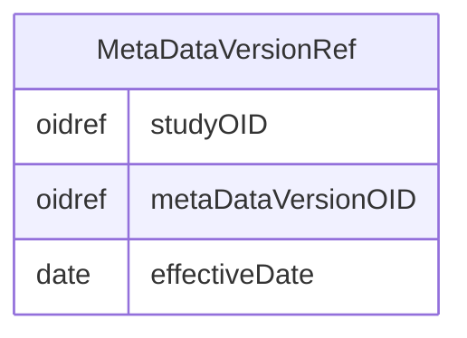

# Class: MetaDataVersionRef

_A reference to a MetaDataVersion used at the containing Location. The EffectiveDate reflects the possibility that the metadata may change over the course of the study._


URI: [odm:MetaDataVersionRef](http://www.cdisc.org/ns/odm/v2.0/MetaDataVersionRef)





<!-- no inheritance hierarchy -->


## Slots

| Name | Cardinality* and Range | Description | Inheritance |
| ---  | --- | --- | --- |
| [studyOID](studyOID.md) | 1..1 <br/> [oidref](oidref.md) | References the Study that uses this metadata version. | direct |
| [metaDataVersionOID](metaDataVersionOID.md) | 1..1 <br/> [oidref](oidref.md) | References the MetaDataVersion (within the above Study). | direct |
| [effectiveDate](effectiveDate.md) | 1..1 <br/> [date](date.md) | Datetime stamp when this MetaDataVersion was published at this location. | direct |

_* See [LinkML documentation](https://linkml.io/linkml/schemas/slots.html#slot-cardinality) for cardinality definitions._


## Usages

| used by | used in | type | used |
| ---  | --- | --- | --- |
| [Location](Location.md) | [metaDataVersionRef](metaDataVersionRef.md) | range | [MetaDataVersionRef](MetaDataVersionRef.md) |


## See Also

* [https://wiki.cdisc.org/display/PUB/MetaDataVersionRef](https://wiki.cdisc.org/display/PUB/MetaDataVersionRef)

## Identifier and Mapping Information


### Schema Source


* from schema: http://www.cdisc.org/ns/odm/v2.0


## Mappings

| Mapping Type | Mapped Value |
| ---  | ---  |
| self | odm:MetaDataVersionRef |
| native | odm:MetaDataVersionRef |


## LinkML Source

<!-- TODO: investigate https://stackoverflow.com/questions/37606292/how-to-create-tabbed-code-blocks-in-mkdocs-or-sphinx -->

### Direct

<details>
```yaml
name: MetaDataVersionRef
description: A reference to a MetaDataVersion used at the containing Location. The
  EffectiveDate reflects the possibility that the metadata may change over the course
  of the study.
from_schema: http://www.cdisc.org/ns/odm/v2.0
see_also:
- https://wiki.cdisc.org/display/PUB/MetaDataVersionRef
rank: 1000
slots:
- studyOID
- metaDataVersionOID
- effectiveDate
slot_usage:
  studyOID:
    name: studyOID
    description: References the Study that uses this metadata version.
    comments:
    - 'Required

      range: oidref'
    domain_of:
    - Include
    - SourceItem
    - AdminData
    - MetaDataVersionRef
    - ReferenceData
    - ClinicalData
    - Association
    - KeySet
    range: oidref
    required: true
  metaDataVersionOID:
    name: metaDataVersionOID
    description: References the MetaDataVersion (within the above Study).
    comments:
    - 'Required

      range: oidref'
    domain_of:
    - Include
    - SourceItem
    - MetaDataVersionRef
    - ReferenceData
    - ClinicalData
    - Association
    - KeySet
    range: oidref
    required: true
  effectiveDate:
    name: effectiveDate
    description: Datetime stamp when this MetaDataVersion was published at this location.
    comments:
    - 'Required

      range: date

      All data entered following the EffectiveDate must be included in a ClinicalData
      element that references this MetaDataVersionOID.'
    domain_of:
    - MetaDataVersionRef
    range: date
    required: true
class_uri: odm:MetaDataVersionRef

```
</details>

### Induced

<details>
```yaml
name: MetaDataVersionRef
description: A reference to a MetaDataVersion used at the containing Location. The
  EffectiveDate reflects the possibility that the metadata may change over the course
  of the study.
from_schema: http://www.cdisc.org/ns/odm/v2.0
see_also:
- https://wiki.cdisc.org/display/PUB/MetaDataVersionRef
rank: 1000
slot_usage:
  studyOID:
    name: studyOID
    description: References the Study that uses this metadata version.
    comments:
    - 'Required

      range: oidref'
    domain_of:
    - Include
    - SourceItem
    - AdminData
    - MetaDataVersionRef
    - ReferenceData
    - ClinicalData
    - Association
    - KeySet
    range: oidref
    required: true
  metaDataVersionOID:
    name: metaDataVersionOID
    description: References the MetaDataVersion (within the above Study).
    comments:
    - 'Required

      range: oidref'
    domain_of:
    - Include
    - SourceItem
    - MetaDataVersionRef
    - ReferenceData
    - ClinicalData
    - Association
    - KeySet
    range: oidref
    required: true
  effectiveDate:
    name: effectiveDate
    description: Datetime stamp when this MetaDataVersion was published at this location.
    comments:
    - 'Required

      range: date

      All data entered following the EffectiveDate must be included in a ClinicalData
      element that references this MetaDataVersionOID.'
    domain_of:
    - MetaDataVersionRef
    range: date
    required: true
attributes:
  studyOID:
    name: studyOID
    description: References the Study that uses this metadata version.
    comments:
    - 'Required

      range: oidref'
    from_schema: http://www.cdisc.org/ns/odm/v2.0
    rank: 1000
    alias: studyOID
    owner: MetaDataVersionRef
    domain_of:
    - Include
    - SourceItem
    - AdminData
    - MetaDataVersionRef
    - ReferenceData
    - ClinicalData
    - Association
    - KeySet
    range: oidref
    required: true
  metaDataVersionOID:
    name: metaDataVersionOID
    description: References the MetaDataVersion (within the above Study).
    comments:
    - 'Required

      range: oidref'
    from_schema: http://www.cdisc.org/ns/odm/v2.0
    rank: 1000
    alias: metaDataVersionOID
    owner: MetaDataVersionRef
    domain_of:
    - Include
    - SourceItem
    - MetaDataVersionRef
    - ReferenceData
    - ClinicalData
    - Association
    - KeySet
    range: oidref
    required: true
  effectiveDate:
    name: effectiveDate
    description: Datetime stamp when this MetaDataVersion was published at this location.
    comments:
    - 'Required

      range: date

      All data entered following the EffectiveDate must be included in a ClinicalData
      element that references this MetaDataVersionOID.'
    from_schema: http://www.cdisc.org/ns/odm/v2.0
    rank: 1000
    alias: effectiveDate
    owner: MetaDataVersionRef
    domain_of:
    - MetaDataVersionRef
    range: date
    required: true
class_uri: odm:MetaDataVersionRef

```
</details>