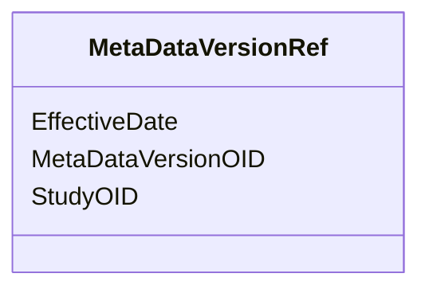

# Class: MetaDataVersionRef


URI: [odm:MetaDataVersionRef](http://www.cdisc.org/ns/odm/v2.0/MetaDataVersionRef)





<!-- no inheritance hierarchy -->


## Slots

| Name | Cardinality and Range | Description | Inheritance |
| ---  | --- | --- | --- |
| [StudyOID](StudyOID.md) | 1..1 <br/> [Oidref](Oidref.md) |  | direct |
| [MetaDataVersionOID](MetaDataVersionOID.md) | 1..1 <br/> [Oidref](Oidref.md) |  | direct |
| [EffectiveDate](EffectiveDate.md) | 1..1 <br/> [Date](Date.md) |  | direct |


## Usages

| used by | used in | type | used |
| ---  | --- | --- | --- |
| [Location](Location.md) | [MetaDataVersionRefRef](MetaDataVersionRefRef.md) | range | [MetaDataVersionRef](MetaDataVersionRef.md) |


## See Also

* [https://wiki.cdisc.org/display/ODM2/MetaDataVersionRef](https://wiki.cdisc.org/display/ODM2/MetaDataVersionRef)

## Identifier and Mapping Information


### Schema Source


* from schema: http://www.cdisc.org/ns/odm/v2.0


## Mappings

| Mapping Type | Mapped Value |
| ---  | ---  |
| self | odm:MetaDataVersionRef |
| native | odm:MetaDataVersionRef |


## LinkML Source

<!-- TODO: investigate https://stackoverflow.com/questions/37606292/how-to-create-tabbed-code-blocks-in-mkdocs-or-sphinx -->

### Direct

<details>
```yaml
name: MetaDataVersionRef
from_schema: http://www.cdisc.org/ns/odm/v2.0
see_also:
- https://wiki.cdisc.org/display/ODM2/MetaDataVersionRef
slots:
- StudyOID
- MetaDataVersionOID
- EffectiveDate
slot_usage:
  StudyOID:
    name: StudyOID
    domain_of:
    - Include
    - SourceItem
    - AdminData
    - MetaDataVersionRef
    - ReferenceData
    - ClinicalData
    - Association
    - KeySet
    range: oidref
    required: true
  MetaDataVersionOID:
    name: MetaDataVersionOID
    domain_of:
    - Include
    - SourceItem
    - MetaDataVersionRef
    - ReferenceData
    - ClinicalData
    - Association
    - KeySet
    range: oidref
    required: true
  EffectiveDate:
    name: EffectiveDate
    domain_of:
    - MetaDataVersionRef
    range: date
    required: true
class_uri: odm:MetaDataVersionRef

```
</details>

### Induced

<details>
```yaml
name: MetaDataVersionRef
from_schema: http://www.cdisc.org/ns/odm/v2.0
see_also:
- https://wiki.cdisc.org/display/ODM2/MetaDataVersionRef
slot_usage:
  StudyOID:
    name: StudyOID
    domain_of:
    - Include
    - SourceItem
    - AdminData
    - MetaDataVersionRef
    - ReferenceData
    - ClinicalData
    - Association
    - KeySet
    range: oidref
    required: true
  MetaDataVersionOID:
    name: MetaDataVersionOID
    domain_of:
    - Include
    - SourceItem
    - MetaDataVersionRef
    - ReferenceData
    - ClinicalData
    - Association
    - KeySet
    range: oidref
    required: true
  EffectiveDate:
    name: EffectiveDate
    domain_of:
    - MetaDataVersionRef
    range: date
    required: true
attributes:
  StudyOID:
    name: StudyOID
    from_schema: http://www.cdisc.org/ns/odm/v2.0
    rank: 1000
    alias: StudyOID
    owner: MetaDataVersionRef
    domain_of:
    - Include
    - SourceItem
    - AdminData
    - MetaDataVersionRef
    - ReferenceData
    - ClinicalData
    - Association
    - KeySet
    range: oidref
    required: true
  MetaDataVersionOID:
    name: MetaDataVersionOID
    from_schema: http://www.cdisc.org/ns/odm/v2.0
    rank: 1000
    alias: MetaDataVersionOID
    owner: MetaDataVersionRef
    domain_of:
    - Include
    - SourceItem
    - MetaDataVersionRef
    - ReferenceData
    - ClinicalData
    - Association
    - KeySet
    range: oidref
    required: true
  EffectiveDate:
    name: EffectiveDate
    from_schema: http://www.cdisc.org/ns/odm/v2.0
    rank: 1000
    alias: EffectiveDate
    owner: MetaDataVersionRef
    domain_of:
    - MetaDataVersionRef
    range: date
    required: true
class_uri: odm:MetaDataVersionRef

```
</details>