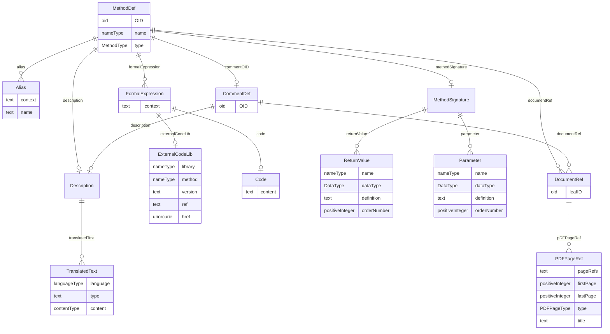

# Class: MethodDef

_A MethodDef defines how a data value can be obtained from a collection of other data values._


URI: [odm:MethodDef](http://www.cdisc.org/ns/odm/v2.0/MethodDef)





<!-- no inheritance hierarchy -->


## Slots

| Name | Cardinality* and Range | Description | Inheritance |
| ---  | --- | --- | --- |
| [OID](OID.md) | 1..1 <br/> [oid](oid.md) | Unique identifer for the MethodDef element. | direct |
| [name](name.md) | 1..1 <br/> [nameType](nameType.md) | Human readable name for the method. | direct |
| [type](type.md) | 0..1 <br/> [MethodType](MethodType.md) | Computation: derivation involving one or more variables. Imputation: derivati... | direct |
| [commentOID](commentOID.md) | 0..1 <br/> [CommentDef](CommentDef.md) | Reference to a CommentDef with information related to this MethodDef. | direct |
| [description](description.md) | 0..1 <br/> [Description](Description.md) | Description reference: A free-text description of the containing metadata com... | direct |
| [methodSignature](methodSignature.md) | 0..1 <br/> [MethodSignature](MethodSignature.md) | MethodSignature reference: A MethodSignature defines the parameters and retur... | direct |
| [formalExpression](formalExpression.md) | 0..* <br/> [FormalExpression](FormalExpression.md) | FormalExpression reference: A FormalExpression used within a ConditionDef or ... | direct |
| [alias](alias.md) | 0..* <br/> [Alias](Alias.md) | Alias reference: An Alias provides an additional name for an element. The Con... | direct |
| [documentRef](documentRef.md) | 0..* <br/> [DocumentRef](DocumentRef.md) | The DocumentRef element is a container for page references in a PDF file. | direct |

_* See [LinkML documentation](https://linkml.io/linkml/schemas/slots.html#slot-cardinality) for cardinality definitions._


## Usages

| used by | used in | type | used |
| ---  | --- | --- | --- |
| [MetaDataVersion](MetaDataVersion.md) | [methodDef](methodDef.md) | range | [MethodDef](MethodDef.md) |
| [ItemGroupRef](ItemGroupRef.md) | [methodOID](methodOID.md) | range | [MethodDef](MethodDef.md) |
| [ItemRef](ItemRef.md) | [methodOID](methodOID.md) | range | [MethodDef](MethodDef.md) |
| [TransitionTimingConstraint](TransitionTimingConstraint.md) | [methodOID](methodOID.md) | range | [MethodDef](MethodDef.md) |


## See Also

* [https://wiki.cdisc.org/display/PUB/MethodDef](https://wiki.cdisc.org/display/PUB/MethodDef)

## Identifier and Mapping Information


### Schema Source


* from schema: http://www.cdisc.org/ns/odm/v2.0


## Mappings

| Mapping Type | Mapped Value |
| ---  | ---  |
| self | odm:MethodDef |
| native | odm:MethodDef |


## LinkML Source

<!-- TODO: investigate https://stackoverflow.com/questions/37606292/how-to-create-tabbed-code-blocks-in-mkdocs-or-sphinx -->

### Direct

<details>
```yaml
name: MethodDef
description: A MethodDef defines how a data value can be obtained from a collection
  of other data values.
from_schema: http://www.cdisc.org/ns/odm/v2.0
see_also:
- https://wiki.cdisc.org/display/PUB/MethodDef
rank: 1000
slots:
- OID
- name
- type
- commentOID
- description
- methodSignature
- formalExpression
- alias
- documentRef
slot_usage:
  OID:
    name: OID
    description: Unique identifer for the MethodDef element.
    comments:
    - 'Required

      range: oid'
    identifier: true
    domain_of:
    - Study
    - MetaDataVersion
    - Standard
    - ValueListDef
    - WhereClauseDef
    - StudyEventGroupDef
    - StudyEventDef
    - ItemGroupDef
    - ItemDef
    - CodeList
    - MethodDef
    - ConditionDef
    - CommentDef
    - StudyIndication
    - StudyIntervention
    - StudyObjective
    - StudyEndPoint
    - StudyTargetPopulation
    - StudyEstimand
    - Arm
    - Epoch
    - StudyParameter
    - StudyTiming
    - TransitionTimingConstraint
    - AbsoluteTimingConstraint
    - RelativeTimingConstraint
    - DurationTimingConstraint
    - WorkflowDef
    - Transition
    - Branching
    - Criterion
    - User
    - Organization
    - Location
    - SignatureDef
    - Query
    range: oid
    required: true
  name:
    name: name
    description: Human readable name for the method.
    comments:
    - 'Required

      range: name'
    domain_of:
    - Alias
    - MetaDataVersion
    - Standard
    - StudyEventGroupDef
    - StudyEventDef
    - ItemGroupDef
    - Class
    - SubClass
    - SourceItem
    - Resource
    - ItemDef
    - CodeList
    - MethodDef
    - Parameter
    - ReturnValue
    - ConditionDef
    - StudyObjective
    - StudyEndPoint
    - StudyTargetPopulation
    - StudyEstimand
    - Arm
    - Epoch
    - StudyTiming
    - TransitionTimingConstraint
    - AbsoluteTimingConstraint
    - RelativeTimingConstraint
    - DurationTimingConstraint
    - WorkflowDef
    - Transition
    - Branching
    - Criterion
    - Organization
    - Location
    - Query
    range: nameType
    required: true
  type:
    name: type
    description: 'Computation: derivation involving one or more variables. Imputation:
      derivation based on other observations. Transpose: conversion of rows to columns
      or vice versa. Preload: retrieve and populate data from an external source.'
    comments:
    - 'Optional

      enum values: (Computation | Imputation | Transpose | Preload)'
    domain_of:
    - TranslatedText
    - PDFPageRef
    - Standard
    - StudyEventDef
    - ItemGroupDef
    - Origin
    - Resource
    - MethodDef
    - StudyEndPoint
    - TransitionTimingConstraint
    - RelativeTimingConstraint
    - Branching
    - Organization
    - Query
    range: MethodType
  commentOID:
    name: commentOID
    description: Reference to a CommentDef with information related to this MethodDef.
    comments:
    - 'Optional

      range: oidref'
    domain_of:
    - MetaDataVersion
    - Standard
    - WhereClauseDef
    - StudyEventGroupDef
    - StudyEventDef
    - ItemGroupDef
    - ItemDef
    - CodeList
    - CodeListItem
    - MethodDef
    - ConditionDef
    - Coding
    range: CommentDef
  description:
    name: description
    domain_of:
    - Study
    - MetaDataVersion
    - ValueListDef
    - StudyEventGroupRef
    - StudyEventGroupDef
    - StudyEventDef
    - ItemGroupDef
    - Origin
    - ItemDef
    - CodeList
    - CodeListItem
    - MethodDef
    - ConditionDef
    - CommentDef
    - Protocol
    - StudyStructure
    - TrialPhase
    - StudyIndication
    - StudyIntervention
    - StudyObjective
    - StudyEndPoint
    - StudyTargetPopulation
    - StudyEstimand
    - IntercurrentEvent
    - SummaryMeasure
    - Arm
    - Epoch
    - TransitionTimingConstraint
    - AbsoluteTimingConstraint
    - RelativeTimingConstraint
    - DurationTimingConstraint
    - WorkflowDef
    - Criterion
    - Organization
    - Location
    - ODMFileMetadata
    range: Description
    maximum_cardinality: 1
  methodSignature:
    name: methodSignature
    domain_of:
    - RangeCheck
    - MethodDef
    - ConditionDef
    range: MethodSignature
    maximum_cardinality: 1
  formalExpression:
    name: formalExpression
    multivalued: true
    domain_of:
    - RangeCheck
    - MethodDef
    - ConditionDef
    - StudyEndPoint
    - StudyTargetPopulation
    range: FormalExpression
    inlined: true
    inlined_as_list: true
  alias:
    name: alias
    multivalued: true
    domain_of:
    - StudyEventDef
    - ItemGroupDef
    - ItemDef
    - CodeList
    - CodeListItem
    - MethodDef
    - ConditionDef
    - Protocol
    range: Alias
    inlined: true
    inlined_as_list: true
  documentRef:
    name: documentRef
    multivalued: true
    domain_of:
    - AnnotatedCRF
    - SupplementalDoc
    - Origin
    - MethodDef
    - CommentDef
    range: DocumentRef
    inlined: true
    inlined_as_list: true
class_uri: odm:MethodDef

```
</details>

### Induced

<details>
```yaml
name: MethodDef
description: A MethodDef defines how a data value can be obtained from a collection
  of other data values.
from_schema: http://www.cdisc.org/ns/odm/v2.0
see_also:
- https://wiki.cdisc.org/display/PUB/MethodDef
rank: 1000
slot_usage:
  OID:
    name: OID
    description: Unique identifer for the MethodDef element.
    comments:
    - 'Required

      range: oid'
    identifier: true
    domain_of:
    - Study
    - MetaDataVersion
    - Standard
    - ValueListDef
    - WhereClauseDef
    - StudyEventGroupDef
    - StudyEventDef
    - ItemGroupDef
    - ItemDef
    - CodeList
    - MethodDef
    - ConditionDef
    - CommentDef
    - StudyIndication
    - StudyIntervention
    - StudyObjective
    - StudyEndPoint
    - StudyTargetPopulation
    - StudyEstimand
    - Arm
    - Epoch
    - StudyParameter
    - StudyTiming
    - TransitionTimingConstraint
    - AbsoluteTimingConstraint
    - RelativeTimingConstraint
    - DurationTimingConstraint
    - WorkflowDef
    - Transition
    - Branching
    - Criterion
    - User
    - Organization
    - Location
    - SignatureDef
    - Query
    range: oid
    required: true
  name:
    name: name
    description: Human readable name for the method.
    comments:
    - 'Required

      range: name'
    domain_of:
    - Alias
    - MetaDataVersion
    - Standard
    - StudyEventGroupDef
    - StudyEventDef
    - ItemGroupDef
    - Class
    - SubClass
    - SourceItem
    - Resource
    - ItemDef
    - CodeList
    - MethodDef
    - Parameter
    - ReturnValue
    - ConditionDef
    - StudyObjective
    - StudyEndPoint
    - StudyTargetPopulation
    - StudyEstimand
    - Arm
    - Epoch
    - StudyTiming
    - TransitionTimingConstraint
    - AbsoluteTimingConstraint
    - RelativeTimingConstraint
    - DurationTimingConstraint
    - WorkflowDef
    - Transition
    - Branching
    - Criterion
    - Organization
    - Location
    - Query
    range: nameType
    required: true
  type:
    name: type
    description: 'Computation: derivation involving one or more variables. Imputation:
      derivation based on other observations. Transpose: conversion of rows to columns
      or vice versa. Preload: retrieve and populate data from an external source.'
    comments:
    - 'Optional

      enum values: (Computation | Imputation | Transpose | Preload)'
    domain_of:
    - TranslatedText
    - PDFPageRef
    - Standard
    - StudyEventDef
    - ItemGroupDef
    - Origin
    - Resource
    - MethodDef
    - StudyEndPoint
    - TransitionTimingConstraint
    - RelativeTimingConstraint
    - Branching
    - Organization
    - Query
    range: MethodType
  commentOID:
    name: commentOID
    description: Reference to a CommentDef with information related to this MethodDef.
    comments:
    - 'Optional

      range: oidref'
    domain_of:
    - MetaDataVersion
    - Standard
    - WhereClauseDef
    - StudyEventGroupDef
    - StudyEventDef
    - ItemGroupDef
    - ItemDef
    - CodeList
    - CodeListItem
    - MethodDef
    - ConditionDef
    - Coding
    range: CommentDef
  description:
    name: description
    domain_of:
    - Study
    - MetaDataVersion
    - ValueListDef
    - StudyEventGroupRef
    - StudyEventGroupDef
    - StudyEventDef
    - ItemGroupDef
    - Origin
    - ItemDef
    - CodeList
    - CodeListItem
    - MethodDef
    - ConditionDef
    - CommentDef
    - Protocol
    - StudyStructure
    - TrialPhase
    - StudyIndication
    - StudyIntervention
    - StudyObjective
    - StudyEndPoint
    - StudyTargetPopulation
    - StudyEstimand
    - IntercurrentEvent
    - SummaryMeasure
    - Arm
    - Epoch
    - TransitionTimingConstraint
    - AbsoluteTimingConstraint
    - RelativeTimingConstraint
    - DurationTimingConstraint
    - WorkflowDef
    - Criterion
    - Organization
    - Location
    - ODMFileMetadata
    range: Description
    maximum_cardinality: 1
  methodSignature:
    name: methodSignature
    domain_of:
    - RangeCheck
    - MethodDef
    - ConditionDef
    range: MethodSignature
    maximum_cardinality: 1
  formalExpression:
    name: formalExpression
    multivalued: true
    domain_of:
    - RangeCheck
    - MethodDef
    - ConditionDef
    - StudyEndPoint
    - StudyTargetPopulation
    range: FormalExpression
    inlined: true
    inlined_as_list: true
  alias:
    name: alias
    multivalued: true
    domain_of:
    - StudyEventDef
    - ItemGroupDef
    - ItemDef
    - CodeList
    - CodeListItem
    - MethodDef
    - ConditionDef
    - Protocol
    range: Alias
    inlined: true
    inlined_as_list: true
  documentRef:
    name: documentRef
    multivalued: true
    domain_of:
    - AnnotatedCRF
    - SupplementalDoc
    - Origin
    - MethodDef
    - CommentDef
    range: DocumentRef
    inlined: true
    inlined_as_list: true
attributes:
  OID:
    name: OID
    description: Unique identifer for the MethodDef element.
    comments:
    - 'Required

      range: oid'
    from_schema: http://www.cdisc.org/ns/odm/v2.0
    rank: 1000
    identifier: true
    alias: OID
    owner: MethodDef
    domain_of:
    - Study
    - MetaDataVersion
    - Standard
    - ValueListDef
    - WhereClauseDef
    - StudyEventGroupDef
    - StudyEventDef
    - ItemGroupDef
    - ItemDef
    - CodeList
    - MethodDef
    - ConditionDef
    - CommentDef
    - StudyIndication
    - StudyIntervention
    - StudyObjective
    - StudyEndPoint
    - StudyTargetPopulation
    - StudyEstimand
    - Arm
    - Epoch
    - StudyParameter
    - StudyTiming
    - TransitionTimingConstraint
    - AbsoluteTimingConstraint
    - RelativeTimingConstraint
    - DurationTimingConstraint
    - WorkflowDef
    - Transition
    - Branching
    - Criterion
    - User
    - Organization
    - Location
    - SignatureDef
    - Query
    range: oid
    required: true
  name:
    name: name
    description: Human readable name for the method.
    comments:
    - 'Required

      range: name'
    from_schema: http://www.cdisc.org/ns/odm/v2.0
    rank: 1000
    alias: name
    owner: MethodDef
    domain_of:
    - Alias
    - MetaDataVersion
    - Standard
    - StudyEventGroupDef
    - StudyEventDef
    - ItemGroupDef
    - Class
    - SubClass
    - SourceItem
    - Resource
    - ItemDef
    - CodeList
    - MethodDef
    - Parameter
    - ReturnValue
    - ConditionDef
    - StudyObjective
    - StudyEndPoint
    - StudyTargetPopulation
    - StudyEstimand
    - Arm
    - Epoch
    - StudyTiming
    - TransitionTimingConstraint
    - AbsoluteTimingConstraint
    - RelativeTimingConstraint
    - DurationTimingConstraint
    - WorkflowDef
    - Transition
    - Branching
    - Criterion
    - Organization
    - Location
    - Query
    range: nameType
    required: true
  type:
    name: type
    description: 'Computation: derivation involving one or more variables. Imputation:
      derivation based on other observations. Transpose: conversion of rows to columns
      or vice versa. Preload: retrieve and populate data from an external source.'
    comments:
    - 'Optional

      enum values: (Computation | Imputation | Transpose | Preload)'
    from_schema: http://www.cdisc.org/ns/odm/v2.0
    rank: 1000
    alias: type
    owner: MethodDef
    domain_of:
    - TranslatedText
    - PDFPageRef
    - Standard
    - StudyEventDef
    - ItemGroupDef
    - Origin
    - Resource
    - MethodDef
    - StudyEndPoint
    - TransitionTimingConstraint
    - RelativeTimingConstraint
    - Branching
    - Organization
    - Query
    range: MethodType
  commentOID:
    name: commentOID
    description: Reference to a CommentDef with information related to this MethodDef.
    comments:
    - 'Optional

      range: oidref'
    from_schema: http://www.cdisc.org/ns/odm/v2.0
    rank: 1000
    alias: commentOID
    owner: MethodDef
    domain_of:
    - MetaDataVersion
    - Standard
    - WhereClauseDef
    - StudyEventGroupDef
    - StudyEventDef
    - ItemGroupDef
    - ItemDef
    - CodeList
    - CodeListItem
    - MethodDef
    - ConditionDef
    - Coding
    range: CommentDef
  description:
    name: description
    description: 'Description reference: A free-text description of the containing
      metadata component, unless restricted by Business Rules.'
    from_schema: http://www.cdisc.org/ns/odm/v2.0
    rank: 1000
    alias: description
    owner: MethodDef
    domain_of:
    - Study
    - MetaDataVersion
    - ValueListDef
    - StudyEventGroupRef
    - StudyEventGroupDef
    - StudyEventDef
    - ItemGroupDef
    - Origin
    - ItemDef
    - CodeList
    - CodeListItem
    - MethodDef
    - ConditionDef
    - CommentDef
    - Protocol
    - StudyStructure
    - TrialPhase
    - StudyIndication
    - StudyIntervention
    - StudyObjective
    - StudyEndPoint
    - StudyTargetPopulation
    - StudyEstimand
    - IntercurrentEvent
    - SummaryMeasure
    - Arm
    - Epoch
    - TransitionTimingConstraint
    - AbsoluteTimingConstraint
    - RelativeTimingConstraint
    - DurationTimingConstraint
    - WorkflowDef
    - Criterion
    - Organization
    - Location
    - ODMFileMetadata
    range: Description
    maximum_cardinality: 1
  methodSignature:
    name: methodSignature
    description: 'MethodSignature reference: A MethodSignature defines the parameters
      and return values for a method. The MethodSignature improves traceability while
      enhancing the ability for automation engines to execute a MethodDef''s FormalExpression.
      Most Methods use one or more input parameters and return one or more values.'
    from_schema: http://www.cdisc.org/ns/odm/v2.0
    rank: 1000
    alias: methodSignature
    owner: MethodDef
    domain_of:
    - RangeCheck
    - MethodDef
    - ConditionDef
    range: MethodSignature
    maximum_cardinality: 1
  formalExpression:
    name: formalExpression
    description: 'FormalExpression reference: A FormalExpression used within a ConditionDef
      or a RangeCheck must evaluate to True or False. A FormalExpression referenced
      within a MethodDef having Type Imputation, Computation, or Transpose must evaluate
      to the correct DataType for an Item that may be imputed or computed using the
      Method. A FormalExpression gets parameter and return value definitions from
      the MethodSignature element. The data types in the MethodSignature parameters
      and return values must match the corresponding data types in the FormalExpression.'
    from_schema: http://www.cdisc.org/ns/odm/v2.0
    rank: 1000
    multivalued: true
    alias: formalExpression
    owner: MethodDef
    domain_of:
    - RangeCheck
    - MethodDef
    - ConditionDef
    - StudyEndPoint
    - StudyTargetPopulation
    range: FormalExpression
    inlined: true
    inlined_as_list: true
  alias:
    name: alias
    description: 'Alias reference: An Alias provides an additional name for an element.
      The Context attribute specifies the application domain in which this additional
      name is relevant.'
    from_schema: http://www.cdisc.org/ns/odm/v2.0
    rank: 1000
    multivalued: true
    alias: alias
    owner: MethodDef
    domain_of:
    - StudyEventDef
    - ItemGroupDef
    - ItemDef
    - CodeList
    - CodeListItem
    - MethodDef
    - ConditionDef
    - Protocol
    range: Alias
    inlined: true
    inlined_as_list: true
  documentRef:
    name: documentRef
    description: The DocumentRef element is a container for page references in a PDF
      file.
    from_schema: http://www.cdisc.org/ns/odm/v2.0
    rank: 1000
    multivalued: true
    alias: documentRef
    owner: MethodDef
    domain_of:
    - AnnotatedCRF
    - SupplementalDoc
    - Origin
    - MethodDef
    - CommentDef
    range: DocumentRef
    inlined: true
    inlined_as_list: true
class_uri: odm:MethodDef

```
</details>