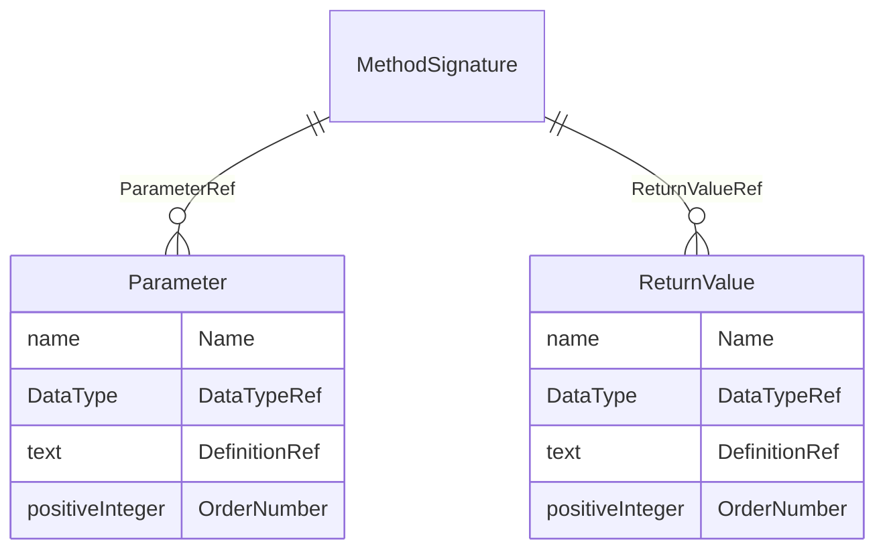

# Class: MethodSignature

_A MethodSignature defines the parameters and return values for a method. The MethodSignature improves traceability while enhancing the ability for automation engines to execute a MethodDef's FormalExpression. Most Methods use one or more input parameters and return one or more values._


URI: [odm:MethodSignature](http://www.cdisc.org/ns/odm/v2.0/MethodSignature)





<!-- no inheritance hierarchy -->


## Slots

| Name | Cardinality* and Range | Description | Inheritance |
| ---  | --- | --- | --- |
| [ParameterRef](ParameterRef.md) | 0..* <br/> [Parameter](Parameter.md) | Parameter reference: The Parameter element represents a method parameter used... | direct |
| [ReturnValueRef](ReturnValueRef.md) | 0..* <br/> [ReturnValue](ReturnValue.md) | ReturnValue reference: The ReturnValue element represents a return value used... | direct |

_* See [LinkML documentation](https://linkml.io/linkml/schemas/slots.html#slot-cardinality) for cardinality definitions._


## Usages

| used by | used in | type | used |
| ---  | --- | --- | --- |
| [RangeCheck](RangeCheck.md) | [MethodSignatureRef](MethodSignatureRef.md) | range | [MethodSignature](MethodSignature.md) |
| [MethodDef](MethodDef.md) | [MethodSignatureRef](MethodSignatureRef.md) | range | [MethodSignature](MethodSignature.md) |
| [ConditionDef](ConditionDef.md) | [MethodSignatureRef](MethodSignatureRef.md) | range | [MethodSignature](MethodSignature.md) |


## See Also

* [https://wiki.cdisc.org/display/PUB/MethodSignature](https://wiki.cdisc.org/display/PUB/MethodSignature)

## Identifier and Mapping Information


### Schema Source


* from schema: http://www.cdisc.org/ns/odm/v2.0


## Mappings

| Mapping Type | Mapped Value |
| ---  | ---  |
| self | odm:MethodSignature |
| native | odm:MethodSignature |


## LinkML Source

<!-- TODO: investigate https://stackoverflow.com/questions/37606292/how-to-create-tabbed-code-blocks-in-mkdocs-or-sphinx -->

### Direct

<details>
```yaml
name: MethodSignature
description: A MethodSignature defines the parameters and return values for a method.
  The MethodSignature improves traceability while enhancing the ability for automation
  engines to execute a MethodDef's FormalExpression. Most Methods use one or more
  input parameters and return one or more values.
from_schema: http://www.cdisc.org/ns/odm/v2.0
see_also:
- https://wiki.cdisc.org/display/PUB/MethodSignature
rank: 1000
slots:
- ParameterRef
- ReturnValueRef
slot_usage:
  ParameterRef:
    name: ParameterRef
    multivalued: true
    domain_of:
    - MethodSignature
    range: Parameter
    inlined: true
    inlined_as_list: true
  ReturnValueRef:
    name: ReturnValueRef
    multivalued: true
    domain_of:
    - MethodSignature
    range: ReturnValue
    inlined: true
    inlined_as_list: true
class_uri: odm:MethodSignature

```
</details>

### Induced

<details>
```yaml
name: MethodSignature
description: A MethodSignature defines the parameters and return values for a method.
  The MethodSignature improves traceability while enhancing the ability for automation
  engines to execute a MethodDef's FormalExpression. Most Methods use one or more
  input parameters and return one or more values.
from_schema: http://www.cdisc.org/ns/odm/v2.0
see_also:
- https://wiki.cdisc.org/display/PUB/MethodSignature
rank: 1000
slot_usage:
  ParameterRef:
    name: ParameterRef
    multivalued: true
    domain_of:
    - MethodSignature
    range: Parameter
    inlined: true
    inlined_as_list: true
  ReturnValueRef:
    name: ReturnValueRef
    multivalued: true
    domain_of:
    - MethodSignature
    range: ReturnValue
    inlined: true
    inlined_as_list: true
attributes:
  ParameterRef:
    name: ParameterRef
    description: 'Parameter reference: The Parameter element represents a method parameter
      used as part of a MethodSignature in MethodDef, ConditionDef, or RangeCheck.'
    from_schema: http://www.cdisc.org/ns/odm/v2.0
    rank: 1000
    multivalued: true
    identifier: false
    alias: ParameterRef
    owner: MethodSignature
    domain_of:
    - MethodSignature
    range: Parameter
    inlined: true
    inlined_as_list: true
  ReturnValueRef:
    name: ReturnValueRef
    description: 'ReturnValue reference: The ReturnValue element represents a return
      value used as part of a MethodSignature in MethodDef, ConditionDef, or RangeCheck.
      A return value identifies values passed from the Method to the calling element.
      A ReturnValue may be computed by a FormalExpression.'
    from_schema: http://www.cdisc.org/ns/odm/v2.0
    rank: 1000
    multivalued: true
    identifier: false
    alias: ReturnValueRef
    owner: MethodSignature
    domain_of:
    - MethodSignature
    range: ReturnValue
    inlined: true
    inlined_as_list: true
class_uri: odm:MethodSignature

```
</details>