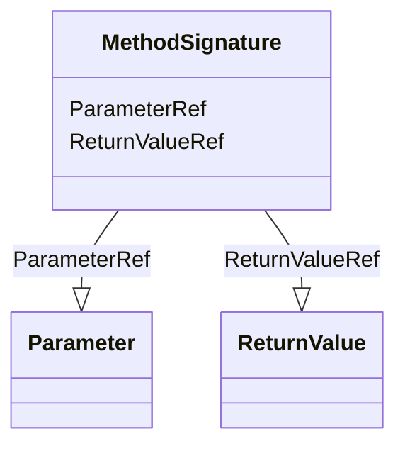

# Class: MethodSignature


URI: [odm:MethodSignature](http://www.cdisc.org/ns/odm/v2.0/MethodSignature)





<!-- no inheritance hierarchy -->


## Slots

| Name | Cardinality and Range | Description | Inheritance |
| ---  | --- | --- | --- |
| [ParameterRef](ParameterRef.md) | 0..* <br/> [Parameter](Parameter.md) |  | direct |
| [ReturnValueRef](ReturnValueRef.md) | 0..* <br/> [ReturnValue](ReturnValue.md) |  | direct |


## Usages

| used by | used in | type | used |
| ---  | --- | --- | --- |
| [RangeCheck](RangeCheck.md) | [MethodSignatureRef](MethodSignatureRef.md) | range | [MethodSignature](MethodSignature.md) |
| [MethodDef](MethodDef.md) | [MethodSignatureRef](MethodSignatureRef.md) | range | [MethodSignature](MethodSignature.md) |
| [ConditionDef](ConditionDef.md) | [MethodSignatureRef](MethodSignatureRef.md) | range | [MethodSignature](MethodSignature.md) |


## See Also

* [https://wiki.cdisc.org/display/ODM2/MethodSignature](https://wiki.cdisc.org/display/ODM2/MethodSignature)

## Identifier and Mapping Information


### Schema Source


* from schema: http://www.cdisc.org/ns/odm/v2.0


## Mappings

| Mapping Type | Mapped Value |
| ---  | ---  |
| self | odm:MethodSignature |
| native | odm:MethodSignature |


## LinkML Source

<!-- TODO: investigate https://stackoverflow.com/questions/37606292/how-to-create-tabbed-code-blocks-in-mkdocs-or-sphinx -->

### Direct

<details>
```yaml
name: MethodSignature
from_schema: http://www.cdisc.org/ns/odm/v2.0
see_also:
- https://wiki.cdisc.org/display/ODM2/MethodSignature
slots:
- ParameterRef
- ReturnValueRef
slot_usage:
  ParameterRef:
    name: ParameterRef
    multivalued: true
    domain_of:
    - MethodSignature
    range: Parameter
    inlined: true
    inlined_as_list: true
  ReturnValueRef:
    name: ReturnValueRef
    multivalued: true
    domain_of:
    - MethodSignature
    range: ReturnValue
    inlined: true
    inlined_as_list: true
class_uri: odm:MethodSignature

```
</details>

### Induced

<details>
```yaml
name: MethodSignature
from_schema: http://www.cdisc.org/ns/odm/v2.0
see_also:
- https://wiki.cdisc.org/display/ODM2/MethodSignature
slot_usage:
  ParameterRef:
    name: ParameterRef
    multivalued: true
    domain_of:
    - MethodSignature
    range: Parameter
    inlined: true
    inlined_as_list: true
  ReturnValueRef:
    name: ReturnValueRef
    multivalued: true
    domain_of:
    - MethodSignature
    range: ReturnValue
    inlined: true
    inlined_as_list: true
attributes:
  ParameterRef:
    name: ParameterRef
    from_schema: http://www.cdisc.org/ns/odm/v2.0
    rank: 1000
    multivalued: true
    alias: ParameterRef
    owner: MethodSignature
    domain_of:
    - MethodSignature
    range: Parameter
    inlined: true
    inlined_as_list: true
  ReturnValueRef:
    name: ReturnValueRef
    from_schema: http://www.cdisc.org/ns/odm/v2.0
    rank: 1000
    multivalued: true
    alias: ReturnValueRef
    owner: MethodSignature
    domain_of:
    - MethodSignature
    range: ReturnValue
    inlined: true
    inlined_as_list: true
class_uri: odm:MethodSignature

```
</details>