# Class: ODMFileMetadata

_Root element for ODM Documents. The ODM element is the top-level (root) element of each ODM document._


URI: [odm:ODM](http://www.cdisc.org/ns/odm/v2.0/ODM)

```mermaid
erDiagram
ODMFileMetadata {
    FileType FileTypeRef  
    Granularity GranularityRef  
    Context ContextRef  
    oid FileOID  
    datetime CreationDateTime  
    oidref PriorFileOID  
    datetime AsOfDateTime  
    ODMVersion ODMVersionRef  
    text Originator  
    text SourceSystem  
    text SourceSystemVersion  
}
Association {
    oidref StudyOID  
    oidref MetaDataVersionOID  
}
Annotation {
    positiveInteger SeqNum  
    TransactionType TransactionTypeRef  
    oid ID  
}
KeySet {
    oidref StudyOID  
    subjectKey SubjectKey  
    oidref MetaDataVersionOID  
    oidref StudyEventOID  
    repeatKey StudyEventRepeatKey  
    oidref ItemGroupOID  
    repeatKey ItemGroupRepeatKey  
    oidref ItemOID  
}
ClinicalData {
    oidref StudyOID  
    oidref MetaDataVersionOID  
}
Signature {
    oid ID  
}
AuditRecord {
    EditPointType EditPoint  
    YesOrNo UsedMethod  
}
Query {
    oid OID  
    QuerySourceType Source  
    text Target  
    QueryType Type  
    QueryStateType State  
    datetime LastUpdateDatetime  
    name Name  
}
ItemGroupData {
    oidref ItemGroupOID  
    repeatKey ItemGroupRepeatKey  
    TransactionType TransactionTypeRef  
    positiveInteger ItemGroupDataSeq  
}
SubjectData {
    subjectKey SubjectKey  
    TransactionType TransactionTypeRef  
}
ReferenceData {
    oidref StudyOID  
    oidref MetaDataVersionOID  
}
AdminData {
    oidref StudyOID  
}
SignatureDef {
    oid OID  
    SignMethod Methodology  
}
Location {
    oid OID  
    name Name  
    text Role  
    oidref OrganizationOID  
}
Organization {
    oid OID  
    name Name  
    text Role  
    OrganizationType Type  
    oidref LocationOID  
    oidref PartOfOrganizationOID  
}
User {
    oid OID  
    UserType UserTypeRef  
    oidref OrganizationOID  
    oidref LocationOID  
}
Study {
    oid OID  
    name StudyName  
    name ProtocolName  
    name VersionID  
    name VersionName  
    name Status  
}
MetaDataVersion {
    oid OID  
    name Name  
    oidref CommentOID  
}
Description {

}

ODMFileMetadata ||--|o Description : "DescriptionRef"
ODMFileMetadata ||--}o Study : "StudyRef"
ODMFileMetadata ||--}o AdminData : "AdminDataRef"
ODMFileMetadata ||--}o ReferenceData : "ReferenceDataRef"
ODMFileMetadata ||--}o ClinicalData : "ClinicalDataRef"
ODMFileMetadata ||--}o Association : "AssociationRef"
Association ||--|o KeySet : "KeySetRef"
Association ||--|o Annotation : "AnnotationRef"
Annotation ||--|o Comment : "CommentRef"
Annotation ||--}o Coding : "CodingRef"
Annotation ||--}o Flag : "FlagRef"
ClinicalData ||--}o SubjectData : "SubjectDataRef"
ClinicalData ||--}o ItemGroupData : "ItemGroupDataRef"
ClinicalData ||--}o Query : "QueryRef"
ClinicalData ||--|o AuditRecord : "AuditRecordRef"
ClinicalData ||--|o Signature : "SignatureRefRef"
ClinicalData ||--|o Annotation : "AnnotationRef"
Signature ||--|o UserRef : "UserRefRef"
Signature ||--|o LocationRef : "LocationRefRef"
Signature ||--|o SignatureRef : "SignatureRefRef"
Signature ||--|o DateTimeStamp : "DateTimeStampRef"
AuditRecord ||--|o UserRef : "UserRefRef"
AuditRecord ||--|o LocationRef : "LocationRefRef"
AuditRecord ||--|o DateTimeStamp : "DateTimeStampRef"
AuditRecord ||--|o ReasonForChange : "ReasonForChangeRef"
AuditRecord ||--|o SourceID : "SourceIDRef"
Query ||--|o Value : "ValueRef"
Query ||--}o AuditRecord : "AuditRecordRef"
ItemGroupData ||--}o Query : "QueryRef"
ItemGroupData ||--}o ItemGroupData : "ItemGroupDataRef"
ItemGroupData ||--}o ItemData : "ItemDataRef"
ItemGroupData ||--|o AuditRecord : "AuditRecordRef"
ItemGroupData ||--|o Signature : "SignatureRefRef"
ItemGroupData ||--|o Annotation : "AnnotationRef"
SubjectData ||--|o InvestigatorRef : "InvestigatorRefRef"
SubjectData ||--|o SiteRef : "SiteRefRef"
SubjectData ||--}o StudyEventData : "StudyEventDataRef"
SubjectData ||--}o Query : "QueryRef"
SubjectData ||--|o AuditRecord : "AuditRecordRef"
SubjectData ||--|o Signature : "SignatureRefRef"
SubjectData ||--|o Annotation : "AnnotationRef"
ReferenceData ||--}o ItemGroupData : "ItemGroupDataRef"
ReferenceData ||--|o AuditRecord : "AuditRecordRef"
ReferenceData ||--|o Signature : "SignatureRefRef"
ReferenceData ||--|o Annotation : "AnnotationRef"
AdminData ||--}o User : "UserRefRef"
AdminData ||--}o Organization : "OrganizationRef"
AdminData ||--}o Location : "LocationRefRef"
AdminData ||--}o SignatureDef : "SignatureDefRef"
SignatureDef ||--|o Meaning : "MeaningRef"
SignatureDef ||--|o LegalReason : "LegalReasonRef"
Location ||--|o Description : "DescriptionRef"
Location ||--}o MetaDataVersionRef : "MetaDataVersionRefRef"
Location ||--}o Address : "AddressRef"
Location ||--}o Telecom : "TelecomRef"
Location ||--}o Query : "QueryRef"
Organization ||--|o Description : "DescriptionRef"
Organization ||--}o Address : "AddressRef"
Organization ||--}o Telecom : "TelecomRef"
User ||--|o UserName : "UserNameRef"
User ||--|o Prefix : "PrefixRef"
User ||--|o Suffix : "SuffixRef"
User ||--|o FullName : "FullNameRef"
User ||--|o GivenName : "GivenNameRef"
User ||--|o FamilyName : "FamilyNameRef"
User ||--|o Image : "ImageRef"
User ||--}o Address : "AddressRef"
User ||--}o Telecom : "TelecomRef"
Study ||--|o Description : "DescriptionRef"
Study ||--}o MetaDataVersion : "MetaDataVersionRefRef"
MetaDataVersion ||--|o Description : "DescriptionRef"
MetaDataVersion ||--|o Include : "IncludeRef"
MetaDataVersion ||--|o Standards : "StandardsRef"
MetaDataVersion ||--|o AnnotatedCRF : "AnnotatedCRFRef"
MetaDataVersion ||--|o SupplementalDoc : "SupplementalDocRef"
MetaDataVersion ||--}o ValueListDef : "ValueListDefRef"
MetaDataVersion ||--}o WhereClauseDef : "WhereClauseDefRef"
MetaDataVersion ||--|o Protocol : "ProtocolRef"
MetaDataVersion ||--}o WorkflowDef : "WorkflowDefRef"
MetaDataVersion ||--}o StudyEventGroupDef : "StudyEventGroupDefRef"
MetaDataVersion ||--}o StudyEventDef : "StudyEventDefRef"
MetaDataVersion ||--}o ItemGroupDef : "ItemGroupDefRef"
MetaDataVersion ||--}o ItemDef : "ItemDefRef"
MetaDataVersion ||--}o CodeList : "CodeListRefRef"
MetaDataVersion ||--}o ConditionDef : "ConditionDefRef"
MetaDataVersion ||--}o MethodDef : "MethodDefRef"
MetaDataVersion ||--}o CommentDef : "CommentDefRef"
MetaDataVersion ||--}o Leaf : "LeafRef"
Description ||--}o TranslatedText : "TranslatedTextRef"

```





<!-- no inheritance hierarchy -->


## Slots

| Name | Cardinality* and Range | Description | Inheritance |
| ---  | --- | --- | --- |
| [FileTypeRef](FileTypeRef.md) | 1..1 <br/> [FileType](FileType.md) | Snapshot means that the document contains only the current state of the data ... | direct |
| [GranularityRef](GranularityRef.md) | 0..1 <br/> [Granularity](Granularity.md) | Granularity is intended to give the sender a shorthand way to Describes the s... | direct |
| [ContextRef](ContextRef.md) | 0..1 <br/> [Context](Context.md) | Indicates the intended usage of the ODM document. Archive - indicates that th... | direct |
| [FileOID](FileOID.md) | 1..1 <br/> [oid](oid.md) | A unique identifier for this file. | direct |
| [CreationDateTime](CreationDateTime.md) | 1..1 <br/> [datetime](datetime.md) | Time of creation of the file containing the document. | direct |
| [PriorFileOID](PriorFileOID.md) | 0..1 <br/> [oidref](oidref.md) | Reference to the previous file (if any) in a series. | direct |
| [AsOfDateTime](AsOfDateTime.md) | 0..1 <br/> [datetime](datetime.md) | The date/time at which the source database was queried in order to create thi... | direct |
| [ODMVersionRef](ODMVersionRef.md) | 0..1 <br/> [ODMVersion](ODMVersion.md) | The version of the ODM standard used. | direct |
| [Originator](Originator.md) | 0..1 <br/> [text](text.md) | The organization that generated the ODM file. | direct |
| [SourceSystem](SourceSystem.md) | 0..1 <br/> [text](text.md) | The computer system or database management system that is the source of the i... | direct |
| [SourceSystemVersion](SourceSystemVersion.md) | 0..1 <br/> [text](text.md) | The version of the "SourceSystem" above. | direct |
| [DescriptionRef](DescriptionRef.md) | 0..1 <br/> [Description](Description.md) | Description reference: A free-text description of the containing metadata com... | direct |
| [StudyRef](StudyRef.md) | 0..* <br/> [Study](Study.md) | Study reference: This element collects static structural information about an... | direct |
| [AdminDataRef](AdminDataRef.md) | 0..* <br/> [AdminData](AdminData.md) | AdminData reference: Administrative information about users, locations, organ... | direct |
| [ReferenceDataRef](ReferenceDataRef.md) | 0..* <br/> [ReferenceData](ReferenceData.md) | ReferenceData reference: Reference data provides information on how to interp... | direct |
| [ClinicalDataRef](ClinicalDataRef.md) | 0..* <br/> [ClinicalData](ClinicalData.md) | ClinicalData reference: Clinical data for 1 or more subjects. | direct |
| [AssociationRef](AssociationRef.md) | 0..* <br/> [Association](Association.md) | Association reference: An association permits an annotation to be placed on a... | direct |

_* See [LinkML documentation](https://linkml.io/linkml/schemas/slots.html#slot-cardinality) for cardinality definitions._


## See Also

* [https://wiki.cdisc.org/display/PUB/ODM](https://wiki.cdisc.org/display/PUB/ODM)

## Identifier and Mapping Information


### Schema Source


* from schema: http://www.cdisc.org/ns/odm/v2.0


## Mappings

| Mapping Type | Mapped Value |
| ---  | ---  |
| self | odm:ODM |
| native | odm:ODMFileMetadata |


## LinkML Source

<!-- TODO: investigate https://stackoverflow.com/questions/37606292/how-to-create-tabbed-code-blocks-in-mkdocs-or-sphinx -->

### Direct

<details>
```yaml
name: ODMFileMetadata
description: Root element for ODM Documents. The ODM element is the top-level (root)
  element of each ODM document.
from_schema: http://www.cdisc.org/ns/odm/v2.0
see_also:
- https://wiki.cdisc.org/display/PUB/ODM
rank: 1000
slots:
- FileTypeRef
- GranularityRef
- ContextRef
- FileOID
- CreationDateTime
- PriorFileOID
- AsOfDateTime
- ODMVersionRef
- Originator
- SourceSystem
- SourceSystemVersion
- DescriptionRef
- StudyRef
- AdminDataRef
- ReferenceDataRef
- ClinicalDataRef
- AssociationRef
slot_usage:
  FileTypeRef:
    name: FileTypeRef
    description: Snapshot means that the document contains only the current state
      of the data and metadata it describes, and no transactional history. Transactional
      means that the document may contain more than one instance per data point. Query
      means the document contains only ClinicalData/Query elements.
    comments:
    - 'Required

      enum values: ( Snapshot | Transactional | Query)'
    domain_of:
    - ODMFileMetadata
    range: FileType
    required: true
  GranularityRef:
    name: GranularityRef
    description: Granularity is intended to give the sender a shorthand way to Describes
      the scope of information in the document, for certain common types of documents.
      All means the entire study; Metadata means the Study/MetaDataVersion element;
      AdminData and ReferenceData mean the corresponding elements; AllClinicalData
      means all of the ClinicalData collected for the study. SingleSite, means all
      of the Clinical Data for a single study site. SingleSubject means all of the
      Clinical Data for a single Subject.
    comments:
    - 'Optional

      enum values: ( All | Metadata | AdminData | ReferenceData | AllClinicalData
      | SingleSite | SingleSubject )'
    domain_of:
    - ODMFileMetadata
    range: Granularity
  ContextRef:
    name: ContextRef
    description: Indicates the intended usage of the ODM document. Archive - indicates
      that the file is intended to meet the requirements of an electronic record as
      defined in 21 CFR 11. Submission - indicates that the file is intended to be
      used for regulatory submission. Exchange - indicates that the file was generated
      to be imported into an ODM compliant system.
    comments:
    - 'Optional

      enum values: (Archive| Submission | Exchange)'
    domain_of:
    - Alias
    - FormalExpression
    - ODMFileMetadata
    range: Context
  FileOID:
    name: FileOID
    description: A unique identifier for this file.
    comments:
    - 'Required

      range: oid'
    domain_of:
    - ODMFileMetadata
    range: oid
    required: true
  CreationDateTime:
    name: CreationDateTime
    description: Time of creation of the file containing the document.
    comments:
    - 'Required

      range: datetime'
    domain_of:
    - ODMFileMetadata
    range: datetime
    required: true
  PriorFileOID:
    name: PriorFileOID
    description: Reference to the previous file (if any) in a series.
    comments:
    - 'Optional

      range: oidref'
    domain_of:
    - ODMFileMetadata
    range: oidref
  AsOfDateTime:
    name: AsOfDateTime
    description: The date/time at which the source database was queried in order to
      create this document.
    comments:
    - 'Optional

      range: datetime'
    domain_of:
    - ODMFileMetadata
    range: datetime
  ODMVersionRef:
    name: ODMVersionRef
    description: The version of the ODM standard used.
    comments:
    - 'Required

      enum values: Pattern: 2.0(.(0|([1-9][0-9]*)))?(-([0-9a-zA-Z])+)*'
    domain_of:
    - ODMFileMetadata
    range: ODMVersion
  Originator:
    name: Originator
    description: The organization that generated the ODM file.
    comments:
    - 'Optional

      range: text'
    domain_of:
    - ODMFileMetadata
    range: text
  SourceSystem:
    name: SourceSystem
    description: The computer system or database management system that is the source
      of the information in this file.
    comments:
    - 'Optional

      range: text'
    domain_of:
    - ODMFileMetadata
    range: text
  SourceSystemVersion:
    name: SourceSystemVersion
    description: The version of the "SourceSystem" above.
    comments:
    - 'Optional

      range: text'
    domain_of:
    - ODMFileMetadata
    range: text
  DescriptionRef:
    name: DescriptionRef
    domain_of:
    - Study
    - MetaDataVersion
    - ValueListDef
    - StudyEventGroupRef
    - StudyEventGroupDef
    - StudyEventDef
    - ItemGroupDef
    - Origin
    - ItemDef
    - CodeList
    - CodeListItem
    - MethodDef
    - ConditionDef
    - CommentDef
    - Protocol
    - StudyStructure
    - TrialPhase
    - StudyIndication
    - StudyIntervention
    - StudyObjective
    - StudyEndPoint
    - StudyTargetPopulation
    - StudyEstimand
    - IntercurrentEvent
    - SummaryMeasure
    - Arm
    - Epoch
    - TransitionTimingConstraint
    - AbsoluteTimingConstraint
    - RelativeTimingConstraint
    - DurationTimingConstraint
    - WorkflowDef
    - Criterion
    - Organization
    - Location
    - ODMFileMetadata
    range: Description
    maximum_cardinality: 1
  StudyRef:
    name: StudyRef
    multivalued: true
    domain_of:
    - ODMFileMetadata
    range: Study
    inlined: true
    inlined_as_list: true
  AdminDataRef:
    name: AdminDataRef
    multivalued: true
    domain_of:
    - ODMFileMetadata
    range: AdminData
    inlined: true
    inlined_as_list: true
  ReferenceDataRef:
    name: ReferenceDataRef
    multivalued: true
    domain_of:
    - ODMFileMetadata
    range: ReferenceData
    inlined: true
    inlined_as_list: true
  ClinicalDataRef:
    name: ClinicalDataRef
    multivalued: true
    domain_of:
    - ODMFileMetadata
    range: ClinicalData
    inlined: true
    inlined_as_list: true
  AssociationRef:
    name: AssociationRef
    multivalued: true
    domain_of:
    - ODMFileMetadata
    range: Association
    inlined: true
    inlined_as_list: true
class_uri: odm:ODM
tree_root: true

```
</details>

### Induced

<details>
```yaml
name: ODMFileMetadata
description: Root element for ODM Documents. The ODM element is the top-level (root)
  element of each ODM document.
from_schema: http://www.cdisc.org/ns/odm/v2.0
see_also:
- https://wiki.cdisc.org/display/PUB/ODM
rank: 1000
slot_usage:
  FileTypeRef:
    name: FileTypeRef
    description: Snapshot means that the document contains only the current state
      of the data and metadata it describes, and no transactional history. Transactional
      means that the document may contain more than one instance per data point. Query
      means the document contains only ClinicalData/Query elements.
    comments:
    - 'Required

      enum values: ( Snapshot | Transactional | Query)'
    domain_of:
    - ODMFileMetadata
    range: FileType
    required: true
  GranularityRef:
    name: GranularityRef
    description: Granularity is intended to give the sender a shorthand way to Describes
      the scope of information in the document, for certain common types of documents.
      All means the entire study; Metadata means the Study/MetaDataVersion element;
      AdminData and ReferenceData mean the corresponding elements; AllClinicalData
      means all of the ClinicalData collected for the study. SingleSite, means all
      of the Clinical Data for a single study site. SingleSubject means all of the
      Clinical Data for a single Subject.
    comments:
    - 'Optional

      enum values: ( All | Metadata | AdminData | ReferenceData | AllClinicalData
      | SingleSite | SingleSubject )'
    domain_of:
    - ODMFileMetadata
    range: Granularity
  ContextRef:
    name: ContextRef
    description: Indicates the intended usage of the ODM document. Archive - indicates
      that the file is intended to meet the requirements of an electronic record as
      defined in 21 CFR 11. Submission - indicates that the file is intended to be
      used for regulatory submission. Exchange - indicates that the file was generated
      to be imported into an ODM compliant system.
    comments:
    - 'Optional

      enum values: (Archive| Submission | Exchange)'
    domain_of:
    - Alias
    - FormalExpression
    - ODMFileMetadata
    range: Context
  FileOID:
    name: FileOID
    description: A unique identifier for this file.
    comments:
    - 'Required

      range: oid'
    domain_of:
    - ODMFileMetadata
    range: oid
    required: true
  CreationDateTime:
    name: CreationDateTime
    description: Time of creation of the file containing the document.
    comments:
    - 'Required

      range: datetime'
    domain_of:
    - ODMFileMetadata
    range: datetime
    required: true
  PriorFileOID:
    name: PriorFileOID
    description: Reference to the previous file (if any) in a series.
    comments:
    - 'Optional

      range: oidref'
    domain_of:
    - ODMFileMetadata
    range: oidref
  AsOfDateTime:
    name: AsOfDateTime
    description: The date/time at which the source database was queried in order to
      create this document.
    comments:
    - 'Optional

      range: datetime'
    domain_of:
    - ODMFileMetadata
    range: datetime
  ODMVersionRef:
    name: ODMVersionRef
    description: The version of the ODM standard used.
    comments:
    - 'Required

      enum values: Pattern: 2.0(.(0|([1-9][0-9]*)))?(-([0-9a-zA-Z])+)*'
    domain_of:
    - ODMFileMetadata
    range: ODMVersion
  Originator:
    name: Originator
    description: The organization that generated the ODM file.
    comments:
    - 'Optional

      range: text'
    domain_of:
    - ODMFileMetadata
    range: text
  SourceSystem:
    name: SourceSystem
    description: The computer system or database management system that is the source
      of the information in this file.
    comments:
    - 'Optional

      range: text'
    domain_of:
    - ODMFileMetadata
    range: text
  SourceSystemVersion:
    name: SourceSystemVersion
    description: The version of the "SourceSystem" above.
    comments:
    - 'Optional

      range: text'
    domain_of:
    - ODMFileMetadata
    range: text
  DescriptionRef:
    name: DescriptionRef
    domain_of:
    - Study
    - MetaDataVersion
    - ValueListDef
    - StudyEventGroupRef
    - StudyEventGroupDef
    - StudyEventDef
    - ItemGroupDef
    - Origin
    - ItemDef
    - CodeList
    - CodeListItem
    - MethodDef
    - ConditionDef
    - CommentDef
    - Protocol
    - StudyStructure
    - TrialPhase
    - StudyIndication
    - StudyIntervention
    - StudyObjective
    - StudyEndPoint
    - StudyTargetPopulation
    - StudyEstimand
    - IntercurrentEvent
    - SummaryMeasure
    - Arm
    - Epoch
    - TransitionTimingConstraint
    - AbsoluteTimingConstraint
    - RelativeTimingConstraint
    - DurationTimingConstraint
    - WorkflowDef
    - Criterion
    - Organization
    - Location
    - ODMFileMetadata
    range: Description
    maximum_cardinality: 1
  StudyRef:
    name: StudyRef
    multivalued: true
    domain_of:
    - ODMFileMetadata
    range: Study
    inlined: true
    inlined_as_list: true
  AdminDataRef:
    name: AdminDataRef
    multivalued: true
    domain_of:
    - ODMFileMetadata
    range: AdminData
    inlined: true
    inlined_as_list: true
  ReferenceDataRef:
    name: ReferenceDataRef
    multivalued: true
    domain_of:
    - ODMFileMetadata
    range: ReferenceData
    inlined: true
    inlined_as_list: true
  ClinicalDataRef:
    name: ClinicalDataRef
    multivalued: true
    domain_of:
    - ODMFileMetadata
    range: ClinicalData
    inlined: true
    inlined_as_list: true
  AssociationRef:
    name: AssociationRef
    multivalued: true
    domain_of:
    - ODMFileMetadata
    range: Association
    inlined: true
    inlined_as_list: true
attributes:
  FileTypeRef:
    name: FileTypeRef
    description: Snapshot means that the document contains only the current state
      of the data and metadata it describes, and no transactional history. Transactional
      means that the document may contain more than one instance per data point. Query
      means the document contains only ClinicalData/Query elements.
    comments:
    - 'Required

      enum values: ( Snapshot | Transactional | Query)'
    from_schema: http://www.cdisc.org/ns/odm/v2.0
    rank: 1000
    alias: FileTypeRef
    owner: ODMFileMetadata
    domain_of:
    - ODMFileMetadata
    range: FileType
    required: true
  GranularityRef:
    name: GranularityRef
    description: Granularity is intended to give the sender a shorthand way to Describes
      the scope of information in the document, for certain common types of documents.
      All means the entire study; Metadata means the Study/MetaDataVersion element;
      AdminData and ReferenceData mean the corresponding elements; AllClinicalData
      means all of the ClinicalData collected for the study. SingleSite, means all
      of the Clinical Data for a single study site. SingleSubject means all of the
      Clinical Data for a single Subject.
    comments:
    - 'Optional

      enum values: ( All | Metadata | AdminData | ReferenceData | AllClinicalData
      | SingleSite | SingleSubject )'
    from_schema: http://www.cdisc.org/ns/odm/v2.0
    rank: 1000
    alias: GranularityRef
    owner: ODMFileMetadata
    domain_of:
    - ODMFileMetadata
    range: Granularity
  ContextRef:
    name: ContextRef
    description: Indicates the intended usage of the ODM document. Archive - indicates
      that the file is intended to meet the requirements of an electronic record as
      defined in 21 CFR 11. Submission - indicates that the file is intended to be
      used for regulatory submission. Exchange - indicates that the file was generated
      to be imported into an ODM compliant system.
    comments:
    - 'Optional

      enum values: (Archive| Submission | Exchange)'
    from_schema: http://www.cdisc.org/ns/odm/v2.0
    rank: 1000
    alias: ContextRef
    owner: ODMFileMetadata
    domain_of:
    - Alias
    - FormalExpression
    - ODMFileMetadata
    range: Context
  FileOID:
    name: FileOID
    description: A unique identifier for this file.
    comments:
    - 'Required

      range: oid'
    from_schema: http://www.cdisc.org/ns/odm/v2.0
    rank: 1000
    alias: FileOID
    owner: ODMFileMetadata
    domain_of:
    - ODMFileMetadata
    range: oid
    required: true
  CreationDateTime:
    name: CreationDateTime
    description: Time of creation of the file containing the document.
    comments:
    - 'Required

      range: datetime'
    from_schema: http://www.cdisc.org/ns/odm/v2.0
    rank: 1000
    alias: CreationDateTime
    owner: ODMFileMetadata
    domain_of:
    - ODMFileMetadata
    range: datetime
    required: true
  PriorFileOID:
    name: PriorFileOID
    description: Reference to the previous file (if any) in a series.
    comments:
    - 'Optional

      range: oidref'
    from_schema: http://www.cdisc.org/ns/odm/v2.0
    rank: 1000
    alias: PriorFileOID
    owner: ODMFileMetadata
    domain_of:
    - ODMFileMetadata
    range: oidref
  AsOfDateTime:
    name: AsOfDateTime
    description: The date/time at which the source database was queried in order to
      create this document.
    comments:
    - 'Optional

      range: datetime'
    from_schema: http://www.cdisc.org/ns/odm/v2.0
    rank: 1000
    alias: AsOfDateTime
    owner: ODMFileMetadata
    domain_of:
    - ODMFileMetadata
    range: datetime
  ODMVersionRef:
    name: ODMVersionRef
    description: The version of the ODM standard used.
    comments:
    - 'Required

      enum values: Pattern: 2.0(.(0|([1-9][0-9]*)))?(-([0-9a-zA-Z])+)*'
    from_schema: http://www.cdisc.org/ns/odm/v2.0
    rank: 1000
    alias: ODMVersionRef
    owner: ODMFileMetadata
    domain_of:
    - ODMFileMetadata
    range: ODMVersion
  Originator:
    name: Originator
    description: The organization that generated the ODM file.
    comments:
    - 'Optional

      range: text'
    from_schema: http://www.cdisc.org/ns/odm/v2.0
    rank: 1000
    alias: Originator
    owner: ODMFileMetadata
    domain_of:
    - ODMFileMetadata
    range: text
  SourceSystem:
    name: SourceSystem
    description: The computer system or database management system that is the source
      of the information in this file.
    comments:
    - 'Optional

      range: text'
    from_schema: http://www.cdisc.org/ns/odm/v2.0
    rank: 1000
    alias: SourceSystem
    owner: ODMFileMetadata
    domain_of:
    - ODMFileMetadata
    range: text
  SourceSystemVersion:
    name: SourceSystemVersion
    description: The version of the "SourceSystem" above.
    comments:
    - 'Optional

      range: text'
    from_schema: http://www.cdisc.org/ns/odm/v2.0
    rank: 1000
    alias: SourceSystemVersion
    owner: ODMFileMetadata
    domain_of:
    - ODMFileMetadata
    range: text
  DescriptionRef:
    name: DescriptionRef
    description: 'Description reference: A free-text description of the containing
      metadata component, unless restricted by Business Rules.'
    from_schema: http://www.cdisc.org/ns/odm/v2.0
    rank: 1000
    identifier: false
    alias: DescriptionRef
    owner: ODMFileMetadata
    domain_of:
    - Study
    - MetaDataVersion
    - ValueListDef
    - StudyEventGroupRef
    - StudyEventGroupDef
    - StudyEventDef
    - ItemGroupDef
    - Origin
    - ItemDef
    - CodeList
    - CodeListItem
    - MethodDef
    - ConditionDef
    - CommentDef
    - Protocol
    - StudyStructure
    - TrialPhase
    - StudyIndication
    - StudyIntervention
    - StudyObjective
    - StudyEndPoint
    - StudyTargetPopulation
    - StudyEstimand
    - IntercurrentEvent
    - SummaryMeasure
    - Arm
    - Epoch
    - TransitionTimingConstraint
    - AbsoluteTimingConstraint
    - RelativeTimingConstraint
    - DurationTimingConstraint
    - WorkflowDef
    - Criterion
    - Organization
    - Location
    - ODMFileMetadata
    range: Description
    maximum_cardinality: 1
  StudyRef:
    name: StudyRef
    description: 'Study reference: This element collects static structural information
      about an individual study.'
    from_schema: http://www.cdisc.org/ns/odm/v2.0
    rank: 1000
    multivalued: true
    identifier: false
    alias: StudyRef
    owner: ODMFileMetadata
    domain_of:
    - ODMFileMetadata
    range: Study
    inlined: true
    inlined_as_list: true
  AdminDataRef:
    name: AdminDataRef
    description: 'AdminData reference: Administrative information about users, locations,
      organizations, and electronic signatures.'
    from_schema: http://www.cdisc.org/ns/odm/v2.0
    rank: 1000
    multivalued: true
    identifier: false
    alias: AdminDataRef
    owner: ODMFileMetadata
    domain_of:
    - ODMFileMetadata
    range: AdminData
    inlined: true
    inlined_as_list: true
  ReferenceDataRef:
    name: ReferenceDataRef
    description: 'ReferenceData reference: Reference data provides information on
      how to interpret clinical data. For example, reference data might include lab
      normal ranges. For a study that uses CDISC standards, reference data might include
      SDTM Trial Design datasets.'
    from_schema: http://www.cdisc.org/ns/odm/v2.0
    rank: 1000
    multivalued: true
    identifier: false
    alias: ReferenceDataRef
    owner: ODMFileMetadata
    domain_of:
    - ODMFileMetadata
    range: ReferenceData
    inlined: true
    inlined_as_list: true
  ClinicalDataRef:
    name: ClinicalDataRef
    description: 'ClinicalData reference: Clinical data for 1 or more subjects.'
    from_schema: http://www.cdisc.org/ns/odm/v2.0
    rank: 1000
    multivalued: true
    identifier: false
    alias: ClinicalDataRef
    owner: ODMFileMetadata
    domain_of:
    - ODMFileMetadata
    range: ClinicalData
    inlined: true
    inlined_as_list: true
  AssociationRef:
    name: AssociationRef
    description: 'Association reference: An association permits an annotation to be
      placed on an ordered pair of entities rather than on just one. The first and
      second KeySets identify the start and end of the annotated "link.'
    from_schema: http://www.cdisc.org/ns/odm/v2.0
    rank: 1000
    multivalued: true
    identifier: false
    alias: AssociationRef
    owner: ODMFileMetadata
    domain_of:
    - ODMFileMetadata
    range: Association
    inlined: true
    inlined_as_list: true
class_uri: odm:ODM
tree_root: true

```
</details>