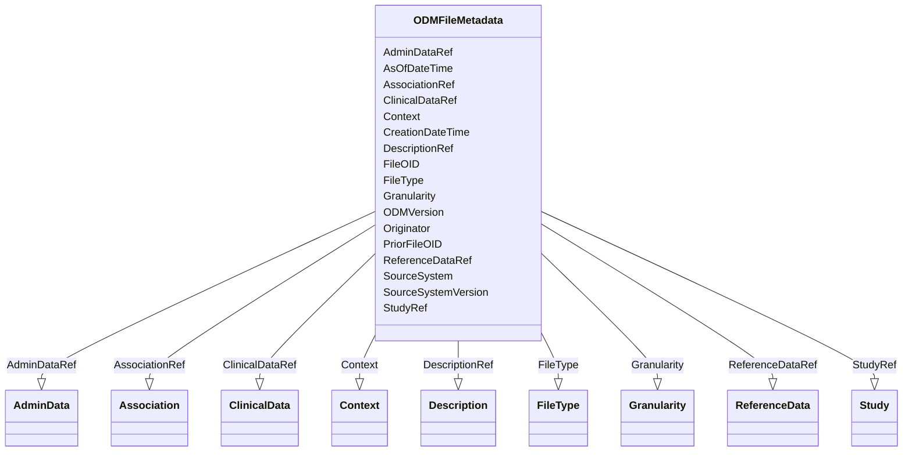

# Class: ODMFileMetadata


URI: [odm:ODM](http://www.cdisc.org/ns/odm/v2.0/ODM)





<!-- no inheritance hierarchy -->


## Slots

| Name | Cardinality and Range | Description | Inheritance |
| ---  | --- | --- | --- |
| [FileType](FileType.md) | 1..1 <br/> [FileType](FileType.md) |  | direct |
| [Granularity](Granularity.md) | 0..1 <br/> [Granularity](Granularity.md) |  | direct |
| [Context](Context.md) | 0..1 <br/> [Context](Context.md) |  | direct |
| [FileOID](FileOID.md) | 1..1 <br/> [Oid](Oid.md) |  | direct |
| [CreationDateTime](CreationDateTime.md) | 1..1 <br/> [Datetime](Datetime.md) |  | direct |
| [PriorFileOID](PriorFileOID.md) | 0..1 <br/> [Oidref](Oidref.md) |  | direct |
| [AsOfDateTime](AsOfDateTime.md) | 0..1 <br/> [Datetime](Datetime.md) |  | direct |
| [ODMVersion](ODMVersion.md) | 0..1 <br/> [ODMVersion](ODMVersion.md) |  | direct |
| [Originator](Originator.md) | 0..1 <br/> [Text](Text.md) |  | direct |
| [SourceSystem](SourceSystem.md) | 0..1 <br/> [Text](Text.md) |  | direct |
| [SourceSystemVersion](SourceSystemVersion.md) | 0..1 <br/> [Text](Text.md) |  | direct |
| [DescriptionRef](DescriptionRef.md) | 0..1 <br/> [Description](Description.md) |  | direct |
| [StudyRef](StudyRef.md) | 0..* <br/> [Study](Study.md) |  | direct |
| [AdminDataRef](AdminDataRef.md) | 0..* <br/> [AdminData](AdminData.md) |  | direct |
| [ReferenceDataRef](ReferenceDataRef.md) | 0..* <br/> [ReferenceData](ReferenceData.md) |  | direct |
| [ClinicalDataRef](ClinicalDataRef.md) | 0..* <br/> [ClinicalData](ClinicalData.md) |  | direct |
| [AssociationRef](AssociationRef.md) | 0..* <br/> [Association](Association.md) |  | direct |


## Identifier and Mapping Information


### Schema Source


* from schema: http://www.cdisc.org/ns/odm/v2.0


## Mappings

| Mapping Type | Mapped Value |
| ---  | ---  |
| self | odm:ODM |
| native | odm:ODMFileMetadata |


## LinkML Source

<!-- TODO: investigate https://stackoverflow.com/questions/37606292/how-to-create-tabbed-code-blocks-in-mkdocs-or-sphinx -->

### Direct

<details>
```yaml
name: ODMFileMetadata
from_schema: http://www.cdisc.org/ns/odm/v2.0
slots:
- FileType
- Granularity
- Context
- FileOID
- CreationDateTime
- PriorFileOID
- AsOfDateTime
- ODMVersion
- Originator
- SourceSystem
- SourceSystemVersion
- DescriptionRef
- StudyRef
- AdminDataRef
- ReferenceDataRef
- ClinicalDataRef
- AssociationRef
slot_usage:
  FileType:
    name: FileType
    domain_of:
    - ODMFileMetadata
    range: FileType
    required: true
  Granularity:
    name: Granularity
    domain_of:
    - ODMFileMetadata
    range: Granularity
    required: false
  Context:
    name: Context
    domain_of:
    - FormalExpression
    - Alias
    - ODMFileMetadata
    range: Context
    required: false
  FileOID:
    name: FileOID
    domain_of:
    - ODMFileMetadata
    range: oid
    required: true
  CreationDateTime:
    name: CreationDateTime
    domain_of:
    - ODMFileMetadata
    range: datetime
    required: true
  PriorFileOID:
    name: PriorFileOID
    domain_of:
    - ODMFileMetadata
    range: oidref
    required: false
  AsOfDateTime:
    name: AsOfDateTime
    domain_of:
    - ODMFileMetadata
    range: datetime
    required: false
  ODMVersion:
    name: ODMVersion
    domain_of:
    - ODMFileMetadata
    range: ODMVersion
    required: false
  Originator:
    name: Originator
    domain_of:
    - ODMFileMetadata
    range: text
    required: false
  SourceSystem:
    name: SourceSystem
    domain_of:
    - ODMFileMetadata
    range: text
    required: false
  SourceSystemVersion:
    name: SourceSystemVersion
    domain_of:
    - ODMFileMetadata
    range: text
    required: false
  DescriptionRef:
    name: DescriptionRef
    domain_of:
    - ValueListDef
    - StudyEventGroupRef
    - StudyEventGroupDef
    - Origin
    - CommentDef
    - Protocol
    - StudyStructure
    - TrialPhase
    - StudyIndication
    - StudyIntervention
    - StudyObjective
    - StudyEndPoint
    - StudyTargetPopulation
    - StudyEstimand
    - IntercurrentEvent
    - SummaryMeasure
    - Arm
    - Epoch
    - TransitionTimingConstraint
    - AbsoluteTimingConstraint
    - RelativeTimingConstraint
    - DurationTimingConstraint
    - WorkflowDef
    - Criterion
    - ExceptionEvent
    - Organization
    - MetaDataVersion
    - StudyEventDef
    - ItemGroupDef
    - ItemDef
    - CodeList
    - ConditionDef
    - MethodDef
    - CodeListItem
    - EnumeratedItem
    - Location
    - Study
    - ODMFileMetadata
    range: Description
    required: false
    minimum_cardinality: 0
    maximum_cardinality: 1
  StudyRef:
    name: StudyRef
    multivalued: true
    list_elements_unique: true
    domain_of:
    - ODMFileMetadata
    range: Study
    required: false
    minimum_cardinality: 0
  AdminDataRef:
    name: AdminDataRef
    multivalued: true
    domain_of:
    - ODMFileMetadata
    range: AdminData
    required: false
    minimum_cardinality: 0
  ReferenceDataRef:
    name: ReferenceDataRef
    multivalued: true
    domain_of:
    - ODMFileMetadata
    range: ReferenceData
    required: false
    minimum_cardinality: 0
  ClinicalDataRef:
    name: ClinicalDataRef
    multivalued: true
    domain_of:
    - ODMFileMetadata
    range: ClinicalData
    required: false
    minimum_cardinality: 0
  AssociationRef:
    name: AssociationRef
    multivalued: true
    domain_of:
    - ODMFileMetadata
    range: Association
    required: false
    minimum_cardinality: 0
class_uri: odm:ODM

```
</details>

### Induced

<details>
```yaml
name: ODMFileMetadata
from_schema: http://www.cdisc.org/ns/odm/v2.0
slot_usage:
  FileType:
    name: FileType
    domain_of:
    - ODMFileMetadata
    range: FileType
    required: true
  Granularity:
    name: Granularity
    domain_of:
    - ODMFileMetadata
    range: Granularity
    required: false
  Context:
    name: Context
    domain_of:
    - FormalExpression
    - Alias
    - ODMFileMetadata
    range: Context
    required: false
  FileOID:
    name: FileOID
    domain_of:
    - ODMFileMetadata
    range: oid
    required: true
  CreationDateTime:
    name: CreationDateTime
    domain_of:
    - ODMFileMetadata
    range: datetime
    required: true
  PriorFileOID:
    name: PriorFileOID
    domain_of:
    - ODMFileMetadata
    range: oidref
    required: false
  AsOfDateTime:
    name: AsOfDateTime
    domain_of:
    - ODMFileMetadata
    range: datetime
    required: false
  ODMVersion:
    name: ODMVersion
    domain_of:
    - ODMFileMetadata
    range: ODMVersion
    required: false
  Originator:
    name: Originator
    domain_of:
    - ODMFileMetadata
    range: text
    required: false
  SourceSystem:
    name: SourceSystem
    domain_of:
    - ODMFileMetadata
    range: text
    required: false
  SourceSystemVersion:
    name: SourceSystemVersion
    domain_of:
    - ODMFileMetadata
    range: text
    required: false
  DescriptionRef:
    name: DescriptionRef
    domain_of:
    - ValueListDef
    - StudyEventGroupRef
    - StudyEventGroupDef
    - Origin
    - CommentDef
    - Protocol
    - StudyStructure
    - TrialPhase
    - StudyIndication
    - StudyIntervention
    - StudyObjective
    - StudyEndPoint
    - StudyTargetPopulation
    - StudyEstimand
    - IntercurrentEvent
    - SummaryMeasure
    - Arm
    - Epoch
    - TransitionTimingConstraint
    - AbsoluteTimingConstraint
    - RelativeTimingConstraint
    - DurationTimingConstraint
    - WorkflowDef
    - Criterion
    - ExceptionEvent
    - Organization
    - MetaDataVersion
    - StudyEventDef
    - ItemGroupDef
    - ItemDef
    - CodeList
    - ConditionDef
    - MethodDef
    - CodeListItem
    - EnumeratedItem
    - Location
    - Study
    - ODMFileMetadata
    range: Description
    required: false
    minimum_cardinality: 0
    maximum_cardinality: 1
  StudyRef:
    name: StudyRef
    multivalued: true
    list_elements_unique: true
    domain_of:
    - ODMFileMetadata
    range: Study
    required: false
    minimum_cardinality: 0
  AdminDataRef:
    name: AdminDataRef
    multivalued: true
    domain_of:
    - ODMFileMetadata
    range: AdminData
    required: false
    minimum_cardinality: 0
  ReferenceDataRef:
    name: ReferenceDataRef
    multivalued: true
    domain_of:
    - ODMFileMetadata
    range: ReferenceData
    required: false
    minimum_cardinality: 0
  ClinicalDataRef:
    name: ClinicalDataRef
    multivalued: true
    domain_of:
    - ODMFileMetadata
    range: ClinicalData
    required: false
    minimum_cardinality: 0
  AssociationRef:
    name: AssociationRef
    multivalued: true
    domain_of:
    - ODMFileMetadata
    range: Association
    required: false
    minimum_cardinality: 0
attributes:
  FileType:
    name: FileType
    from_schema: http://www.cdisc.org/ns/odm/v2.0
    rank: 1000
    alias: FileType
    owner: ODMFileMetadata
    domain_of:
    - ODMFileMetadata
    range: FileType
    required: true
  Granularity:
    name: Granularity
    from_schema: http://www.cdisc.org/ns/odm/v2.0
    rank: 1000
    alias: Granularity
    owner: ODMFileMetadata
    domain_of:
    - ODMFileMetadata
    range: Granularity
    required: false
  Context:
    name: Context
    from_schema: http://www.cdisc.org/ns/odm/v2.0
    rank: 1000
    alias: Context
    owner: ODMFileMetadata
    domain_of:
    - FormalExpression
    - Alias
    - ODMFileMetadata
    range: Context
    required: false
  FileOID:
    name: FileOID
    from_schema: http://www.cdisc.org/ns/odm/v2.0
    rank: 1000
    alias: FileOID
    owner: ODMFileMetadata
    domain_of:
    - ODMFileMetadata
    range: oid
    required: true
  CreationDateTime:
    name: CreationDateTime
    from_schema: http://www.cdisc.org/ns/odm/v2.0
    rank: 1000
    alias: CreationDateTime
    owner: ODMFileMetadata
    domain_of:
    - ODMFileMetadata
    range: datetime
    required: true
  PriorFileOID:
    name: PriorFileOID
    from_schema: http://www.cdisc.org/ns/odm/v2.0
    rank: 1000
    alias: PriorFileOID
    owner: ODMFileMetadata
    domain_of:
    - ODMFileMetadata
    range: oidref
    required: false
  AsOfDateTime:
    name: AsOfDateTime
    from_schema: http://www.cdisc.org/ns/odm/v2.0
    rank: 1000
    alias: AsOfDateTime
    owner: ODMFileMetadata
    domain_of:
    - ODMFileMetadata
    range: datetime
    required: false
  ODMVersion:
    name: ODMVersion
    from_schema: http://www.cdisc.org/ns/odm/v2.0
    rank: 1000
    alias: ODMVersion
    owner: ODMFileMetadata
    domain_of:
    - ODMFileMetadata
    range: ODMVersion
    required: false
  Originator:
    name: Originator
    from_schema: http://www.cdisc.org/ns/odm/v2.0
    rank: 1000
    alias: Originator
    owner: ODMFileMetadata
    domain_of:
    - ODMFileMetadata
    range: text
    required: false
  SourceSystem:
    name: SourceSystem
    from_schema: http://www.cdisc.org/ns/odm/v2.0
    rank: 1000
    alias: SourceSystem
    owner: ODMFileMetadata
    domain_of:
    - ODMFileMetadata
    range: text
    required: false
  SourceSystemVersion:
    name: SourceSystemVersion
    from_schema: http://www.cdisc.org/ns/odm/v2.0
    rank: 1000
    alias: SourceSystemVersion
    owner: ODMFileMetadata
    domain_of:
    - ODMFileMetadata
    range: text
    required: false
  DescriptionRef:
    name: DescriptionRef
    from_schema: http://www.cdisc.org/ns/odm/v2.0
    rank: 1000
    alias: DescriptionRef
    owner: ODMFileMetadata
    domain_of:
    - ValueListDef
    - StudyEventGroupRef
    - StudyEventGroupDef
    - Origin
    - CommentDef
    - Protocol
    - StudyStructure
    - TrialPhase
    - StudyIndication
    - StudyIntervention
    - StudyObjective
    - StudyEndPoint
    - StudyTargetPopulation
    - StudyEstimand
    - IntercurrentEvent
    - SummaryMeasure
    - Arm
    - Epoch
    - TransitionTimingConstraint
    - AbsoluteTimingConstraint
    - RelativeTimingConstraint
    - DurationTimingConstraint
    - WorkflowDef
    - Criterion
    - ExceptionEvent
    - Organization
    - MetaDataVersion
    - StudyEventDef
    - ItemGroupDef
    - ItemDef
    - CodeList
    - ConditionDef
    - MethodDef
    - CodeListItem
    - EnumeratedItem
    - Location
    - Study
    - ODMFileMetadata
    range: Description
    required: false
    minimum_cardinality: 0
    maximum_cardinality: 1
  StudyRef:
    name: StudyRef
    from_schema: http://www.cdisc.org/ns/odm/v2.0
    rank: 1000
    multivalued: true
    list_elements_unique: true
    alias: StudyRef
    owner: ODMFileMetadata
    domain_of:
    - ODMFileMetadata
    range: Study
    required: false
    minimum_cardinality: 0
  AdminDataRef:
    name: AdminDataRef
    from_schema: http://www.cdisc.org/ns/odm/v2.0
    rank: 1000
    multivalued: true
    alias: AdminDataRef
    owner: ODMFileMetadata
    domain_of:
    - ODMFileMetadata
    range: AdminData
    required: false
    minimum_cardinality: 0
  ReferenceDataRef:
    name: ReferenceDataRef
    from_schema: http://www.cdisc.org/ns/odm/v2.0
    rank: 1000
    multivalued: true
    alias: ReferenceDataRef
    owner: ODMFileMetadata
    domain_of:
    - ODMFileMetadata
    range: ReferenceData
    required: false
    minimum_cardinality: 0
  ClinicalDataRef:
    name: ClinicalDataRef
    from_schema: http://www.cdisc.org/ns/odm/v2.0
    rank: 1000
    multivalued: true
    alias: ClinicalDataRef
    owner: ODMFileMetadata
    domain_of:
    - ODMFileMetadata
    range: ClinicalData
    required: false
    minimum_cardinality: 0
  AssociationRef:
    name: AssociationRef
    from_schema: http://www.cdisc.org/ns/odm/v2.0
    rank: 1000
    multivalued: true
    alias: AssociationRef
    owner: ODMFileMetadata
    domain_of:
    - ODMFileMetadata
    range: Association
    required: false
    minimum_cardinality: 0
class_uri: odm:ODM

```
</details>