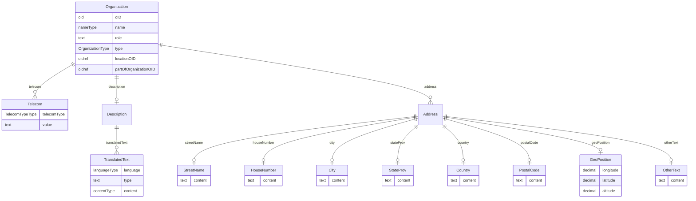

# Class: Organization

_An organization can reference a parent organization. Users may be associated with an Organization. An Organization may be associated with a Location. A User, Location, or Organization may have an address._


URI: [odm:Organization](http://www.cdisc.org/ns/odm/v2.0/Organization)





<!-- no inheritance hierarchy -->


## Slots

| Name | Cardinality* and Range | Description | Inheritance |
| ---  | --- | --- | --- |
| [oID](oID.md) | 1..1 <br/> [oid](oid.md) | Unique identifier for the organization. | direct |
| [name](name.md) | 1..1 <br/> [nameType](nameType.md) | Formal, human readable name of the organization. | direct |
| [role](role.md) | 0..1 <br/> [text](text.md) | Role of the organization in the current study. | direct |
| [type](type.md) | 1..1 <br/> [OrganizationType](OrganizationType.md) | Categorization of organizations associated with clinical studies. | direct |
| [locationOID](locationOID.md) | 0..1 <br/> [oidref](oidref.md) | Reference to a location where data is collected and/or study subjects are tre... | direct |
| [partOfOrganizationOID](partOfOrganizationOID.md) | 0..1 <br/> [oidref](oidref.md) | Reference to a parent organization. | direct |
| [description](description.md) | 0..1 <br/> [Description](Description.md) | Description reference: A free-text description of the containing metadata com... | direct |
| [address](address.md) | 0..* <br/> [Address](Address.md) | Address reference: The postal address for a user, location, or organization. | direct |
| [telecom](telecom.md) | 0..* <br/> [Telecom](Telecom.md) | Telecom reference: The telecommunication contacts points of a user, a locatio... | direct |

_* See [LinkML documentation](https://linkml.io/linkml/schemas/slots.html#slot-cardinality) for cardinality definitions._


## Usages

| used by | used in | type | used |
| ---  | --- | --- | --- |
| [AdminData](AdminData.md) | [organization](organization.md) | range | [Organization](Organization.md) |


## See Also

* [https://wiki.cdisc.org/display/PUB/Organization](https://wiki.cdisc.org/display/PUB/Organization)

## Identifier and Mapping Information


### Schema Source


* from schema: http://www.cdisc.org/ns/odm/v2.0


## Mappings

| Mapping Type | Mapped Value |
| ---  | ---  |
| self | odm:Organization |
| native | odm:Organization |


## LinkML Source

<!-- TODO: investigate https://stackoverflow.com/questions/37606292/how-to-create-tabbed-code-blocks-in-mkdocs-or-sphinx -->

### Direct

<details>
```yaml
name: Organization
description: An organization can reference a parent organization. Users may be associated
  with an Organization. An Organization may be associated with a Location. A User,
  Location, or Organization may have an address.
from_schema: http://www.cdisc.org/ns/odm/v2.0
see_also:
- https://wiki.cdisc.org/display/PUB/Organization
rank: 1000
slots:
- oID
- name
- role
- type
- locationOID
- partOfOrganizationOID
- description
- address
- telecom
slot_usage:
  oID:
    name: oID
    description: Unique identifier for the organization.
    comments:
    - 'Required

      range: oid

      Must be unique within the Organization elements for a study.'
    domain_of:
    - Study
    - MetaDataVersion
    - Standard
    - ValueListDef
    - WhereClauseDef
    - StudyEventGroupDef
    - StudyEventDef
    - ItemGroupDef
    - ItemDef
    - CodeList
    - MethodDef
    - ConditionDef
    - CommentDef
    - StudyIndication
    - StudyIntervention
    - StudyObjective
    - StudyEndPoint
    - StudyTargetPopulation
    - StudyEstimand
    - Arm
    - Epoch
    - StudyParameter
    - StudyTiming
    - TransitionTimingConstraint
    - AbsoluteTimingConstraint
    - RelativeTimingConstraint
    - DurationTimingConstraint
    - WorkflowDef
    - Transition
    - Branching
    - Criterion
    - User
    - Organization
    - Location
    - SignatureDef
    - Query
    range: oid
    required: true
  name:
    name: name
    description: Formal, human readable name of the organization.
    comments:
    - 'Required

      range: name

      Must be unique within the set of Organization elements for a study.'
    domain_of:
    - Alias
    - MetaDataVersion
    - Standard
    - StudyEventGroupDef
    - StudyEventDef
    - ItemGroupDef
    - Class
    - SubClass
    - SourceItem
    - Resource
    - ItemDef
    - CodeList
    - MethodDef
    - Parameter
    - ReturnValue
    - ConditionDef
    - StudyObjective
    - StudyEndPoint
    - StudyTargetPopulation
    - StudyEstimand
    - Arm
    - Epoch
    - StudyTiming
    - TransitionTimingConstraint
    - AbsoluteTimingConstraint
    - RelativeTimingConstraint
    - DurationTimingConstraint
    - WorkflowDef
    - Transition
    - Branching
    - Criterion
    - Organization
    - Location
    - Query
    range: nameType
    required: true
  role:
    name: role
    description: Role of the organization in the current study.
    comments:
    - 'Optional

      range: text'
    domain_of:
    - ItemRef
    - Organization
    - Location
    range: text
  type:
    name: type
    description: Categorization of organizations associated with clinical studies.
    comments:
    - 'Required

      enum values: (Sponsor | Site | CRO | Lab | Other | TechnologyProvider)

      An ODM extension is required if additional Type values are needed.'
    domain_of:
    - TranslatedText
    - PDFPageRef
    - Standard
    - StudyEventDef
    - ItemGroupDef
    - Origin
    - Resource
    - MethodDef
    - StudyEndPoint
    - TransitionTimingConstraint
    - RelativeTimingConstraint
    - Branching
    - Organization
    - Query
    range: OrganizationType
    required: true
  locationOID:
    name: locationOID
    description: Reference to a location where data is collected and/or study subjects
      are treated.
    comments:
    - 'Optional

      range: oidref

      Must match the OID attribute for a Location element for the study.'
    domain_of:
    - User
    - Organization
    - SiteRef
    - LocationRef
    range: oidref
  partOfOrganizationOID:
    name: partOfOrganizationOID
    description: Reference to a parent organization.
    comments:
    - 'Optional

      range: oidref

      Must match the OID Organization within the study.'
    domain_of:
    - Organization
    range: oidref
  description:
    name: description
    domain_of:
    - Study
    - MetaDataVersion
    - ValueListDef
    - StudyEventGroupRef
    - StudyEventGroupDef
    - StudyEventDef
    - ItemGroupDef
    - Origin
    - ItemDef
    - CodeList
    - CodeListItem
    - MethodDef
    - ConditionDef
    - CommentDef
    - Protocol
    - StudyStructure
    - TrialPhase
    - StudyIndication
    - StudyIntervention
    - StudyObjective
    - StudyEndPoint
    - StudyTargetPopulation
    - StudyEstimand
    - IntercurrentEvent
    - SummaryMeasure
    - Arm
    - Epoch
    - TransitionTimingConstraint
    - AbsoluteTimingConstraint
    - RelativeTimingConstraint
    - DurationTimingConstraint
    - WorkflowDef
    - Criterion
    - Organization
    - Location
    - ODMFileMetadata
    range: Description
    maximum_cardinality: 1
  address:
    name: address
    multivalued: true
    domain_of:
    - User
    - Organization
    - Location
    range: Address
    inlined: true
    inlined_as_list: true
  telecom:
    name: telecom
    multivalued: true
    domain_of:
    - User
    - Organization
    - Location
    range: Telecom
    inlined: true
    inlined_as_list: true
class_uri: odm:Organization

```
</details>

### Induced

<details>
```yaml
name: Organization
description: An organization can reference a parent organization. Users may be associated
  with an Organization. An Organization may be associated with a Location. A User,
  Location, or Organization may have an address.
from_schema: http://www.cdisc.org/ns/odm/v2.0
see_also:
- https://wiki.cdisc.org/display/PUB/Organization
rank: 1000
slot_usage:
  oID:
    name: oID
    description: Unique identifier for the organization.
    comments:
    - 'Required

      range: oid

      Must be unique within the Organization elements for a study.'
    domain_of:
    - Study
    - MetaDataVersion
    - Standard
    - ValueListDef
    - WhereClauseDef
    - StudyEventGroupDef
    - StudyEventDef
    - ItemGroupDef
    - ItemDef
    - CodeList
    - MethodDef
    - ConditionDef
    - CommentDef
    - StudyIndication
    - StudyIntervention
    - StudyObjective
    - StudyEndPoint
    - StudyTargetPopulation
    - StudyEstimand
    - Arm
    - Epoch
    - StudyParameter
    - StudyTiming
    - TransitionTimingConstraint
    - AbsoluteTimingConstraint
    - RelativeTimingConstraint
    - DurationTimingConstraint
    - WorkflowDef
    - Transition
    - Branching
    - Criterion
    - User
    - Organization
    - Location
    - SignatureDef
    - Query
    range: oid
    required: true
  name:
    name: name
    description: Formal, human readable name of the organization.
    comments:
    - 'Required

      range: name

      Must be unique within the set of Organization elements for a study.'
    domain_of:
    - Alias
    - MetaDataVersion
    - Standard
    - StudyEventGroupDef
    - StudyEventDef
    - ItemGroupDef
    - Class
    - SubClass
    - SourceItem
    - Resource
    - ItemDef
    - CodeList
    - MethodDef
    - Parameter
    - ReturnValue
    - ConditionDef
    - StudyObjective
    - StudyEndPoint
    - StudyTargetPopulation
    - StudyEstimand
    - Arm
    - Epoch
    - StudyTiming
    - TransitionTimingConstraint
    - AbsoluteTimingConstraint
    - RelativeTimingConstraint
    - DurationTimingConstraint
    - WorkflowDef
    - Transition
    - Branching
    - Criterion
    - Organization
    - Location
    - Query
    range: nameType
    required: true
  role:
    name: role
    description: Role of the organization in the current study.
    comments:
    - 'Optional

      range: text'
    domain_of:
    - ItemRef
    - Organization
    - Location
    range: text
  type:
    name: type
    description: Categorization of organizations associated with clinical studies.
    comments:
    - 'Required

      enum values: (Sponsor | Site | CRO | Lab | Other | TechnologyProvider)

      An ODM extension is required if additional Type values are needed.'
    domain_of:
    - TranslatedText
    - PDFPageRef
    - Standard
    - StudyEventDef
    - ItemGroupDef
    - Origin
    - Resource
    - MethodDef
    - StudyEndPoint
    - TransitionTimingConstraint
    - RelativeTimingConstraint
    - Branching
    - Organization
    - Query
    range: OrganizationType
    required: true
  locationOID:
    name: locationOID
    description: Reference to a location where data is collected and/or study subjects
      are treated.
    comments:
    - 'Optional

      range: oidref

      Must match the OID attribute for a Location element for the study.'
    domain_of:
    - User
    - Organization
    - SiteRef
    - LocationRef
    range: oidref
  partOfOrganizationOID:
    name: partOfOrganizationOID
    description: Reference to a parent organization.
    comments:
    - 'Optional

      range: oidref

      Must match the OID Organization within the study.'
    domain_of:
    - Organization
    range: oidref
  description:
    name: description
    domain_of:
    - Study
    - MetaDataVersion
    - ValueListDef
    - StudyEventGroupRef
    - StudyEventGroupDef
    - StudyEventDef
    - ItemGroupDef
    - Origin
    - ItemDef
    - CodeList
    - CodeListItem
    - MethodDef
    - ConditionDef
    - CommentDef
    - Protocol
    - StudyStructure
    - TrialPhase
    - StudyIndication
    - StudyIntervention
    - StudyObjective
    - StudyEndPoint
    - StudyTargetPopulation
    - StudyEstimand
    - IntercurrentEvent
    - SummaryMeasure
    - Arm
    - Epoch
    - TransitionTimingConstraint
    - AbsoluteTimingConstraint
    - RelativeTimingConstraint
    - DurationTimingConstraint
    - WorkflowDef
    - Criterion
    - Organization
    - Location
    - ODMFileMetadata
    range: Description
    maximum_cardinality: 1
  address:
    name: address
    multivalued: true
    domain_of:
    - User
    - Organization
    - Location
    range: Address
    inlined: true
    inlined_as_list: true
  telecom:
    name: telecom
    multivalued: true
    domain_of:
    - User
    - Organization
    - Location
    range: Telecom
    inlined: true
    inlined_as_list: true
attributes:
  oID:
    name: oID
    description: Unique identifier for the organization.
    comments:
    - 'Required

      range: oid

      Must be unique within the Organization elements for a study.'
    from_schema: http://www.cdisc.org/ns/odm/v2.0
    rank: 1000
    identifier: true
    alias: oID
    owner: Organization
    domain_of:
    - Study
    - MetaDataVersion
    - Standard
    - ValueListDef
    - WhereClauseDef
    - StudyEventGroupDef
    - StudyEventDef
    - ItemGroupDef
    - ItemDef
    - CodeList
    - MethodDef
    - ConditionDef
    - CommentDef
    - StudyIndication
    - StudyIntervention
    - StudyObjective
    - StudyEndPoint
    - StudyTargetPopulation
    - StudyEstimand
    - Arm
    - Epoch
    - StudyParameter
    - StudyTiming
    - TransitionTimingConstraint
    - AbsoluteTimingConstraint
    - RelativeTimingConstraint
    - DurationTimingConstraint
    - WorkflowDef
    - Transition
    - Branching
    - Criterion
    - User
    - Organization
    - Location
    - SignatureDef
    - Query
    range: oid
    required: true
  name:
    name: name
    description: Formal, human readable name of the organization.
    comments:
    - 'Required

      range: name

      Must be unique within the set of Organization elements for a study.'
    from_schema: http://www.cdisc.org/ns/odm/v2.0
    rank: 1000
    alias: name
    owner: Organization
    domain_of:
    - Alias
    - MetaDataVersion
    - Standard
    - StudyEventGroupDef
    - StudyEventDef
    - ItemGroupDef
    - Class
    - SubClass
    - SourceItem
    - Resource
    - ItemDef
    - CodeList
    - MethodDef
    - Parameter
    - ReturnValue
    - ConditionDef
    - StudyObjective
    - StudyEndPoint
    - StudyTargetPopulation
    - StudyEstimand
    - Arm
    - Epoch
    - StudyTiming
    - TransitionTimingConstraint
    - AbsoluteTimingConstraint
    - RelativeTimingConstraint
    - DurationTimingConstraint
    - WorkflowDef
    - Transition
    - Branching
    - Criterion
    - Organization
    - Location
    - Query
    range: nameType
    required: true
  role:
    name: role
    description: Role of the organization in the current study.
    comments:
    - 'Optional

      range: text'
    from_schema: http://www.cdisc.org/ns/odm/v2.0
    rank: 1000
    alias: role
    owner: Organization
    domain_of:
    - ItemRef
    - Organization
    - Location
    range: text
  type:
    name: type
    description: Categorization of organizations associated with clinical studies.
    comments:
    - 'Required

      enum values: (Sponsor | Site | CRO | Lab | Other | TechnologyProvider)

      An ODM extension is required if additional Type values are needed.'
    from_schema: http://www.cdisc.org/ns/odm/v2.0
    rank: 1000
    alias: type
    owner: Organization
    domain_of:
    - TranslatedText
    - PDFPageRef
    - Standard
    - StudyEventDef
    - ItemGroupDef
    - Origin
    - Resource
    - MethodDef
    - StudyEndPoint
    - TransitionTimingConstraint
    - RelativeTimingConstraint
    - Branching
    - Organization
    - Query
    range: OrganizationType
    required: true
  locationOID:
    name: locationOID
    description: Reference to a location where data is collected and/or study subjects
      are treated.
    comments:
    - 'Optional

      range: oidref

      Must match the OID attribute for a Location element for the study.'
    from_schema: http://www.cdisc.org/ns/odm/v2.0
    rank: 1000
    alias: locationOID
    owner: Organization
    domain_of:
    - User
    - Organization
    - SiteRef
    - LocationRef
    range: oidref
  partOfOrganizationOID:
    name: partOfOrganizationOID
    description: Reference to a parent organization.
    comments:
    - 'Optional

      range: oidref

      Must match the OID Organization within the study.'
    from_schema: http://www.cdisc.org/ns/odm/v2.0
    rank: 1000
    alias: partOfOrganizationOID
    owner: Organization
    domain_of:
    - Organization
    range: oidref
  description:
    name: description
    description: 'Description reference: A free-text description of the containing
      metadata component, unless restricted by Business Rules.'
    from_schema: http://www.cdisc.org/ns/odm/v2.0
    rank: 1000
    identifier: false
    alias: description
    owner: Organization
    domain_of:
    - Study
    - MetaDataVersion
    - ValueListDef
    - StudyEventGroupRef
    - StudyEventGroupDef
    - StudyEventDef
    - ItemGroupDef
    - Origin
    - ItemDef
    - CodeList
    - CodeListItem
    - MethodDef
    - ConditionDef
    - CommentDef
    - Protocol
    - StudyStructure
    - TrialPhase
    - StudyIndication
    - StudyIntervention
    - StudyObjective
    - StudyEndPoint
    - StudyTargetPopulation
    - StudyEstimand
    - IntercurrentEvent
    - SummaryMeasure
    - Arm
    - Epoch
    - TransitionTimingConstraint
    - AbsoluteTimingConstraint
    - RelativeTimingConstraint
    - DurationTimingConstraint
    - WorkflowDef
    - Criterion
    - Organization
    - Location
    - ODMFileMetadata
    range: Description
    maximum_cardinality: 1
  address:
    name: address
    description: 'Address reference: The postal address for a user, location, or organization.'
    from_schema: http://www.cdisc.org/ns/odm/v2.0
    rank: 1000
    multivalued: true
    identifier: false
    alias: address
    owner: Organization
    domain_of:
    - User
    - Organization
    - Location
    range: Address
    inlined: true
    inlined_as_list: true
  telecom:
    name: telecom
    description: 'Telecom reference: The telecommunication contacts points of a user,
      a location, or an organization. The Type attribute designates the type of contact.'
    from_schema: http://www.cdisc.org/ns/odm/v2.0
    rank: 1000
    multivalued: true
    identifier: false
    alias: telecom
    owner: Organization
    domain_of:
    - User
    - Organization
    - Location
    range: Telecom
    inlined: true
    inlined_as_list: true
class_uri: odm:Organization

```
</details>