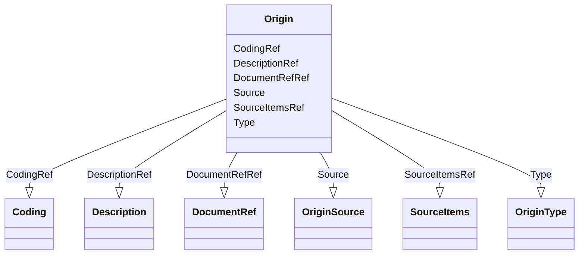

# Class: Origin


_Origin defines the source metadata, where applicable, for ODM ItemRefs or ItemGroupRefs. Origin as a child element replaces the Origin attribute in ODM v1.3 that exists for the ItemDef and ItemGroupDef elements.The Origin element is based on the def:Origin element in Define-XML v2.1 with the Trace-XML v1.0 extension. Element NameOriginParent ElementsItemGroupDef, ItemRefElement XPath(s)/ODM/Study/MetaDataVersion/ValueListDef/ItemRef/Origin/ODM/Study/MetaDataVersion/ItemGroupDef/Origin/ODM/Study/MetaDataVersion/ItemGroupDef/ItemRef/OriginElement Textual ValueNoneAttributesType, SourceChild Elements(Description?, SourceItems?, Coding*, DocumentRef*)The SourceItems element contains SourceItem child elements that reference the source variables, if any, for a given ItemRef. SourceItem elements provide machine-readable traceability and identify specific arguments for a MethodDef, specially when used with an Origin with Type="Derived".Usage/Business Rules_


URI: [odm:Origin](http://www.cdisc.org/ns/odm/v2.0/Origin)





<!-- no inheritance hierarchy -->


## Slots

| Name | Cardinality and Range | Description | Inheritance |
| ---  | --- | --- | --- |
| [Type](Type.md) | 1..1 <br/> [OriginType](OriginType.md) | Identifies how the clinical data values were obtained | direct |
| [Source](Source.md) | 0..1 <br/> [OriginSource](OriginSource.md) | I ndicates the party responsible for the data's origin type | direct |
| [DescriptionRef](DescriptionRef.md) | 0..1 <br/> [Description](Description.md) |  | direct |
| [SourceItemsRef](SourceItemsRef.md) | 0..1 <br/> [SourceItems](SourceItems.md) |  | direct |
| [CodingRef](CodingRef.md) | 0..* <br/> [Coding](Coding.md) |  | direct |
| [DocumentRefRef](DocumentRefRef.md) | 0..* <br/> [DocumentRef](DocumentRef.md) | The DocumentRef element is a container for page references in a PDF file | direct |


## Usages

| used by | used in | type | used |
| ---  | --- | --- | --- |
| [ItemGroupDef](ItemGroupDef.md) | [OriginRef](OriginRef.md) | range | [Origin](Origin.md) |
| [ItemRef](ItemRef.md) | [OriginRef](OriginRef.md) | range | [Origin](Origin.md) |


## See Also

* [https://wiki.cdisc.org/display/ODM2/Origin](https://wiki.cdisc.org/display/ODM2/Origin)

## Identifier and Mapping Information


### Schema Source


* from schema: http://www.cdisc.org/ns/odm/v2.0


## Mappings

| Mapping Type | Mapped Value |
| ---  | ---  |
| self | odm:Origin |
| native | odm:Origin |


## LinkML Source

<!-- TODO: investigate https://stackoverflow.com/questions/37606292/how-to-create-tabbed-code-blocks-in-mkdocs-or-sphinx -->

### Direct

<details>
```yaml
name: Origin
description: Origin defines the source metadata, where applicable, for ODM ItemRefs
  or ItemGroupRefs. Origin as a child element replaces the Origin attribute in ODM
  v1.3 that exists for the ItemDef and ItemGroupDef elements.The Origin element is
  based on the def:Origin element in Define-XML v2.1 with the Trace-XML v1.0 extension.
  Element NameOriginParent ElementsItemGroupDef, ItemRefElement XPath(s)/ODM/Study/MetaDataVersion/ValueListDef/ItemRef/Origin/ODM/Study/MetaDataVersion/ItemGroupDef/Origin/ODM/Study/MetaDataVersion/ItemGroupDef/ItemRef/OriginElement
  Textual ValueNoneAttributesType, SourceChild Elements(Description?, SourceItems?,
  Coding*, DocumentRef*)The SourceItems element contains SourceItem child elements
  that reference the source variables, if any, for a given ItemRef. SourceItem elements
  provide machine-readable traceability and identify specific arguments for a MethodDef,
  specially when used with an Origin with Type="Derived".Usage/Business Rules
from_schema: http://www.cdisc.org/ns/odm/v2.0
see_also:
- https://wiki.cdisc.org/display/ODM2/Origin
slots:
- Type
- Source
- DescriptionRef
- SourceItemsRef
- CodingRef
- DocumentRefRef
slot_usage:
  Type:
    name: Type
    description: Identifies how the clinical data values were obtained.
    comments:
    - 'Required

      range:text

      The list of allowable Origin/@Type attribute values is provided as non-extensible
      codelists in the CDISC Controlled Terminology, Define-XML package. * Users are
      encouraged to refer to the most recent version of the CDISC Controlled Terminology
      ( https://www.cdisc.org/standards/terminology/controlled-terminology ).'
    domain_of:
    - TranslatedText
    - PDFPageRef
    - Standard
    - StudyEventDef
    - ItemGroupDef
    - Origin
    - Resource
    - MethodDef
    - StudyEndPoint
    - TransitionTimingConstraint
    - RelativeTimingConstraint
    - Branching
    - Organization
    - Query
    range: OriginType
    required: true
  Source:
    name: Source
    description: I ndicates the party responsible for the data's origin type.
    comments:
    - 'Optional

      range:text

      The list of allowable Origin/@Source attribute values is provided in the CDISC
      Controlled Terminology, Define-XML package. * Users are encouraged to refer
      to the most recent version of the CDISC Controlled Terminology ( https://www.cdisc.org/standards/terminology/controlled-terminology
      ).'
    domain_of:
    - Origin
    - Query
    range: OriginSource
  DescriptionRef:
    name: DescriptionRef
    domain_of:
    - Study
    - MetaDataVersion
    - ValueListDef
    - StudyEventGroupRef
    - StudyEventGroupDef
    - StudyEventDef
    - ItemGroupDef
    - Origin
    - ItemDef
    - CodeList
    - CodeListItem
    - MethodDef
    - ConditionDef
    - CommentDef
    - Protocol
    - StudyStructure
    - TrialPhase
    - StudyIndication
    - StudyIntervention
    - StudyObjective
    - StudyEndPoint
    - StudyTargetPopulation
    - StudyEstimand
    - IntercurrentEvent
    - SummaryMeasure
    - Arm
    - Epoch
    - TransitionTimingConstraint
    - AbsoluteTimingConstraint
    - RelativeTimingConstraint
    - DurationTimingConstraint
    - WorkflowDef
    - Criterion
    - ExceptionEvent
    - Organization
    - Location
    - ODMFileMetadata
    range: Description
    maximum_cardinality: 1
  SourceItemsRef:
    name: SourceItemsRef
    domain_of:
    - Origin
    range: SourceItems
    maximum_cardinality: 1
  CodingRef:
    name: CodingRef
    multivalued: true
    domain_of:
    - StudyEventGroupDef
    - StudyEventDef
    - ItemGroupDef
    - Origin
    - SourceItems
    - SourceItem
    - ItemDef
    - CodeList
    - CodeListItem
    - StudyIndication
    - StudyIntervention
    - StudyTargetPopulation
    - StudyParameter
    - ParameterValue
    - Criterion
    - Annotation
    range: Coding
    inlined: true
    inlined_as_list: true
  DocumentRefRef:
    name: DocumentRefRef
    multivalued: true
    domain_of:
    - AnnotatedCRF
    - SupplementalDoc
    - Origin
    - MethodDef
    - CommentDef
    range: DocumentRef
    inlined: true
    inlined_as_list: true
class_uri: odm:Origin

```
</details>

### Induced

<details>
```yaml
name: Origin
description: Origin defines the source metadata, where applicable, for ODM ItemRefs
  or ItemGroupRefs. Origin as a child element replaces the Origin attribute in ODM
  v1.3 that exists for the ItemDef and ItemGroupDef elements.The Origin element is
  based on the def:Origin element in Define-XML v2.1 with the Trace-XML v1.0 extension.
  Element NameOriginParent ElementsItemGroupDef, ItemRefElement XPath(s)/ODM/Study/MetaDataVersion/ValueListDef/ItemRef/Origin/ODM/Study/MetaDataVersion/ItemGroupDef/Origin/ODM/Study/MetaDataVersion/ItemGroupDef/ItemRef/OriginElement
  Textual ValueNoneAttributesType, SourceChild Elements(Description?, SourceItems?,
  Coding*, DocumentRef*)The SourceItems element contains SourceItem child elements
  that reference the source variables, if any, for a given ItemRef. SourceItem elements
  provide machine-readable traceability and identify specific arguments for a MethodDef,
  specially when used with an Origin with Type="Derived".Usage/Business Rules
from_schema: http://www.cdisc.org/ns/odm/v2.0
see_also:
- https://wiki.cdisc.org/display/ODM2/Origin
slot_usage:
  Type:
    name: Type
    description: Identifies how the clinical data values were obtained.
    comments:
    - 'Required

      range:text

      The list of allowable Origin/@Type attribute values is provided as non-extensible
      codelists in the CDISC Controlled Terminology, Define-XML package. * Users are
      encouraged to refer to the most recent version of the CDISC Controlled Terminology
      ( https://www.cdisc.org/standards/terminology/controlled-terminology ).'
    domain_of:
    - TranslatedText
    - PDFPageRef
    - Standard
    - StudyEventDef
    - ItemGroupDef
    - Origin
    - Resource
    - MethodDef
    - StudyEndPoint
    - TransitionTimingConstraint
    - RelativeTimingConstraint
    - Branching
    - Organization
    - Query
    range: OriginType
    required: true
  Source:
    name: Source
    description: I ndicates the party responsible for the data's origin type.
    comments:
    - 'Optional

      range:text

      The list of allowable Origin/@Source attribute values is provided in the CDISC
      Controlled Terminology, Define-XML package. * Users are encouraged to refer
      to the most recent version of the CDISC Controlled Terminology ( https://www.cdisc.org/standards/terminology/controlled-terminology
      ).'
    domain_of:
    - Origin
    - Query
    range: OriginSource
  DescriptionRef:
    name: DescriptionRef
    domain_of:
    - Study
    - MetaDataVersion
    - ValueListDef
    - StudyEventGroupRef
    - StudyEventGroupDef
    - StudyEventDef
    - ItemGroupDef
    - Origin
    - ItemDef
    - CodeList
    - CodeListItem
    - MethodDef
    - ConditionDef
    - CommentDef
    - Protocol
    - StudyStructure
    - TrialPhase
    - StudyIndication
    - StudyIntervention
    - StudyObjective
    - StudyEndPoint
    - StudyTargetPopulation
    - StudyEstimand
    - IntercurrentEvent
    - SummaryMeasure
    - Arm
    - Epoch
    - TransitionTimingConstraint
    - AbsoluteTimingConstraint
    - RelativeTimingConstraint
    - DurationTimingConstraint
    - WorkflowDef
    - Criterion
    - ExceptionEvent
    - Organization
    - Location
    - ODMFileMetadata
    range: Description
    maximum_cardinality: 1
  SourceItemsRef:
    name: SourceItemsRef
    domain_of:
    - Origin
    range: SourceItems
    maximum_cardinality: 1
  CodingRef:
    name: CodingRef
    multivalued: true
    domain_of:
    - StudyEventGroupDef
    - StudyEventDef
    - ItemGroupDef
    - Origin
    - SourceItems
    - SourceItem
    - ItemDef
    - CodeList
    - CodeListItem
    - StudyIndication
    - StudyIntervention
    - StudyTargetPopulation
    - StudyParameter
    - ParameterValue
    - Criterion
    - Annotation
    range: Coding
    inlined: true
    inlined_as_list: true
  DocumentRefRef:
    name: DocumentRefRef
    multivalued: true
    domain_of:
    - AnnotatedCRF
    - SupplementalDoc
    - Origin
    - MethodDef
    - CommentDef
    range: DocumentRef
    inlined: true
    inlined_as_list: true
attributes:
  Type:
    name: Type
    description: Identifies how the clinical data values were obtained.
    comments:
    - 'Required

      range:text

      The list of allowable Origin/@Type attribute values is provided as non-extensible
      codelists in the CDISC Controlled Terminology, Define-XML package. * Users are
      encouraged to refer to the most recent version of the CDISC Controlled Terminology
      ( https://www.cdisc.org/standards/terminology/controlled-terminology ).'
    from_schema: http://www.cdisc.org/ns/odm/v2.0
    rank: 1000
    alias: Type
    owner: Origin
    domain_of:
    - TranslatedText
    - PDFPageRef
    - Standard
    - StudyEventDef
    - ItemGroupDef
    - Origin
    - Resource
    - MethodDef
    - StudyEndPoint
    - TransitionTimingConstraint
    - RelativeTimingConstraint
    - Branching
    - Organization
    - Query
    range: OriginType
    required: true
  Source:
    name: Source
    description: I ndicates the party responsible for the data's origin type.
    comments:
    - 'Optional

      range:text

      The list of allowable Origin/@Source attribute values is provided in the CDISC
      Controlled Terminology, Define-XML package. * Users are encouraged to refer
      to the most recent version of the CDISC Controlled Terminology ( https://www.cdisc.org/standards/terminology/controlled-terminology
      ).'
    from_schema: http://www.cdisc.org/ns/odm/v2.0
    rank: 1000
    alias: Source
    owner: Origin
    domain_of:
    - Origin
    - Query
    range: OriginSource
  DescriptionRef:
    name: DescriptionRef
    from_schema: http://www.cdisc.org/ns/odm/v2.0
    rank: 1000
    identifier: false
    alias: DescriptionRef
    owner: Origin
    domain_of:
    - Study
    - MetaDataVersion
    - ValueListDef
    - StudyEventGroupRef
    - StudyEventGroupDef
    - StudyEventDef
    - ItemGroupDef
    - Origin
    - ItemDef
    - CodeList
    - CodeListItem
    - MethodDef
    - ConditionDef
    - CommentDef
    - Protocol
    - StudyStructure
    - TrialPhase
    - StudyIndication
    - StudyIntervention
    - StudyObjective
    - StudyEndPoint
    - StudyTargetPopulation
    - StudyEstimand
    - IntercurrentEvent
    - SummaryMeasure
    - Arm
    - Epoch
    - TransitionTimingConstraint
    - AbsoluteTimingConstraint
    - RelativeTimingConstraint
    - DurationTimingConstraint
    - WorkflowDef
    - Criterion
    - ExceptionEvent
    - Organization
    - Location
    - ODMFileMetadata
    range: Description
    maximum_cardinality: 1
  SourceItemsRef:
    name: SourceItemsRef
    from_schema: http://www.cdisc.org/ns/odm/v2.0
    rank: 1000
    identifier: false
    alias: SourceItemsRef
    owner: Origin
    domain_of:
    - Origin
    range: SourceItems
    maximum_cardinality: 1
  CodingRef:
    name: CodingRef
    from_schema: http://www.cdisc.org/ns/odm/v2.0
    rank: 1000
    multivalued: true
    identifier: false
    alias: CodingRef
    owner: Origin
    domain_of:
    - StudyEventGroupDef
    - StudyEventDef
    - ItemGroupDef
    - Origin
    - SourceItems
    - SourceItem
    - ItemDef
    - CodeList
    - CodeListItem
    - StudyIndication
    - StudyIntervention
    - StudyTargetPopulation
    - StudyParameter
    - ParameterValue
    - Criterion
    - Annotation
    range: Coding
    inlined: true
    inlined_as_list: true
  DocumentRefRef:
    name: DocumentRefRef
    description: The DocumentRef element is a container for page references in a PDF
      file.
    from_schema: http://www.cdisc.org/ns/odm/v2.0
    rank: 1000
    multivalued: true
    identifier: false
    alias: DocumentRefRef
    owner: Origin
    domain_of:
    - AnnotatedCRF
    - SupplementalDoc
    - Origin
    - MethodDef
    - CommentDef
    range: DocumentRef
    inlined: true
    inlined_as_list: true
class_uri: odm:Origin

```
</details>