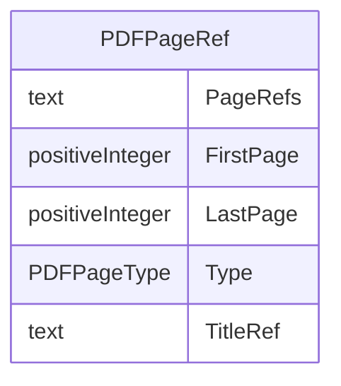

# Class: PDFPageRef

_This element is the container for CRF page references._


URI: [odm:PDFPageRef](http://www.cdisc.org/ns/odm/v2.0/PDFPageRef)





<!-- no inheritance hierarchy -->


## Slots

| Name | Cardinality* and Range | Description | Inheritance |
| ---  | --- | --- | --- |
| [PageRefs](PageRefs.md) | 0..1 <br/> [text](text.md) | List of PDF pages, separated by spaces. Sample: "17 20 32 | direct |
| [FirstPage](FirstPage.md) | 0..1 <br/> [positiveInteger](positiveInteger.md) | First page in a range of pages. Note that the way to indicate the range of pa... | direct |
| [LastPage](LastPage.md) | 0..1 <br/> [positiveInteger](positiveInteger.md) | Last page in a range of pages. Note that the way to indicate the range of pag... | direct |
| [Type](Type.md) | 1..1 <br/> [PDFPageType](PDFPageType.md) | Type of page for page reference(s) indicated in the PageRefs attribute | direct |
| [TitleRef](TitleRef.md) | 0..1 <br/> [text](text.md) | Alternative label to provide a more specific and descriptive reference to a p... | direct |

_* See [LinkML documentation](https://linkml.io/linkml/schemas/slots.html#slot-cardinality) for cardinality definitions._


## Usages

| used by | used in | type | used |
| ---  | --- | --- | --- |
| [DocumentRef](DocumentRef.md) | [PDFPageRefRef](PDFPageRefRef.md) | range | [PDFPageRef](PDFPageRef.md) |


## See Also

* [https://wiki.cdisc.org/display/PUB/PDFPageRef](https://wiki.cdisc.org/display/PUB/PDFPageRef)

## Identifier and Mapping Information


### Schema Source


* from schema: http://www.cdisc.org/ns/odm/v2.0


## Mappings

| Mapping Type | Mapped Value |
| ---  | ---  |
| self | odm:PDFPageRef |
| native | odm:PDFPageRef |


## LinkML Source

<!-- TODO: investigate https://stackoverflow.com/questions/37606292/how-to-create-tabbed-code-blocks-in-mkdocs-or-sphinx -->

### Direct

<details>
```yaml
name: PDFPageRef
description: This element is the container for CRF page references.
from_schema: http://www.cdisc.org/ns/odm/v2.0
see_also:
- https://wiki.cdisc.org/display/PUB/PDFPageRef
rank: 1000
slots:
- PageRefs
- FirstPage
- LastPage
- Type
- TitleRef
slot_usage:
  PageRefs:
    name: PageRefs
    description: 'List of PDF pages, separated by spaces. Sample: "17 20 32'
    comments:
    - 'Optional

      range: text'
    domain_of:
    - PDFPageRef
    range: text
  FirstPage:
    name: FirstPage
    description: First page in a range of pages. Note that the way to indicate the
      range of pages depends on the associated Type attribute provided.
    comments:
    - 'Conditional Required if PageRefs is not provided.

      range: positiveInteger'
    domain_of:
    - PDFPageRef
    range: positiveInteger
  LastPage:
    name: LastPage
    description: Last page in a range of pages. Note that the way to indicate the
      range of pages depends on the associated Type attribute provided.
    comments:
    - 'Conditional Required if PageRefs is not provided.

      range: positiveInteger'
    domain_of:
    - PDFPageRef
    range: positiveInteger
  Type:
    name: Type
    description: Type of page for page reference(s) indicated in the PageRefs attribute
    comments:
    - 'Required

      enum values: (PhysicalRef | NamedDestination)

      When Type="NamedDestination", NamedDestinations have to be created within the
      PDF document to be able to link to them via a hyperlink.'
    domain_of:
    - TranslatedText
    - PDFPageRef
    - Standard
    - StudyEventDef
    - ItemGroupDef
    - Origin
    - Resource
    - MethodDef
    - StudyEndPoint
    - TransitionTimingConstraint
    - RelativeTimingConstraint
    - Branching
    - Organization
    - Query
    range: PDFPageType
    required: true
  TitleRef:
    name: TitleRef
    description: Alternative label to provide a more specific and descriptive reference
      to a page link.
    comments:
    - 'Optional

      range: text'
    domain_of:
    - PDFPageRef
    - Leaf
    range: text
class_uri: odm:PDFPageRef

```
</details>

### Induced

<details>
```yaml
name: PDFPageRef
description: This element is the container for CRF page references.
from_schema: http://www.cdisc.org/ns/odm/v2.0
see_also:
- https://wiki.cdisc.org/display/PUB/PDFPageRef
rank: 1000
slot_usage:
  PageRefs:
    name: PageRefs
    description: 'List of PDF pages, separated by spaces. Sample: "17 20 32'
    comments:
    - 'Optional

      range: text'
    domain_of:
    - PDFPageRef
    range: text
  FirstPage:
    name: FirstPage
    description: First page in a range of pages. Note that the way to indicate the
      range of pages depends on the associated Type attribute provided.
    comments:
    - 'Conditional Required if PageRefs is not provided.

      range: positiveInteger'
    domain_of:
    - PDFPageRef
    range: positiveInteger
  LastPage:
    name: LastPage
    description: Last page in a range of pages. Note that the way to indicate the
      range of pages depends on the associated Type attribute provided.
    comments:
    - 'Conditional Required if PageRefs is not provided.

      range: positiveInteger'
    domain_of:
    - PDFPageRef
    range: positiveInteger
  Type:
    name: Type
    description: Type of page for page reference(s) indicated in the PageRefs attribute
    comments:
    - 'Required

      enum values: (PhysicalRef | NamedDestination)

      When Type="NamedDestination", NamedDestinations have to be created within the
      PDF document to be able to link to them via a hyperlink.'
    domain_of:
    - TranslatedText
    - PDFPageRef
    - Standard
    - StudyEventDef
    - ItemGroupDef
    - Origin
    - Resource
    - MethodDef
    - StudyEndPoint
    - TransitionTimingConstraint
    - RelativeTimingConstraint
    - Branching
    - Organization
    - Query
    range: PDFPageType
    required: true
  TitleRef:
    name: TitleRef
    description: Alternative label to provide a more specific and descriptive reference
      to a page link.
    comments:
    - 'Optional

      range: text'
    domain_of:
    - PDFPageRef
    - Leaf
    range: text
attributes:
  PageRefs:
    name: PageRefs
    description: 'List of PDF pages, separated by spaces. Sample: "17 20 32'
    comments:
    - 'Optional

      range: text'
    from_schema: http://www.cdisc.org/ns/odm/v2.0
    rank: 1000
    alias: PageRefs
    owner: PDFPageRef
    domain_of:
    - PDFPageRef
    range: text
  FirstPage:
    name: FirstPage
    description: First page in a range of pages. Note that the way to indicate the
      range of pages depends on the associated Type attribute provided.
    comments:
    - 'Conditional Required if PageRefs is not provided.

      range: positiveInteger'
    from_schema: http://www.cdisc.org/ns/odm/v2.0
    rank: 1000
    alias: FirstPage
    owner: PDFPageRef
    domain_of:
    - PDFPageRef
    range: positiveInteger
  LastPage:
    name: LastPage
    description: Last page in a range of pages. Note that the way to indicate the
      range of pages depends on the associated Type attribute provided.
    comments:
    - 'Conditional Required if PageRefs is not provided.

      range: positiveInteger'
    from_schema: http://www.cdisc.org/ns/odm/v2.0
    rank: 1000
    alias: LastPage
    owner: PDFPageRef
    domain_of:
    - PDFPageRef
    range: positiveInteger
  Type:
    name: Type
    description: Type of page for page reference(s) indicated in the PageRefs attribute
    comments:
    - 'Required

      enum values: (PhysicalRef | NamedDestination)

      When Type="NamedDestination", NamedDestinations have to be created within the
      PDF document to be able to link to them via a hyperlink.'
    from_schema: http://www.cdisc.org/ns/odm/v2.0
    rank: 1000
    alias: Type
    owner: PDFPageRef
    domain_of:
    - TranslatedText
    - PDFPageRef
    - Standard
    - StudyEventDef
    - ItemGroupDef
    - Origin
    - Resource
    - MethodDef
    - StudyEndPoint
    - TransitionTimingConstraint
    - RelativeTimingConstraint
    - Branching
    - Organization
    - Query
    range: PDFPageType
    required: true
  TitleRef:
    name: TitleRef
    description: Alternative label to provide a more specific and descriptive reference
      to a page link.
    comments:
    - 'Optional

      range: text'
    from_schema: http://www.cdisc.org/ns/odm/v2.0
    rank: 1000
    identifier: false
    alias: TitleRef
    owner: PDFPageRef
    domain_of:
    - PDFPageRef
    - Leaf
    range: text
class_uri: odm:PDFPageRef

```
</details>