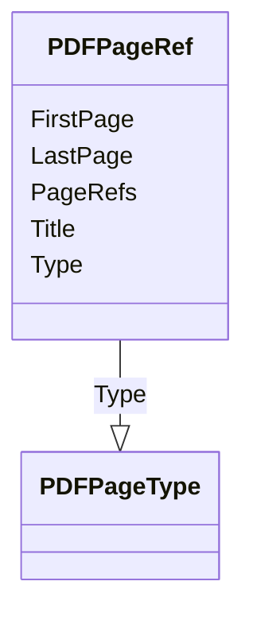

# Class: PDFPageRef


_This element is the container for CRF page references._


URI: [odm:PDFPageRef](http://www.cdisc.org/ns/odm/v2.0/PDFPageRef)





<!-- no inheritance hierarchy -->


## Slots

| Name | Cardinality and Range | Description | Inheritance |
| ---  | --- | --- | --- |
| [PageRefs](PageRefs.md) | 0..1 <br/> [Text](Text.md) | List of PDF pages separated by a space | direct |
| [FirstPage](FirstPage.md) | 0..1 <br/> [Integer](Integer.md) | First page in a range of pages | direct |
| [LastPage](LastPage.md) | 0..1 <br/> [Integer](Integer.md) | Last page in a range of pages | direct |
| [Type](Type.md) | 1..1 <br/> [PDFPageType](PDFPageType.md) | Type of page for page references indicated in the PageRefs attribute | direct |
| [Title](Title.md) | 0..1 <br/> [Text](Text.md) | Text with the label for the document reference | direct |


## Usages

| used by | used in | type | used |
| ---  | --- | --- | --- |
| [DocumentRef](DocumentRef.md) | [PDFPageRefRef](PDFPageRefRef.md) | range | [PDFPageRef](PDFPageRef.md) |


## Identifier and Mapping Information


### Schema Source


* from schema: http://www.cdisc.org/ns/odm/v2.0


## Mappings

| Mapping Type | Mapped Value |
| ---  | ---  |
| self | odm:PDFPageRef |
| native | odm:PDFPageRef |


## LinkML Source

<!-- TODO: investigate https://stackoverflow.com/questions/37606292/how-to-create-tabbed-code-blocks-in-mkdocs-or-sphinx -->

### Direct

<details>
```yaml
name: PDFPageRef
description: This element is the container for CRF page references.
from_schema: http://www.cdisc.org/ns/odm/v2.0
slots:
- PageRefs
- FirstPage
- LastPage
- Type
- Title
slot_usage:
  PageRefs:
    name: PageRefs
    domain_of:
    - PDFPageRef
    range: text
    required: false
  FirstPage:
    name: FirstPage
    domain_of:
    - PDFPageRef
    range: integer
    required: false
  LastPage:
    name: LastPage
    domain_of:
    - PDFPageRef
    range: integer
    required: false
  Type:
    name: Type
    domain_of:
    - PDFPageRef
    - Origin
    - Resource
    - StudyObjective
    - StudyEndPoint
    - TransitionTimingConstraint
    - RelativeTimingConstraint
    - Branching
    - Organization
    - Query
    - StudyEventDef
    - ItemGroupDef
    - MethodDef
    - Standard
    range: PDFPageType
    required: true
  Title:
    name: Title
    domain_of:
    - PDFPageRef
    range: text
    required: false
class_uri: odm:PDFPageRef

```
</details>

### Induced

<details>
```yaml
name: PDFPageRef
description: This element is the container for CRF page references.
from_schema: http://www.cdisc.org/ns/odm/v2.0
slot_usage:
  PageRefs:
    name: PageRefs
    domain_of:
    - PDFPageRef
    range: text
    required: false
  FirstPage:
    name: FirstPage
    domain_of:
    - PDFPageRef
    range: integer
    required: false
  LastPage:
    name: LastPage
    domain_of:
    - PDFPageRef
    range: integer
    required: false
  Type:
    name: Type
    domain_of:
    - PDFPageRef
    - Origin
    - Resource
    - StudyObjective
    - StudyEndPoint
    - TransitionTimingConstraint
    - RelativeTimingConstraint
    - Branching
    - Organization
    - Query
    - StudyEventDef
    - ItemGroupDef
    - MethodDef
    - Standard
    range: PDFPageType
    required: true
  Title:
    name: Title
    domain_of:
    - PDFPageRef
    range: text
    required: false
attributes:
  PageRefs:
    name: PageRefs
    description: List of PDF pages separated by a space.
    from_schema: http://www.cdisc.org/ns/odm/v2.0
    rank: 1000
    alias: PageRefs
    owner: PDFPageRef
    domain_of:
    - PDFPageRef
    range: text
    required: false
  FirstPage:
    name: FirstPage
    description: First page in a range of pages.
    from_schema: http://www.cdisc.org/ns/odm/v2.0
    rank: 1000
    alias: FirstPage
    owner: PDFPageRef
    domain_of:
    - PDFPageRef
    range: integer
    required: false
  LastPage:
    name: LastPage
    description: Last page in a range of pages.
    from_schema: http://www.cdisc.org/ns/odm/v2.0
    rank: 1000
    alias: LastPage
    owner: PDFPageRef
    domain_of:
    - PDFPageRef
    range: integer
    required: false
  Type:
    name: Type
    description: Type of page for page references indicated in the PageRefs attribute.
    from_schema: http://www.cdisc.org/ns/odm/v2.0
    rank: 1000
    alias: Type
    owner: PDFPageRef
    domain_of:
    - PDFPageRef
    - Origin
    - Resource
    - StudyObjective
    - StudyEndPoint
    - TransitionTimingConstraint
    - RelativeTimingConstraint
    - Branching
    - Organization
    - Query
    - StudyEventDef
    - ItemGroupDef
    - MethodDef
    - Standard
    range: PDFPageType
    required: true
  Title:
    name: Title
    description: Text with the label for the document reference.
    from_schema: http://www.cdisc.org/ns/odm/v2.0
    rank: 1000
    alias: Title
    owner: PDFPageRef
    domain_of:
    - PDFPageRef
    range: text
    required: false
class_uri: odm:PDFPageRef

```
</details>