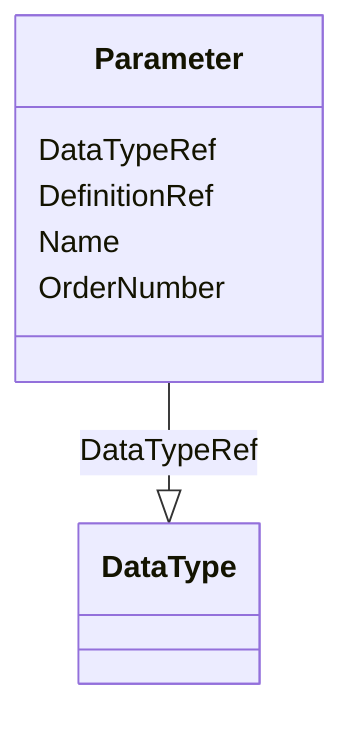

# Class: Parameter


URI: [odm:Parameter](http://www.cdisc.org/ns/odm/v2.0/Parameter)





<!-- no inheritance hierarchy -->


## Slots

| Name | Cardinality and Range | Description | Inheritance |
| ---  | --- | --- | --- |
| [Name](Name.md) | 1..1 <br/> [Name](Name.md) | General observation Sub Class | direct |
| [DataTypeRef](DataTypeRef.md) | 1..1 <br/> [DataType](DataType.md) | The DataType attribute specifies how the corresponding value | direct |
| [DefinitionRef](DefinitionRef.md) | 0..1 <br/> [Text](Text.md) |  | direct |
| [OrderNumber](OrderNumber.md) | 0..1 <br/> [PositiveInteger](PositiveInteger.md) |  | direct |


## Usages

| used by | used in | type | used |
| ---  | --- | --- | --- |
| [MethodSignature](MethodSignature.md) | [ParameterRef](ParameterRef.md) | range | [Parameter](Parameter.md) |


## See Also

* [https://wiki.cdisc.org/display/ODM2/Parameter](https://wiki.cdisc.org/display/ODM2/Parameter)

## Identifier and Mapping Information


### Schema Source


* from schema: http://www.cdisc.org/ns/odm/v2.0


## Mappings

| Mapping Type | Mapped Value |
| ---  | ---  |
| self | odm:Parameter |
| native | odm:Parameter |


## LinkML Source

<!-- TODO: investigate https://stackoverflow.com/questions/37606292/how-to-create-tabbed-code-blocks-in-mkdocs-or-sphinx -->

### Direct

<details>
```yaml
name: Parameter
from_schema: http://www.cdisc.org/ns/odm/v2.0
see_also:
- https://wiki.cdisc.org/display/ODM2/Parameter
slots:
- Name
- DataTypeRef
- DefinitionRef
- OrderNumber
slot_usage:
  Name:
    name: Name
    domain_of:
    - Alias
    - MetaDataVersion
    - Standard
    - StudyEventGroupDef
    - StudyEventDef
    - ItemGroupDef
    - Class
    - SubClass
    - SourceItem
    - Resource
    - ItemDef
    - CodeList
    - MethodDef
    - Parameter
    - ReturnValue
    - ConditionDef
    - StudyObjective
    - StudyEndPoint
    - StudyTargetPopulation
    - StudyEstimand
    - Arm
    - Epoch
    - StudyTiming
    - TransitionTimingConstraint
    - AbsoluteTimingConstraint
    - RelativeTimingConstraint
    - DurationTimingConstraint
    - WorkflowDef
    - Transition
    - Branching
    - Criterion
    - ExceptionEvent
    - Organization
    - Location
    - Query
    range: name
    required: true
  DataTypeRef:
    name: DataTypeRef
    domain_of:
    - ItemDef
    - CodeList
    - Parameter
    - ReturnValue
    range: DataType
    required: true
  DefinitionRef:
    name: DefinitionRef
    domain_of:
    - ItemDef
    - Parameter
    - ReturnValue
    range: text
  OrderNumber:
    name: OrderNumber
    domain_of:
    - StudyEventGroupRef
    - StudyEventRef
    - ItemGroupRef
    - ItemRef
    - CodeListItem
    - Parameter
    - ReturnValue
    - StudyEndPointRef
    range: positiveInteger
class_uri: odm:Parameter

```
</details>

### Induced

<details>
```yaml
name: Parameter
from_schema: http://www.cdisc.org/ns/odm/v2.0
see_also:
- https://wiki.cdisc.org/display/ODM2/Parameter
slot_usage:
  Name:
    name: Name
    domain_of:
    - Alias
    - MetaDataVersion
    - Standard
    - StudyEventGroupDef
    - StudyEventDef
    - ItemGroupDef
    - Class
    - SubClass
    - SourceItem
    - Resource
    - ItemDef
    - CodeList
    - MethodDef
    - Parameter
    - ReturnValue
    - ConditionDef
    - StudyObjective
    - StudyEndPoint
    - StudyTargetPopulation
    - StudyEstimand
    - Arm
    - Epoch
    - StudyTiming
    - TransitionTimingConstraint
    - AbsoluteTimingConstraint
    - RelativeTimingConstraint
    - DurationTimingConstraint
    - WorkflowDef
    - Transition
    - Branching
    - Criterion
    - ExceptionEvent
    - Organization
    - Location
    - Query
    range: name
    required: true
  DataTypeRef:
    name: DataTypeRef
    domain_of:
    - ItemDef
    - CodeList
    - Parameter
    - ReturnValue
    range: DataType
    required: true
  DefinitionRef:
    name: DefinitionRef
    domain_of:
    - ItemDef
    - Parameter
    - ReturnValue
    range: text
  OrderNumber:
    name: OrderNumber
    domain_of:
    - StudyEventGroupRef
    - StudyEventRef
    - ItemGroupRef
    - ItemRef
    - CodeListItem
    - Parameter
    - ReturnValue
    - StudyEndPointRef
    range: positiveInteger
attributes:
  Name:
    name: Name
    description: General observation Sub Class.
    from_schema: http://www.cdisc.org/ns/odm/v2.0
    rank: 1000
    alias: Name
    owner: Parameter
    domain_of:
    - Alias
    - MetaDataVersion
    - Standard
    - StudyEventGroupDef
    - StudyEventDef
    - ItemGroupDef
    - Class
    - SubClass
    - SourceItem
    - Resource
    - ItemDef
    - CodeList
    - MethodDef
    - Parameter
    - ReturnValue
    - ConditionDef
    - StudyObjective
    - StudyEndPoint
    - StudyTargetPopulation
    - StudyEstimand
    - Arm
    - Epoch
    - StudyTiming
    - TransitionTimingConstraint
    - AbsoluteTimingConstraint
    - RelativeTimingConstraint
    - DurationTimingConstraint
    - WorkflowDef
    - Transition
    - Branching
    - Criterion
    - ExceptionEvent
    - Organization
    - Location
    - Query
    range: name
    required: true
  DataTypeRef:
    name: DataTypeRef
    description: "The DataType attribute specifies how the corresponding value\n \
      \                   elements are to be interpreted for comparison and storage."
    from_schema: http://www.cdisc.org/ns/odm/v2.0
    rank: 1000
    alias: DataTypeRef
    owner: Parameter
    domain_of:
    - ItemDef
    - CodeList
    - Parameter
    - ReturnValue
    range: DataType
    required: true
  DefinitionRef:
    name: DefinitionRef
    from_schema: http://www.cdisc.org/ns/odm/v2.0
    rank: 1000
    alias: DefinitionRef
    owner: Parameter
    domain_of:
    - ItemDef
    - Parameter
    - ReturnValue
    range: text
  OrderNumber:
    name: OrderNumber
    from_schema: http://www.cdisc.org/ns/odm/v2.0
    rank: 1000
    alias: OrderNumber
    owner: Parameter
    domain_of:
    - StudyEventGroupRef
    - StudyEventRef
    - ItemGroupRef
    - ItemRef
    - CodeListItem
    - Parameter
    - ReturnValue
    - StudyEndPointRef
    range: positiveInteger
class_uri: odm:Parameter

```
</details>