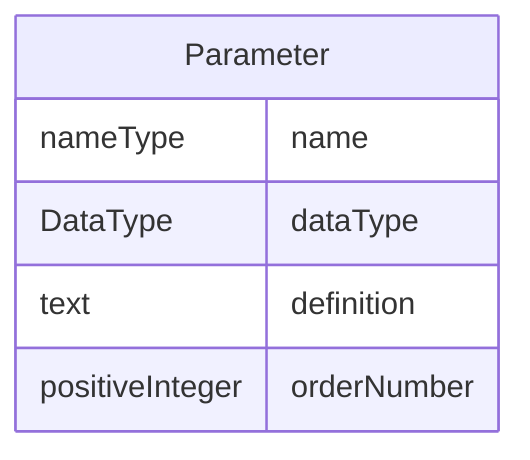

# Class: Parameter

_The Parameter element represents a method parameter used as part of a MethodSignature in MethodDef, ConditionDef, or RangeCheck._


URI: [odm:Parameter](http://www.cdisc.org/ns/odm/v2.0/Parameter)





<!-- no inheritance hierarchy -->


## Slots

| Name | Cardinality* and Range | Description | Inheritance |
| ---  | --- | --- | --- |
| [name](name.md) | 1..1 <br/> [nameType](nameType.md) | The parameter name - typically the name of an ItemDef referenced in the ItemG... | direct |
| [dataType](dataType.md) | 1..1 <br/> [DataType](DataType.md) | Parameter datatype. | direct |
| [definition](definition.md) | 0..1 <br/> [text](text.md) | A free-text definition of the parameter | direct |
| [orderNumber](orderNumber.md) | 0..1 <br/> [positiveInteger](positiveInteger.md) | Position of the Parameter in the MethodSignature | direct |

_* See [LinkML documentation](https://linkml.io/linkml/schemas/slots.html#slot-cardinality) for cardinality definitions._


## Usages

| used by | used in | type | used |
| ---  | --- | --- | --- |
| [MethodSignature](MethodSignature.md) | [parameter](parameter.md) | range | [Parameter](Parameter.md) |


## See Also

* [https://wiki.cdisc.org/display/PUB/Parameter](https://wiki.cdisc.org/display/PUB/Parameter)

## Identifier and Mapping Information


### Schema Source


* from schema: http://www.cdisc.org/ns/odm/v2.0


## Mappings

| Mapping Type | Mapped Value |
| ---  | ---  |
| self | odm:Parameter |
| native | odm:Parameter |


## LinkML Source

<!-- TODO: investigate https://stackoverflow.com/questions/37606292/how-to-create-tabbed-code-blocks-in-mkdocs-or-sphinx -->

### Direct

<details>
```yaml
name: Parameter
description: The Parameter element represents a method parameter used as part of a
  MethodSignature in MethodDef, ConditionDef, or RangeCheck.
from_schema: http://www.cdisc.org/ns/odm/v2.0
see_also:
- https://wiki.cdisc.org/display/PUB/Parameter
rank: 1000
slots:
- name
- dataType
- definition
- orderNumber
slot_usage:
  name:
    name: name
    description: The parameter name - typically the name of an ItemDef referenced
      in the ItemGroupDef.
    comments:
    - 'Required

      range: name'
    domain_of:
    - Alias
    - MetaDataVersion
    - Standard
    - StudyEventGroupDef
    - StudyEventDef
    - ItemGroupDef
    - Class
    - SubClass
    - SourceItem
    - Resource
    - ItemDef
    - CodeList
    - MethodDef
    - Parameter
    - ReturnValue
    - ConditionDef
    - StudyObjective
    - StudyEndPoint
    - StudyTargetPopulation
    - StudyEstimand
    - Arm
    - Epoch
    - StudyTiming
    - TransitionTimingConstraint
    - AbsoluteTimingConstraint
    - RelativeTimingConstraint
    - DurationTimingConstraint
    - WorkflowDef
    - Transition
    - Branching
    - Criterion
    - Organization
    - Location
    - Query
    range: nameType
    required: true
  dataType:
    name: dataType
    description: Parameter datatype.
    comments:
    - 'Required

      enum values: (text | integer | decimal | float | double | date | time | datetime
      | string | boolean | double | hexBinary | base64Binary | hexFloat | base64Float
      | partialDate | partialTime | partialDatetime | durationDatetime | intervalDatetime
      | incompleteDatetime | incompleteDate | incompleteTime | URI )'
    domain_of:
    - ItemDef
    - CodeList
    - Parameter
    - ReturnValue
    range: DataType
    required: true
  definition:
    name: definition
    description: A free-text definition of the parameter
    comments:
    - 'Optional

      range: text'
    domain_of:
    - ItemDef
    - Parameter
    - ReturnValue
    range: text
  orderNumber:
    name: orderNumber
    description: Position of the Parameter in the MethodSignature
    comments:
    - 'Optional

      range: positiveInteger'
    domain_of:
    - StudyEventGroupRef
    - StudyEventRef
    - ItemGroupRef
    - ItemRef
    - CodeListItem
    - Parameter
    - ReturnValue
    - StudyEndPointRef
    range: positiveInteger
class_uri: odm:Parameter

```
</details>

### Induced

<details>
```yaml
name: Parameter
description: The Parameter element represents a method parameter used as part of a
  MethodSignature in MethodDef, ConditionDef, or RangeCheck.
from_schema: http://www.cdisc.org/ns/odm/v2.0
see_also:
- https://wiki.cdisc.org/display/PUB/Parameter
rank: 1000
slot_usage:
  name:
    name: name
    description: The parameter name - typically the name of an ItemDef referenced
      in the ItemGroupDef.
    comments:
    - 'Required

      range: name'
    domain_of:
    - Alias
    - MetaDataVersion
    - Standard
    - StudyEventGroupDef
    - StudyEventDef
    - ItemGroupDef
    - Class
    - SubClass
    - SourceItem
    - Resource
    - ItemDef
    - CodeList
    - MethodDef
    - Parameter
    - ReturnValue
    - ConditionDef
    - StudyObjective
    - StudyEndPoint
    - StudyTargetPopulation
    - StudyEstimand
    - Arm
    - Epoch
    - StudyTiming
    - TransitionTimingConstraint
    - AbsoluteTimingConstraint
    - RelativeTimingConstraint
    - DurationTimingConstraint
    - WorkflowDef
    - Transition
    - Branching
    - Criterion
    - Organization
    - Location
    - Query
    range: nameType
    required: true
  dataType:
    name: dataType
    description: Parameter datatype.
    comments:
    - 'Required

      enum values: (text | integer | decimal | float | double | date | time | datetime
      | string | boolean | double | hexBinary | base64Binary | hexFloat | base64Float
      | partialDate | partialTime | partialDatetime | durationDatetime | intervalDatetime
      | incompleteDatetime | incompleteDate | incompleteTime | URI )'
    domain_of:
    - ItemDef
    - CodeList
    - Parameter
    - ReturnValue
    range: DataType
    required: true
  definition:
    name: definition
    description: A free-text definition of the parameter
    comments:
    - 'Optional

      range: text'
    domain_of:
    - ItemDef
    - Parameter
    - ReturnValue
    range: text
  orderNumber:
    name: orderNumber
    description: Position of the Parameter in the MethodSignature
    comments:
    - 'Optional

      range: positiveInteger'
    domain_of:
    - StudyEventGroupRef
    - StudyEventRef
    - ItemGroupRef
    - ItemRef
    - CodeListItem
    - Parameter
    - ReturnValue
    - StudyEndPointRef
    range: positiveInteger
attributes:
  name:
    name: name
    description: The parameter name - typically the name of an ItemDef referenced
      in the ItemGroupDef.
    comments:
    - 'Required

      range: name'
    from_schema: http://www.cdisc.org/ns/odm/v2.0
    rank: 1000
    alias: name
    owner: Parameter
    domain_of:
    - Alias
    - MetaDataVersion
    - Standard
    - StudyEventGroupDef
    - StudyEventDef
    - ItemGroupDef
    - Class
    - SubClass
    - SourceItem
    - Resource
    - ItemDef
    - CodeList
    - MethodDef
    - Parameter
    - ReturnValue
    - ConditionDef
    - StudyObjective
    - StudyEndPoint
    - StudyTargetPopulation
    - StudyEstimand
    - Arm
    - Epoch
    - StudyTiming
    - TransitionTimingConstraint
    - AbsoluteTimingConstraint
    - RelativeTimingConstraint
    - DurationTimingConstraint
    - WorkflowDef
    - Transition
    - Branching
    - Criterion
    - Organization
    - Location
    - Query
    range: nameType
    required: true
  dataType:
    name: dataType
    description: Parameter datatype.
    comments:
    - 'Required

      enum values: (text | integer | decimal | float | double | date | time | datetime
      | string | boolean | double | hexBinary | base64Binary | hexFloat | base64Float
      | partialDate | partialTime | partialDatetime | durationDatetime | intervalDatetime
      | incompleteDatetime | incompleteDate | incompleteTime | URI )'
    from_schema: http://www.cdisc.org/ns/odm/v2.0
    rank: 1000
    alias: dataType
    owner: Parameter
    domain_of:
    - ItemDef
    - CodeList
    - Parameter
    - ReturnValue
    range: DataType
    required: true
  definition:
    name: definition
    description: A free-text definition of the parameter
    comments:
    - 'Optional

      range: text'
    from_schema: http://www.cdisc.org/ns/odm/v2.0
    rank: 1000
    alias: definition
    owner: Parameter
    domain_of:
    - ItemDef
    - Parameter
    - ReturnValue
    range: text
  orderNumber:
    name: orderNumber
    description: Position of the Parameter in the MethodSignature
    comments:
    - 'Optional

      range: positiveInteger'
    from_schema: http://www.cdisc.org/ns/odm/v2.0
    rank: 1000
    alias: orderNumber
    owner: Parameter
    domain_of:
    - StudyEventGroupRef
    - StudyEventRef
    - ItemGroupRef
    - ItemRef
    - CodeListItem
    - Parameter
    - ReturnValue
    - StudyEndPointRef
    range: positiveInteger
class_uri: odm:Parameter

```
</details>