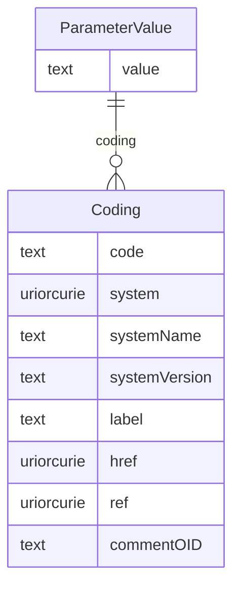

# Class: ParameterValue

_This element contains the value of the study parameter as text content._


URI: [odm:ParameterValue](http://www.cdisc.org/ns/odm/v2.0/ParameterValue)





<!-- no inheritance hierarchy -->


## Slots

| Name | Cardinality* and Range | Description | Inheritance |
| ---  | --- | --- | --- |
| [value](value.md) | 1..1 <br/> [text](text.md) | Value for parent StudyParameter/@Term. | direct |
| [coding](coding.md) | 0..* <br/> [Coding](Coding.md) | Coding reference: Coding references a symbol from a defined code system. It u... | direct |

_* See [LinkML documentation](https://linkml.io/linkml/schemas/slots.html#slot-cardinality) for cardinality definitions._


## Usages

| used by | used in | type | used |
| ---  | --- | --- | --- |
| [StudyParameter](StudyParameter.md) | [parameterValue](parameterValue.md) | range | [ParameterValue](ParameterValue.md) |


## See Also

* [https://wiki.cdisc.org/display/PUB/ParameterValue](https://wiki.cdisc.org/display/PUB/ParameterValue)

## Identifier and Mapping Information


### Schema Source


* from schema: http://www.cdisc.org/ns/odm/v2.0


## Mappings

| Mapping Type | Mapped Value |
| ---  | ---  |
| self | odm:ParameterValue |
| native | odm:ParameterValue |


## LinkML Source

<!-- TODO: investigate https://stackoverflow.com/questions/37606292/how-to-create-tabbed-code-blocks-in-mkdocs-or-sphinx -->

### Direct

<details>
```yaml
name: ParameterValue
description: This element contains the value of the study parameter as text content.
from_schema: http://www.cdisc.org/ns/odm/v2.0
see_also:
- https://wiki.cdisc.org/display/PUB/ParameterValue
rank: 1000
slots:
- value
- coding
slot_usage:
  value:
    name: value
    description: Value for parent StudyParameter/@Term.
    comments:
    - 'Required

      range: text

      When there is a Coding child element, the Values will reflect the requirements
      of the referenced coding system.'
    domain_of:
    - TrialPhase
    - ParameterValue
    - Telecom
    - ItemData
    - Query
    range: text
    required: true
  coding:
    name: coding
    multivalued: true
    domain_of:
    - StudyEventGroupDef
    - StudyEventDef
    - ItemGroupDef
    - Origin
    - SourceItems
    - SourceItem
    - ItemDef
    - CodeList
    - CodeListItem
    - StudyIndication
    - StudyIntervention
    - StudyTargetPopulation
    - StudyParameter
    - ParameterValue
    - Criterion
    - Annotation
    range: Coding
    inlined: true
    inlined_as_list: true
class_uri: odm:ParameterValue

```
</details>

### Induced

<details>
```yaml
name: ParameterValue
description: This element contains the value of the study parameter as text content.
from_schema: http://www.cdisc.org/ns/odm/v2.0
see_also:
- https://wiki.cdisc.org/display/PUB/ParameterValue
rank: 1000
slot_usage:
  value:
    name: value
    description: Value for parent StudyParameter/@Term.
    comments:
    - 'Required

      range: text

      When there is a Coding child element, the Values will reflect the requirements
      of the referenced coding system.'
    domain_of:
    - TrialPhase
    - ParameterValue
    - Telecom
    - ItemData
    - Query
    range: text
    required: true
  coding:
    name: coding
    multivalued: true
    domain_of:
    - StudyEventGroupDef
    - StudyEventDef
    - ItemGroupDef
    - Origin
    - SourceItems
    - SourceItem
    - ItemDef
    - CodeList
    - CodeListItem
    - StudyIndication
    - StudyIntervention
    - StudyTargetPopulation
    - StudyParameter
    - ParameterValue
    - Criterion
    - Annotation
    range: Coding
    inlined: true
    inlined_as_list: true
attributes:
  value:
    name: value
    description: Value for parent StudyParameter/@Term.
    comments:
    - 'Required

      range: text

      When there is a Coding child element, the Values will reflect the requirements
      of the referenced coding system.'
    from_schema: http://www.cdisc.org/ns/odm/v2.0
    rank: 1000
    alias: value
    owner: ParameterValue
    domain_of:
    - TrialPhase
    - ParameterValue
    - Telecom
    - ItemData
    - Query
    range: text
    required: true
  coding:
    name: coding
    description: 'Coding reference: Coding references a symbol from a defined code
      system. It uses a code defined in a terminology system to associate semantics
      with a given term, codelist, variable, or group of variables. The presence of
      a Coding element associates a meaning to its parent element. Including multiple
      Coding elements for a given parent indicates synonymous meanings provided by
      different code systems or code system versions.'
    from_schema: http://www.cdisc.org/ns/odm/v2.0
    rank: 1000
    multivalued: true
    alias: coding
    owner: ParameterValue
    domain_of:
    - StudyEventGroupDef
    - StudyEventDef
    - ItemGroupDef
    - Origin
    - SourceItems
    - SourceItem
    - ItemDef
    - CodeList
    - CodeListItem
    - StudyIndication
    - StudyIntervention
    - StudyTargetPopulation
    - StudyParameter
    - ParameterValue
    - Criterion
    - Annotation
    range: Coding
    inlined: true
    inlined_as_list: true
class_uri: odm:ParameterValue

```
</details>