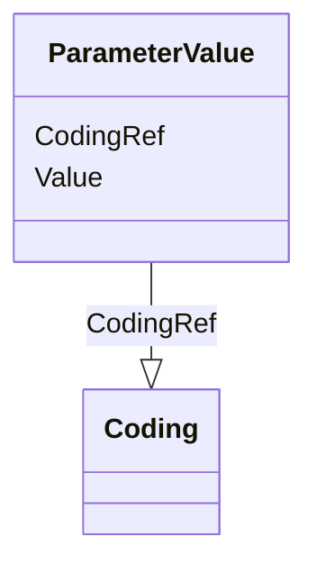

# Class: ParameterValue


URI: [odm:ParameterValue](http://www.cdisc.org/ns/odm/v2.0/ParameterValue)





<!-- no inheritance hierarchy -->


## Slots

| Name | Cardinality and Range | Description | Inheritance |
| ---  | --- | --- | --- |
| [Value](Value.md) | 1..1 <br/> [Text](Text.md) |  | direct |
| [CodingRef](CodingRef.md) | 0..* <br/> [Coding](Coding.md) |  | direct |


## Usages

| used by | used in | type | used |
| ---  | --- | --- | --- |
| [StudyParameter](StudyParameter.md) | [ParameterValueRef](ParameterValueRef.md) | range | [ParameterValue](ParameterValue.md) |


## Identifier and Mapping Information


### Schema Source


* from schema: http://www.cdisc.org/ns/odm/v2.0


## Mappings

| Mapping Type | Mapped Value |
| ---  | ---  |
| self | odm:ParameterValue |
| native | odm:ParameterValue |


## LinkML Source

<!-- TODO: investigate https://stackoverflow.com/questions/37606292/how-to-create-tabbed-code-blocks-in-mkdocs-or-sphinx -->

### Direct

<details>
```yaml
name: ParameterValue
from_schema: http://www.cdisc.org/ns/odm/v2.0
slots:
- Value
- CodingRef
slot_usage:
  Value:
    name: Value
    domain_of:
    - TrialPhase
    - ParameterValue
    range: text
    required: true
  CodingRef:
    name: CodingRef
    multivalued: true
    domain_of:
    - StudyEventGroupDef
    - Origin
    - SourceItems
    - SourceItem
    - StudyIndication
    - StudyIntervention
    - StudyTargetPopulation
    - StudyParameter
    - ParameterValue
    - Annotation
    - StudyEventDef
    - ItemGroupDef
    - ItemDef
    - CodeList
    - CodeListItem
    - EnumeratedItem
    range: Coding
    required: false
    minimum_cardinality: 0
class_uri: odm:ParameterValue

```
</details>

### Induced

<details>
```yaml
name: ParameterValue
from_schema: http://www.cdisc.org/ns/odm/v2.0
slot_usage:
  Value:
    name: Value
    domain_of:
    - TrialPhase
    - ParameterValue
    range: text
    required: true
  CodingRef:
    name: CodingRef
    multivalued: true
    domain_of:
    - StudyEventGroupDef
    - Origin
    - SourceItems
    - SourceItem
    - StudyIndication
    - StudyIntervention
    - StudyTargetPopulation
    - StudyParameter
    - ParameterValue
    - Annotation
    - StudyEventDef
    - ItemGroupDef
    - ItemDef
    - CodeList
    - CodeListItem
    - EnumeratedItem
    range: Coding
    required: false
    minimum_cardinality: 0
attributes:
  Value:
    name: Value
    from_schema: http://www.cdisc.org/ns/odm/v2.0
    rank: 1000
    alias: Value
    owner: ParameterValue
    domain_of:
    - TrialPhase
    - ParameterValue
    range: text
    required: true
  CodingRef:
    name: CodingRef
    from_schema: http://www.cdisc.org/ns/odm/v2.0
    rank: 1000
    multivalued: true
    alias: CodingRef
    owner: ParameterValue
    domain_of:
    - StudyEventGroupDef
    - Origin
    - SourceItems
    - SourceItem
    - StudyIndication
    - StudyIntervention
    - StudyTargetPopulation
    - StudyParameter
    - ParameterValue
    - Annotation
    - StudyEventDef
    - ItemGroupDef
    - ItemDef
    - CodeList
    - CodeListItem
    - EnumeratedItem
    range: Coding
    required: false
    minimum_cardinality: 0
class_uri: odm:ParameterValue

```
</details>