# Class: Protocol

_The Protocol element lists the kinds of study events that can occur within a specific version of a study. All clinical data must occur within one of these study events._


URI: [odm:Protocol](http://www.cdisc.org/ns/odm/v2.0/Protocol)

```mermaid
erDiagram
Protocol {

}
Alias {
    text context  
    text name  
}
WorkflowRef {

}
WorkflowDef {
    oid OID  
    nameType name  
}
StudyEventGroupRef {
    positiveInteger orderNumber  
    YesOrNo mandatory  
}
Description {

}
ConditionDef {
    oid OID  
    nameType name  
}
StudyEventGroupDef {
    oid OID  
    nameType name  
}
InclusionExclusionCriteria {

}
ExclusionCriteria {

}
InclusionCriteria {

}
StudyEstimands {

}
StudyEstimand {
    oid OID  
    nameType name  
    StudyEstimandLevel level  
}
StudyTargetPopulation {
    oid OID  
    nameType name  
}
FormalExpression {
    text context  
}
Coding {
    text code  
    uriorcurie system  
    text systemName  
    text systemVersion  
    text label  
    uriorcurie href  
    uriorcurie ref  
    text commentOID  
}
StudyEndPoints {

}
StudyEndPoint {
    oid OID  
    nameType name  
    StudyEndPointType type  
    StudyEstimandLevel level  
}
StudyObjectives {

}
StudyObjective {
    oid OID  
    nameType name  
    StudyObjectiveLevel level  
}
StudyInterventions {

}
StudyIntervention {
    oid OID  
}
StudyIndications {

}
StudyIndication {
    oid OID  
}
StudyTimings {

}
StudyTiming {
    oid OID  
    nameType name  
}
TrialPhase {
    TrialPhaseType value  
}
StudyStructure {

}
Epoch {
    oid OID  
    nameType name  
    positiveInteger sequenceNumber  
}
Arm {
    oid OID  
    nameType name  
}
StudySummary {

}
StudyParameter {
    oid OID  
    nameType term  
    nameType shortName  
}

Protocol ||--|o Description : "description"
Protocol ||--|o StudySummary : "studySummary"
Protocol ||--|o StudyStructure : "studyStructure"
Protocol ||--|o TrialPhase : "trialPhase"
Protocol ||--|o StudyTimings : "studyTimings"
Protocol ||--|o StudyIndications : "studyIndications"
Protocol ||--|o StudyInterventions : "studyInterventions"
Protocol ||--|o StudyObjectives : "studyObjectives"
Protocol ||--|o StudyEndPoints : "studyEndPoints"
Protocol ||--|o StudyTargetPopulation : "studyTargetPopulation"
Protocol ||--|o StudyEstimands : "studyEstimands"
Protocol ||--|o InclusionExclusionCriteria : "inclusionExclusionCriteria"
Protocol ||--}o StudyEventGroupRef : "studyEventGroupRef"
Protocol ||--|o WorkflowRef : "workflowRef"
Protocol ||--}o Alias : "alias"
WorkflowRef ||--|| WorkflowDef : "workflowOID"
WorkflowDef ||--|o Description : "description"
WorkflowDef ||--|o WorkflowStart : "workflowStart"
WorkflowDef ||--}o WorkflowEnd : "workflowEnd"
WorkflowDef ||--}o Transition : "transition"
WorkflowDef ||--}o Branching : "branching"
StudyEventGroupRef ||--|| StudyEventGroupDef : "studyEventGroupOID"
StudyEventGroupRef ||--|o ConditionDef : "collectionExceptionConditionOID"
StudyEventGroupRef ||--|o Description : "description"
Description ||--}o TranslatedText : "translatedText"
ConditionDef ||--|o CommentDef : "commentOID"
ConditionDef ||--|o Description : "description"
ConditionDef ||--|o MethodSignature : "methodSignature"
ConditionDef ||--}o FormalExpression : "formalExpression"
ConditionDef ||--}o Alias : "alias"
StudyEventGroupDef ||--|o Arm : "armOID"
StudyEventGroupDef ||--|o Epoch : "epochOID"
StudyEventGroupDef ||--|o CommentDef : "commentOID"
StudyEventGroupDef ||--|o Description : "description"
StudyEventGroupDef ||--|o WorkflowRef : "workflowRef"
StudyEventGroupDef ||--}o Coding : "coding"
StudyEventGroupDef ||--}o StudyEventGroupRef : "studyEventGroupRef"
StudyEventGroupDef ||--}o StudyEventRef : "studyEventRef"
InclusionExclusionCriteria ||--|o InclusionCriteria : "inclusionCriteria"
InclusionExclusionCriteria ||--|o ExclusionCriteria : "exclusionCriteria"
ExclusionCriteria ||--}o Criterion : "criterion"
InclusionCriteria ||--}o Criterion : "criterion"
StudyEstimands ||--}o StudyEstimand : "studyEstimand"
StudyEstimand ||--|o Description : "description"
StudyEstimand ||--|o StudyTargetPopulationRef : "studyTargetPopulationRef"
StudyEstimand ||--|o StudyInterventionRef : "studyInterventionRef"
StudyEstimand ||--|o StudyEndPointRef : "studyEndPointRef"
StudyEstimand ||--}o IntercurrentEvent : "intercurrentEvent"
StudyEstimand ||--|o SummaryMeasure : "summaryMeasure"
StudyTargetPopulation ||--|o Description : "description"
StudyTargetPopulation ||--}o Coding : "coding"
StudyTargetPopulation ||--}o FormalExpression : "formalExpression"
FormalExpression ||--|o Code : "code"
FormalExpression ||--|o ExternalCodeLib : "externalCodeLib"
StudyEndPoints ||--}o StudyEndPoint : "studyEndPoint"
StudyEndPoint ||--|o Description : "description"
StudyEndPoint ||--}o FormalExpression : "formalExpression"
StudyObjectives ||--}o StudyObjective : "studyObjective"
StudyObjective ||--|o Description : "description"
StudyObjective ||--}o StudyEndPointRef : "studyEndPointRef"
StudyInterventions ||--}o StudyIntervention : "studyIntervention"
StudyIntervention ||--|o Description : "description"
StudyIntervention ||--}o Coding : "coding"
StudyIndications ||--}o StudyIndication : "studyIndication"
StudyIndication ||--|o Description : "description"
StudyIndication ||--}o Coding : "coding"
StudyTimings ||--}o StudyTiming : "studyTiming"
StudyTiming ||--}o AbsoluteTimingConstraint : "absoluteTimingConstraint"
StudyTiming ||--}o RelativeTimingConstraint : "relativeTimingConstraint"
StudyTiming ||--}o TransitionTimingConstraint : "transitionTimingConstraint"
StudyTiming ||--}o DurationTimingConstraint : "durationTimingConstraint"
TrialPhase ||--|o Description : "description"
StudyStructure ||--|o Description : "description"
StudyStructure ||--}o Arm : "arm"
StudyStructure ||--}o Epoch : "epoch"
StudyStructure ||--|o WorkflowRef : "workflowRef"
Epoch ||--|o Description : "description"
Arm ||--|o Description : "description"
Arm ||--|o WorkflowRef : "workflowRef"
StudySummary ||--}o StudyParameter : "studyParameter"
StudyParameter ||--|o ParameterValue : "parameterValue"
StudyParameter ||--}o Coding : "coding"

```





<!-- no inheritance hierarchy -->


## Slots

| Name | Cardinality* and Range | Description | Inheritance |
| ---  | --- | --- | --- |
| [description](description.md) | 0..1 <br/> [Description](Description.md) | Description reference: A free-text description of the containing metadata com... | direct |
| [studySummary](studySummary.md) | 0..1 <br/> [StudySummary](StudySummary.md) | StudySummary reference: The StudyParameter element allows to provide a set of... | direct |
| [studyStructure](studyStructure.md) | 0..1 <br/> [StudyStructure](StudyStructure.md) | StudyStructure reference: The StudyStructure element describes the general st... | direct |
| [trialPhase](trialPhase.md) | 0..1 <br/> [TrialPhase](TrialPhase.md) | TrialPhase reference: The TrialPhase element designates the phase of the stud... | direct |
| [studyTimings](studyTimings.md) | 0..1 <br/> [StudyTimings](StudyTimings.md) | StudyTimings reference: The StudyTimings element is a container element for i... | direct |
| [studyIndications](studyIndications.md) | 0..1 <br/> [StudyIndications](StudyIndications.md) | StudyIndications reference: StudyIndications is a container element for indiv... | direct |
| [studyInterventions](studyInterventions.md) | 0..1 <br/> [StudyInterventions](StudyInterventions.md) | StudyInterventions reference: The StudyInterventions element is a container e... | direct |
| [studyObjectives](studyObjectives.md) | 0..1 <br/> [StudyObjectives](StudyObjectives.md) | StudyObjectives reference: The StudyObjectives is a container element for ind... | direct |
| [studyEndPoints](studyEndPoints.md) | 0..1 <br/> [StudyEndPoints](StudyEndPoints.md) | StudyEndPoints reference: The StudyEndPoints element is a container element f... | direct |
| [studyTargetPopulation](studyTargetPopulation.md) | 0..1 <br/> [StudyTargetPopulation](StudyTargetPopulation.md) | StudyTargetPopulation reference: The StudyTargetPopulation describes the popu... | direct |
| [studyEstimands](studyEstimands.md) | 0..1 <br/> [StudyEstimands](StudyEstimands.md) | StudyEstimands reference: StudyEstimands is a container element for individua... | direct |
| [inclusionExclusionCriteria](inclusionExclusionCriteria.md) | 0..1 <br/> [InclusionExclusionCriteria](InclusionExclusionCriteria.md) | InclusionExclusionCriteria reference: The InclusionExclusionCriteria element ... | direct |
| [studyEventGroupRef](studyEventGroupRef.md) | 0..* <br/> [StudyEventGroupRef](StudyEventGroupRef.md) | StudyEventGroupRef reference: This element references a StudyEventGroupDef as... | direct |
| [workflowRef](workflowRef.md) | 0..1 <br/> [WorkflowRef](WorkflowRef.md) | WorkflowRef reference: The WorkflowRef references a workflow definition | direct |
| [alias](alias.md) | 0..* <br/> [Alias](Alias.md) | Alias reference: An Alias provides an additional name for an element. The Con... | direct |

_* See [LinkML documentation](https://linkml.io/linkml/schemas/slots.html#slot-cardinality) for cardinality definitions._


## Usages

| used by | used in | type | used |
| ---  | --- | --- | --- |
| [MetaDataVersion](MetaDataVersion.md) | [protocol](protocol.md) | range | [Protocol](Protocol.md) |


## See Also

* [https://wiki.cdisc.org/display/PUB/Protocol](https://wiki.cdisc.org/display/PUB/Protocol)

## Identifier and Mapping Information


### Schema Source


* from schema: http://www.cdisc.org/ns/odm/v2.0


## Mappings

| Mapping Type | Mapped Value |
| ---  | ---  |
| self | odm:Protocol |
| native | odm:Protocol |


## LinkML Source

<!-- TODO: investigate https://stackoverflow.com/questions/37606292/how-to-create-tabbed-code-blocks-in-mkdocs-or-sphinx -->

### Direct

<details>
```yaml
name: Protocol
description: The Protocol element lists the kinds of study events that can occur within
  a specific version of a study. All clinical data must occur within one of these
  study events.
from_schema: http://www.cdisc.org/ns/odm/v2.0
see_also:
- https://wiki.cdisc.org/display/PUB/Protocol
rank: 1000
slots:
- description
- studySummary
- studyStructure
- trialPhase
- studyTimings
- studyIndications
- studyInterventions
- studyObjectives
- studyEndPoints
- studyTargetPopulation
- studyEstimands
- inclusionExclusionCriteria
- studyEventGroupRef
- workflowRef
- alias
slot_usage:
  description:
    name: description
    domain_of:
    - Study
    - MetaDataVersion
    - ValueListDef
    - StudyEventGroupRef
    - StudyEventGroupDef
    - StudyEventDef
    - ItemGroupDef
    - Origin
    - ItemDef
    - CodeList
    - CodeListItem
    - MethodDef
    - ConditionDef
    - CommentDef
    - Protocol
    - StudyStructure
    - TrialPhase
    - StudyIndication
    - StudyIntervention
    - StudyObjective
    - StudyEndPoint
    - StudyTargetPopulation
    - StudyEstimand
    - IntercurrentEvent
    - SummaryMeasure
    - Arm
    - Epoch
    - TransitionTimingConstraint
    - AbsoluteTimingConstraint
    - RelativeTimingConstraint
    - DurationTimingConstraint
    - WorkflowDef
    - Criterion
    - Organization
    - Location
    - ODMFileMetadata
    range: Description
    maximum_cardinality: 1
  studySummary:
    name: studySummary
    domain_of:
    - Protocol
    range: StudySummary
    maximum_cardinality: 1
  studyStructure:
    name: studyStructure
    domain_of:
    - Protocol
    range: StudyStructure
    maximum_cardinality: 1
  trialPhase:
    name: trialPhase
    domain_of:
    - Protocol
    range: TrialPhase
    maximum_cardinality: 1
  studyTimings:
    name: studyTimings
    domain_of:
    - Protocol
    range: StudyTimings
    maximum_cardinality: 1
  studyIndications:
    name: studyIndications
    domain_of:
    - Protocol
    range: StudyIndications
    maximum_cardinality: 1
  studyInterventions:
    name: studyInterventions
    domain_of:
    - Protocol
    range: StudyInterventions
    maximum_cardinality: 1
  studyObjectives:
    name: studyObjectives
    domain_of:
    - Protocol
    range: StudyObjectives
    maximum_cardinality: 1
  studyEndPoints:
    name: studyEndPoints
    domain_of:
    - Protocol
    range: StudyEndPoints
    maximum_cardinality: 1
  studyTargetPopulation:
    name: studyTargetPopulation
    domain_of:
    - Protocol
    range: StudyTargetPopulation
    maximum_cardinality: 1
  studyEstimands:
    name: studyEstimands
    domain_of:
    - Protocol
    range: StudyEstimands
    maximum_cardinality: 1
  inclusionExclusionCriteria:
    name: inclusionExclusionCriteria
    domain_of:
    - Protocol
    range: InclusionExclusionCriteria
    maximum_cardinality: 1
  studyEventGroupRef:
    name: studyEventGroupRef
    multivalued: true
    domain_of:
    - StudyEventGroupDef
    - Protocol
    range: StudyEventGroupRef
    inlined: true
    inlined_as_list: true
  workflowRef:
    name: workflowRef
    domain_of:
    - StudyEventGroupDef
    - StudyEventDef
    - ItemGroupDef
    - Protocol
    - StudyStructure
    - Arm
    range: WorkflowRef
    maximum_cardinality: 1
  alias:
    name: alias
    multivalued: true
    domain_of:
    - StudyEventDef
    - ItemGroupDef
    - ItemDef
    - CodeList
    - CodeListItem
    - MethodDef
    - ConditionDef
    - Protocol
    range: Alias
    inlined: true
    inlined_as_list: true
class_uri: odm:Protocol

```
</details>

### Induced

<details>
```yaml
name: Protocol
description: The Protocol element lists the kinds of study events that can occur within
  a specific version of a study. All clinical data must occur within one of these
  study events.
from_schema: http://www.cdisc.org/ns/odm/v2.0
see_also:
- https://wiki.cdisc.org/display/PUB/Protocol
rank: 1000
slot_usage:
  description:
    name: description
    domain_of:
    - Study
    - MetaDataVersion
    - ValueListDef
    - StudyEventGroupRef
    - StudyEventGroupDef
    - StudyEventDef
    - ItemGroupDef
    - Origin
    - ItemDef
    - CodeList
    - CodeListItem
    - MethodDef
    - ConditionDef
    - CommentDef
    - Protocol
    - StudyStructure
    - TrialPhase
    - StudyIndication
    - StudyIntervention
    - StudyObjective
    - StudyEndPoint
    - StudyTargetPopulation
    - StudyEstimand
    - IntercurrentEvent
    - SummaryMeasure
    - Arm
    - Epoch
    - TransitionTimingConstraint
    - AbsoluteTimingConstraint
    - RelativeTimingConstraint
    - DurationTimingConstraint
    - WorkflowDef
    - Criterion
    - Organization
    - Location
    - ODMFileMetadata
    range: Description
    maximum_cardinality: 1
  studySummary:
    name: studySummary
    domain_of:
    - Protocol
    range: StudySummary
    maximum_cardinality: 1
  studyStructure:
    name: studyStructure
    domain_of:
    - Protocol
    range: StudyStructure
    maximum_cardinality: 1
  trialPhase:
    name: trialPhase
    domain_of:
    - Protocol
    range: TrialPhase
    maximum_cardinality: 1
  studyTimings:
    name: studyTimings
    domain_of:
    - Protocol
    range: StudyTimings
    maximum_cardinality: 1
  studyIndications:
    name: studyIndications
    domain_of:
    - Protocol
    range: StudyIndications
    maximum_cardinality: 1
  studyInterventions:
    name: studyInterventions
    domain_of:
    - Protocol
    range: StudyInterventions
    maximum_cardinality: 1
  studyObjectives:
    name: studyObjectives
    domain_of:
    - Protocol
    range: StudyObjectives
    maximum_cardinality: 1
  studyEndPoints:
    name: studyEndPoints
    domain_of:
    - Protocol
    range: StudyEndPoints
    maximum_cardinality: 1
  studyTargetPopulation:
    name: studyTargetPopulation
    domain_of:
    - Protocol
    range: StudyTargetPopulation
    maximum_cardinality: 1
  studyEstimands:
    name: studyEstimands
    domain_of:
    - Protocol
    range: StudyEstimands
    maximum_cardinality: 1
  inclusionExclusionCriteria:
    name: inclusionExclusionCriteria
    domain_of:
    - Protocol
    range: InclusionExclusionCriteria
    maximum_cardinality: 1
  studyEventGroupRef:
    name: studyEventGroupRef
    multivalued: true
    domain_of:
    - StudyEventGroupDef
    - Protocol
    range: StudyEventGroupRef
    inlined: true
    inlined_as_list: true
  workflowRef:
    name: workflowRef
    domain_of:
    - StudyEventGroupDef
    - StudyEventDef
    - ItemGroupDef
    - Protocol
    - StudyStructure
    - Arm
    range: WorkflowRef
    maximum_cardinality: 1
  alias:
    name: alias
    multivalued: true
    domain_of:
    - StudyEventDef
    - ItemGroupDef
    - ItemDef
    - CodeList
    - CodeListItem
    - MethodDef
    - ConditionDef
    - Protocol
    range: Alias
    inlined: true
    inlined_as_list: true
attributes:
  description:
    name: description
    description: 'Description reference: A free-text description of the containing
      metadata component, unless restricted by Business Rules.'
    from_schema: http://www.cdisc.org/ns/odm/v2.0
    rank: 1000
    alias: description
    owner: Protocol
    domain_of:
    - Study
    - MetaDataVersion
    - ValueListDef
    - StudyEventGroupRef
    - StudyEventGroupDef
    - StudyEventDef
    - ItemGroupDef
    - Origin
    - ItemDef
    - CodeList
    - CodeListItem
    - MethodDef
    - ConditionDef
    - CommentDef
    - Protocol
    - StudyStructure
    - TrialPhase
    - StudyIndication
    - StudyIntervention
    - StudyObjective
    - StudyEndPoint
    - StudyTargetPopulation
    - StudyEstimand
    - IntercurrentEvent
    - SummaryMeasure
    - Arm
    - Epoch
    - TransitionTimingConstraint
    - AbsoluteTimingConstraint
    - RelativeTimingConstraint
    - DurationTimingConstraint
    - WorkflowDef
    - Criterion
    - Organization
    - Location
    - ODMFileMetadata
    range: Description
    maximum_cardinality: 1
  studySummary:
    name: studySummary
    description: 'StudySummary reference: The StudyParameter element allows to provide
      a set of study design parameters such as anticipated number of subjects, minimum
      and maximum age of the participants, or planned number of arms.'
    from_schema: http://www.cdisc.org/ns/odm/v2.0
    rank: 1000
    alias: studySummary
    owner: Protocol
    domain_of:
    - Protocol
    range: StudySummary
    maximum_cardinality: 1
  studyStructure:
    name: studyStructure
    description: 'StudyStructure reference: The StudyStructure element describes the
      general structure of a clinical study with arms, epochs, and workflows.'
    from_schema: http://www.cdisc.org/ns/odm/v2.0
    rank: 1000
    alias: studyStructure
    owner: Protocol
    domain_of:
    - Protocol
    range: StudyStructure
    maximum_cardinality: 1
  trialPhase:
    name: trialPhase
    description: 'TrialPhase reference: The TrialPhase element designates the phase
      of the study in the clinical trial.'
    from_schema: http://www.cdisc.org/ns/odm/v2.0
    rank: 1000
    alias: trialPhase
    owner: Protocol
    domain_of:
    - Protocol
    range: TrialPhase
    maximum_cardinality: 1
  studyTimings:
    name: studyTimings
    description: 'StudyTimings reference: The StudyTimings element is a container
      element for individual StudyTiming elements.'
    from_schema: http://www.cdisc.org/ns/odm/v2.0
    rank: 1000
    alias: studyTimings
    owner: Protocol
    domain_of:
    - Protocol
    range: StudyTimings
    maximum_cardinality: 1
  studyIndications:
    name: studyIndications
    description: 'StudyIndications reference: StudyIndications is a container element
      for individual StudyIndication elements.'
    from_schema: http://www.cdisc.org/ns/odm/v2.0
    rank: 1000
    alias: studyIndications
    owner: Protocol
    domain_of:
    - Protocol
    range: StudyIndications
    maximum_cardinality: 1
  studyInterventions:
    name: studyInterventions
    description: 'StudyInterventions reference: The StudyInterventions element is
      a container element for individual StudyIntervention elements.'
    from_schema: http://www.cdisc.org/ns/odm/v2.0
    rank: 1000
    alias: studyInterventions
    owner: Protocol
    domain_of:
    - Protocol
    range: StudyInterventions
    maximum_cardinality: 1
  studyObjectives:
    name: studyObjectives
    description: 'StudyObjectives reference: The StudyObjectives is a container element
      for individual StudyObjective elements.'
    from_schema: http://www.cdisc.org/ns/odm/v2.0
    rank: 1000
    alias: studyObjectives
    owner: Protocol
    domain_of:
    - Protocol
    range: StudyObjectives
    maximum_cardinality: 1
  studyEndPoints:
    name: studyEndPoints
    description: 'StudyEndPoints reference: The StudyEndPoints element is a container
      element for individual StudyEndPoint elements.'
    from_schema: http://www.cdisc.org/ns/odm/v2.0
    rank: 1000
    alias: studyEndPoints
    owner: Protocol
    domain_of:
    - Protocol
    range: StudyEndPoints
    maximum_cardinality: 1
  studyTargetPopulation:
    name: studyTargetPopulation
    description: 'StudyTargetPopulation reference: The StudyTargetPopulation describes
      the population targeted for the clinical study.'
    from_schema: http://www.cdisc.org/ns/odm/v2.0
    rank: 1000
    alias: studyTargetPopulation
    owner: Protocol
    domain_of:
    - Protocol
    range: StudyTargetPopulation
    maximum_cardinality: 1
  studyEstimands:
    name: studyEstimands
    description: 'StudyEstimands reference: StudyEstimands is a container element
      for individual StudyEstimand elements.'
    from_schema: http://www.cdisc.org/ns/odm/v2.0
    rank: 1000
    alias: studyEstimands
    owner: Protocol
    domain_of:
    - Protocol
    range: StudyEstimands
    maximum_cardinality: 1
  inclusionExclusionCriteria:
    name: inclusionExclusionCriteria
    description: 'InclusionExclusionCriteria reference: The InclusionExclusionCriteria
      element can contain 2 lists of Criterion elements, represented by the 2 elements
      InclusionCriteria and ExclusionCriteria. Together, these criteria determine
      the eligibility of a subject for the study. The actual condition to be evaluated
      is contained in an ODM ConditionDef, which is referenced by each Criterion‟s
      ConditionOID attribute.'
    from_schema: http://www.cdisc.org/ns/odm/v2.0
    rank: 1000
    alias: inclusionExclusionCriteria
    owner: Protocol
    domain_of:
    - Protocol
    range: InclusionExclusionCriteria
    maximum_cardinality: 1
  studyEventGroupRef:
    name: studyEventGroupRef
    description: 'StudyEventGroupRef reference: This element references a StudyEventGroupDef
      as it occurs within a specific version of a study. The list of StudyEventGroupRefs
      identifies the types of study group events that are allowed to occur within
      the study.'
    from_schema: http://www.cdisc.org/ns/odm/v2.0
    rank: 1000
    multivalued: true
    alias: studyEventGroupRef
    owner: Protocol
    domain_of:
    - StudyEventGroupDef
    - Protocol
    range: StudyEventGroupRef
    inlined: true
    inlined_as_list: true
  workflowRef:
    name: workflowRef
    description: 'WorkflowRef reference: The WorkflowRef references a workflow definition'
    from_schema: http://www.cdisc.org/ns/odm/v2.0
    rank: 1000
    alias: workflowRef
    owner: Protocol
    domain_of:
    - StudyEventGroupDef
    - StudyEventDef
    - ItemGroupDef
    - Protocol
    - StudyStructure
    - Arm
    range: WorkflowRef
    maximum_cardinality: 1
  alias:
    name: alias
    description: 'Alias reference: An Alias provides an additional name for an element.
      The Context attribute specifies the application domain in which this additional
      name is relevant.'
    from_schema: http://www.cdisc.org/ns/odm/v2.0
    rank: 1000
    multivalued: true
    alias: alias
    owner: Protocol
    domain_of:
    - StudyEventDef
    - ItemGroupDef
    - ItemDef
    - CodeList
    - CodeListItem
    - MethodDef
    - ConditionDef
    - Protocol
    range: Alias
    inlined: true
    inlined_as_list: true
class_uri: odm:Protocol

```
</details>