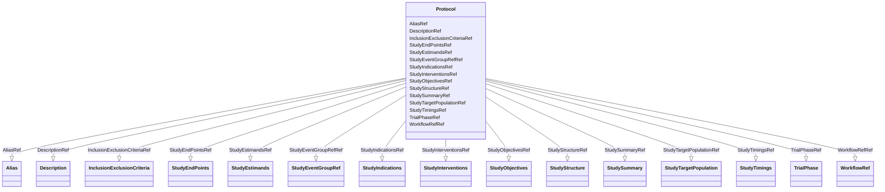

# Class: Protocol


URI: [odm:Protocol](http://www.cdisc.org/ns/odm/v2.0/Protocol)





<!-- no inheritance hierarchy -->


## Slots

| Name | Cardinality and Range | Description | Inheritance |
| ---  | --- | --- | --- |
| [DescriptionRef](DescriptionRef.md) | 0..1 <br/> [Description](Description.md) |  | direct |
| [StudySummaryRef](StudySummaryRef.md) | 0..1 <br/> [StudySummary](StudySummary.md) |  | direct |
| [StudyStructureRef](StudyStructureRef.md) | 0..1 <br/> [StudyStructure](StudyStructure.md) |  | direct |
| [TrialPhaseRef](TrialPhaseRef.md) | 0..1 <br/> [TrialPhase](TrialPhase.md) |  | direct |
| [StudyTimingsRef](StudyTimingsRef.md) | 0..1 <br/> [StudyTimings](StudyTimings.md) |  | direct |
| [StudyIndicationsRef](StudyIndicationsRef.md) | 0..1 <br/> [StudyIndications](StudyIndications.md) |  | direct |
| [StudyInterventionsRef](StudyInterventionsRef.md) | 0..1 <br/> [StudyInterventions](StudyInterventions.md) |  | direct |
| [StudyObjectivesRef](StudyObjectivesRef.md) | 0..1 <br/> [StudyObjectives](StudyObjectives.md) |  | direct |
| [StudyEndPointsRef](StudyEndPointsRef.md) | 0..1 <br/> [StudyEndPoints](StudyEndPoints.md) |  | direct |
| [StudyTargetPopulationRef](StudyTargetPopulationRef.md) | 0..1 <br/> [StudyTargetPopulation](StudyTargetPopulation.md) |  | direct |
| [StudyEstimandsRef](StudyEstimandsRef.md) | 0..1 <br/> [StudyEstimands](StudyEstimands.md) |  | direct |
| [InclusionExclusionCriteriaRef](InclusionExclusionCriteriaRef.md) | 0..1 <br/> [InclusionExclusionCriteria](InclusionExclusionCriteria.md) |  | direct |
| [StudyEventGroupRefRef](StudyEventGroupRefRef.md) | 0..* <br/> [StudyEventGroupRef](StudyEventGroupRef.md) |  | direct |
| [WorkflowRefRef](WorkflowRefRef.md) | 0..1 <br/> [WorkflowRef](WorkflowRef.md) |  | direct |
| [AliasRef](AliasRef.md) | 0..* <br/> [Alias](Alias.md) |  | direct |


## Usages

| used by | used in | type | used |
| ---  | --- | --- | --- |
| [MetaDataVersion](MetaDataVersion.md) | [ProtocolRef](ProtocolRef.md) | range | [Protocol](Protocol.md) |


## Identifier and Mapping Information


### Schema Source


* from schema: http://www.cdisc.org/ns/odm/v2.0


## Mappings

| Mapping Type | Mapped Value |
| ---  | ---  |
| self | odm:Protocol |
| native | odm:Protocol |


## LinkML Source

<!-- TODO: investigate https://stackoverflow.com/questions/37606292/how-to-create-tabbed-code-blocks-in-mkdocs-or-sphinx -->

### Direct

<details>
```yaml
name: Protocol
from_schema: http://www.cdisc.org/ns/odm/v2.0
slots:
- DescriptionRef
- StudySummaryRef
- StudyStructureRef
- TrialPhaseRef
- StudyTimingsRef
- StudyIndicationsRef
- StudyInterventionsRef
- StudyObjectivesRef
- StudyEndPointsRef
- StudyTargetPopulationRef
- StudyEstimandsRef
- InclusionExclusionCriteriaRef
- StudyEventGroupRefRef
- WorkflowRefRef
- AliasRef
slot_usage:
  DescriptionRef:
    name: DescriptionRef
    domain_of:
    - ValueListDef
    - StudyEventGroupRef
    - StudyEventGroupDef
    - Origin
    - CommentDef
    - Protocol
    - StudyStructure
    - TrialPhase
    - StudyIndication
    - StudyIntervention
    - StudyObjective
    - StudyEndPoint
    - StudyTargetPopulation
    - StudyEstimand
    - IntercurrentEvent
    - SummaryMeasure
    - Arm
    - Epoch
    - TransitionTimingConstraint
    - AbsoluteTimingConstraint
    - RelativeTimingConstraint
    - DurationTimingConstraint
    - WorkflowDef
    - Criterion
    - ExceptionEvent
    - Organization
    - MetaDataVersion
    - StudyEventDef
    - ItemGroupDef
    - ItemDef
    - CodeList
    - ConditionDef
    - MethodDef
    - CodeListItem
    - EnumeratedItem
    - Location
    - Study
    - ODMFileMetadata
    range: Description
    required: false
    minimum_cardinality: 0
    maximum_cardinality: 1
  StudySummaryRef:
    name: StudySummaryRef
    domain_of:
    - Protocol
    range: StudySummary
    required: false
    minimum_cardinality: 0
    maximum_cardinality: 1
  StudyStructureRef:
    name: StudyStructureRef
    domain_of:
    - Protocol
    range: StudyStructure
    required: false
    minimum_cardinality: 0
    maximum_cardinality: 1
  TrialPhaseRef:
    name: TrialPhaseRef
    domain_of:
    - Protocol
    range: TrialPhase
    required: false
    minimum_cardinality: 0
    maximum_cardinality: 1
  StudyTimingsRef:
    name: StudyTimingsRef
    domain_of:
    - Protocol
    range: StudyTimings
    required: false
    minimum_cardinality: 0
    maximum_cardinality: 1
  StudyIndicationsRef:
    name: StudyIndicationsRef
    domain_of:
    - Protocol
    range: StudyIndications
    required: false
    minimum_cardinality: 0
    maximum_cardinality: 1
  StudyInterventionsRef:
    name: StudyInterventionsRef
    domain_of:
    - Protocol
    range: StudyInterventions
    required: false
    minimum_cardinality: 0
    maximum_cardinality: 1
  StudyObjectivesRef:
    name: StudyObjectivesRef
    domain_of:
    - Protocol
    range: StudyObjectives
    required: false
    minimum_cardinality: 0
    maximum_cardinality: 1
  StudyEndPointsRef:
    name: StudyEndPointsRef
    domain_of:
    - Protocol
    range: StudyEndPoints
    required: false
    minimum_cardinality: 0
    maximum_cardinality: 1
  StudyTargetPopulationRef:
    name: StudyTargetPopulationRef
    domain_of:
    - Protocol
    range: StudyTargetPopulation
    required: false
    minimum_cardinality: 0
    maximum_cardinality: 1
  StudyEstimandsRef:
    name: StudyEstimandsRef
    domain_of:
    - Protocol
    range: StudyEstimands
    required: false
    minimum_cardinality: 0
    maximum_cardinality: 1
  InclusionExclusionCriteriaRef:
    name: InclusionExclusionCriteriaRef
    domain_of:
    - Protocol
    range: InclusionExclusionCriteria
    required: false
    minimum_cardinality: 0
    maximum_cardinality: 1
  StudyEventGroupRefRef:
    name: StudyEventGroupRefRef
    multivalued: true
    domain_of:
    - Protocol
    range: StudyEventGroupRef
    required: false
    minimum_cardinality: 0
  WorkflowRefRef:
    name: WorkflowRefRef
    domain_of:
    - StudyEventGroupDef
    - Protocol
    - StudyStructure
    - Arm
    - StudyEventDef
    - ItemGroupDef
    range: WorkflowRef
    required: false
    minimum_cardinality: 0
    maximum_cardinality: 1
  AliasRef:
    name: AliasRef
    multivalued: true
    list_elements_unique: true
    domain_of:
    - Protocol
    - StudyEventDef
    - ItemGroupDef
    - ItemDef
    - CodeList
    - ConditionDef
    - MethodDef
    - CodeListItem
    - EnumeratedItem
    range: Alias
    required: false
    minimum_cardinality: 0
class_uri: odm:Protocol

```
</details>

### Induced

<details>
```yaml
name: Protocol
from_schema: http://www.cdisc.org/ns/odm/v2.0
slot_usage:
  DescriptionRef:
    name: DescriptionRef
    domain_of:
    - ValueListDef
    - StudyEventGroupRef
    - StudyEventGroupDef
    - Origin
    - CommentDef
    - Protocol
    - StudyStructure
    - TrialPhase
    - StudyIndication
    - StudyIntervention
    - StudyObjective
    - StudyEndPoint
    - StudyTargetPopulation
    - StudyEstimand
    - IntercurrentEvent
    - SummaryMeasure
    - Arm
    - Epoch
    - TransitionTimingConstraint
    - AbsoluteTimingConstraint
    - RelativeTimingConstraint
    - DurationTimingConstraint
    - WorkflowDef
    - Criterion
    - ExceptionEvent
    - Organization
    - MetaDataVersion
    - StudyEventDef
    - ItemGroupDef
    - ItemDef
    - CodeList
    - ConditionDef
    - MethodDef
    - CodeListItem
    - EnumeratedItem
    - Location
    - Study
    - ODMFileMetadata
    range: Description
    required: false
    minimum_cardinality: 0
    maximum_cardinality: 1
  StudySummaryRef:
    name: StudySummaryRef
    domain_of:
    - Protocol
    range: StudySummary
    required: false
    minimum_cardinality: 0
    maximum_cardinality: 1
  StudyStructureRef:
    name: StudyStructureRef
    domain_of:
    - Protocol
    range: StudyStructure
    required: false
    minimum_cardinality: 0
    maximum_cardinality: 1
  TrialPhaseRef:
    name: TrialPhaseRef
    domain_of:
    - Protocol
    range: TrialPhase
    required: false
    minimum_cardinality: 0
    maximum_cardinality: 1
  StudyTimingsRef:
    name: StudyTimingsRef
    domain_of:
    - Protocol
    range: StudyTimings
    required: false
    minimum_cardinality: 0
    maximum_cardinality: 1
  StudyIndicationsRef:
    name: StudyIndicationsRef
    domain_of:
    - Protocol
    range: StudyIndications
    required: false
    minimum_cardinality: 0
    maximum_cardinality: 1
  StudyInterventionsRef:
    name: StudyInterventionsRef
    domain_of:
    - Protocol
    range: StudyInterventions
    required: false
    minimum_cardinality: 0
    maximum_cardinality: 1
  StudyObjectivesRef:
    name: StudyObjectivesRef
    domain_of:
    - Protocol
    range: StudyObjectives
    required: false
    minimum_cardinality: 0
    maximum_cardinality: 1
  StudyEndPointsRef:
    name: StudyEndPointsRef
    domain_of:
    - Protocol
    range: StudyEndPoints
    required: false
    minimum_cardinality: 0
    maximum_cardinality: 1
  StudyTargetPopulationRef:
    name: StudyTargetPopulationRef
    domain_of:
    - Protocol
    range: StudyTargetPopulation
    required: false
    minimum_cardinality: 0
    maximum_cardinality: 1
  StudyEstimandsRef:
    name: StudyEstimandsRef
    domain_of:
    - Protocol
    range: StudyEstimands
    required: false
    minimum_cardinality: 0
    maximum_cardinality: 1
  InclusionExclusionCriteriaRef:
    name: InclusionExclusionCriteriaRef
    domain_of:
    - Protocol
    range: InclusionExclusionCriteria
    required: false
    minimum_cardinality: 0
    maximum_cardinality: 1
  StudyEventGroupRefRef:
    name: StudyEventGroupRefRef
    multivalued: true
    domain_of:
    - Protocol
    range: StudyEventGroupRef
    required: false
    minimum_cardinality: 0
  WorkflowRefRef:
    name: WorkflowRefRef
    domain_of:
    - StudyEventGroupDef
    - Protocol
    - StudyStructure
    - Arm
    - StudyEventDef
    - ItemGroupDef
    range: WorkflowRef
    required: false
    minimum_cardinality: 0
    maximum_cardinality: 1
  AliasRef:
    name: AliasRef
    multivalued: true
    list_elements_unique: true
    domain_of:
    - Protocol
    - StudyEventDef
    - ItemGroupDef
    - ItemDef
    - CodeList
    - ConditionDef
    - MethodDef
    - CodeListItem
    - EnumeratedItem
    range: Alias
    required: false
    minimum_cardinality: 0
attributes:
  DescriptionRef:
    name: DescriptionRef
    from_schema: http://www.cdisc.org/ns/odm/v2.0
    rank: 1000
    alias: DescriptionRef
    owner: Protocol
    domain_of:
    - ValueListDef
    - StudyEventGroupRef
    - StudyEventGroupDef
    - Origin
    - CommentDef
    - Protocol
    - StudyStructure
    - TrialPhase
    - StudyIndication
    - StudyIntervention
    - StudyObjective
    - StudyEndPoint
    - StudyTargetPopulation
    - StudyEstimand
    - IntercurrentEvent
    - SummaryMeasure
    - Arm
    - Epoch
    - TransitionTimingConstraint
    - AbsoluteTimingConstraint
    - RelativeTimingConstraint
    - DurationTimingConstraint
    - WorkflowDef
    - Criterion
    - ExceptionEvent
    - Organization
    - MetaDataVersion
    - StudyEventDef
    - ItemGroupDef
    - ItemDef
    - CodeList
    - ConditionDef
    - MethodDef
    - CodeListItem
    - EnumeratedItem
    - Location
    - Study
    - ODMFileMetadata
    range: Description
    required: false
    minimum_cardinality: 0
    maximum_cardinality: 1
  StudySummaryRef:
    name: StudySummaryRef
    from_schema: http://www.cdisc.org/ns/odm/v2.0
    rank: 1000
    alias: StudySummaryRef
    owner: Protocol
    domain_of:
    - Protocol
    range: StudySummary
    required: false
    minimum_cardinality: 0
    maximum_cardinality: 1
  StudyStructureRef:
    name: StudyStructureRef
    from_schema: http://www.cdisc.org/ns/odm/v2.0
    rank: 1000
    alias: StudyStructureRef
    owner: Protocol
    domain_of:
    - Protocol
    range: StudyStructure
    required: false
    minimum_cardinality: 0
    maximum_cardinality: 1
  TrialPhaseRef:
    name: TrialPhaseRef
    from_schema: http://www.cdisc.org/ns/odm/v2.0
    rank: 1000
    alias: TrialPhaseRef
    owner: Protocol
    domain_of:
    - Protocol
    range: TrialPhase
    required: false
    minimum_cardinality: 0
    maximum_cardinality: 1
  StudyTimingsRef:
    name: StudyTimingsRef
    from_schema: http://www.cdisc.org/ns/odm/v2.0
    rank: 1000
    alias: StudyTimingsRef
    owner: Protocol
    domain_of:
    - Protocol
    range: StudyTimings
    required: false
    minimum_cardinality: 0
    maximum_cardinality: 1
  StudyIndicationsRef:
    name: StudyIndicationsRef
    from_schema: http://www.cdisc.org/ns/odm/v2.0
    rank: 1000
    alias: StudyIndicationsRef
    owner: Protocol
    domain_of:
    - Protocol
    range: StudyIndications
    required: false
    minimum_cardinality: 0
    maximum_cardinality: 1
  StudyInterventionsRef:
    name: StudyInterventionsRef
    from_schema: http://www.cdisc.org/ns/odm/v2.0
    rank: 1000
    alias: StudyInterventionsRef
    owner: Protocol
    domain_of:
    - Protocol
    range: StudyInterventions
    required: false
    minimum_cardinality: 0
    maximum_cardinality: 1
  StudyObjectivesRef:
    name: StudyObjectivesRef
    from_schema: http://www.cdisc.org/ns/odm/v2.0
    rank: 1000
    alias: StudyObjectivesRef
    owner: Protocol
    domain_of:
    - Protocol
    range: StudyObjectives
    required: false
    minimum_cardinality: 0
    maximum_cardinality: 1
  StudyEndPointsRef:
    name: StudyEndPointsRef
    from_schema: http://www.cdisc.org/ns/odm/v2.0
    rank: 1000
    alias: StudyEndPointsRef
    owner: Protocol
    domain_of:
    - Protocol
    range: StudyEndPoints
    required: false
    minimum_cardinality: 0
    maximum_cardinality: 1
  StudyTargetPopulationRef:
    name: StudyTargetPopulationRef
    from_schema: http://www.cdisc.org/ns/odm/v2.0
    rank: 1000
    alias: StudyTargetPopulationRef
    owner: Protocol
    domain_of:
    - Protocol
    range: StudyTargetPopulation
    required: false
    minimum_cardinality: 0
    maximum_cardinality: 1
  StudyEstimandsRef:
    name: StudyEstimandsRef
    from_schema: http://www.cdisc.org/ns/odm/v2.0
    rank: 1000
    alias: StudyEstimandsRef
    owner: Protocol
    domain_of:
    - Protocol
    range: StudyEstimands
    required: false
    minimum_cardinality: 0
    maximum_cardinality: 1
  InclusionExclusionCriteriaRef:
    name: InclusionExclusionCriteriaRef
    from_schema: http://www.cdisc.org/ns/odm/v2.0
    rank: 1000
    alias: InclusionExclusionCriteriaRef
    owner: Protocol
    domain_of:
    - Protocol
    range: InclusionExclusionCriteria
    required: false
    minimum_cardinality: 0
    maximum_cardinality: 1
  StudyEventGroupRefRef:
    name: StudyEventGroupRefRef
    from_schema: http://www.cdisc.org/ns/odm/v2.0
    rank: 1000
    multivalued: true
    alias: StudyEventGroupRefRef
    owner: Protocol
    domain_of:
    - Protocol
    range: StudyEventGroupRef
    required: false
    minimum_cardinality: 0
  WorkflowRefRef:
    name: WorkflowRefRef
    from_schema: http://www.cdisc.org/ns/odm/v2.0
    rank: 1000
    alias: WorkflowRefRef
    owner: Protocol
    domain_of:
    - StudyEventGroupDef
    - Protocol
    - StudyStructure
    - Arm
    - StudyEventDef
    - ItemGroupDef
    range: WorkflowRef
    required: false
    minimum_cardinality: 0
    maximum_cardinality: 1
  AliasRef:
    name: AliasRef
    from_schema: http://www.cdisc.org/ns/odm/v2.0
    rank: 1000
    multivalued: true
    list_elements_unique: true
    alias: AliasRef
    owner: Protocol
    domain_of:
    - Protocol
    - StudyEventDef
    - ItemGroupDef
    - ItemDef
    - CodeList
    - ConditionDef
    - MethodDef
    - CodeListItem
    - EnumeratedItem
    range: Alias
    required: false
    minimum_cardinality: 0
class_uri: odm:Protocol

```
</details>