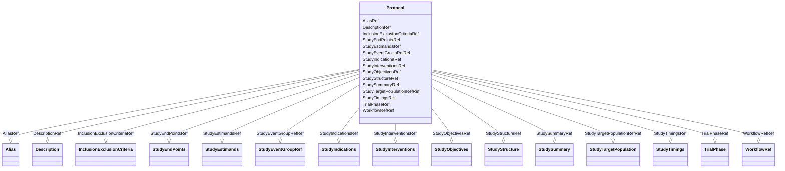

# Class: Protocol


_The Protocol element lists the kinds of study events that can occur within a specific version of a study. All clinical data must occur within one of these study events._


URI: [odm:Protocol](http://www.cdisc.org/ns/odm/v2.0/Protocol)





<!-- no inheritance hierarchy -->


## Slots

| Name | Cardinality and Range | Description | Inheritance |
| ---  | --- | --- | --- |
| [DescriptionRef](DescriptionRef.md) | 0..1 <br/> [Description](Description.md) | Description reference: A free-text description of the containing metadata com... | direct |
| [StudySummaryRef](StudySummaryRef.md) | 0..1 <br/> [StudySummary](StudySummary.md) | StudySummary reference: The StudyParameter element allows to provide a set of... | direct |
| [StudyStructureRef](StudyStructureRef.md) | 0..1 <br/> [StudyStructure](StudyStructure.md) | StudyStructure reference: The StudyStructure element describes the general st... | direct |
| [TrialPhaseRef](TrialPhaseRef.md) | 0..1 <br/> [TrialPhase](TrialPhase.md) | TrialPhase reference: The TrialPhase element designates the phase of the stud... | direct |
| [StudyTimingsRef](StudyTimingsRef.md) | 0..1 <br/> [StudyTimings](StudyTimings.md) | StudyTimings reference: The StudyTimings element is a container element for i... | direct |
| [StudyIndicationsRef](StudyIndicationsRef.md) | 0..1 <br/> [StudyIndications](StudyIndications.md) | StudyIndications reference: StudyIndications is a container element for indiv... | direct |
| [StudyInterventionsRef](StudyInterventionsRef.md) | 0..1 <br/> [StudyInterventions](StudyInterventions.md) | StudyInterventions reference: The StudyInterventions element is a container e... | direct |
| [StudyObjectivesRef](StudyObjectivesRef.md) | 0..1 <br/> [StudyObjectives](StudyObjectives.md) | StudyObjectives reference: The StudyObjectives is a container element for ind... | direct |
| [StudyEndPointsRef](StudyEndPointsRef.md) | 0..1 <br/> [StudyEndPoints](StudyEndPoints.md) | StudyEndPoints reference: The StudyEndPoints element is a container element f... | direct |
| [StudyTargetPopulationRefRef](StudyTargetPopulationRefRef.md) | 0..1 <br/> [StudyTargetPopulation](StudyTargetPopulation.md) | StudyTargetPopulationRef reference: The StudyTargetPopulationRef references a... | direct |
| [StudyEstimandsRef](StudyEstimandsRef.md) | 0..1 <br/> [StudyEstimands](StudyEstimands.md) | StudyEstimands reference: StudyEstimands is a container element for individua... | direct |
| [InclusionExclusionCriteriaRef](InclusionExclusionCriteriaRef.md) | 0..1 <br/> [InclusionExclusionCriteria](InclusionExclusionCriteria.md) | InclusionExclusionCriteria reference: The InclusionExclusionCriteria element ... | direct |
| [StudyEventGroupRefRef](StudyEventGroupRefRef.md) | 0..* <br/> [StudyEventGroupRef](StudyEventGroupRef.md) | StudyEventGroupRef reference: This element references a StudyEventGroupDef as... | direct |
| [WorkflowRefRef](WorkflowRefRef.md) | 0..1 <br/> [WorkflowRef](WorkflowRef.md) | WorkflowRef reference: The WorkflowRef references a workflow definition | direct |
| [AliasRef](AliasRef.md) | 0..* <br/> [Alias](Alias.md) | Alias reference: An Alias provides an additional name for an element. The Con... | direct |


## Usages

| used by | used in | type | used |
| ---  | --- | --- | --- |
| [MetaDataVersion](MetaDataVersion.md) | [ProtocolRef](ProtocolRef.md) | range | [Protocol](Protocol.md) |


## See Also

* [https://wiki.cdisc.org/display/ODM2/Protocol](https://wiki.cdisc.org/display/ODM2/Protocol)

## Identifier and Mapping Information


### Schema Source


* from schema: http://www.cdisc.org/ns/odm/v2.0


## Mappings

| Mapping Type | Mapped Value |
| ---  | ---  |
| self | odm:Protocol |
| native | odm:Protocol |


## LinkML Source

<!-- TODO: investigate https://stackoverflow.com/questions/37606292/how-to-create-tabbed-code-blocks-in-mkdocs-or-sphinx -->

### Direct

<details>
```yaml
name: Protocol
description: The Protocol element lists the kinds of study events that can occur within
  a specific version of a study. All clinical data must occur within one of these
  study events.
from_schema: http://www.cdisc.org/ns/odm/v2.0
see_also:
- https://wiki.cdisc.org/display/ODM2/Protocol
slots:
- DescriptionRef
- StudySummaryRef
- StudyStructureRef
- TrialPhaseRef
- StudyTimingsRef
- StudyIndicationsRef
- StudyInterventionsRef
- StudyObjectivesRef
- StudyEndPointsRef
- StudyTargetPopulationRefRef
- StudyEstimandsRef
- InclusionExclusionCriteriaRef
- StudyEventGroupRefRef
- WorkflowRefRef
- AliasRef
slot_usage:
  DescriptionRef:
    name: DescriptionRef
    domain_of:
    - Study
    - MetaDataVersion
    - ValueListDef
    - StudyEventGroupRef
    - StudyEventGroupDef
    - StudyEventDef
    - ItemGroupDef
    - Origin
    - ItemDef
    - CodeList
    - CodeListItem
    - MethodDef
    - ConditionDef
    - CommentDef
    - Protocol
    - StudyStructure
    - TrialPhase
    - StudyIndication
    - StudyIntervention
    - StudyObjective
    - StudyEndPoint
    - StudyTargetPopulation
    - StudyEstimand
    - IntercurrentEvent
    - SummaryMeasure
    - Arm
    - Epoch
    - TransitionTimingConstraint
    - AbsoluteTimingConstraint
    - RelativeTimingConstraint
    - DurationTimingConstraint
    - WorkflowDef
    - Criterion
    - Organization
    - Location
    - ODMFileMetadata
    range: Description
    maximum_cardinality: 1
  StudySummaryRef:
    name: StudySummaryRef
    domain_of:
    - Protocol
    range: StudySummary
    maximum_cardinality: 1
  StudyStructureRef:
    name: StudyStructureRef
    domain_of:
    - Protocol
    range: StudyStructure
    maximum_cardinality: 1
  TrialPhaseRef:
    name: TrialPhaseRef
    domain_of:
    - Protocol
    range: TrialPhase
    maximum_cardinality: 1
  StudyTimingsRef:
    name: StudyTimingsRef
    domain_of:
    - Protocol
    range: StudyTimings
    maximum_cardinality: 1
  StudyIndicationsRef:
    name: StudyIndicationsRef
    domain_of:
    - Protocol
    range: StudyIndications
    maximum_cardinality: 1
  StudyInterventionsRef:
    name: StudyInterventionsRef
    domain_of:
    - Protocol
    range: StudyInterventions
    maximum_cardinality: 1
  StudyObjectivesRef:
    name: StudyObjectivesRef
    domain_of:
    - Protocol
    range: StudyObjectives
    maximum_cardinality: 1
  StudyEndPointsRef:
    name: StudyEndPointsRef
    domain_of:
    - Protocol
    range: StudyEndPoints
    maximum_cardinality: 1
  StudyTargetPopulationRefRef:
    name: StudyTargetPopulationRefRef
    domain_of:
    - Protocol
    - StudyEstimand
    range: StudyTargetPopulation
    maximum_cardinality: 1
  StudyEstimandsRef:
    name: StudyEstimandsRef
    domain_of:
    - Protocol
    range: StudyEstimands
    maximum_cardinality: 1
  InclusionExclusionCriteriaRef:
    name: InclusionExclusionCriteriaRef
    domain_of:
    - Protocol
    range: InclusionExclusionCriteria
    maximum_cardinality: 1
  StudyEventGroupRefRef:
    name: StudyEventGroupRefRef
    multivalued: true
    domain_of:
    - StudyEventGroupDef
    - Protocol
    range: StudyEventGroupRef
    inlined: true
    inlined_as_list: true
  WorkflowRefRef:
    name: WorkflowRefRef
    domain_of:
    - StudyEventGroupDef
    - StudyEventDef
    - ItemGroupDef
    - Protocol
    - StudyStructure
    - Arm
    range: WorkflowRef
    maximum_cardinality: 1
  AliasRef:
    name: AliasRef
    multivalued: true
    domain_of:
    - StudyEventDef
    - ItemGroupDef
    - ItemDef
    - CodeList
    - CodeListItem
    - MethodDef
    - ConditionDef
    - Protocol
    range: Alias
    inlined: true
    inlined_as_list: true
class_uri: odm:Protocol

```
</details>

### Induced

<details>
```yaml
name: Protocol
description: The Protocol element lists the kinds of study events that can occur within
  a specific version of a study. All clinical data must occur within one of these
  study events.
from_schema: http://www.cdisc.org/ns/odm/v2.0
see_also:
- https://wiki.cdisc.org/display/ODM2/Protocol
slot_usage:
  DescriptionRef:
    name: DescriptionRef
    domain_of:
    - Study
    - MetaDataVersion
    - ValueListDef
    - StudyEventGroupRef
    - StudyEventGroupDef
    - StudyEventDef
    - ItemGroupDef
    - Origin
    - ItemDef
    - CodeList
    - CodeListItem
    - MethodDef
    - ConditionDef
    - CommentDef
    - Protocol
    - StudyStructure
    - TrialPhase
    - StudyIndication
    - StudyIntervention
    - StudyObjective
    - StudyEndPoint
    - StudyTargetPopulation
    - StudyEstimand
    - IntercurrentEvent
    - SummaryMeasure
    - Arm
    - Epoch
    - TransitionTimingConstraint
    - AbsoluteTimingConstraint
    - RelativeTimingConstraint
    - DurationTimingConstraint
    - WorkflowDef
    - Criterion
    - Organization
    - Location
    - ODMFileMetadata
    range: Description
    maximum_cardinality: 1
  StudySummaryRef:
    name: StudySummaryRef
    domain_of:
    - Protocol
    range: StudySummary
    maximum_cardinality: 1
  StudyStructureRef:
    name: StudyStructureRef
    domain_of:
    - Protocol
    range: StudyStructure
    maximum_cardinality: 1
  TrialPhaseRef:
    name: TrialPhaseRef
    domain_of:
    - Protocol
    range: TrialPhase
    maximum_cardinality: 1
  StudyTimingsRef:
    name: StudyTimingsRef
    domain_of:
    - Protocol
    range: StudyTimings
    maximum_cardinality: 1
  StudyIndicationsRef:
    name: StudyIndicationsRef
    domain_of:
    - Protocol
    range: StudyIndications
    maximum_cardinality: 1
  StudyInterventionsRef:
    name: StudyInterventionsRef
    domain_of:
    - Protocol
    range: StudyInterventions
    maximum_cardinality: 1
  StudyObjectivesRef:
    name: StudyObjectivesRef
    domain_of:
    - Protocol
    range: StudyObjectives
    maximum_cardinality: 1
  StudyEndPointsRef:
    name: StudyEndPointsRef
    domain_of:
    - Protocol
    range: StudyEndPoints
    maximum_cardinality: 1
  StudyTargetPopulationRefRef:
    name: StudyTargetPopulationRefRef
    domain_of:
    - Protocol
    - StudyEstimand
    range: StudyTargetPopulation
    maximum_cardinality: 1
  StudyEstimandsRef:
    name: StudyEstimandsRef
    domain_of:
    - Protocol
    range: StudyEstimands
    maximum_cardinality: 1
  InclusionExclusionCriteriaRef:
    name: InclusionExclusionCriteriaRef
    domain_of:
    - Protocol
    range: InclusionExclusionCriteria
    maximum_cardinality: 1
  StudyEventGroupRefRef:
    name: StudyEventGroupRefRef
    multivalued: true
    domain_of:
    - StudyEventGroupDef
    - Protocol
    range: StudyEventGroupRef
    inlined: true
    inlined_as_list: true
  WorkflowRefRef:
    name: WorkflowRefRef
    domain_of:
    - StudyEventGroupDef
    - StudyEventDef
    - ItemGroupDef
    - Protocol
    - StudyStructure
    - Arm
    range: WorkflowRef
    maximum_cardinality: 1
  AliasRef:
    name: AliasRef
    multivalued: true
    domain_of:
    - StudyEventDef
    - ItemGroupDef
    - ItemDef
    - CodeList
    - CodeListItem
    - MethodDef
    - ConditionDef
    - Protocol
    range: Alias
    inlined: true
    inlined_as_list: true
attributes:
  DescriptionRef:
    name: DescriptionRef
    description: 'Description reference: A free-text description of the containing
      metadata component, unless restricted by Business Rules.'
    from_schema: http://www.cdisc.org/ns/odm/v2.0
    rank: 1000
    identifier: false
    alias: DescriptionRef
    owner: Protocol
    domain_of:
    - Study
    - MetaDataVersion
    - ValueListDef
    - StudyEventGroupRef
    - StudyEventGroupDef
    - StudyEventDef
    - ItemGroupDef
    - Origin
    - ItemDef
    - CodeList
    - CodeListItem
    - MethodDef
    - ConditionDef
    - CommentDef
    - Protocol
    - StudyStructure
    - TrialPhase
    - StudyIndication
    - StudyIntervention
    - StudyObjective
    - StudyEndPoint
    - StudyTargetPopulation
    - StudyEstimand
    - IntercurrentEvent
    - SummaryMeasure
    - Arm
    - Epoch
    - TransitionTimingConstraint
    - AbsoluteTimingConstraint
    - RelativeTimingConstraint
    - DurationTimingConstraint
    - WorkflowDef
    - Criterion
    - Organization
    - Location
    - ODMFileMetadata
    range: Description
    maximum_cardinality: 1
  StudySummaryRef:
    name: StudySummaryRef
    description: 'StudySummary reference: The StudyParameter element allows to provide
      a set of study design parameters such as anticipated number of subjects, minimum
      and maximum age of the participants, or planned number of arms.'
    from_schema: http://www.cdisc.org/ns/odm/v2.0
    rank: 1000
    identifier: false
    alias: StudySummaryRef
    owner: Protocol
    domain_of:
    - Protocol
    range: StudySummary
    maximum_cardinality: 1
  StudyStructureRef:
    name: StudyStructureRef
    description: 'StudyStructure reference: The StudyStructure element describes the
      general structure of a clinical study with arms, epochs, and workflows.'
    from_schema: http://www.cdisc.org/ns/odm/v2.0
    rank: 1000
    identifier: false
    alias: StudyStructureRef
    owner: Protocol
    domain_of:
    - Protocol
    range: StudyStructure
    maximum_cardinality: 1
  TrialPhaseRef:
    name: TrialPhaseRef
    description: 'TrialPhase reference: The TrialPhase element designates the phase
      of the study in the clinical trial.'
    from_schema: http://www.cdisc.org/ns/odm/v2.0
    rank: 1000
    identifier: false
    alias: TrialPhaseRef
    owner: Protocol
    domain_of:
    - Protocol
    range: TrialPhase
    maximum_cardinality: 1
  StudyTimingsRef:
    name: StudyTimingsRef
    description: 'StudyTimings reference: The StudyTimings element is a container
      element for individual StudyTiming elements.'
    from_schema: http://www.cdisc.org/ns/odm/v2.0
    rank: 1000
    identifier: false
    alias: StudyTimingsRef
    owner: Protocol
    domain_of:
    - Protocol
    range: StudyTimings
    maximum_cardinality: 1
  StudyIndicationsRef:
    name: StudyIndicationsRef
    description: 'StudyIndications reference: StudyIndications is a container element
      for individual StudyIndication elements.'
    from_schema: http://www.cdisc.org/ns/odm/v2.0
    rank: 1000
    identifier: false
    alias: StudyIndicationsRef
    owner: Protocol
    domain_of:
    - Protocol
    range: StudyIndications
    maximum_cardinality: 1
  StudyInterventionsRef:
    name: StudyInterventionsRef
    description: 'StudyInterventions reference: The StudyInterventions element is
      a container element for individual StudyIntervention elements.'
    from_schema: http://www.cdisc.org/ns/odm/v2.0
    rank: 1000
    identifier: false
    alias: StudyInterventionsRef
    owner: Protocol
    domain_of:
    - Protocol
    range: StudyInterventions
    maximum_cardinality: 1
  StudyObjectivesRef:
    name: StudyObjectivesRef
    description: 'StudyObjectives reference: The StudyObjectives is a container element
      for individual StudyObjective elements.'
    from_schema: http://www.cdisc.org/ns/odm/v2.0
    rank: 1000
    identifier: false
    alias: StudyObjectivesRef
    owner: Protocol
    domain_of:
    - Protocol
    range: StudyObjectives
    maximum_cardinality: 1
  StudyEndPointsRef:
    name: StudyEndPointsRef
    description: 'StudyEndPoints reference: The StudyEndPoints element is a container
      element for individual StudyEndPoint elements.'
    from_schema: http://www.cdisc.org/ns/odm/v2.0
    rank: 1000
    identifier: false
    alias: StudyEndPointsRef
    owner: Protocol
    domain_of:
    - Protocol
    range: StudyEndPoints
    maximum_cardinality: 1
  StudyTargetPopulationRefRef:
    name: StudyTargetPopulationRefRef
    description: 'StudyTargetPopulationRef reference: The StudyTargetPopulationRef
      references a StudyTargetPopulation to which the estimand applies.'
    from_schema: http://www.cdisc.org/ns/odm/v2.0
    rank: 1000
    identifier: false
    alias: StudyTargetPopulationRefRef
    owner: Protocol
    domain_of:
    - Protocol
    - StudyEstimand
    range: StudyTargetPopulation
    maximum_cardinality: 1
  StudyEstimandsRef:
    name: StudyEstimandsRef
    description: 'StudyEstimands reference: StudyEstimands is a container element
      for individual StudyEstimand elements.'
    from_schema: http://www.cdisc.org/ns/odm/v2.0
    rank: 1000
    identifier: false
    alias: StudyEstimandsRef
    owner: Protocol
    domain_of:
    - Protocol
    range: StudyEstimands
    maximum_cardinality: 1
  InclusionExclusionCriteriaRef:
    name: InclusionExclusionCriteriaRef
    description: 'InclusionExclusionCriteria reference: The InclusionExclusionCriteria
      element can contain 2 lists of Criterion elements, represented by the 2 elements
      InclusionCriteria and ExclusionCriteria. Together, these criteria determine
      the eligibility of a subject for the study. The actual condition to be evaluated
      is contained in an ODM ConditionDef, which is referenced by each Criterion‟s
      ConditionOID attribute.'
    from_schema: http://www.cdisc.org/ns/odm/v2.0
    rank: 1000
    identifier: false
    alias: InclusionExclusionCriteriaRef
    owner: Protocol
    domain_of:
    - Protocol
    range: InclusionExclusionCriteria
    maximum_cardinality: 1
  StudyEventGroupRefRef:
    name: StudyEventGroupRefRef
    description: 'StudyEventGroupRef reference: This element references a StudyEventGroupDef
      as it occurs within a specific version of a study. The list of StudyEventGroupRefs
      identifies the types of study group events that are allowed to occur within
      the study.'
    from_schema: http://www.cdisc.org/ns/odm/v2.0
    rank: 1000
    multivalued: true
    identifier: false
    alias: StudyEventGroupRefRef
    owner: Protocol
    domain_of:
    - StudyEventGroupDef
    - Protocol
    range: StudyEventGroupRef
    inlined: true
    inlined_as_list: true
  WorkflowRefRef:
    name: WorkflowRefRef
    description: 'WorkflowRef reference: The WorkflowRef references a workflow definition'
    from_schema: http://www.cdisc.org/ns/odm/v2.0
    rank: 1000
    identifier: false
    alias: WorkflowRefRef
    owner: Protocol
    domain_of:
    - StudyEventGroupDef
    - StudyEventDef
    - ItemGroupDef
    - Protocol
    - StudyStructure
    - Arm
    range: WorkflowRef
    maximum_cardinality: 1
  AliasRef:
    name: AliasRef
    description: 'Alias reference: An Alias provides an additional name for an element.
      The Context attribute specifies the application domain in which this additional
      name is relevant.'
    from_schema: http://www.cdisc.org/ns/odm/v2.0
    rank: 1000
    multivalued: true
    identifier: false
    alias: AliasRef
    owner: Protocol
    domain_of:
    - StudyEventDef
    - ItemGroupDef
    - ItemDef
    - CodeList
    - CodeListItem
    - MethodDef
    - ConditionDef
    - Protocol
    range: Alias
    inlined: true
    inlined_as_list: true
class_uri: odm:Protocol

```
</details>