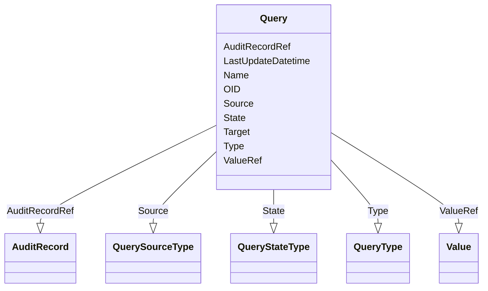

# Class: Query


URI: [odm:Query](http://www.cdisc.org/ns/odm/v2.0/Query)





<!-- no inheritance hierarchy -->


## Slots

| Name | Cardinality and Range | Description | Inheritance |
| ---  | --- | --- | --- |
| [OID](OID.md) | 1..1 <br/> [Oid](Oid.md) | Unique identifier of the version within the XML document | direct |
| [Source](Source.md) | 1..1 <br/> [QuerySourceType](QuerySourceType.md) |  | direct |
| [Target](Target.md) | 0..1 <br/> [Text](Text.md) |  | direct |
| [Type](Type.md) | 0..1 <br/> [QueryType](QueryType.md) | Type of page for page references indicated in the PageRefs attribute | direct |
| [State](State.md) | 1..1 <br/> [QueryStateType](QueryStateType.md) |  | direct |
| [LastUpdateDatetime](LastUpdateDatetime.md) | 1..1 <br/> [Datetime](Datetime.md) |  | direct |
| [Name](Name.md) | 0..1 <br/> [Name](Name.md) | General observation Sub Class | direct |
| [ValueRef](ValueRef.md) | 1..1 <br/> [Value](Value.md) |  | direct |
| [AuditRecordRef](AuditRecordRef.md) | 0..1 <br/> [AuditRecord](AuditRecord.md) |  | direct |


## Usages

| used by | used in | type | used |
| ---  | --- | --- | --- |
| [ClinicalData](ClinicalData.md) | [QueryRef](QueryRef.md) | range | [Query](Query.md) |
| [SubjectData](SubjectData.md) | [QueryRef](QueryRef.md) | range | [Query](Query.md) |
| [StudyEventData](StudyEventData.md) | [QueryRef](QueryRef.md) | range | [Query](Query.md) |
| [ItemGroupData](ItemGroupData.md) | [QueryRef](QueryRef.md) | range | [Query](Query.md) |
| [ItemData](ItemData.md) | [QueryRef](QueryRef.md) | range | [Query](Query.md) |
| [Location](Location.md) | [QueryRef](QueryRef.md) | range | [Query](Query.md) |


## Identifier and Mapping Information


### Schema Source


* from schema: http://www.cdisc.org/ns/odm/v2.0


## Mappings

| Mapping Type | Mapped Value |
| ---  | ---  |
| self | odm:Query |
| native | odm:Query |


## LinkML Source

<!-- TODO: investigate https://stackoverflow.com/questions/37606292/how-to-create-tabbed-code-blocks-in-mkdocs-or-sphinx -->

### Direct

<details>
```yaml
name: Query
from_schema: http://www.cdisc.org/ns/odm/v2.0
slots:
- OID
- Source
- Target
- Type
- State
- LastUpdateDatetime
- Name
- ValueRef
- AuditRecordRef
slot_usage:
  OID:
    name: OID
    domain_of:
    - ValueListDef
    - WhereClauseDef
    - StudyEventGroupDef
    - CommentDef
    - StudyIndication
    - StudyIntervention
    - StudyObjective
    - StudyEndPoint
    - StudyTargetPopulation
    - StudyEstimand
    - Arm
    - Epoch
    - StudyParameter
    - StudyTiming
    - TransitionTimingConstraint
    - AbsoluteTimingConstraint
    - RelativeTimingConstraint
    - DurationTimingConstraint
    - WorkflowDef
    - Transition
    - Branching
    - Criterion
    - ExceptionEvent
    - Organization
    - Query
    - MetaDataVersion
    - StudyEventDef
    - ItemGroupDef
    - ItemDef
    - CodeList
    - ConditionDef
    - MethodDef
    - Standard
    - User
    - Location
    - SignatureDef
    - Study
    range: oid
    required: true
  Source:
    name: Source
    domain_of:
    - Origin
    - Query
    range: QuerySourceType
    required: true
  Target:
    name: Target
    domain_of:
    - Query
    range: text
    required: false
  Type:
    name: Type
    domain_of:
    - PDFPageRef
    - Origin
    - Resource
    - StudyObjective
    - StudyEndPoint
    - TransitionTimingConstraint
    - RelativeTimingConstraint
    - Branching
    - Organization
    - Query
    - StudyEventDef
    - ItemGroupDef
    - MethodDef
    - Standard
    range: QueryType
    required: false
  State:
    name: State
    domain_of:
    - Query
    range: QueryStateType
    required: true
  LastUpdateDatetime:
    name: LastUpdateDatetime
    domain_of:
    - Query
    range: datetime
    required: true
  Name:
    name: Name
    domain_of:
    - StudyEventGroupDef
    - Class
    - SubClass
    - SourceItem
    - Resource
    - Parameter
    - ReturnValue
    - StudyObjective
    - StudyEndPoint
    - StudyTargetPopulation
    - StudyEstimand
    - Arm
    - Epoch
    - StudyTiming
    - TransitionTimingConstraint
    - AbsoluteTimingConstraint
    - RelativeTimingConstraint
    - DurationTimingConstraint
    - WorkflowDef
    - Transition
    - Branching
    - Criterion
    - ExceptionEvent
    - Organization
    - Query
    - MetaDataVersion
    - StudyEventDef
    - ItemGroupDef
    - ItemDef
    - CodeList
    - ConditionDef
    - MethodDef
    - Standard
    - Alias
    - Location
    range: name
    required: false
  ValueRef:
    name: ValueRef
    domain_of:
    - ItemData
    - Query
    range: Value
    required: true
    minimum_cardinality: 1
    maximum_cardinality: 1
  AuditRecordRef:
    name: AuditRecordRef
    domain_of:
    - Query
    range: AuditRecord
    required: false
    minimum_cardinality: 0
    maximum_cardinality: 1
class_uri: odm:Query

```
</details>

### Induced

<details>
```yaml
name: Query
from_schema: http://www.cdisc.org/ns/odm/v2.0
slot_usage:
  OID:
    name: OID
    domain_of:
    - ValueListDef
    - WhereClauseDef
    - StudyEventGroupDef
    - CommentDef
    - StudyIndication
    - StudyIntervention
    - StudyObjective
    - StudyEndPoint
    - StudyTargetPopulation
    - StudyEstimand
    - Arm
    - Epoch
    - StudyParameter
    - StudyTiming
    - TransitionTimingConstraint
    - AbsoluteTimingConstraint
    - RelativeTimingConstraint
    - DurationTimingConstraint
    - WorkflowDef
    - Transition
    - Branching
    - Criterion
    - ExceptionEvent
    - Organization
    - Query
    - MetaDataVersion
    - StudyEventDef
    - ItemGroupDef
    - ItemDef
    - CodeList
    - ConditionDef
    - MethodDef
    - Standard
    - User
    - Location
    - SignatureDef
    - Study
    range: oid
    required: true
  Source:
    name: Source
    domain_of:
    - Origin
    - Query
    range: QuerySourceType
    required: true
  Target:
    name: Target
    domain_of:
    - Query
    range: text
    required: false
  Type:
    name: Type
    domain_of:
    - PDFPageRef
    - Origin
    - Resource
    - StudyObjective
    - StudyEndPoint
    - TransitionTimingConstraint
    - RelativeTimingConstraint
    - Branching
    - Organization
    - Query
    - StudyEventDef
    - ItemGroupDef
    - MethodDef
    - Standard
    range: QueryType
    required: false
  State:
    name: State
    domain_of:
    - Query
    range: QueryStateType
    required: true
  LastUpdateDatetime:
    name: LastUpdateDatetime
    domain_of:
    - Query
    range: datetime
    required: true
  Name:
    name: Name
    domain_of:
    - StudyEventGroupDef
    - Class
    - SubClass
    - SourceItem
    - Resource
    - Parameter
    - ReturnValue
    - StudyObjective
    - StudyEndPoint
    - StudyTargetPopulation
    - StudyEstimand
    - Arm
    - Epoch
    - StudyTiming
    - TransitionTimingConstraint
    - AbsoluteTimingConstraint
    - RelativeTimingConstraint
    - DurationTimingConstraint
    - WorkflowDef
    - Transition
    - Branching
    - Criterion
    - ExceptionEvent
    - Organization
    - Query
    - MetaDataVersion
    - StudyEventDef
    - ItemGroupDef
    - ItemDef
    - CodeList
    - ConditionDef
    - MethodDef
    - Standard
    - Alias
    - Location
    range: name
    required: false
  ValueRef:
    name: ValueRef
    domain_of:
    - ItemData
    - Query
    range: Value
    required: true
    minimum_cardinality: 1
    maximum_cardinality: 1
  AuditRecordRef:
    name: AuditRecordRef
    domain_of:
    - Query
    range: AuditRecord
    required: false
    minimum_cardinality: 0
    maximum_cardinality: 1
attributes:
  OID:
    name: OID
    description: Unique identifier of the version within the XML document.
    from_schema: http://www.cdisc.org/ns/odm/v2.0
    rank: 1000
    alias: OID
    owner: Query
    domain_of:
    - ValueListDef
    - WhereClauseDef
    - StudyEventGroupDef
    - CommentDef
    - StudyIndication
    - StudyIntervention
    - StudyObjective
    - StudyEndPoint
    - StudyTargetPopulation
    - StudyEstimand
    - Arm
    - Epoch
    - StudyParameter
    - StudyTiming
    - TransitionTimingConstraint
    - AbsoluteTimingConstraint
    - RelativeTimingConstraint
    - DurationTimingConstraint
    - WorkflowDef
    - Transition
    - Branching
    - Criterion
    - ExceptionEvent
    - Organization
    - Query
    - MetaDataVersion
    - StudyEventDef
    - ItemGroupDef
    - ItemDef
    - CodeList
    - ConditionDef
    - MethodDef
    - Standard
    - User
    - Location
    - SignatureDef
    - Study
    range: oid
    required: true
  Source:
    name: Source
    from_schema: http://www.cdisc.org/ns/odm/v2.0
    rank: 1000
    alias: Source
    owner: Query
    domain_of:
    - Origin
    - Query
    range: QuerySourceType
    required: true
  Target:
    name: Target
    from_schema: http://www.cdisc.org/ns/odm/v2.0
    rank: 1000
    alias: Target
    owner: Query
    domain_of:
    - Query
    range: text
    required: false
  Type:
    name: Type
    description: Type of page for page references indicated in the PageRefs attribute.
    from_schema: http://www.cdisc.org/ns/odm/v2.0
    rank: 1000
    alias: Type
    owner: Query
    domain_of:
    - PDFPageRef
    - Origin
    - Resource
    - StudyObjective
    - StudyEndPoint
    - TransitionTimingConstraint
    - RelativeTimingConstraint
    - Branching
    - Organization
    - Query
    - StudyEventDef
    - ItemGroupDef
    - MethodDef
    - Standard
    range: QueryType
    required: false
  State:
    name: State
    from_schema: http://www.cdisc.org/ns/odm/v2.0
    rank: 1000
    alias: State
    owner: Query
    domain_of:
    - Query
    range: QueryStateType
    required: true
  LastUpdateDatetime:
    name: LastUpdateDatetime
    from_schema: http://www.cdisc.org/ns/odm/v2.0
    rank: 1000
    alias: LastUpdateDatetime
    owner: Query
    domain_of:
    - Query
    range: datetime
    required: true
  Name:
    name: Name
    description: General observation Sub Class.
    from_schema: http://www.cdisc.org/ns/odm/v2.0
    rank: 1000
    alias: Name
    owner: Query
    domain_of:
    - StudyEventGroupDef
    - Class
    - SubClass
    - SourceItem
    - Resource
    - Parameter
    - ReturnValue
    - StudyObjective
    - StudyEndPoint
    - StudyTargetPopulation
    - StudyEstimand
    - Arm
    - Epoch
    - StudyTiming
    - TransitionTimingConstraint
    - AbsoluteTimingConstraint
    - RelativeTimingConstraint
    - DurationTimingConstraint
    - WorkflowDef
    - Transition
    - Branching
    - Criterion
    - ExceptionEvent
    - Organization
    - Query
    - MetaDataVersion
    - StudyEventDef
    - ItemGroupDef
    - ItemDef
    - CodeList
    - ConditionDef
    - MethodDef
    - Standard
    - Alias
    - Location
    range: name
    required: false
  ValueRef:
    name: ValueRef
    from_schema: http://www.cdisc.org/ns/odm/v2.0
    rank: 1000
    alias: ValueRef
    owner: Query
    domain_of:
    - ItemData
    - Query
    range: Value
    required: true
    minimum_cardinality: 1
    maximum_cardinality: 1
  AuditRecordRef:
    name: AuditRecordRef
    from_schema: http://www.cdisc.org/ns/odm/v2.0
    rank: 1000
    alias: AuditRecordRef
    owner: Query
    domain_of:
    - Query
    range: AuditRecord
    required: false
    minimum_cardinality: 0
    maximum_cardinality: 1
class_uri: odm:Query

```
</details>