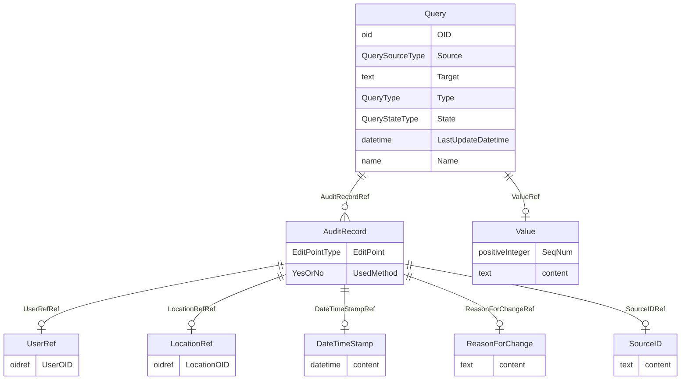

# Class: Query

_The Query element represents a request for clarification on a data item collected for a clinical trial, specifically a request from a sponsor or sponsor’s representative to an investigator to resolve an error or inconsistency discovered during data review. Queries can be created manually by individuals such as site monitors or data managers or automatically by systems. The full text of the Query exists in the Value child element. The optional Name attribute provide the means to provide a short identifier that can be included in listing or user interfaces._


URI: [odm:Query](http://www.cdisc.org/ns/odm/v2.0/Query)





<!-- no inheritance hierarchy -->


## Slots

| Name | Cardinality* and Range | Description | Inheritance |
| ---  | --- | --- | --- |
| [OID](OID.md) | 1..1 <br/> [oid](oid.md) | Query unique identifier | direct |
| [Source](Source.md) | 1..1 <br/> [QuerySourceType](QuerySourceType.md) | Origin of the Query. | direct |
| [Target](Target.md) | 0..1 <br/> [text](text.md) | Element upon which the Query is raised. The parent element is the Target when... | direct |
| [Type](Type.md) | 0..1 <br/> [QueryType](QueryType.md) | Indicates whether Is the Query was raised manually by a user or automatically... | direct |
| [State](State.md) | 1..1 <br/> [QueryStateType](QueryStateType.md) | Status of the Query | direct |
| [LastUpdateDatetime](LastUpdateDatetime.md) | 1..1 <br/> [datetime](datetime.md) | When was this Query updated? Will correspond to the creation date or the last... | direct |
| [Name](Name.md) | 0..1 <br/> [name](name.md) | Name for a query that can be used to identify the query in a listing or user ... | direct |
| [ValueRef](ValueRef.md) | 0..1 <br/> [Value](Value.md) | Human-readable designation of the trial phase. | direct |
| [AuditRecordRef](AuditRecordRef.md) | 0..* <br/> [AuditRecord](AuditRecord.md) | AuditRecord reference: An AuditRecord carries information pertaining to the c... | direct |

_* See [LinkML documentation](https://linkml.io/linkml/schemas/slots.html#slot-cardinality) for cardinality definitions._


## Usages

| used by | used in | type | used |
| ---  | --- | --- | --- |
| [Location](Location.md) | [QueryRef](QueryRef.md) | range | [Query](Query.md) |
| [ClinicalData](ClinicalData.md) | [QueryRef](QueryRef.md) | range | [Query](Query.md) |
| [SubjectData](SubjectData.md) | [QueryRef](QueryRef.md) | range | [Query](Query.md) |
| [StudyEventData](StudyEventData.md) | [QueryRef](QueryRef.md) | range | [Query](Query.md) |
| [ItemGroupData](ItemGroupData.md) | [QueryRef](QueryRef.md) | range | [Query](Query.md) |
| [ItemData](ItemData.md) | [QueryRef](QueryRef.md) | range | [Query](Query.md) |


## See Also

* [https://wiki.cdisc.org/display/PUB/Query](https://wiki.cdisc.org/display/PUB/Query)

## Identifier and Mapping Information


### Schema Source


* from schema: http://www.cdisc.org/ns/odm/v2.0


## Mappings

| Mapping Type | Mapped Value |
| ---  | ---  |
| self | odm:Query |
| native | odm:Query |


## LinkML Source

<!-- TODO: investigate https://stackoverflow.com/questions/37606292/how-to-create-tabbed-code-blocks-in-mkdocs-or-sphinx -->

### Direct

<details>
```yaml
name: Query
description: The Query element represents a request for clarification on a data item
  collected for a clinical trial, specifically a request from a sponsor or sponsor’s
  representative to an investigator to resolve an error or inconsistency discovered
  during data review. Queries can be created manually by individuals such as site
  monitors or data managers or automatically by systems. The full text of the Query
  exists in the Value child element. The optional Name attribute provide the means
  to provide a short identifier that can be included in listing or user interfaces.
from_schema: http://www.cdisc.org/ns/odm/v2.0
see_also:
- https://wiki.cdisc.org/display/PUB/Query
rank: 1000
slots:
- OID
- Source
- Target
- Type
- State
- LastUpdateDatetime
- Name
- ValueRef
- AuditRecordRef
slot_usage:
  OID:
    name: OID
    description: Query unique identifier
    comments:
    - Must be unique within a Study.
    domain_of:
    - Study
    - MetaDataVersion
    - Standard
    - ValueListDef
    - WhereClauseDef
    - StudyEventGroupDef
    - StudyEventDef
    - ItemGroupDef
    - ItemDef
    - CodeList
    - MethodDef
    - ConditionDef
    - CommentDef
    - StudyIndication
    - StudyIntervention
    - StudyObjective
    - StudyEndPoint
    - StudyTargetPopulation
    - StudyEstimand
    - Arm
    - Epoch
    - StudyParameter
    - StudyTiming
    - TransitionTimingConstraint
    - AbsoluteTimingConstraint
    - RelativeTimingConstraint
    - DurationTimingConstraint
    - WorkflowDef
    - Transition
    - Branching
    - Criterion
    - User
    - Organization
    - Location
    - SignatureDef
    - Query
    range: oid
    required: true
  Source:
    name: Source
    description: Origin of the Query.
    domain_of:
    - Origin
    - Query
    range: QuerySourceType
    required: true
  Target:
    name: Target
    description: Element upon which the Query is raised. The parent element is the
      Target when the Target attribute is omitted.
    comments:
    - Optional
    domain_of:
    - Query
    range: text
  Type:
    name: Type
    description: Indicates whether Is the Query was raised manually by a user or automatically
      via an edit check.
    comments:
    - Optional
    domain_of:
    - TranslatedText
    - PDFPageRef
    - Standard
    - StudyEventDef
    - ItemGroupDef
    - Origin
    - Resource
    - MethodDef
    - StudyEndPoint
    - TransitionTimingConstraint
    - RelativeTimingConstraint
    - Branching
    - Organization
    - Query
    range: QueryType
  State:
    name: State
    description: Status of the Query
    domain_of:
    - Query
    range: QueryStateType
    required: true
  LastUpdateDatetime:
    name: LastUpdateDatetime
    description: When was this Query updated? Will correspond to the creation date
      or the last updated date?
    domain_of:
    - Query
    range: datetime
    required: true
  Name:
    name: Name
    description: Name for a query that can be used to identify the query in a listing
      or user interface.
    comments:
    - Optional
    domain_of:
    - Alias
    - MetaDataVersion
    - Standard
    - StudyEventGroupDef
    - StudyEventDef
    - ItemGroupDef
    - Class
    - SubClass
    - SourceItem
    - Resource
    - ItemDef
    - CodeList
    - MethodDef
    - Parameter
    - ReturnValue
    - ConditionDef
    - StudyObjective
    - StudyEndPoint
    - StudyTargetPopulation
    - StudyEstimand
    - Arm
    - Epoch
    - StudyTiming
    - TransitionTimingConstraint
    - AbsoluteTimingConstraint
    - RelativeTimingConstraint
    - DurationTimingConstraint
    - WorkflowDef
    - Transition
    - Branching
    - Criterion
    - Organization
    - Location
    - Query
    range: name
  ValueRef:
    name: ValueRef
    domain_of:
    - TrialPhase
    - ParameterValue
    - Telecom
    - ItemData
    - Query
    range: Value
    maximum_cardinality: 1
  AuditRecordRef:
    name: AuditRecordRef
    multivalued: true
    domain_of:
    - ReferenceData
    - ClinicalData
    - SubjectData
    - StudyEventData
    - ItemGroupData
    - ItemData
    - Query
    range: AuditRecord
    inlined: true
    inlined_as_list: true
class_uri: odm:Query

```
</details>

### Induced

<details>
```yaml
name: Query
description: The Query element represents a request for clarification on a data item
  collected for a clinical trial, specifically a request from a sponsor or sponsor’s
  representative to an investigator to resolve an error or inconsistency discovered
  during data review. Queries can be created manually by individuals such as site
  monitors or data managers or automatically by systems. The full text of the Query
  exists in the Value child element. The optional Name attribute provide the means
  to provide a short identifier that can be included in listing or user interfaces.
from_schema: http://www.cdisc.org/ns/odm/v2.0
see_also:
- https://wiki.cdisc.org/display/PUB/Query
rank: 1000
slot_usage:
  OID:
    name: OID
    description: Query unique identifier
    comments:
    - Must be unique within a Study.
    domain_of:
    - Study
    - MetaDataVersion
    - Standard
    - ValueListDef
    - WhereClauseDef
    - StudyEventGroupDef
    - StudyEventDef
    - ItemGroupDef
    - ItemDef
    - CodeList
    - MethodDef
    - ConditionDef
    - CommentDef
    - StudyIndication
    - StudyIntervention
    - StudyObjective
    - StudyEndPoint
    - StudyTargetPopulation
    - StudyEstimand
    - Arm
    - Epoch
    - StudyParameter
    - StudyTiming
    - TransitionTimingConstraint
    - AbsoluteTimingConstraint
    - RelativeTimingConstraint
    - DurationTimingConstraint
    - WorkflowDef
    - Transition
    - Branching
    - Criterion
    - User
    - Organization
    - Location
    - SignatureDef
    - Query
    range: oid
    required: true
  Source:
    name: Source
    description: Origin of the Query.
    domain_of:
    - Origin
    - Query
    range: QuerySourceType
    required: true
  Target:
    name: Target
    description: Element upon which the Query is raised. The parent element is the
      Target when the Target attribute is omitted.
    comments:
    - Optional
    domain_of:
    - Query
    range: text
  Type:
    name: Type
    description: Indicates whether Is the Query was raised manually by a user or automatically
      via an edit check.
    comments:
    - Optional
    domain_of:
    - TranslatedText
    - PDFPageRef
    - Standard
    - StudyEventDef
    - ItemGroupDef
    - Origin
    - Resource
    - MethodDef
    - StudyEndPoint
    - TransitionTimingConstraint
    - RelativeTimingConstraint
    - Branching
    - Organization
    - Query
    range: QueryType
  State:
    name: State
    description: Status of the Query
    domain_of:
    - Query
    range: QueryStateType
    required: true
  LastUpdateDatetime:
    name: LastUpdateDatetime
    description: When was this Query updated? Will correspond to the creation date
      or the last updated date?
    domain_of:
    - Query
    range: datetime
    required: true
  Name:
    name: Name
    description: Name for a query that can be used to identify the query in a listing
      or user interface.
    comments:
    - Optional
    domain_of:
    - Alias
    - MetaDataVersion
    - Standard
    - StudyEventGroupDef
    - StudyEventDef
    - ItemGroupDef
    - Class
    - SubClass
    - SourceItem
    - Resource
    - ItemDef
    - CodeList
    - MethodDef
    - Parameter
    - ReturnValue
    - ConditionDef
    - StudyObjective
    - StudyEndPoint
    - StudyTargetPopulation
    - StudyEstimand
    - Arm
    - Epoch
    - StudyTiming
    - TransitionTimingConstraint
    - AbsoluteTimingConstraint
    - RelativeTimingConstraint
    - DurationTimingConstraint
    - WorkflowDef
    - Transition
    - Branching
    - Criterion
    - Organization
    - Location
    - Query
    range: name
  ValueRef:
    name: ValueRef
    domain_of:
    - TrialPhase
    - ParameterValue
    - Telecom
    - ItemData
    - Query
    range: Value
    maximum_cardinality: 1
  AuditRecordRef:
    name: AuditRecordRef
    multivalued: true
    domain_of:
    - ReferenceData
    - ClinicalData
    - SubjectData
    - StudyEventData
    - ItemGroupData
    - ItemData
    - Query
    range: AuditRecord
    inlined: true
    inlined_as_list: true
attributes:
  OID:
    name: OID
    description: Query unique identifier
    comments:
    - Must be unique within a Study.
    from_schema: http://www.cdisc.org/ns/odm/v2.0
    rank: 1000
    identifier: true
    alias: OID
    owner: Query
    domain_of:
    - Study
    - MetaDataVersion
    - Standard
    - ValueListDef
    - WhereClauseDef
    - StudyEventGroupDef
    - StudyEventDef
    - ItemGroupDef
    - ItemDef
    - CodeList
    - MethodDef
    - ConditionDef
    - CommentDef
    - StudyIndication
    - StudyIntervention
    - StudyObjective
    - StudyEndPoint
    - StudyTargetPopulation
    - StudyEstimand
    - Arm
    - Epoch
    - StudyParameter
    - StudyTiming
    - TransitionTimingConstraint
    - AbsoluteTimingConstraint
    - RelativeTimingConstraint
    - DurationTimingConstraint
    - WorkflowDef
    - Transition
    - Branching
    - Criterion
    - User
    - Organization
    - Location
    - SignatureDef
    - Query
    range: oid
    required: true
  Source:
    name: Source
    description: Origin of the Query.
    from_schema: http://www.cdisc.org/ns/odm/v2.0
    rank: 1000
    alias: Source
    owner: Query
    domain_of:
    - Origin
    - Query
    range: QuerySourceType
    required: true
  Target:
    name: Target
    description: Element upon which the Query is raised. The parent element is the
      Target when the Target attribute is omitted.
    comments:
    - Optional
    from_schema: http://www.cdisc.org/ns/odm/v2.0
    rank: 1000
    alias: Target
    owner: Query
    domain_of:
    - Query
    range: text
  Type:
    name: Type
    description: Indicates whether Is the Query was raised manually by a user or automatically
      via an edit check.
    comments:
    - Optional
    from_schema: http://www.cdisc.org/ns/odm/v2.0
    rank: 1000
    alias: Type
    owner: Query
    domain_of:
    - TranslatedText
    - PDFPageRef
    - Standard
    - StudyEventDef
    - ItemGroupDef
    - Origin
    - Resource
    - MethodDef
    - StudyEndPoint
    - TransitionTimingConstraint
    - RelativeTimingConstraint
    - Branching
    - Organization
    - Query
    range: QueryType
  State:
    name: State
    description: Status of the Query
    from_schema: http://www.cdisc.org/ns/odm/v2.0
    rank: 1000
    alias: State
    owner: Query
    domain_of:
    - Query
    range: QueryStateType
    required: true
  LastUpdateDatetime:
    name: LastUpdateDatetime
    description: When was this Query updated? Will correspond to the creation date
      or the last updated date?
    from_schema: http://www.cdisc.org/ns/odm/v2.0
    rank: 1000
    alias: LastUpdateDatetime
    owner: Query
    domain_of:
    - Query
    range: datetime
    required: true
  Name:
    name: Name
    description: Name for a query that can be used to identify the query in a listing
      or user interface.
    comments:
    - Optional
    from_schema: http://www.cdisc.org/ns/odm/v2.0
    rank: 1000
    alias: Name
    owner: Query
    domain_of:
    - Alias
    - MetaDataVersion
    - Standard
    - StudyEventGroupDef
    - StudyEventDef
    - ItemGroupDef
    - Class
    - SubClass
    - SourceItem
    - Resource
    - ItemDef
    - CodeList
    - MethodDef
    - Parameter
    - ReturnValue
    - ConditionDef
    - StudyObjective
    - StudyEndPoint
    - StudyTargetPopulation
    - StudyEstimand
    - Arm
    - Epoch
    - StudyTiming
    - TransitionTimingConstraint
    - AbsoluteTimingConstraint
    - RelativeTimingConstraint
    - DurationTimingConstraint
    - WorkflowDef
    - Transition
    - Branching
    - Criterion
    - Organization
    - Location
    - Query
    range: name
  ValueRef:
    name: ValueRef
    description: Human-readable designation of the trial phase.
    from_schema: http://www.cdisc.org/ns/odm/v2.0
    rank: 1000
    identifier: false
    alias: ValueRef
    owner: Query
    domain_of:
    - TrialPhase
    - ParameterValue
    - Telecom
    - ItemData
    - Query
    range: Value
    maximum_cardinality: 1
  AuditRecordRef:
    name: AuditRecordRef
    description: 'AuditRecord reference: An AuditRecord carries information pertaining
      to the creation, deletion, or modification of clinical data. This information
      includes who performed that action, and where, when, and why that action was
      performed.AuditRecord information describes a change to clinical data, but is
      not itself clinical data. The value of some clinical data can always be changed
      by a subsequent transaction, but history cannot be changed, only added to.'
    from_schema: http://www.cdisc.org/ns/odm/v2.0
    rank: 1000
    multivalued: true
    identifier: false
    alias: AuditRecordRef
    owner: Query
    domain_of:
    - ReferenceData
    - ClinicalData
    - SubjectData
    - StudyEventData
    - ItemGroupData
    - ItemData
    - Query
    range: AuditRecord
    inlined: true
    inlined_as_list: true
class_uri: odm:Query

```
</details>