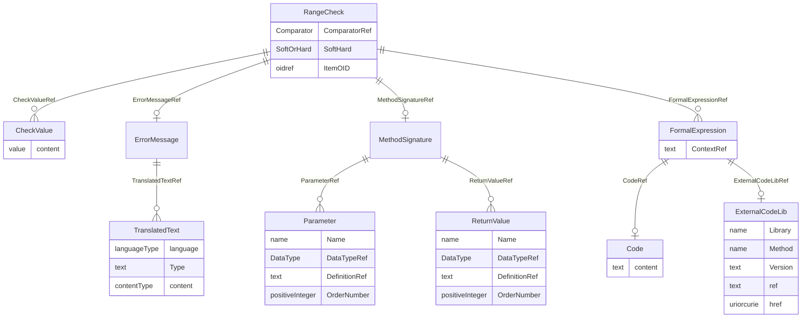

# Class: RangeCheck

_A RangeCheck defines a constraint on the value of the enclosing item. It represents an expression that evaluates to True when the ItemData value is valid or False when the ItemData value is invalid. The expression is specified using either Comparator and CheckValue or using FormalExpressions._


URI: [odm:RangeCheck](http://www.cdisc.org/ns/odm/v2.0/RangeCheck)





<!-- no inheritance hierarchy -->


## Slots

| Name | Cardinality* and Range | Description | Inheritance |
| ---  | --- | --- | --- |
| [ComparatorRef](ComparatorRef.md) | 0..1 <br/> [Comparator](Comparator.md) | Comparison operator used to compare the item and value(s). | direct |
| [SoftHard](SoftHard.md) | 0..1 <br/> [SoftOrHard](SoftOrHard.md) | Type of range check. Soft indicates that a warning occurs when the RangeCheck... | direct |
| [ItemOID](ItemOID.md) | 0..1 <br/> [oidref](oidref.md) | Identifies a variable to compare against. | direct |
| [ErrorMessageRef](ErrorMessageRef.md) | 0..1 <br/> [ErrorMessage](ErrorMessage.md) | ErrorMessage reference: Error message provided to user when the range check f... | direct |
| [MethodSignatureRef](MethodSignatureRef.md) | 0..1 <br/> [MethodSignature](MethodSignature.md) | MethodSignature reference: A MethodSignature defines the parameters and retur... | direct |
| [FormalExpressionRef](FormalExpressionRef.md) | 0..* <br/> [FormalExpression](FormalExpression.md) | FormalExpression reference: A FormalExpression used within a ConditionDef or ... | direct |
| [CheckValueRef](CheckValueRef.md) | 0..* <br/> [CheckValue](CheckValue.md) | CheckValue reference: A comparison value used in a range check. | direct |

_* See [LinkML documentation](https://linkml.io/linkml/schemas/slots.html#slot-cardinality) for cardinality definitions._


## Usages

| used by | used in | type | used |
| ---  | --- | --- | --- |
| [WhereClauseDef](WhereClauseDef.md) | [RangeCheckRef](RangeCheckRef.md) | range | [RangeCheck](RangeCheck.md) |
| [ItemDef](ItemDef.md) | [RangeCheckRef](RangeCheckRef.md) | range | [RangeCheck](RangeCheck.md) |


## See Also

* [https://wiki.cdisc.org/display/ODM2/RangeCheck](https://wiki.cdisc.org/display/ODM2/RangeCheck)

## Identifier and Mapping Information


### Schema Source


* from schema: http://www.cdisc.org/ns/odm/v2.0


## Mappings

| Mapping Type | Mapped Value |
| ---  | ---  |
| self | odm:RangeCheck |
| native | odm:RangeCheck |


## LinkML Source

<!-- TODO: investigate https://stackoverflow.com/questions/37606292/how-to-create-tabbed-code-blocks-in-mkdocs-or-sphinx -->

### Direct

<details>
```yaml
name: RangeCheck
description: A RangeCheck defines a constraint on the value of the enclosing item.
  It represents an expression that evaluates to True when the ItemData value is valid
  or False when the ItemData value is invalid. The expression is specified using either
  Comparator and CheckValue or using FormalExpressions.
from_schema: http://www.cdisc.org/ns/odm/v2.0
see_also:
- https://wiki.cdisc.org/display/ODM2/RangeCheck
rank: 1000
slots:
- ComparatorRef
- SoftHard
- ItemOID
- ErrorMessageRef
- MethodSignatureRef
- FormalExpressionRef
- CheckValueRef
slot_usage:
  ComparatorRef:
    name: ComparatorRef
    description: Comparison operator used to compare the item and value(s).
    comments:
    - 'Conditional

      enum values: (LT | LE | GT | GE | EQ | NE | IN | NOTIN)'
    domain_of:
    - RangeCheck
    range: Comparator
  SoftHard:
    name: SoftHard
    description: Type of range check. Soft indicates that a warning occurs when the
      RangeCheck fails. Hard indicates that an error occurs when the RangeCheck fails.
    comments:
    - 'Conditional

      enum values: (Soft | Hard)'
    domain_of:
    - RangeCheck
    range: SoftOrHard
  ItemOID:
    name: ItemOID
    description: Identifies a variable to compare against.
    comments:
    - 'Conditional

      range: oidref'
    domain_of:
    - ItemRef
    - SourceItem
    - RangeCheck
    - ItemData
    - KeySet
    range: oidref
  ErrorMessageRef:
    name: ErrorMessageRef
    domain_of:
    - RangeCheck
    range: ErrorMessage
    maximum_cardinality: 1
  MethodSignatureRef:
    name: MethodSignatureRef
    domain_of:
    - RangeCheck
    - MethodDef
    - ConditionDef
    range: MethodSignature
    maximum_cardinality: 1
  FormalExpressionRef:
    name: FormalExpressionRef
    multivalued: true
    domain_of:
    - RangeCheck
    - MethodDef
    - ConditionDef
    - StudyEndPoint
    - StudyTargetPopulation
    range: FormalExpression
    inlined: true
    inlined_as_list: true
  CheckValueRef:
    name: CheckValueRef
    multivalued: true
    domain_of:
    - RangeCheck
    range: CheckValue
    inlined: true
    inlined_as_list: true
class_uri: odm:RangeCheck

```
</details>

### Induced

<details>
```yaml
name: RangeCheck
description: A RangeCheck defines a constraint on the value of the enclosing item.
  It represents an expression that evaluates to True when the ItemData value is valid
  or False when the ItemData value is invalid. The expression is specified using either
  Comparator and CheckValue or using FormalExpressions.
from_schema: http://www.cdisc.org/ns/odm/v2.0
see_also:
- https://wiki.cdisc.org/display/ODM2/RangeCheck
rank: 1000
slot_usage:
  ComparatorRef:
    name: ComparatorRef
    description: Comparison operator used to compare the item and value(s).
    comments:
    - 'Conditional

      enum values: (LT | LE | GT | GE | EQ | NE | IN | NOTIN)'
    domain_of:
    - RangeCheck
    range: Comparator
  SoftHard:
    name: SoftHard
    description: Type of range check. Soft indicates that a warning occurs when the
      RangeCheck fails. Hard indicates that an error occurs when the RangeCheck fails.
    comments:
    - 'Conditional

      enum values: (Soft | Hard)'
    domain_of:
    - RangeCheck
    range: SoftOrHard
  ItemOID:
    name: ItemOID
    description: Identifies a variable to compare against.
    comments:
    - 'Conditional

      range: oidref'
    domain_of:
    - ItemRef
    - SourceItem
    - RangeCheck
    - ItemData
    - KeySet
    range: oidref
  ErrorMessageRef:
    name: ErrorMessageRef
    domain_of:
    - RangeCheck
    range: ErrorMessage
    maximum_cardinality: 1
  MethodSignatureRef:
    name: MethodSignatureRef
    domain_of:
    - RangeCheck
    - MethodDef
    - ConditionDef
    range: MethodSignature
    maximum_cardinality: 1
  FormalExpressionRef:
    name: FormalExpressionRef
    multivalued: true
    domain_of:
    - RangeCheck
    - MethodDef
    - ConditionDef
    - StudyEndPoint
    - StudyTargetPopulation
    range: FormalExpression
    inlined: true
    inlined_as_list: true
  CheckValueRef:
    name: CheckValueRef
    multivalued: true
    domain_of:
    - RangeCheck
    range: CheckValue
    inlined: true
    inlined_as_list: true
attributes:
  ComparatorRef:
    name: ComparatorRef
    description: Comparison operator used to compare the item and value(s).
    comments:
    - 'Conditional

      enum values: (LT | LE | GT | GE | EQ | NE | IN | NOTIN)'
    from_schema: http://www.cdisc.org/ns/odm/v2.0
    rank: 1000
    alias: ComparatorRef
    owner: RangeCheck
    domain_of:
    - RangeCheck
    range: Comparator
  SoftHard:
    name: SoftHard
    description: Type of range check. Soft indicates that a warning occurs when the
      RangeCheck fails. Hard indicates that an error occurs when the RangeCheck fails.
    comments:
    - 'Conditional

      enum values: (Soft | Hard)'
    from_schema: http://www.cdisc.org/ns/odm/v2.0
    rank: 1000
    alias: SoftHard
    owner: RangeCheck
    domain_of:
    - RangeCheck
    range: SoftOrHard
  ItemOID:
    name: ItemOID
    description: Identifies a variable to compare against.
    comments:
    - 'Conditional

      range: oidref'
    from_schema: http://www.cdisc.org/ns/odm/v2.0
    rank: 1000
    alias: ItemOID
    owner: RangeCheck
    domain_of:
    - ItemRef
    - SourceItem
    - RangeCheck
    - ItemData
    - KeySet
    range: oidref
  ErrorMessageRef:
    name: ErrorMessageRef
    description: 'ErrorMessage reference: Error message provided to user when the
      range check fails.'
    from_schema: http://www.cdisc.org/ns/odm/v2.0
    rank: 1000
    identifier: false
    alias: ErrorMessageRef
    owner: RangeCheck
    domain_of:
    - RangeCheck
    range: ErrorMessage
    maximum_cardinality: 1
  MethodSignatureRef:
    name: MethodSignatureRef
    description: 'MethodSignature reference: A MethodSignature defines the parameters
      and return values for a method. The MethodSignature improves traceability while
      enhancing the ability for automation engines to execute a MethodDef''s FormalExpression.
      Most Methods use one or more input parameters and return one or more values.'
    from_schema: http://www.cdisc.org/ns/odm/v2.0
    rank: 1000
    identifier: false
    alias: MethodSignatureRef
    owner: RangeCheck
    domain_of:
    - RangeCheck
    - MethodDef
    - ConditionDef
    range: MethodSignature
    maximum_cardinality: 1
  FormalExpressionRef:
    name: FormalExpressionRef
    description: 'FormalExpression reference: A FormalExpression used within a ConditionDef
      or a RangeCheck must evaluate to True or False. A FormalExpression referenced
      within a MethodDef having Type Imputation, Computation, or Transpose must evaluate
      to the correct DataType for an Item that may be imputed or computed using the
      Method. A FormalExpression gets parameter and return value definitions from
      the MethodSignature element. The data types in the MethodSignature parameters
      and return values must match the corresponding data types in the FormalExpression.'
    from_schema: http://www.cdisc.org/ns/odm/v2.0
    rank: 1000
    multivalued: true
    identifier: false
    alias: FormalExpressionRef
    owner: RangeCheck
    domain_of:
    - RangeCheck
    - MethodDef
    - ConditionDef
    - StudyEndPoint
    - StudyTargetPopulation
    range: FormalExpression
    inlined: true
    inlined_as_list: true
  CheckValueRef:
    name: CheckValueRef
    description: 'CheckValue reference: A comparison value used in a range check.'
    from_schema: http://www.cdisc.org/ns/odm/v2.0
    rank: 1000
    multivalued: true
    identifier: false
    alias: CheckValueRef
    owner: RangeCheck
    domain_of:
    - RangeCheck
    range: CheckValue
    inlined: true
    inlined_as_list: true
class_uri: odm:RangeCheck

```
</details>